开放地理空间联盟(OGC)是一个由500多家公司、政府机构和大学组成的国际行业联盟，参与了一个协商一致的过程，以开发公开可用的 [standards](http://www.opengeospatial.org/standards/) 。标准支持可互操作的解决方案，这些解决方案可以“启用”Web、无线和基于位置的服务以及主流IT。这些标准使技术开发人员能够使复杂的空间信息和服务在各种应用程序中变得可访问和有用。要求范围从复杂的对地观测卫星的调度和控制，到在Web上显示简单的地图图像，以及仅用几个字节对地理标记和消息传递的位置进行编码。

他规定了5个标准，**数据编码标准，数据访问标准，加工标准，可视化标准，元数据和目录服务标准**

我们先从简单的开始讨论

## 可视化标准

### 1. **WMS（Web Map Service）**

WMS是最广泛使用的OGC标准之一，允许客户端通过HTTP请求获取地理空间数据的地图图像。这些图像通常是按需生成的，支持图层叠加、样式配置和透明度设置。

#### **GetMap**: 生成地图图像。

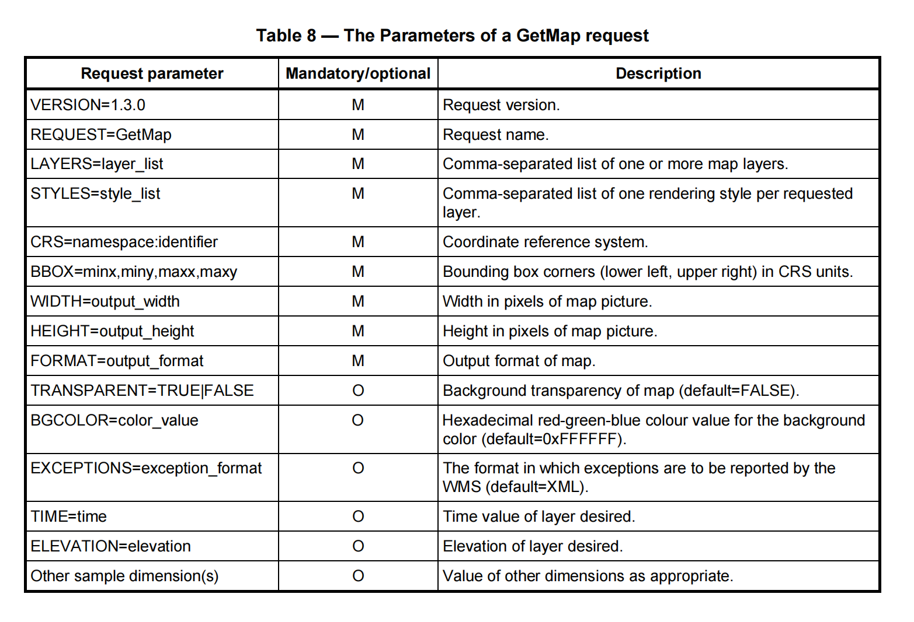

M代表必要，O代表可以选择的，例如我们在`Geoserver`发布`OpenLayers3`的服务，URL链接如下：

```javascript
http://localhost:8080/geoserver/tiger/wms?service=WMS&version=1.1.0&request=GetMap&layers=tiger%3AHuNanProvince&bbox=108.79220581054688%2C24.636547088623047%2C114.26011657714844%2C30.12598991394043&width=764&height=768&srs=EPSG%3A4326&styles=&format=application%2Fopenlayers3
```

%3A是冒号，%2C是逗号，%2F是 /，为了安全URL在某些符号采用特殊编码，具体看 `补充知识` 部分。

这个URL链接的含义对应上表来看是显而易见的，其中比较不容易理解的：

**BBOX (Bounding Box)** 是一个必需的参数，用于指定客户端请求地图图像时的地理空间区域。它的值是由逗号分隔的四个实数组成的列表，表示请求区域的最小X、最小Y、最大X和最大Y值。这些值定义了一个矩形区域，覆盖图层的坐标参考系统（CRS）中的指定范围。

在请求中，BBOX参数确定地图应显示的地理区域，外边界由该矩形的四个坐标值限定。如果BBOX值无效（例如最小X值大于或等于最大X值，或者最小Y值大于或等于最大Y值），服务器会返回错误。如果BBOX范围与图层的有效区域没有重叠，服务器将返回空内容（如空白地图）。此外，如果图层不支持子集，客户端必须请求图层的完整BBOX，否则服务器可能会返回错误。

BBOX的单位取决于你的CRS，如果的地理坐标系就是经纬度，如果是投影坐标系就是m。

------

**WIDTH**和**HEIGHT**参数用于指定生成地图图像的尺寸，以**像素**为单位。这些参数定义了地图的宽度（WIDTH）和高度（HEIGHT），并分别表示地图坐标系中`i`和`j`轴的最大值（分别为`WIDTH-1`和`HEIGHT-1`）。

如果BBOX（地理范围）的宽高比与WIDTH/HEIGHT的比例不同，WMS将根据BBOX的宽高比拉伸返回的地图，以适应指定的图像尺寸。

**这种拉伸可能导致地图失真，尤其是当宽高比不匹配时。因此，开发者应尽量避免用户无意中请求或接收到失真的地图**。

总之，WIDTH和HEIGHT参数控制了生成的地图图像的像素尺寸，这些参数的设置对地图的可视化效果有直接影响，尤其是在确保地图的宽高比与BBOX相匹配时。

------

**format**输出格式取决于你的地理服务器提供的什么输出格式，例如Geoserver的格式有：

```xml
<GetMap>
<Format>image/png</Format>
<Format>application/atom+xml</Format>
<Format>application/json;type=utfgrid</Format>
<Format>application/pdf</Format>
<Format>application/rss+xml</Format>
<Format>application/vnd.google-earth.kml+xml</Format>
<Format>application/vnd.google-earth.kml+xml;mode=networklink</Format>
<Format>application/vnd.google-earth.kmz</Format>
<Format>image/geotiff</Format>
<Format>image/geotiff8</Format>
<Format>image/gif</Format>
<Format>image/jpeg</Format>
<Format>image/png; mode=8bit</Format>
<Format>image/svg+xml</Format>
<Format>image/tiff</Format>
<Format>image/tiff8</Format>
<Format>image/vnd.jpeg-png</Format>
<Format>image/vnd.jpeg-png8</Format>
<Format>text/html; subtype=openlayers</Format>
<Format>text/html; subtype=openlayers2</Format>
<Format>text/html; subtype=openlayers3</Format>
```

------


#### **GetFeatureInfo**: 获取地图图像中特定位置的属性信息。

**GetFeatureInfo** 是一个可选操作，仅适用于那些设置了 `queryable="1"`（即可查询）属性的图层。如果图层未设置此属性，客户端不应发出 GetFeatureInfo 请求，否则 WMS 将返回格式正确的服务异常（代码为 `OperationNotSupported`）。

主要功能：

- **用途**: GetFeatureInfo 允许 WMS 客户端获取有关在先前的地图请求中返回的地图图像上特定位置的更多信息。
- **操作原理**: 用户通过点击地图上的某个点（像素位置 `(I,J)`）来请求该点的详细信息。GetFeatureInfo 请求包括了原始 GetMap 请求的大部分参数（除了 `VERSION` 和 `REQUEST`），以告知 WMS 用户当前查看的地图内容。
- **返回信息**: WMS 通过 `BBOX`、`CRS`、`WIDTH`、`HEIGHT` 等空间上下文信息以及用户选择的 `(I,J)` 位置，可能返回该位置的附加信息。

注意事项：

- **WMS的灵活性**: WMS 提供者可以自行决定返回什么信息以及如何确定该信息。
- **无状态协议**: 由于 WMS 是无状态协议，每次 GetFeatureInfo 请求都需要包含足够的上下文信息，以便服务器能够生成正确的响应。

总结来说，GetFeatureInfo 是一种在地图上查询特定位置的详细信息的机制，特别适用于用户希望了解特定地图区域的更多细节的场景。

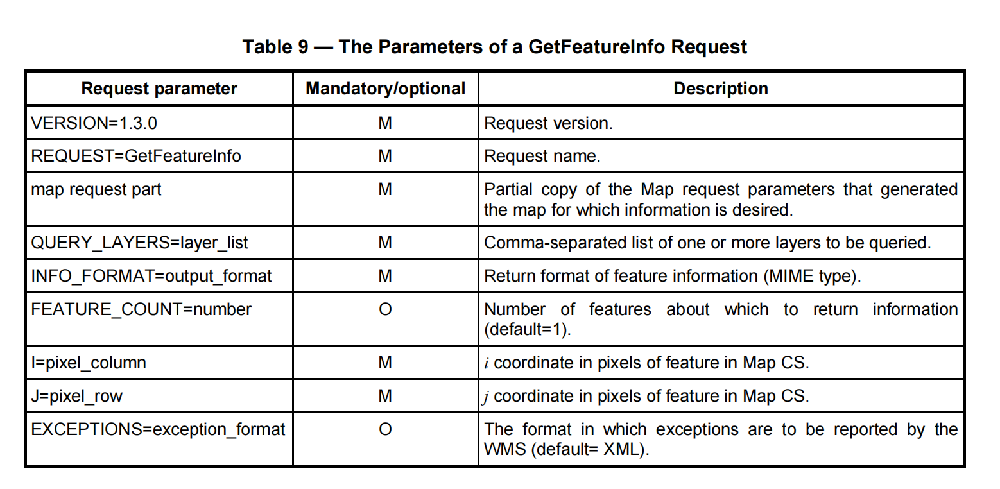

```javascript
http://localhost:8080/geoserver/tiger/wms?service=WMS&version=1.1.0&request=GetFeatureInfo&layers=tiger:HuNanProvince&bbox=108.79220581054688,24.636547088623047,114.26011657714844,30.12598991394043&width=764&height=768&srs=EPSG:4326&styles=&format=image/png&query_layers=tiger:HuNanProvince&info_format=application/json&i=382&j=384

```

**format**格式：

```xml
<GetFeatureInfo>
<Format>text/plain</Format>
<Format>application/vnd.ogc.gml</Format>
<Format>text/xml</Format>
<Format>application/vnd.ogc.gml/3.1.1</Format>
<Format>text/xml; subtype=gml/3.1.1</Format>
<Format>text/html</Format>
<Format>application/json</Format>
```

GetFeatureInfo一般可以用于空间查询

------


#### **GetCapabilities**: 获取WMS服务的元数据，包括可用图层、投影和样式。

`GetCapabilities` 操作的主要目的是获取服务元数据。这些元数据提供了服务器所包含信息的描述以及可接受的请求参数值。这些描述既是机器可读的，也可以供人类阅读。通过 `GetCapabilities` 请求，客户端可以了解服务器支持的服务类型、可用的图层、数据格式、坐标参考系统（CRS）以及其他关键信息。

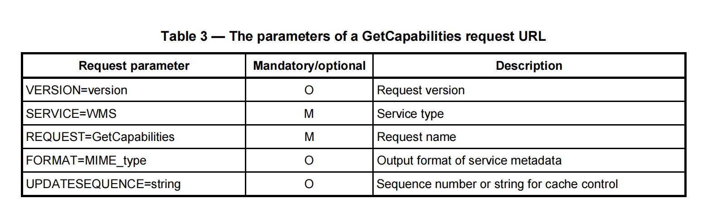

```javascript
http://localhost:8080/geoserver/ows?service=WMS&version=1.3.0&request=GetCapabilities
```

这个容易理解

### 2. **WMTS（Web Map Tile Service）**

WMTS是WMS的扩展，提供预渲染的地图瓦片（tile），以提高地图加载速度和性能。WMTS通常用于大规模的地图服务，例如网络地图应用。

#####  **GetCapabilities**

- **功能**：获取WMTS服务的元数据，包括支持的图层、样式、切片矩阵集、可用的坐标系、格式等信息。

- 请求示例

  ```html
  http://localhost:8080/geoserver/gwc/service/wmts？service=WMTS&version=1.1.1&request=GetCapabilities
  ```

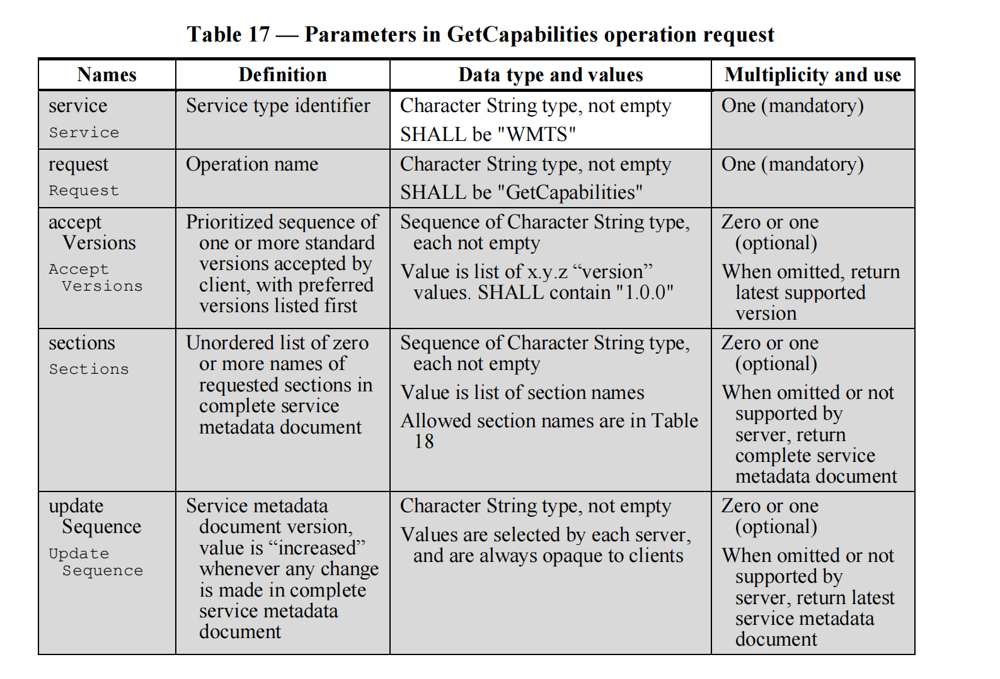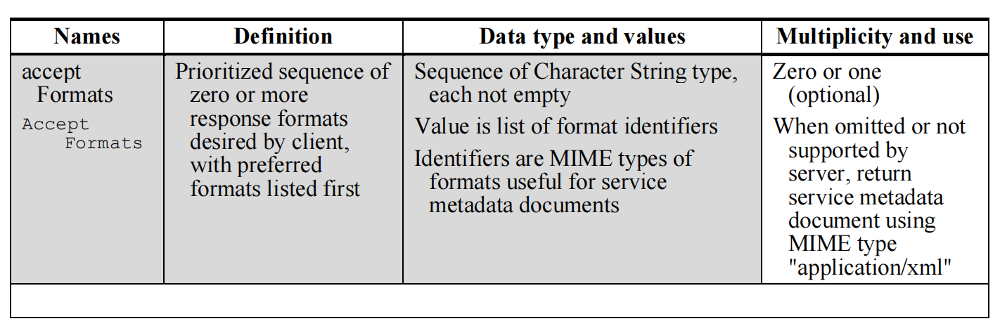


------


##### **GetTile**

> 在此之前，请你先补充**瓦片**的知识，在文档的最下面（补充知识）
>
> ！！！

- **功能**：请求特定的地图切片。用户需要指定图层、样式、切片矩阵集、切片矩阵、行列、格式等参数，以获取具体的地图切片。

- 请求示例

  ```html
  http://localhost:8080/geoserver/gwc/service/wmts?SERVICE=WMTS&REQUEST=GetTile&VERSION=1.0.0&LAYER=tiger:HuNanProvinceMap&STYLE=default&TILEMATRIXSET=EPSG:4326&TILEMATRIX=EPSG:4326:0&TILEROW=0&TILECOL=1&FORMAT=image/png
  ```

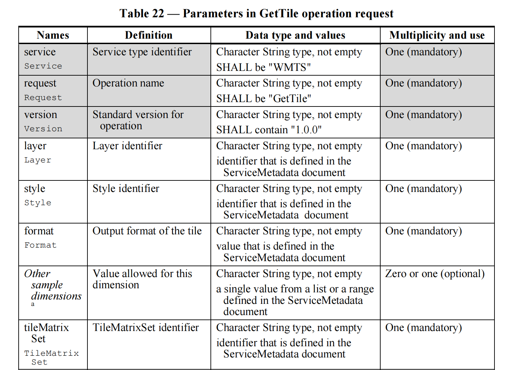

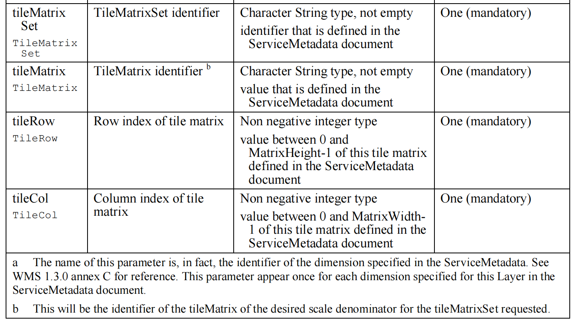

从GetCapabilities里可以得知你可以切片的图层，从结果来看只能切**图层组**的片，图层不行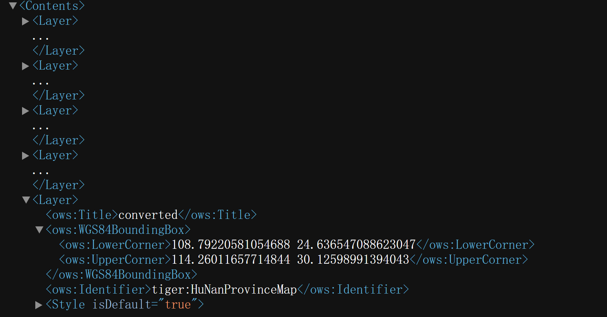


Format格式不用说，重点说说下面的，`TileMatrixSet`指的是切片的**瓦片矩阵集**，下面的`TileMatrixLimits`限定了每个层级下有效瓦片的最小和最大行、列范围。例如图中的 EPSG:4326:0，里面的 0 指的是瓦片的层级，0 的时候相当于地图缩小到最小，这个时候只需要1个瓦片就行了，这也是为什么 MinTileRow 和 MinTileCol 很小。

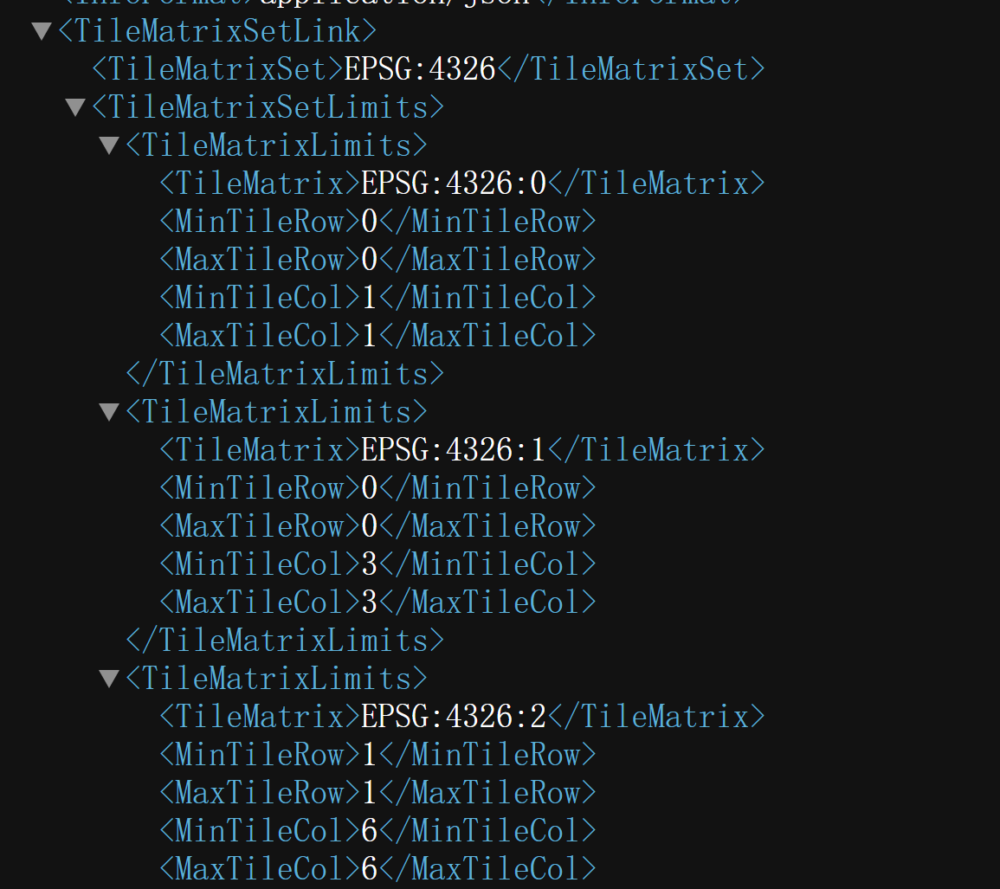

但瓦片的层级很大时，瓦片的数量就很多，这是显而易见的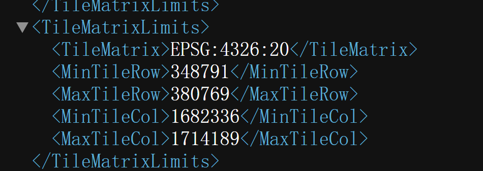

**为什么不从 0 开始？**

在瓦片地图系统中，行（Row）和列（Col）的编号通常是从 0 开始的，尤其是在 Web 地图瓦片标准中（如 Google Maps、OpenStreetMap 等）。然而，在某些特定的瓦片服务或坐标系统中，瓦片编号的范围可能会根据地理范围、投影方式或 TileMatrixSet 的定义而有所不同。这可能导致行和列的编号并非从 0 开始。

------


##### GetFeatureInfo(可选)

- **功能**：获取关于指定地图位置的特定信息，类似于WMS的GetFeatureInfo请求。这个服务在WMTS中是可选的，具体支持与否取决于服务实现。

- 请求示例

  ```html
  http://localhost:8080/geoserver/gwc/service/wmts?SERVICE=WMTS&VERSION=1.0.0&REQUEST=GetFeatureInfo&LAYER=tiger:HuNanProvinceMap&STYLE=default&TILEMATRIXSET=EPSG:4326&TILEMATRIX=EPSG:4326:21&TILEROW=730000&TILECOL=3400000&FORMAT=image/png&INFOFORMAT=application/json&I=128&J=128&WIDTH=256&HEIGHT=256
  ```

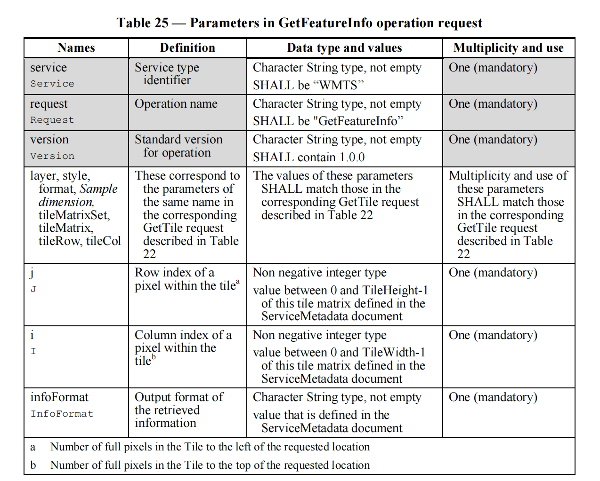

例如我请求到 JSON 的数据可视化后，是一个面数据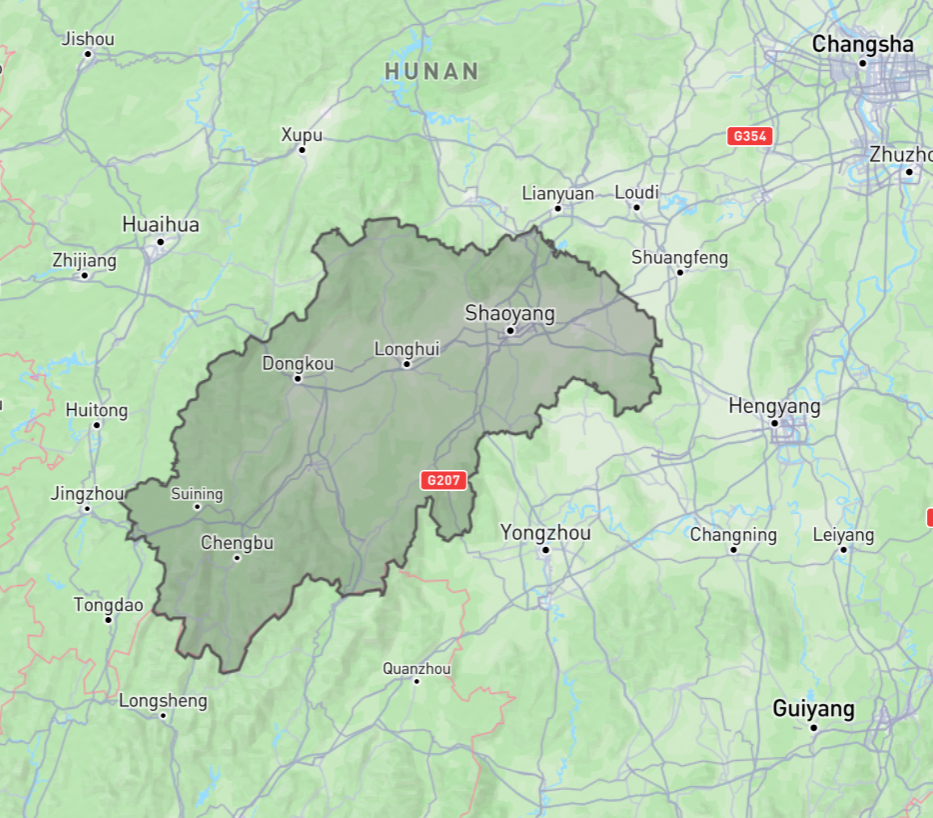

------


### 3. **SLD（Styled Layer Descriptor）**

SLD是一个OGC标准，定义了如何在WMS服务中对地理空间数据进行样式化。SLD允许用户自定义地图的显示样式，包括颜色、线条样式、标记等。

- **UserStyle**: 用户定义的样式，用于覆盖默认样式。
- **NamedLayer**: 关联样式和WMS图层。

### 4. **SE（Symbology Encoding）**

SE是一个XML编码规范，用于描述地图中地理数据的符号化规则。它通常与SLD结合使用，定义如何在地图中渲染点、线、面等几何图形。

- **FeatureTypeStyle**: 定义用于特定数据类型的样式规则。
- **Rule**: 定义条件性样式应用规则，如按属性值进行样式化。

### 5. **WCS（Web Coverage Service）**

WCS允许访问多维栅格数据（如卫星影像、气象数据）。虽然WCS主要用于数据下载和分析，但它也支持对栅格数据进行可视化，如生成覆盖图（coverage）。

- **GetCoverage**: 获取栅格数据的子集或视图。
- **DescribeCoverage**: 描述可用的覆盖图，包括数据类型、空间范围、时间范围等。

### 6. **WFS（Web Feature Service）**

WFS允许客户端访问和操作矢量数据。虽然WFS主要用于数据的查询和编辑，但它可以与SLD结合使用，以支持矢量数据的样式化和可视化。

#### **基本请求操作**

这些是所有 WFS 实现必须支持的核心操作。

##### **GetCapabilities**

- 描述：请求 WFS 服务的能力文档，返回服务的元数据，包括支持的操作、可用的图层、坐标参考系统等。
- 典型用途：客户端获取有关服务的详细信息以确定其功能。

例如在Geoserver格式如下：

```html
http://localhost:8080/geoserver/ows?service=WFS&acceptversions=2.0.0&request=GetCapabilities
```

`GetCapabilities` 操作是与 WFS 服务（以及其他 OGC 服务）交互的第一步。它提供了**服务的全面信息**，使客户端能够了解服务的功能、可用数据和如何与服务进行交互。通过这个请求，客户端可以根据需要选择合适的要素类型、操作、格式和空间参考系统，从而进行更深入的数据请求和处理。


跟WMF的GetCapabilities类似，从Geoserver返回的结果得知，WFS支持的操作（operation）如下：

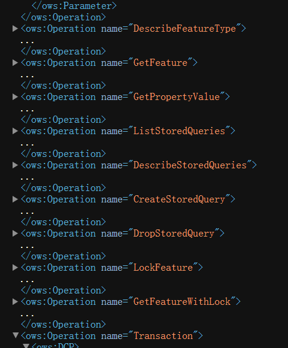

完美的符合OGC文档里面要求的服务

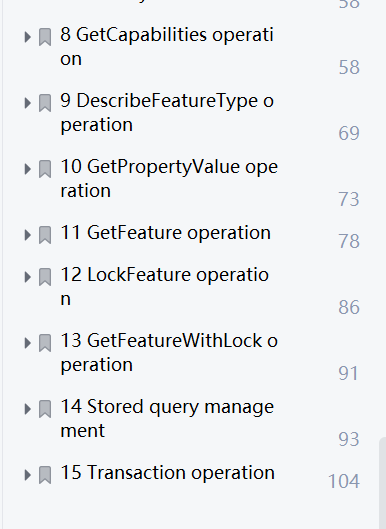

------


##### **DescribeFeatureType**

- 描述：请求描述特定图层的要素类型结构，返回关于要素的属性和数据类型的信息（通常为 XML Schema）。
- 典型用途：客户端了解要素数据的结构，以便正确解析和使用数据。

例如Geoserver里：

```html
http://localhost:8080/geoserver/tiger/wfs?service=WFS&version=1.0.0&request=DescribeFeatureType&typeName=tiger:HuNanProvince
```

符合官方文档里给出的Request格式

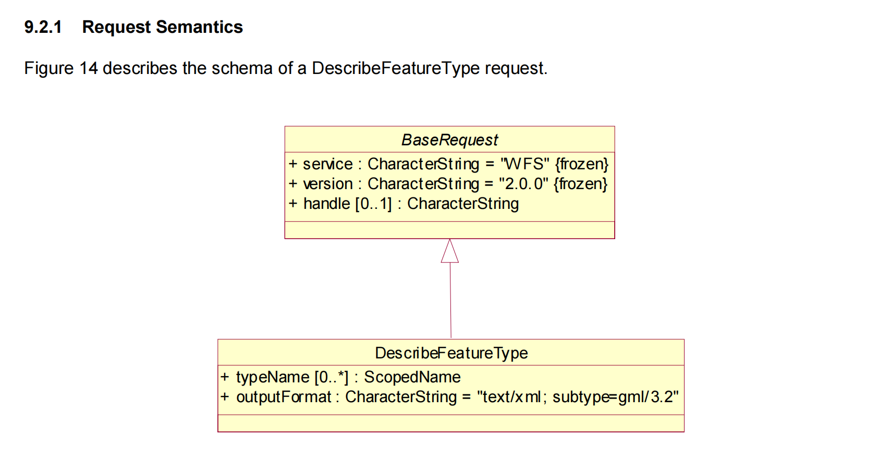

`DescribeFeatureType` 请求通常返回一个 XML 或 JSON 文档，描述要素的属性及其数据类型。

------


##### **GetFeature**

- 描述：请求获取特定图层中的地理要素。可以通过属性、空间过滤器等进行筛选。
- 典型用途：客户端获取实际的矢量数据（如点、线、面等）。

例如Geoserver里，查询某个图层的所有要素：

```html
http://localhost:8080/geoserver/tiger/wfs?service=WFS&version=1.0.0&request=GetFeature&typeName=tiger:HuNanProvince&outputFormat=application/json
```

得到的 JSON 格式，显示后跟原图层相同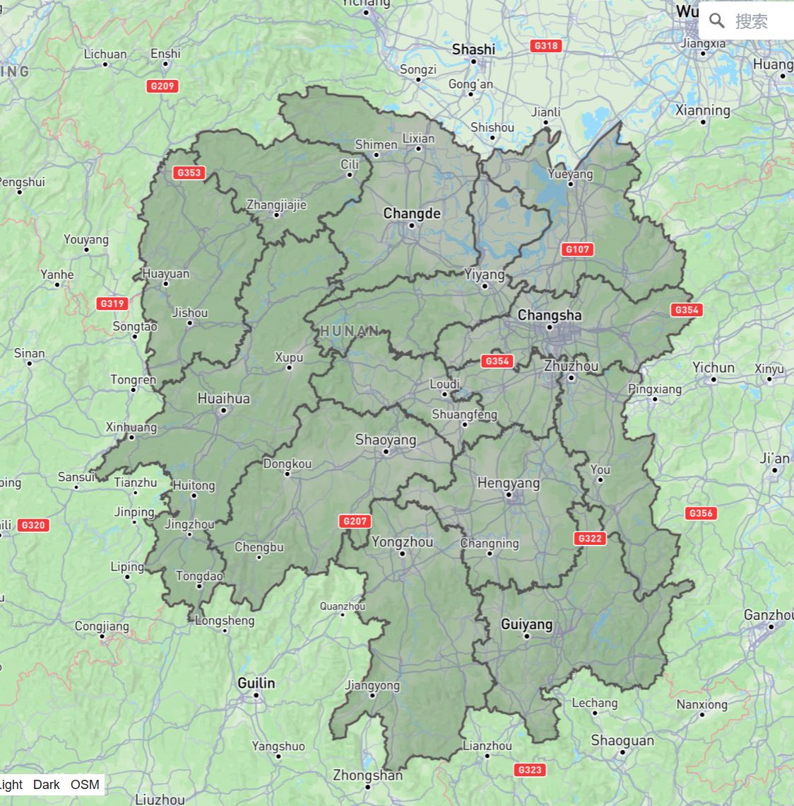

------


#### **事务操作（Transactional WFS，WFS-T）**

这些操作允许客户端对地理要素数据进行创建、修改和删除操作。WFS-T 操作是可选的，不是所有 WFS 实现都支持。

##### **Transaction**

- 描述：执行对地理要素的批量操作，包括插入、更新、删除操作。
- 典型用途：客户端在服务器上创建、更新或删除地理要素。

Transaction是发送一个XML，要发送包含 `Transaction` 操作的请求体，你需要使用 HTTP POST 方法，并将 XML 数据作为请求体发送。具体的暂时不清楚，这块不了解。

##### **LockFeature**

- 描述：请求锁定特定的地理要素，以防止其他客户端同时修改该要素。
- 典型用途：在长时间事务中确保数据一致性，防止并发冲突。

同Transaction，发送请求体是一个XML。

------


#### **筛选和排序**

WFS 提供的请求通常支持丰富的过滤和排序功能，允许用户精确地选择和排序返回的地理要素。

**Filter**

- 描述：通过属性条件、空间条件（如点在多边形内）等筛选要素。
- 典型用途：根据条件过滤返回的地理要素，如选择特定区域内的所有要素。

**SortBy**

- 描述：对返回的要素结果进行排序。
- 典型用途：按属性（如名称、ID）对结果排序。

------


#### 其他扩展操作

根据 WFS 的版本和实现，可能还支持其他扩展操作。例如：

**GetPropertyValue**

- 描述：请求返回特定属性的值，而不是整个要素。这对于需要从大量数据中提取特定属性时非常有用。
- 典型用途：客户端仅获取某个属性的值，而不是整个要素数据。

**DescribeStoredQueries**

- 描述：请求描述 WFS 服务中存储的查询的结构和参数。
- 典型用途：客户端了解和执行服务中预定义的查询。

**ListStoredQueries**

- 描述：请求列出 WFS 服务中存储的查询。
- 典型用途：客户端获取服务支持的所有存储查询的列表。

**CreateStoredQuery / DropStoredQuery**

- 描述：在 WFS 服务上创建或删除存储查询。这些查询可以由客户端定义，并存储在服务器上供以后使用。
- 典型用途：客户端定义复杂的查询并在服务器上保存，以便其他用户或客户端调用。

------


### 7. **KML（Keyhole Markup Language）**

KML是一种用于描述地理数据可视化的XML格式。它最初由Google Earth开发，后被OGC采纳为标准。KML支持点、线、多边形等几何数据的渲染，并允许设置视图、注释、图标等可视化效果。

- **Placemark**: 定义地理位置和相关信息。
- **Style**: 定义几何体的外观（颜色、线条宽度等）。

### 8. **3D Visualization Standards**

OGC也致力于3D地理信息的可视化标准化，包括：

- **CityGML**: 一种用于表示城市3D模型的标准。
- **3D Tiles**: 用于传输大规模3D地理数据的规范，适用于3D城市、建筑、地形等可视化。


## 补充知识：

### 常用URL编码表

| 字符 | URL编码 | 描述             |
| ---- | ------- | ---------------- |
| ``   | `%20`   | 空格             |
| `!`  | `%21`   | 感叹号           |
| `"`  | `%22`   | 双引号           |
| `#`  | `%23`   | 井号（哈希）     |
| `$`  | `%24`   | 美元符号         |
| `%`  | `%25`   | 百分号           |
| `&`  | `%26`   | 和号（&号）      |
| `'`  | `%27`   | 单引号           |
| `(`  | `%28`   | 左圆括号         |
| `)`  | `%29`   | 右圆括号         |
| `*`  | `%2A`   | 星号             |
| `+`  | `%2B`   | 加号             |
| `,`  | `%2C`   | 逗号             |
| `-`  | `%2D`   | 连字符（减号）   |
| `.`  | `%2E`   | 句点             |
| `/`  | `%2F`   | 斜杠             |
| `:`  | `%3A`   | 冒号             |
| `;`  | `%3B`   | 分号             |
| `<`  | `%3C`   | 小于号           |
| `=`  | `%3D`   | 等号             |
| `>`  | `%3E`   | 大于号           |
| `?`  | `%3F`   | 问号             |
| `@`  | `%40`   | 艾特符号（@）    |
| `[`  | `%5B`   | 左方括号         |
| `\`  | `%5C`   | 反斜杠           |
| `]`  | `%5D`   | 右方括号         |
| `^`  | `%5E`   | 插入符（脱字符） |
| `_`  | `%5F`   | 下划线           |
| ```  | `%60`   | 反引号           |
| `{`  | `%7B`   | 左花括号         |
| `    | `       | `%7C`            |
| `}`  | `%7D`   | 右花括号         |
| `~`  | `%7E`   | 波浪号           |

### 瓦片

瓦片地图是将大范围的地图数据分割成多个小的正方形图块（瓦片），然后根据用户的需求动态加载对应的图块以展示地图。这样可以减少数据传输量，提高地图加载速度。以下是瓦片地图的一些关键知识点：

**瓦片的基本概念**

- **瓦片（Tile）**：地图分成的小正方形图块，每个瓦片表示地图的一小部分。
- **瓦片坐标**：瓦片通过行（Row）和列（Col）来进行编号。行表示垂直方向的瓦片编号，列表示水平方向的编号。通常编号从 0 开始。
- **瓦片层级（Zoom Level）**：表示地图的放大级别，层级越大，地图放得越细，所需的瓦片数量也越多。

**瓦片坐标系**

- **EPSG:4326（WGS 84）**：地理坐标系，使用经纬度表示地理位置。瓦片在不同的缩放级别下表示不同的地理范围。
- **EPSG:3857（Web Mercator 或 EPSG:900913）**：常用的投影坐标系，适用于 Web 地图。此投影会将地球投影为一个正方形，适合于在线地图应用。

**瓦片的层级（Zoom Level）**

- 层级表示地图的缩放级别。层级越高，地图越详细，每个瓦片覆盖的地理范围越小，瓦片的数量越多。
- **Zoom Level 0**：整个地球在一个瓦片中表示。
- **Zoom Level N**：地图的瓦片数量为 2N×2N2^N \times 2^N2N×2N。

**瓦片矩阵集（TileMatrixSet）**

- **TileMatrixSet** 定义了不同缩放级别下瓦片的排列和范围。
- **TileMatrixLimits**：限定了每个层级下有效瓦片的最小和最大行、列范围。

**瓦片请求与显示**

- **瓦片加载**：地图应用根据用户的视图范围和缩放级别，计算出需要的瓦片行列，然后从服务器请求这些瓦片。
- **切片服务（Tile Service）**：提供瓦片的 Web 服务，常用的有 WMTS（Web Map Tile Service）。

**瓦片的优点**

- **性能优化**：仅加载用户当前视野内的瓦片，减少数据传输量。
- **缓存友好**：瓦片可以被缓存，从而提高加载速度。
- **动态加载**：随着用户的缩放和平移操作，瓦片动态加载，提供流畅的用户体验。

**常见的问题**

- **瓦片边缘拼接问题**：由于瓦片是独立加载的，可能在瓦片的边缘处出现拼接不完整的情况。
- **坐标系不匹配**：不同瓦片服务可能使用不同的坐标系，需要转换以确保正确显示。

瓦片地图技术在现代 Web 地图应用中被广泛使用，极大地提升了地图加载效率和用户体验。

