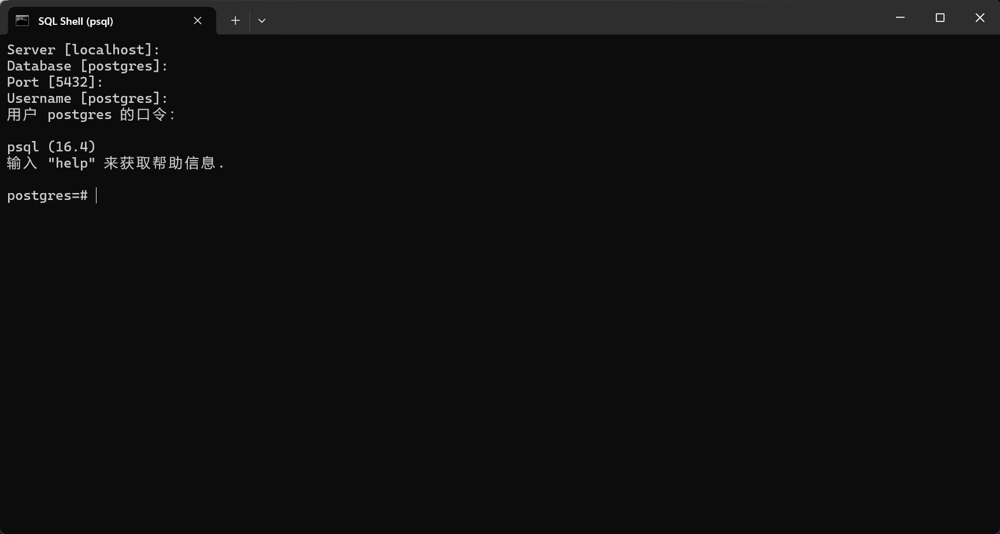
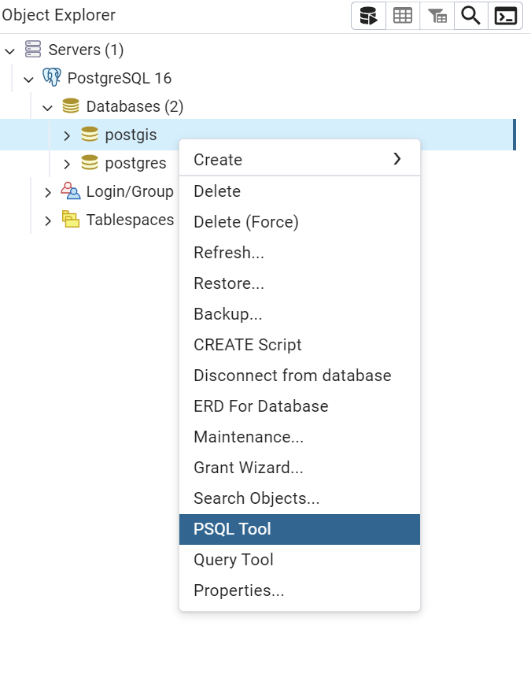

## 安装

安装postsql 和 postgis 直接在网上找教程就行了

## 基础操作

一般我们写 SQL 语句时有两种选中，要么在 SQL Shell 里写，要么在 pgAdmin 里写


打开 SQL Shell 后，一直回车就行了，最后面的口令就是你的密码，安装的时候应该有设置



**创建新的数据库**，name是你设置的数据库名称

```sql
CREATE DATABASE name;
```

**查看当前有哪些数据库**，这个 l 是字母小写 l ，不是数字 1 ，不用打分号

```sql
\l
```

**连接到数据库**

```sql
\c [DBNAME] [USER] [HOST] [PORT]
```

具体参数解释：

- **DBNAME**：要连接的数据库名称。
- **USER**（可选）：用于连接的 PostgreSQL 用户名。如果不指定，则使用当前用户。
- **HOST**（可选）：数据库服务器的主机名。如果数据库运行在本地，可以忽略此项。
- **PORT**（可选）：数据库服务器的端口号，默认是 `5432`。


或者在 `pgAdmin` 里，在对应数据库右键 `PSQL tool` ，在里面打语句



**创建模式**，模式是数据库中的一个逻辑容器，用来组织和管理数据库中的表、视图、索引等对象。通过使用模式，用户可以更好地对数据库对象进行分类，并为不同的应用或用户群体提供隔离和命名空间。

模式可以让数据库更加组织化，尤其是在项目较大或者有多个团队使用同一个数据库时，使用模式能避免命名冲突，并使管理更加灵活。

```sql
CREATE SCHEMA name;
```

------

**给予全部用户访问权限**

```sql
GRANT USAGE ON your_schema_name TO public;
```

`GRANT USAGE ON your_schema_name TO public;` 这个命令用于为 `public` 角色授予对指定模式（schema）的**使用权限**。

**含义**

- **GRANT USAGE**：为指定的角色授予在某个模式下使用对象的权限，允许用户查找和使用该模式中的对象（如表、视图、函数等）。但是，`USAGE` 权限并不允许用户修改模式中的对象（如插入数据、删除数据等），它只是提供了访问的基础权限。
- **ON your_schema_name**：这是你要授予权限的模式名。你需要将 `your_schema_name` 替换为你实际使用的模式名称。
- **TO public**：将权限授予 `public` 角色。`public` 是 PostgreSQL 中的一个默认角色，表示所有用户。如果授予 `public`，则所有数据库用户都会获得该权限。

示例

假设你有一个名为 `postgis` 的模式，并希望将使用权限授予所有用户，命令将是：

```sql
GRANT USAGE ON SCHEMA postgis TO public;
```

**注意**

1. **USAGE 只允许使用模式**，但并不赋予对模式中表或其他对象的权限。如果你还想授予对模式中表的查询权限，你还需要执行类似以下的命令：

   ```sql
   GRANT SELECT ON ALL TABLES IN SCHEMA postgis TO public;
   ```

   这将允许 `public` 用户查询该模式中的所有表。

2. **精确控制权限**：如果不希望所有用户都能访问模式中的对象，你可以将权限授予特定用户或角色，而不是 `public`。

------

**添加到搜索路径中**

```sql
ALTER DATABASE postgis_in_action SET search_path=public,your_schema_name,contrib;
```

`ALTER DATABASE postgis_in_action SET search_path=public,your_schema_name,contrib;` 这条命令用于更改数据库 `postgis_in_action` 的搜索路径（`search_path`）。

**含义**

- **search_path** 是 PostgreSQL 的一个配置参数，决定数据库在查找表、视图、函数等对象时会先去哪些模式（schema）中查找。如果对象在当前模式中找不到，数据库会按照 `search_path` 中定义的顺序继续查找其他模式。
- **public、your_schema_name、contrib**：这些是模式的名称。这里定义了三个模式，数据库会依次在 `public`、`your_schema_name` 和 `contrib` 这三个模式中查找对象。
  - `public` 是默认模式，所有数据库对象如果没有指定模式，默认都会创建在 `public` 模式中。
  - `your_schema_name` 是你之前创建的模式，存储了 PostGIS 的扩展函数、类型和对象。
  - `contrib` 通常用来存放一些额外的扩展或贡献的模块。

**作用**

这条命令的作用是，当你在 `postgis_in_action` 数据库中执行查询或调用函数时，PostgreSQL 会按照 `search_path` 的顺序，在这些模式中查找相应的对象。如果你在 `postgis` 模式中安装了 PostGIS 扩展并且设置了 `search_path`，你可以直接使用 PostGIS 函数和对象，而无需在每次查询时明确指定模式。

------

**查看 postgis 和 postSQL 版本**，输入此命令前，不要进入任何数据库

```sql
SELECT postgis_full_version();
```

------

## 教程

### 情景1

情景：我们需要找到高速公路1公里以内的快餐店数量

> 在此之前，请进入数据库，并且查看是否安装了Postgis拓展

#### 1.使用模式

```sql
CREATE SCHEMA ch01;
```

#### 2.创建有经营权的餐厅对照表

```sql
CREATE TABLE ch01.lu_franchises (id char(3) PRIMARY KEY
 , franchise varchar(30)); -- <1>

INSERT INTO ch01.lu_franchises(id, franchise) -- <2>
VALUES 
  ('BKG', 'Burger King'), ('CJR', 'Carl''s Jr'),
  ('HDE', 'Hardee'), ('INO', 'In-N-Out'), 
  ('JIB', 'Jack in the Box'), ('KFC', 'Kentucky Fried Chicken'),
  ('MCD', 'McDonald'), ('PZH', 'Pizza Hut'),
  ('TCB', 'Taco Bell'), ('WDY', 'Wendys');

```

《1》：

**CREATE TABLE ch01.lu_franchises**：

- 这是一个 `CREATE TABLE` 语句，表示要创建一个名为 `lu_franchises` 的新表。
- `ch01` 是模式（schema）的名称，表示这个表存储在 `ch01` 这个命名空间中。`ch01.lu_franchises`里面的“ . ” 号就是在 `ch01` 模式下创建新表

> 删除表：DROP TABLE table_name

**id char(3) PRIMARY KEY**：

- `id` 是表中的第一列，类型为 `char(3)`，表示一个**固定**长度为 3 个字符的字符串。
- `PRIMARY KEY` 表示这一列是**主键**，必须唯一且不能为空。这意味着表中的每一行都将通过 `id` 唯一标识。

**franchise varchar(30)**：

- `franchise` 是表中的第二列，类型为 `varchar(30)`，表示一个最多包含 30 个字符的**可变长度**字符串。这个列将存储特许经营（franchise）的名称。

> **字符串类型**
>
> - 定长字符串：
>   - `CHAR(n)`：固定长度的字符串，长度为 `n`。如果字符串不够 `n` 个字符，系统会自动用空格补齐。
> - 变长字符串：
>   - `VARCHAR(n)`：变长字符串，最多可以存储 `n` 个字符。字符串长度可以根据实际字符数动态变化。
>   - `TEXT` 或 `CLOB`：用于存储大文本数据，最大长度由数据库系统决定。

《2》：

**INSERT INTO ch01.lu_franchises(id, franchise)**：

- `INSERT INTO` 是用来插入数据的 SQL 语句。
- `ch01.lu_franchises` 是目标表的名称，表位于 `ch01` 模式下。
- 括号中的 `(id, franchise)` 指定要插入数据的列，数据将插入 `id` 和 `franchise` 列中。

**VALUES**：

- `VALUES` 子句定义了要插入的具体值。
- 每组括号中的值对应一行记录，分别表示 `id` 和 `franchise` 列的值。

**插入的值**：

- 例如，`('BKG', 'Burger King')` 表示 `id` 为 `'BKG'`，`franchise` 为 `'Burger King'` 的一条记录。
- `Carl's Jr` 中的 `Carl''s Jr` 使用了两个单引号来表示字符串中的一个单引号，这是 SQL 中的转义方式。
- 其余插入的数据为不同的快餐品牌的 `id` 和 `franchise` 对应关系。

#### 3.创建餐厅表：

```sql
CREATE TABLE ch01.restaurants
(
  id serial primary key,   -- <1>
  franchise char(3) NOT NULL,
  geom geometry(point,2163) -- <2>
);
```

**id serial primary key**：

- `id` 是表中的主键列，用于唯一标识每一行数据。
- `serial` 是一种特殊的数据类型，它自动生成唯一的整数值，通常从 1 开始递增。因此，不需要手动插入 `id` 值，每次插入新行时会自动生成一个新值。
- `primary key` 声明这一列为主键，要求其值是唯一的，并且不能为空。

**franchise char(3) NOT NULL**：

- `franchise` 是一个字符串列，类型为 `char(3)`，表示一个长度为 3 个字符的固定长度字符串。
- `NOT NULL` 约束表示该列不能为空，意味着每条记录都必须有一个非空的 `franchise` 值。

**geom geometry(point,2163)**：

- `geom` 是一个几何列，存储空间几何对象。
- `geometry(point,2163)` 表示该列存储的是 `POINT` 类型的几何数据，用于记录地理坐标点。
- `2163` 是空间参考系统（SRID，Spatial Reference System Identifier）的编号，代表坐标系统。在这个例子中，`2163` 对应于北美平面投影（US National Atlas Equal Area）。

#### 4.在几何列上放置空间索引

```sql
CREATE INDEX ix_code_restaurants_geom ON ch01.restaurants USING gist(geom);
```

**CREATE INDEX ix_code_restaurants_geom**：

- `CREATE INDEX` 是用于创建索引的 SQL 命令。
- `ix_code_restaurants_geom` 是你为索引指定的名称。索引名称是用户定义的，可以选择任何合适的名称，但通常会包括表名和列名以便识别。

**ON ch01.restaurants**：

- 指定要在 `ch01.restaurants` 表上创建索引。

**USING gist(geom)**：

- `USING gist` 表示使用 GiST（Generalized Search Tree）索引方法。GiST 是一种支持多种数据类型的索引结构，特别适合处理空间数据。
- `geom` 是你要为其创建索引的列。GiST 索引特别适合空间数据类型，如 `geometry` 或 `geography`。

#### 5.将餐厅表与经营权餐厅表创建外键关系

简单来说就是只有拥有经营权的餐厅才能添加到餐厅表里，为此，我们需要将两个表建立联系，因为每个表都只能有一个主键，因此只能创建外键关系

```sql
ALTER TABLE ch01.restaurants 
  ADD CONSTRAINT fk_restaurants_lu_franchises
  FOREIGN KEY (franchise) 
  REFERENCES ch01.lu_franchises (id)
  ON UPDATE CASCADE ON DELETE RESTRICT;
```

> fk：Foreign Key的简写

**ALTER TABLE ch01.restaurants**：

- `ALTER TABLE` 是用来修改现有表的 SQL 命令。
- `ch01.restaurants` 是要修改的表的名称，表位于 `ch01` 模式下。

**ADD CONSTRAINT fk_restaurants_lu_franchises**：

- `ADD CONSTRAINT` 用于添加新的约束到表中。
- `fk_restaurants_lu_franchises` 是你为外键约束指定的名称。这个名称可以自定义，通常包括表名和约束类型，以便于识别。

**FOREIGN KEY (franchise)**：

- `FOREIGN KEY` 关键字定义了外键约束。
- `(franchise)` 指定了 `ch01.restaurants` 表中的 `franchise` 列作为外键列。该列将引用另一个表中的主键列。

**REFERENCES ch01.lu_franchises (id)**：

- `REFERENCES` 关键字用于指定外键约束所引用的表和列。
- `ch01.lu_franchises` 是引用的表的名称，表位于 `ch01` 模式下。
- `(id)` 是引用表中的主键列，`ch01.lu_franchises` 表的 `id` 列是主键。

**ON UPDATE CASCADE**：

- 这个选项指定当 `ch01.lu_franchises` 表中的 `id` 列的值发生更改时，相关联的 `ch01.restaurants` 表中的 `franchise` 列的值也将自动更新。这有助于保持数据的一致性。

**ON DELETE RESTRICT**：

- 这个选项指定当尝试删除 `ch01.lu_franchises` 表中的一行时，如果该行被 `ch01.restaurants` 表中的任何行引用，删除操作将被阻止。即，如果 `ch01.lu_franchises` 表中的某个 `id` 被 `ch01.restaurants` 表中的 `franchise` 引用，不能删除该行。

然后可以创建一个索引，使两个表之间的连接更高效

```sql
CREATE INDEX fi_restaurants_franchises 
 ON ch01.restaurants (franchise);
```

> fi：Foregin Index的简写

#### 6.创建高速公路表

```sql
CREATE TABLE ch01.highways
(
  gid integer NOT NULL,
  feature character varying(80),
  name character varying(120),
  state character varying(2),
  geom geometry(multilinestring,2163), 
  CONSTRAINT pk_highways PRIMARY KEY (gid)
);
```

**CREATE TABLE ch01.highways**: 创建一个名为 `highways` 的表，并将其放置在 `ch01` 模式下。

**gid integer NOT NULL**: `gid` 是表中的一个整数列，不能为空。通常用于唯一标识每一条记录。

**feature character varying(80)**: `feature` 是一个可变长度的字符列，最多可以存储80个字符，可能用于描述高速公路的特征。

**name character varying(120)**: `name` 是另一个可变长度的字符列，最多可以存储120个字符，用于存储高速公路的名称。

**state character varying(2)**: `state` 列用于存储州的缩写，最多可以存储2个字符。

**geom geometry(multilinestring,2163)**: `geom` 列用于存储地理空间数据，具体是 `MULTILINESTRING` 类型，用于存储一条或多条线。SRID 2163 是空间参考系统标识符，代表所使用的地理坐标系。

**CONSTRAINT pk_highways PRIMARY KEY (gid)**: 为 `gid` 列设置主键约束，确保该列的值是唯一的且不能为空。

> pk：PRIMARY KEY 主键的简写

添加空间索引

```sql
CREATE INDEX ix_highways 
 ON ch01.highways USING gist(geom);
```

> 使用地理空间数据时，一般创建后就创建空间索引，提高效率

#### 7.导入CSV数据

导入CSV文件，数据在资源里，名称是 `restaurants.csv`

1.先创建表

```sql
CREATE TABLE ch01.restaurants_staging (
  franchise text, lat double precision, lon double precision);
```

**CREATE TABLE ch01.restaurants_staging**: 创建一个名为 `restaurants_staging` 的表，并将其放置在 `ch01` 模式下。这个表可能用作临时或中间阶段的数据存储表（根据名字中的 "staging" 一词推测）。

**franchise text**: `franchise` 列用于存储餐厅的连锁品牌名称，数据类型为 `text`，允许存储不定长度的字符数据。

**lat double precision**: `lat` 列用于存储餐厅的纬度坐标，数据类型为 `double precision`，用于高精度的数值存储（通常用于地理坐标）。

**lon double precision**: `lon` 列用于存储餐厅的经度坐标，数据类型也是 `double precision`，同样用于高精度数值存储。

2.使用psql\copy命令，将CSV文件导入临时表，

```sql
\copy ch01.restaurant_staging FROM '/path/to/restaurants.csv' DELIMITER ',' CSV HEADER;
```

> 注意，使用反斜杠，同时避免路径中有中文

**ch01.restaurant_staging**: 数据将导入的目标表，即 `restaurant_staging` 表，位于 `ch01` 模式下。

**FROM 'file_path'**: `'file_path'` 是本地文件的路径，文件中包含要导入的数据。路径可以是相对路径或绝对路径。

**DELIMITER ','**: 指定文件中使用的分隔符，例如，逗号分隔的 CSV 文件使用 `,` 作为分隔符。

**CSV**: 指文件是 CSV 格式。

**HEADER**: 如果文件的第一行是标题行（包含列名），可以使用 `HEADER` 选项来跳过第一行不导入。

3.将数据从 `ch01.restaurants_staging` 表插入到 `ch01.restaurants` 表中

```sql
INSERT INTO ch01.restaurants (franchise, geom)
SELECT franchise
 , ST_Transform(
   ST_SetSRID(ST_Point(lon , lat), 4326)
   , 2163) As geom
FROM ch01.restaurants_staging;
```

**INSERT INTO ch01.restaurants (franchise, geom)**：将数据插入到 `ch01.restaurants` 表中的 `franchise` 和 `geom` 两个列中。

**SELECT franchise**：从 `ch01.restaurants_staging` 表中选择 `franchise` 字段。

**ST_Point(lon, lat)**：根据 `lon`（经度）和 `lat`（纬度）生成点几何对象。`ST_Point` 函数创建一个基于输入经纬度坐标的点。

**ST_SetSRID(ST_Point(lon, lat), 4326)**：将生成的点设置为 `SRID 4326`，这是 WGS 84 坐标系，通常用于 GPS 经纬度。

**ST_Transform(..., 2163)**：将点从 `SRID 4326` 坐标系转换为 `SRID 2163`，这是一个等面积投影（US National Atlas Equal Area）。这个函数用于将几何对象转换到不同的坐标系。

**FROM ch01.restaurants_staging**：数据来源是 `ch01.restaurants_staging` 表

> **常见的 PostGIS `ST_` 函数：**
>
> 1. **ST_Point**:
>    - **功能**: 创建一个点几何对象。
>    - **示例**: `ST_Point(lon, lat)` 生成一个点，其坐标为指定的经度和纬度。
> 2. **ST_SetSRID**:
>    - **功能**: 为几何对象设置空间参考系的标识符（SRID）。
>    - **示例**: `ST_SetSRID(geom, 4326)` 设置几何对象 `geom` 的 SRID 为 4326（WGS 84）。
> 3. **ST_Transform**:
>    - **功能**: 将几何对象从一个坐标系转换到另一个坐标系。
>    - **示例**: `ST_Transform(geom, 2163)` 将几何对象 `geom` 从其当前坐标系转换为 SRID 2163 的坐标系。
> 4. **ST_Buffer**:
>    - **功能**: 创建一个缓冲区（围绕几何对象的区域）。
>    - **示例**: `ST_Buffer(geom, distance)` 在几何对象 `geom` 周围创建一个指定距离的缓冲区。
> 5. **ST_Intersects**:
>    - **功能**: 判断两个几何对象是否相交。
>    - **示例**: `ST_Intersects(geom1, geom2)` 检查 `geom1` 和 `geom2` 是否相交。
> 6. **ST_Area**:
>    - **功能**: 计算几何对象的面积（适用于面状几何）。
>    - **示例**: `ST_Area(geom)` 计算 `geom` 的面积。

#### 8.导入shp数据

大多数情况下我们收集到的数据都是shp格式的，因此我们要学会如何将shp数据导入到postsql里

此命令在cmd里面打

```sh
shp2pgsql -D -s 4269 -g geom -I "D:\roadtrl020.shp" ch01.highways_staging | psql -h localhost -U postgres -p 5432 -d postgis_in_action -W
```

> 如果出现了 “shp2pgsql不是内部命令” 之类的问题，应该是没有添加环境变量，将PostgreSQL安装目录下的bin文件添加到环境变量里就行了，例如【C:\Program Files\PostgreSQL\16\bin】

1.**shp2pgsql**:

- **功能**: `shp2pgsql` 是一个命令行工具，用于将 Shapefile 转换为 SQL 脚本，并将其导入到 PostgreSQL 数据库中。它是 PostGIS 提供的工具之一。
- **选项**:
  - **-D**: 将数据类型指定为 `DOUBLE PRECISION`。
  - **-s 4269**: 设置 Shapefile 的空间参考系（SRID），在这里 SRID `4269` 是 NAD83（North American Datum 1983）。
  - **-g geom**: 指定 Shapefile 中几何数据的字段名为 `geom`。
  - **-I**: 创建空间索引（`GIST` 索引）。
  - **/data/roadtr1020.shp**: Shapefile 文件的路径。
  - **ch01.highways_staging**: PostgreSQL 中的目标表名，数据将导入到这个表中。没有则会创建

2. **psql**:

- **功能**: `psql` 是 PostgreSQL 的交互式命令行客户端，用于执行 SQL 查询和命令。
- **选项**:
  - **-h localhost**: 指定 PostgreSQL 服务器的主机名为 `localhost`（即本地机器）。
  - **-U postgres**: 使用 `postgres` 用户登录数据库。
  - **-p 5432**: 指定连接到 PostgreSQL 服务器的端口为 `5432`（这是 PostgreSQL 的默认端口）。
  - **-d postgis_in_action**: 连接到名为 `postgis_in_action` 的数据库。
  - **-w** : 输入密码

**流程说明：**

1. **转换 Shapefile**:
   - `shp2pgsql` 将 `/data/roadtr1020.shp` Shapefile 转换为 SQL 脚本，这个脚本将包含创建表和插入数据的 SQL 语句。转换时，它还会处理空间数据类型和坐标系转换。
2. **执行 SQL 脚本**:
   - 通过管道 `|` 将 `shp2pgsql` 生成的 SQL 脚本传递给 `psql`，`psql` 将执行这些 SQL 语句，将数据导入到 `postgis_in_action` 数据库的 `ch01.highways_staging` 表中

#### 9.填充高速公路表

这个shp数据是包含了所有美国的道路数据，大约47000行，但是我们可以做初步筛选，筛选出高速公路，最后是16000行左右。

```sql
INSERT INTO ch01.highways (gid, feature, name, state, geom)
SELECT gid, feature, name, state, ST_Transform(geom, 2163)
FROM ch01.highways_staging
WHERE feature LIKE 'Principal Highway%';
```

1. **INSERT INTO ch01.highways (gid, feature, name, state, geom)**

- **目标表**: `ch01.highways` 是目标表，你要将数据插入到这个表中。
- **列**: 插入的列包括 `gid`, `feature`, `name`, `state`, 和 `geom`。

2. **SELECT gid, feature, name, state, ST_Transform(geom, 2163)**

- **来源表**: 数据来自 `ch01.highways_staging` 表。
- **选择列**:
  - `gid`: 表示唯一标识符。
  - `feature`: 表示道路的特征。
  - `name`: 道路名称。
  - `state`: 状态。
  - **ST_Transform(geom, 2163)**: 使用 PostGIS 函数 `ST_Transform` 将 `geom` 列的几何数据从其当前坐标参考系统转换为 EPSG:2163 (USA Contiguous Albers Equal Area Conic)。

3. **FROM ch01.highways_staging**

- **数据来源**: 从 `ch01.highways_staging` 表中读取数据。

4. **WHERE feature LIKE 'Principal Highway%'**

- **筛选条件**: 仅选择 `feature` 列值以 `'Principal Highway'` 开头的行。

> 在 SQL 中，`%` 是 `LIKE` 子句中的通配符，用于匹配字符串中的任意字符序列。`LIKE` 子句用于在 SQL 查询中进行模式匹配。
>
> **`LIKE` 子句和 `%` 的作用**
>
> - **LIKE 子句**: 用于在 SQL 查询中查找符合指定模式的字符串。它通常与通配符一起使用来匹配不同的字符串模式。
> - **% 通配符**: 在 `LIKE` 子句中，`%` 表示零个或多个字符。这意味着 `%` 可以匹配任意数量的字符，包括零个字符。
> - **'Principal Highway%'**: 这个模式匹配所有以 `'Principal Highway'` 开头的字符串，不管后面跟着什么字符（包括零个字符）。因此，它会匹配以 `'Principal Highway'` 开头的任何字符串。
>
> **其他常用的通配符**
>
> - **_**: 匹配单个字符。例如，`'H_llo'` 将匹配 `'Hello'` 和 `'Hullo'`，但不会匹配 `'Helloo'` 或 `'Helo'`。
> - **[ ]**: 匹配指定范围内的字符。例如，`'[Hh]ello'` 将匹配 `'Hello'` 和 `'hello'`。

#### 10.进行一次 vacuum 分析

```sql
vacuum analyze ch01.highways;
```

`VACUUM ANALYZE` 是 PostgreSQL 数据库管理中的一个重要命令，用于优化和维护数据库表的性能。它包括两部分操作：

**`VACUUM` 操作**

- **作用**: 清理表中的“死”行。数据库中的每个表在进行 `UPDATE` 或 `DELETE` 操作时会产生垃圾行，这些行占用空间但不再使用。
- **效果**:
  - 释放未使用的空间。
  - 避免数据库膨胀。
  - 改善查询性能。

**`ANALYZE` 操作**

- **作用**: 更新表的统计信息，以帮助数据库优化器生成更有效的查询计划。
- **效果**:
  - 提高查询性能。
  - 确保数据库优化器使用最新的统计信息进行查询优化。

**什么时候使用 `VACUUM ANALYZE`**

1. **数据修改后**: 在大量 `INSERT`、`UPDATE` 或 `DELETE` 操作后，使用 `VACUUM ANALYZE` 可以帮助维护性能。
2. **定期维护**: 作为数据库维护计划的一部分，定期运行 `VACUUM ANALYZE` 可以确保性能稳定。