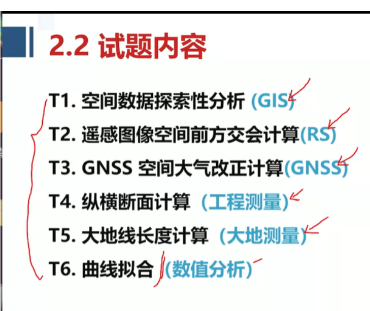
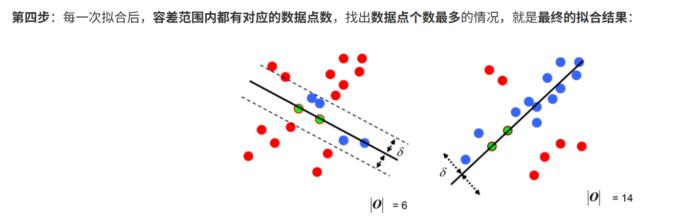

[随机抽样一致算法（Random sample consensus，RANSAC）详解，保姆级教程 - 知乎](https://zhuanlan.zhihu.com/p/402727549)

简单来说，就是：

普通最小二乘法是保守派：在现有数据下，如何实现最优。是从一个整体误差最小的角度去考虑，尽量谁也不得罪。

RANSAC是改革派：首先假设数据具有某种特性（目的），为了达到目的，适当割舍一些现有的数据。

再通俗点，就是：

最小二乘法相当于把**所有人叫过来开会**，好比如教师开会也把食堂阿姨，学生都拉过来开会。

RANSAC相当于**只叫部分人来开会**，教师开会只叫老师，不让学生，校长什么的过来。

主要是具体的应用场景不是特别清楚，但是从去年的内容角度来看，这道题应该是属于**数值分析**，因为 RANSAC 也接近于拟合的范畴。

既然如此，那么就不会有具体的场景让你分析。具体的场景是什么意思？比如：

**几何基元拟合**:

- **直线拟合**: 从含有粗差的点云中拟合出直线（例如，道路边缘、建筑物边线）。
- **平面拟合**: 从三维点云中拟合出平面（例如，墙面、地面）。
- **圆/球拟合**: 从点云中拟合出圆形或球形结构。

**坐标转换参数估计**: 在含有粗差的公共点中，稳健地估计两套坐标系之间的转换参数（例如，七参数转换、四参数转换）。

**影像特征匹配与几何校正**: 识别和剔除错误的特征匹配点（外点），用于影像配准、相机姿态估计等。

**点云配准**: 在三维点云配准中，识别正确的对应点，剔除离群点。

但是估计不会考具体的场景，只是单纯的数值拟合，如果有场景那么是会在赛题里会有说明的才合理。

综上，我分为两部分，直线拟合和平面拟合。

## 一、直线拟合

**目标：** 从一组含有粗差的2D或3D点中，找到最佳拟合的直线模型。

就好比如下图，我们要找到一条直线，直线的左右两边范围内，包含的点数最多。

既然是直线，那么就分为 2D 和 3D 直线了。

### 2D 直线拟合

**2D 直线方程：** 最常见的形式是 y=mx+b。但为了避免垂直线（斜率 m 无穷大）的问题，通常使用一般式：Ax+By+C=0。而且一般式利于计算垂直距离。

**算法步骤**：

1. **参数设置：**

- `min_samples` (最小样本数): 对于2D直线，需要 **2个** 不重合的三维点。
- `threshold` (距离阈值): 用于判断点是否为内点的最大允许距离。
- `max_iterations` (最大迭代次数): 算法运行的最大循环次数。

2. **循环迭代 `max_iterations` 次：**

- **a. 随机抽样：** 从数据集中随机不重复地选择 `min_samples` (即2个) 点，记为 P1(x1,y1) 和 P2(x2,y2)。
- **b. 模型拟合：**
  - 使用选定的2个点 P1(x1,y1) 和 P2(x2,y2) 拟合一条直线。
  - **如果** x1=x2**：** 直线为垂直线，方程为 x=x1。此时 A=1,B=0,C=−x1。
  - **如果** y1=y2**：** 直线为水平线，方程为 y=y1。此时 A=0,B=1,C=−y1。
  - **一般情况：** 可以通过两点式计算斜率 m=(y2−y1)/(x2−x1) 和截距 b=y1−m⋅x1，得到 y=mx+b。
    - 为了统一表示为 Ax+By+C=0 形式，可以令 A=m, B=−1, C=b。然后进行归一化（方便后续计算），归一化后的值为ABC的新值：

$$
A' = A/\sqrt{A^2 + B^2}, B' = B/\sqrt{A^2 + B^2}, C' = C/\sqrt{A^2 + B^2}
$$

- **c. 一致性评估：**

  - 对于数据集 D 中的所有点 Pi(xi,yi)，计算其到当前拟合直线模型的距离 di。

  - **2D点** Pi **到直线** Ax+By+C=0 **的距离公式：**
      $$
      d_i = \frac{\vert Ax_i + By_i + C\vert}{\sqrt{A^2 + B^2}}
      $$
      如果 A,B,C 已经归一化（即 A2+B2=1），则分母为1。

  - **判断内点：** 如果 di ≤ threshold，则将 Pi 视为内点。
  
- **d. 更新最佳模型：**

  - 统计当前模型下的内点数量 `current_inliers_count`。
- 如果 `current_inliers_count` 大于之前找到的 `best_inliers_count`，则更新 `best_inliers_count` 和 `best_model_parameters` (即 A,B,C)。

### 3D 直线拟合

同理，只是直线方程变了。

在三维空间中，一条直线最常用的表示方法是**参数方程**。它由直线上一个已知点和一个方向向量确定：
$$
\begin{cases}
x = x_0 + t\cdot u_x\\
y = y_0 + t\cdot u_y\\
z = z_0 + t\cdot u_z
\end{cases}
$$

1. **参数设置：**

   - `min_samples` (最小样本数): 对于 3D 直线，最少需要 **2个** 不重合的三维点来确定一条直线。
   - `threshold` (距离阈值): 用于判断一个点是否为内点的最大允许距离。
   - `max_iterations` (最大迭代次数): 算法运行的最大循环次数。

2. **循环迭代 `max_iterations` 次**：

   **a. 随机抽样 ：** 从数据集 D 中随机不重复地选择 `min_samples` (即2个) 点，记为 P1(x1,y1,z1) 和 P2(x2,y2,z2)。

   **b. 模型拟合 ：** 利用选取的这两个点来构建当前的直线模型：

   - **确定直线上一个点** P0**：** 可以直接使用 P1 作为 P0(x0,y0,z0)。

   - **确定方向向量** u**：** 计算向量 P1->P2=(x2−x1,y2−y1,z2−z1)。

   - **归一化方向向量：** 将 P1->P2 归一化为单位向量 u'=(ux,uy,uz)。（方便后续计算）
     $$
     \vec{v}_{unit}=\left(\frac{x_2 - x_1}{\sqrt{(x_2 - x_1)^2 + (y_2 - y_1)^2 + (z_2 - z_1)^2}}, \frac{y_2 - y_1}{\sqrt{(x_2 - x_1)^2 + (y_2 - y_1)^2 + (z_2 - z_1)^2}}, \frac{z_2 - z_1}{\sqrt{(x_2 - x_1)^2 + (y_2 - y_1)^2 + (z_2 - z_1)^2}}\right)
     $$
     
   - 这样，我们就得到了一个由 P0 和 u' 定义的假设直线模型。
   
   **c. 一致性评估 ：**
   
   对于数据集 D 中的所有点 Pi(xi,yi,zi)，计算其到当前拟合直线模型的垂直距离 di。
   
   - **3D点** Pi **到通过点** P0 **且方向向量为** u **的直线的距离公式：**
     $$
     d_i = \frac{\|\overrightarrow{P_{0}P_{i}}\times\vec{u}\|}{\|\vec{u}\|}\\
     
     其中 \overrightarrow{P_{0}P_{i}} = (x_i - x_0, y_i - y_0, z_i - z_0)。由于 \vec{u} 已经归一化为单位向量，所以 \|\vec{u}\| = 1，公式简化为：\\
     
     d_i = \|\overrightarrow{P_{0}P_{i}}\times\vec{u}\|
     $$
   - **判断内点：** 如果计算出的距离 di ≤ threshold，则将 Pi 视为内点。
   
   **d. 更新最佳模型：**
   
   - 统计当前模型下的内点数量 `current_inliers_count`。
   - 如果 `current_inliers_count` 大于之前找到的 `best_inliers_count`，则更新 `best_inliers_count` 和 `best_model_parameters` (即 A,B,C)。

## 二、平面拟合

### 3D 平面模型定义

在三维空间中，一个平面最常用的表示方法是**一般式**：

$$
Ax + By + Cz + D = 0
$$
其中：
* (A, B, C) 是平面的**法向量**，它垂直于平面。
* D 是一个常数。
* 为了保证模型的唯一性，法向量通常会被**归一化**，即满足 
  $$
  A^2 + B^2 + C^2 = 1
  $$

**模型参数数量：** 一个三维平面有 3 个独立的自由度（例如，法向量的两个角度，加上平面到原点的距离）。

---

### RANSAC 算法在 3D 平面拟合中的应用步骤

1.  **参数设置：**
    * `min_samples` (最小样本数): 对于 3D 平面，最少需要 **3个** 不共线的三维点来确定一个平面。
    * `threshold` (距离阈值): 用于判断一个点是否为内点的最大允许距离。
    * `max_iterations` (最大迭代次数): 算法运行的最大循环次数。
    
2. **循环迭代 `max_iterations` 次：**

    * **a. 随机抽样：**
        从数据集中随机不重复地选择 `min_samples` (即3个) 点，记为 
        $$
        P_1(x_1, y_1, z_1)、P_2(x_2, y_2, z_2) 和 (x_3, y_3, z_3)。
        $$
        
    * **b. 模型拟合 (Model Estimation)：**
        利用选取的这3个点来构建当前的平面模型：
        
        * **检查共线性：** 首先判断这3个点是否共线。如果共线，则无法确定唯一平面，需要重新抽样。可以通过计算向量 
            $$
            \vec{P_1P_2} 和 \vec{P_1P_3}
            $$
            的叉积来判断：如果叉积的模长接近于0，则认为共线。
        * **计算法向量：** 如果点不共线，计算两个向量 
            $$
            \vec{V_1} = P_2 - P_1 和 \vec{V_2} = P_3 - P_1
            $$
            平面的法向量是这两个向量的叉积：
            $$
            \vec{N} = \vec{V_1} \times \vec{V_2}
            $$
        * **归一化法向量：**归一化为单位向量 
            $$
            (A, B, C) = \frac{\overrightarrow{\vec{N}}}{\|\vec{N}\|}\\
            $$
        * **计算常数 D：**
            $$
            由于平面通过 P_1，将 P_1 的坐标代入平面方程\\ Ax_1 + By_1 + Cz_1 + D = 0，\\解出 D = -(A x_1 + B y_1 + C z_1)。
            $$
            
        * 这样，我们就得到了一个由 (A, B, C, D) 定义的假设平面模型。
        
    * **c. 一致性评估 ：**
        对于数据集中的所有点 ，计算其到当前拟合平面模型的垂直距离 d_i。
        
        * **点 P_i 到平面 Ax+By+Cz+D=0的距离公式：**
            $$
            d_i = \frac{|Ax_i + By_i + Cz_i + D|}{\sqrt{A^2 + B^2 + C^2}}
            $$
            由于法向量已归一化，分母为1，公式简化为：
            $$
            d_i = |Ax_i + By_i + Cz_i + D|
            $$
        * **判断内点：** 
            $$
            如果计算出的距离 d_i \le \text{threshold}，则将 P_i 视为内点。
            $$
        
    * **d. 更新最佳模型：**
        * 统计当前模型下的内点数量 `current_inliers_count`。
        * 如果 `current_inliers_count` 大于之前找到的 `best_inliers_count`，则更新 `best_inliers_count` 和 `best_model_parameters` (即 A, B, C, D)。

