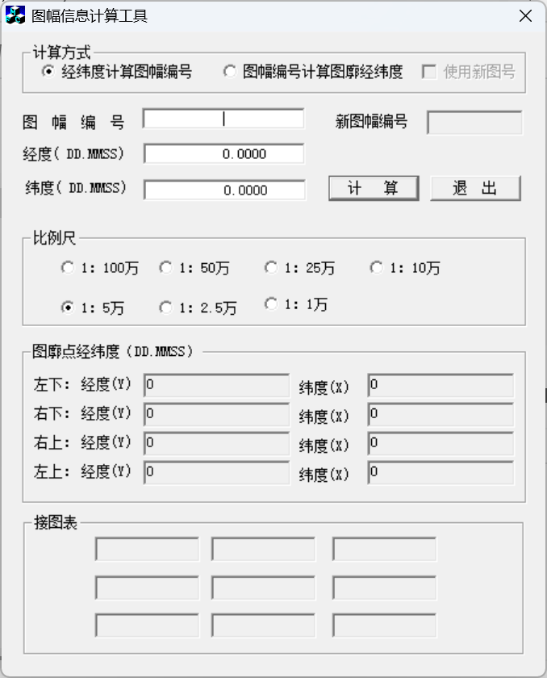
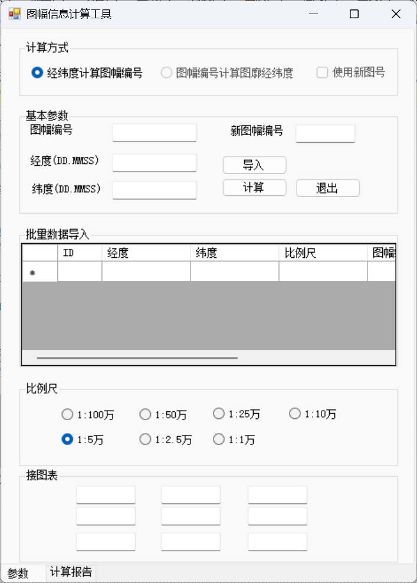
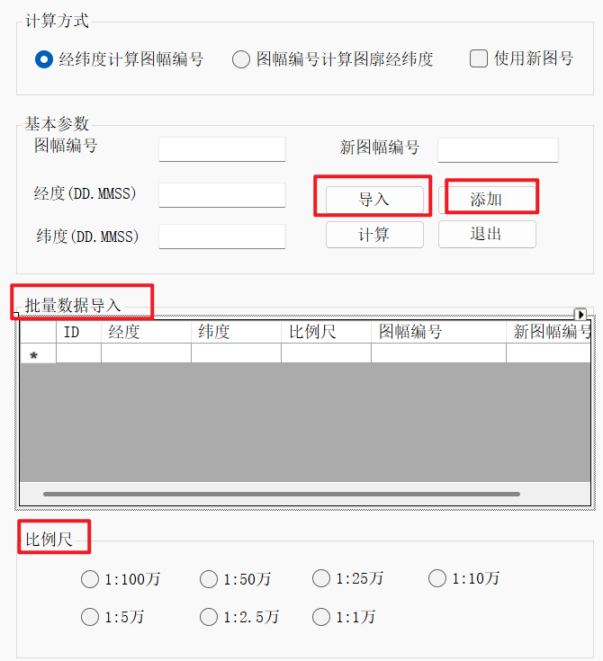

## UI 界面



| 区域名称          | 控件类型组合                              |
| ----------------- | ----------------------------------------- |
| 计算方式          | `GroupBox` + `RadioButton` + `CheckBox`   |
| 经纬度 / 图号输入 | `Label` + `TextBox`                       |
| 比例尺            | `GroupBox` + 多个 `RadioButton`           |
| 经纬度点位置区域  | `GroupBox` + `Label` + `TextBox`（4组）   |
| 接图表            | `GroupBox` + 多个 `TextBox`（3x3 或更多） |
| 操作按钮          | `Button`（计算、退出）                    |

我的：




## 原理

原理挺简单的，挺容易理解的。不懂的可以去 B 站搜视频。说的通俗点，就有点像瓦片一样，瓦片的位置是用 XYZ 来表示的，X 和 Y 表示行列号，Z 表示级别。在这里，我们就相当于先确定 Z，即比例尺，然后确定对应的行列号。当然，我这里只是比喻。

感觉这个题目就是因为界面复杂，有点难理清思路。


## C# 代码

### 1.读取数据

书本上给的程序是单个计算图幅编号的，也就是手动输入。但是比赛明确了提供 txt 文本数据，所以我认为会给点号以及经纬度，然后每个点位的比例尺信息也在 txt 里。

我的 txt 数据格式如下：

```
ID,B(纬度DD.MMSS),L(经度DD.MMSS),scal(比例尺)
1,26.2217,123.1518,1:1000000
2,17.5446,144.1756,1:10000
3,33.4536,125.4523,1:50000
4,50.4422,110.1122,1:250000
```

先做好几点，1.支持导入数据，导入的数据会在 dataGridView 里显示。2.同时也支持手动添加，输入经纬度，然后点击“添加”，会在 dataGridView 里新增一列。3.做好情况判断，比如输入的经纬度要符合 DD.MMSS格式；添加数据需要选择比例尺。



#### 支持手动输入

主要是三个辅助函数，一个是判断用户输入的 DDMMSS 合规吗？一个是把 DDMMSS 转为度，一个是获取用户选择的比例尺。

```c#
//点击“添加”按钮后，dataGridView 展示信息，并且存储点位信息。
private void button4_Click(object sender, EventArgs e)
{
    // 需要选择“经纬度计算图幅编号”
    if (radioButton1.Checked)
    {
        var Ltext = textBox2.Text; //经度文本
        var Btext = textBox3.Text; //纬度文本
        if(IS_BL_right(Ltext) && IS_BL_right(Btext))
        {
            var L = DDMMSS_to_Degrees(Ltext); //转为度
            var B = DDMMSS_to_Degrees(Btext);
            var scaleButton = GetSelectedRadioButton(groupBox3);
            if(scaleButton == null)
            {
                //判断是否选择了比例尺
                MessageBox.Show("未选择比例尺!");
                return;
            }
            var scale = scaleButton.Text;

            // 获取当前行数作为 ID
            int newId = dataGridView1.Rows.Count;

            // 添加用户输入的数据
            dataGridView1.Rows.Add(newId, L, B, scale);

            Point point = new Point(newId, L, B, scale);
            points.Add(point);
        }
        else
        {
            MessageBox.Show("经度或纬度输入错误！");
        }
    }
    else
    {
        MessageBox.Show("计算方式选择错误");
    }
}
//用于判断经度和纬度格式是否规范。
private bool IS_BL_right(string text)
{
    // 检查是否为空或null
    if (string.IsNullOrWhiteSpace(text))
        return false;

    // 移除空格并检查格式
    text = text.Trim();

    // 检查是否包含小数点
    if (!text.Contains("."))
        return false;

    // 分割整数部分和小数部分
    string[] parts = text.Split('.');
    if (parts.Length != 2)
        return false;

    string integerPart = parts[0]; // 度
    string decimalPart = parts[1]; // 分秒

    // 检查整数部分（度）是否为有效数字
    if (!int.TryParse(integerPart, out int degrees) || degrees < 0)
        return false;

    // 检查经度（0-180）或纬度（0-90）
    if (integerPart.Length > 3 || degrees > 180)
        return false;

    // 检查小数部分（MMSS格式，4位数字）
    if (decimalPart.Length != 4 || !int.TryParse(decimalPart, out int mmss))
        return false;

    // 验证分（0-59）和秒（0-59）
    int minutes = mmss / 100;
    int seconds = mmss % 100;
    if (minutes > 59 || seconds > 59)
        return false;

    return true;
}
//DDMMSS转度
private double DDMMSS_to_Degrees(string text)
{
    // 分割整数部分（度）和小数部分（分秒）
    string[] parts = text.Split('.');
    string integerPart = parts[0]; // 度
    string decimalPart = parts[1]; // 分秒

    // 提取度、分、秒
    int degrees = int.Parse(integerPart); // 度
    int mmss = int.Parse(decimalPart);   // 分秒（MMSS）
    int minutes = mmss / 100;            // 分
    int seconds = mmss % 100;            // 秒

    // 转换为十进制度数：度 + 分/60 + 秒/3600
    double result = degrees + (minutes / 60.0) + (seconds / 3600.0);

    return result;
}
// 用于获得用户选择的比例尺
private RadioButton GetSelectedRadioButton(GroupBox groupBox)
{
    // 遍历 GroupBox 中的所有控件
    foreach (Control control in groupBox.Controls)
    {
        // 检查控件是否为 RadioButton 且被选中
        if (control is RadioButton radioButton && radioButton.Checked)
        {
            return radioButton;
        }
    }
    // 如果没有选中任何 RadioButton，返回 null
    return null;
}
```

#### 支持导入

导入就不用多说了，老生常谈了。

```c#
// 点击导入按钮后，可以选择文本导入
private void button3_Click(object sender, EventArgs e)
{
    try
    {
        OpenFileDialog openFileDialog = new OpenFileDialog();
        openFileDialog.FileName = "请选择数据";
        openFileDialog.Filter = "文本文档|*.txt";
        if(openFileDialog.ShowDialog() == DialogResult.OK)
        {
            StreamReader streamReader = new StreamReader(openFileDialog.FileName);
            streamReader.ReadLine(); //第一行不要
            while(!streamReader.EndOfStream)
            {
                var line = streamReader.ReadLine();
                if(line.Length > 0)
                {
                    var tempRegex = Regex.Split(line, @"\,");

                    int id = dataGridView1.Rows.Count;
                    var B = DDMMSS_to_Degrees(tempRegex[1]);
                    var L = DDMMSS_to_Degrees(tempRegex[2]);
                    var scale = tempRegex[3];

                    var point = new Point(id, L, B, scale);
                    points.Add(point);

                    // 添加数据
                    dataGridView1.Rows.Add(id, L, B, scale);
                }
            }
        }
    }
    catch (Exception ex)
    {

        throw ex;
    }
}
```

### 2.计算

写主算法的时候，很明显的发现 AI 能够完成代码，因为不是很难，所以直接让 AI 生成了。

这里就不赘述了，AI 写的代码挺直观的。

按照下面的流程去理解：

老图幅计算——新图幅计算——邻接图表计算

其中，邻接图表的计算逻辑是基于老图幅计算的，我们只需要得到邻接图里的某一点，然后输入到老图幅的已经有的函数就行了。
