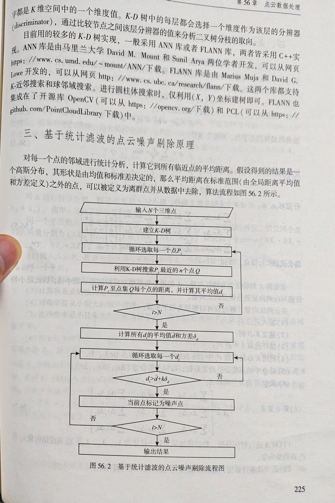

# 写在前面

测绘程序设计（下册）第 225 页有介绍**基于统计滤波的点云噪声剔除原理**，而且也有算法流程图。

1. 输入N个三维点
2. 建立K - D树
3. 循环选取每一个点Pi：

   -  利用K - D树搜索Pi最近的n个点Q

   -  计算Pi至点集Q每个点的距离，并计算其平均值d

4. 判断i > N是否成立： 

   - 若成立，计算所有di的平均值d_bar和方差delta_d 。

   - 若不成立，返回至步骤3继续循环选取下一个点Pi 。  

5. 循环选取每一个di ： 
   - 判断di > d_bar + k * delta_d是否成立： 
     - 若成立，将当前点标记为噪声点。 
     - 若不成立，继续循环判断下一个di 。  

6. 判断i > N是否成立： 
   - 若成立，输出结果。 
   - 若不成立，返回至步骤5继续相关操作。

但是需要注意的是，书上的跟赛题描述的有部分区别。赛题描述的是【基于统计滤波的点云去噪：将点云空间划分为**规则格网**，根据 k 个邻近点的统计特性识别并移除噪声点】。而书本上的，用的是 **K-D 树**。K-D 树也是用来划分点的，但是 C# 没有简洁的原生实现方法，因此赛题里说的是规则格网。所以我们只需要把 K-D 树换成规则格网就行了。

# 基于规则格网的统计滤波点云去噪算法详解

以下均由 AI 生成，理解其思路，具体的内容细节，需要你去写代码才能够知道

## 1. 算法目标

识别并移除点云数据中的噪声点。其核心思想是：对于每个点，计算其到指定数量邻近点的平均距离。如果一个点的平均邻近距离远大于数据集中所有点平均邻近距离的某个统计阈值，则将其视为噪声点。本算法使用规则格网来辅助查找邻近点。

## 2. 输入

- **P**: 包含N个三维点 `(x, y, z)` 的点云数据集。
- **cellSize**: 规则格网的单元尺寸（例如，可以是一个浮点数表示立方体格网的边长，或者是一个包含 `(size_x, size_y, size_z)` 的元组）。
- **n_neighbors**: 用于计算每个点局部平均距离的邻近点数量。
- **k_std_multiplier**: 标准差倍数，用于定义噪声判断的阈值。

## 3. 输出

- **P_denoised**: 去除噪声点后的点云数据集。

## 4. 算法流程

### 步骤一：初始化格网并分配点

1. **计算点云边界 (Bounding Box):**
   - 遍历所有点 `Pi` in `P`，找出 `x, y, z` 坐标的最小值 (`min_x, min_y, min_z`) 和最大值 (`max_x, max_y, max_z`)。这将定义点云数据的空间范围。
2. **确定格网维度:**
   - 根据 `cellSize` 和边界，计算在X, Y, Z三个方向上需要的格网数量：
     - `num_cells_x = ceil((max_x - min_x) / cell_size_x)`
     - `num_cells_y = ceil((max_y - min_y) / cell_size_y)`
     - `num_cells_z = ceil((max_z - min_z) / cell_size_z)`
   - *(注: `ceil` 是向上取整函数。如果 `cellSize` 是单个值，则 `cell_size_x = cell_size_y = cell_size_z = cellSize`)*
3. **创建格网数据结构:**
   - 建立一个数据结构来存储每个格网单元及其包含的点。常见的方式是使用一个三维数组（或列表的列表的列表），或者一个哈希表/字典，其键是格网单元的索引 `(ix, iy, iz)`，值是该单元内点的列表（可以存储点的完整坐标或点的索引）。
   - 例如：`grid = Dictionary<Tuple<int, int, int>, List<Point>>()`
4. **将点分配到格网单元:**
   - 遍历点云中的每一个点 `Pi = (px, py, pz)`:
     - 计算该点所属的格网单元索引：
       - `ix = floor((px - min_x) / cell_size_x)`
       - `iy = floor((py - min_y) / cell_size_y)`
       - `iz = floor((pz - min_z) / cell_size_z)`
       - *(注: `floor` 是向下取整函数。确保索引不会超出计算的 `num_cells` 范围，例如通过 `min(ix, num_cells_x - 1)` 进行约束)*
     - 将点 `Pi` (或其在原始列表中的索引) 添加到 `grid[(ix, iy, iz)]` 对应的列表中。

### 步骤二：计算每个点的平均邻近距离 (di)

1. 初始化一个列表 `D_avg_distances` 用于存储每个点的平均邻近距离 `di`。
2. 遍历点云中的每一个原始点 `Pi` (假设其索引为 `i`):
   - **a. 确定 `Pi` 所在的格网单元:**
     - 根据 `Pi` 的坐标和 `min_x, min_y, min_z, cellSize`，计算其所属的格网单元索引 `(current_ix, current_iy, current_iz)`，同步骤一.4。
   - **b. 确定邻域搜索范围 (候选邻近格网):**
     - `Pi` 的邻域通常定义为包含 `Pi` 的格网单元及其直接相邻的格网单元。在一个三维格网中，这通常是 `Pi` 所在单元周围的 3x3x3 = 27 个格网单元（包括自身）。
     - 收集这些邻近格网单元中的所有点，形成一个候选邻近点集 `Q_candidate`。注意处理边界情况，不要选择超出格网范围的单元。
   - **c. 从候选点中筛选 `n_neighbors` 个最近邻点:**
     - 如果 `Q_candidate` 中的点数小于 `n_neighbors`，则将 `Q_candidate` 中所有点（除了 `Pi` 自身）都作为 `Pi` 的邻近点。
     - 如果 `Q_candidate` 中的点数大于等于 `n_neighbors`：
       - 计算 `Pi` 到 `Q_candidate` 中每一个点 `Qj` (且 `Qj != Pi`) 的欧氏距离。
       - 对这些距离进行排序。
       - 选择距离 `Pi` 最近的 `n_neighbors` 个点，形成点集 `Q_neighbors`。
     - *处理特殊情况：如果有效的邻近点数量（`Q_neighbors` 中的点数）为0（例如，在一个非常稀疏的区域，或者 `n_neighbors` 设置不当），则 `di` 可以设置为一个特殊值（如0或一个较大的惩罚值），或者该点在后续统计中被特殊处理。通常，如果邻近点不足，该点更容易被误判为噪声或导致统计不稳定。一种策略是，如果邻近点少于某个最小阈值（例如 `n_neighbors / 2`），则直接将该点视为噪声候选，或赋予其较大的 `di`。为简化，这里假设总能找到一些邻居。*
   - **d. 计算 `Pi` 的平均邻近距离 `di`:**
     - 计算 `Pi` 到 `Q_neighbors` 中每个点的距离之和。
     - `di = (sum of distances to Q_neighbors) / (number of points in Q_neighbors)`
     - 将计算得到的 `di` 添加到列表 `D_avg_distances` 中。

### 步骤三：计算全局统计量

1. 当所有点的 `di` 都计算完毕后：
   - 计算列表 `D_avg_distances` 中所有 `di` 值的**平均值 `d_mean`** (即原算法中的 `d_bar`)。
     - `d_mean = sum(D_avg_distances) / N` (N是有效计算了`di`的点数)
   - 计算列表 `D_avg_distances` 中所有 `di` 值的**标准差 `d_std_dev`** (即原算法中的 `delta_d`)。
     - `d_std_dev = sqrt( sum((di - d_mean)^2) / N )`

### 步骤四：识别并标记噪声点

1. 初始化一个空的去噪点云列表 `P_denoised`。
2. 再次遍历原始点云中的每个点 `Pi` (或者遍历 `D_avg_distances` 列表，其索引与原始点对应)：
   - 获取该点对应的平均邻近距离 `di` (来自 `D_avg_distances` 列表)。
   - **判断条件:**
     - 如果 `di <= d_mean + k_std_multiplier * d_std_dev`，则认为点 `Pi` 是一个**非噪声点 (inlier)**。将其添加到 `P_denoised`。
     - 如果 `di > d_mean + k_std_multiplier * d_std_dev`，则认为点 `Pi` 是一个**噪声点 (outlier)**。将其丢弃。

### 步骤五：输出结果

1. `P_denoised` 即为最终去噪后的点云。

## 5. 参数选择与注意事项

- **`cellSize`**:
  - 格网单元的大小对算法性能和效果影响显著。
  - 太小：可能导致很多格网为空，邻域搜索时需要查询更多格网，计算量增加；或者一个格网内的点太少，不足以代表局部密度。
  - 太大：可能导致一个格网内包含过多点，使得局部特征模糊，难以区分细小的噪声和物体结构。
  - 通常需要根据点云的平均密度进行经验性设置或实验调优。
- **`n_neighbors`**:
  - 用于计算局部统计量的邻居数量。较小的值对稀疏噪声敏感，但可能将一些正常但局部稀疏的点误判。较大的值对密集噪声簇更鲁棒，但可能平滑掉一些细节。
- **`k_std_multiplier`**:
  - 标准差倍数，决定了判断噪声的严格程度。值越小，越多点会被判断为噪声；值越大，判断条件越宽松。常用的值范围可能在1.0到3.0之间，具体取决于数据特性。
- **边界处理**: 在格网分配和邻域搜索时，需要正确处理位于点云数据边界的格网单元。
