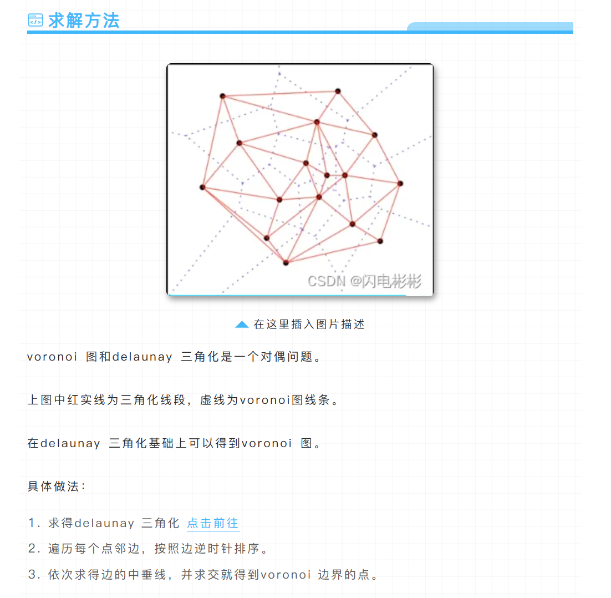
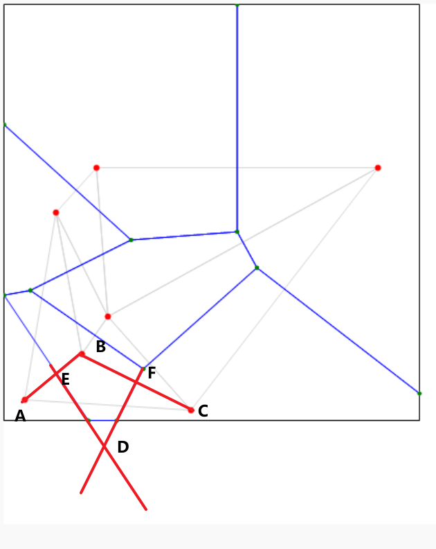
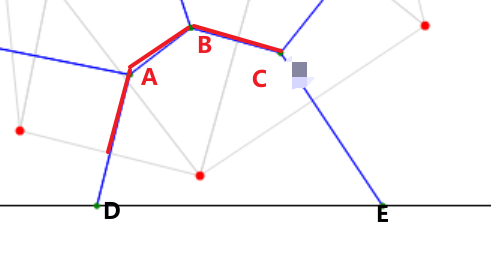
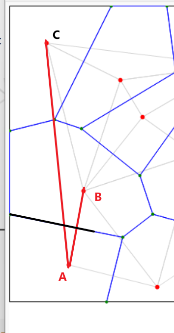
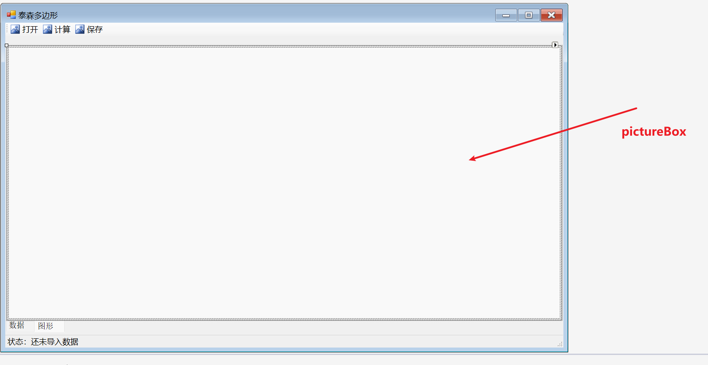

# 写在前面

**更新：看到了另一种实现方法。我觉得可行**。[voronoi diagram(泰森多边形) 应用 - Panda Preserve](https://mp.weixin.qq.com/s/Bhl1OUWomGSzYh9jYlDaEA)

总算是实现了，这次用的方法就是中垂线相交，前前后后花了将近一个月才解决这个题目，感觉是心头大患。不解决这个题目根本没心思做下一个题目，期间不断碰壁，没思路的时候怎么想都没办法，然后就一直没管。。。

# 原理



**voronoi 图和 delaunay 三角化是一个对偶问题。**

**上图中红实线为三角化线段，虚线为 voronoi 图线条。**

**在 delaunay 三角化基础上可以得到 voronoi 图。**

**具体做法：**

1. **求得delaunay 三角化**
2. **遍历每个点邻边，按照边逆时针排序。**
3. **依次求得边的中垂线，并求交就得到voronoi 边界的点。**

# C#实现

## 1.读取数据

这一步不过多解释。我的 txt 长这样：

**需要注意的是**，好像 PictureBox 的坐标系里，以左上角为原点。不知道能不能改。反正我是按这个默认的做的。

```
区域范围,左下坐标,左上坐标,右下坐标,右上坐标
(0,400),(0,0),(400,400),(400,0)
点位ID,X,Y
1,50,50
2,150,100
3,300,80
4,100,250
5,250,200
6,350,280
7,80,350
8,200,380
9,180,150
```

我的 Point 类数据结构以及读取：

```c#
class Point
{
    public double X, Y;
    //public double ID; 最好不要写ID

    public Point(double x,double y)
    {
        X = x;
        Y = y;
    }
    public Point(string line)
    {
        var regx = Regex.Split(line, @"\,");
        X = Convert.ToDouble(regx[1]);
        Y = Convert.ToDouble(regx[2]);
    }
}


//最方便存边界的方法，比赛里谁管你按txt读取，直接按结果写过程，原点在左上角
Point pointLeftBottom = new Point(0, 400);
Point pointLeftTop = new Point(0, 0);
Point pointRightBottom = new Point(400, 400);
Point pointRightTop = new Point(400, 0);

List<Point> Points = new List<Point>(); // 用于存储控制点
private void toolStripButton1_Click(object sender, EventArgs e)
{
    try
    {
        OpenFileDialog openFileDialog = new OpenFileDialog();
        openFileDialog.FileName = "请选择数据";
        openFileDialog.Filter = "文本文件|*.txt";
        if(openFileDialog.ShowDialog() == DialogResult.OK)
        {
            Points.Clear(); // 先去除原本的数据

            var reader = new StreamReader(openFileDialog.FileName);
            reader.ReadLine();
            reader.ReadLine(); //第二行直接在上面就写了
            reader.ReadLine();
            while(!reader.EndOfStream)
            {
                var line = reader.ReadLine();
                if(line.Length > 0)
                {
                    var pointtmp = new Point(line);
                    Points.Add(pointtmp);
                }         
            }
            reader.Close();

            dataGridView1.Rows.Clear();
            for(int i = 0;i < Points.Count;i++)
            {
                dataGridView1.Rows.Add();
                dataGridView1.Rows[i].Cells[0].Value = i + 1;
                dataGridView1.Rows[i].Cells[1].Value = Points[i].X;
                dataGridView1.Rows[i].Cells[2].Value = Points[i].Y;
            }
            toolStripStatusLabel1.Text = "状态：导入数据成功";
            MessageBox.Show("导入成功");
            tabControl1.SelectedIndex = 0;               
        }
    }
    catch (Exception)
    {

        throw;
    }
}
```

## 2.主算法

先写好能够存边界矩形的方法，用构造函数

### 2.1 基本设置

基本的类，Voronoi 顶点类，Voronoi 单元类，三角形类。Voronoi 单元类包含生成点以及对应的 Voronoi 顶点。

以及最初设置边界矩形的方法。

```c#
using System;
using System.Collections.Generic;
using System.Drawing; // 画图需要
using System.Linq; // 用于方便快速排序的
using TriangleNet; // 外部库
using TriangleNet.Geometry; // 外部库

// 定义Voronoi顶点类
class VoronoiVertex
{
    public double X;
    public double Y;

    public VoronoiVertex(double x, double y)
    {
        X = x;
        Y = y;
    }
}
// 定义Voronoi单元类
class VoronoiCell
{
    public Point Site;  // 原始点（泰森多边形的生成点）
    public List<VoronoiVertex> Vertices = new List<VoronoiVertex>();

    public VoronoiCell(Point site)
    {
        Site = site;
    }
}
// 定义三角形类，三角形有三个顶点
class Triangle
{
    public Point A;
    public Point B;
    public Point C;

    public Triangle(Point a, Point b, Point c)
    {
        A = a;
        B = b;
        C = c;
    }

}
public List<Triangle> Triangles = new List<Triangle>(); //三角网
public List<VoronoiCell> VoronoiCells = new List<VoronoiCell>(); // 最后得到的泰森多边形
public List<Point> BoundaryPoints = new List<Point>(); // 边界点，指的是三角网的边界点
public System.Drawing.Rectangle BoundingRectangle { get; set; } // 添加边界矩形属性

// 重载go方法，允许同时设置边界矩形
public void go(List<Point> points, int x, int y, int width, int height)
{
    SetBoundingRectangle(x, y, width, height);
    go(points);
}
// 初始化边界矩形
// 设置边界矩形的方法
public void SetBoundingRectangle(int x, int y, int width, int height)
{
    BoundingRectangle = new System.Drawing.Rectangle(x, y, width, height);
}
// 主方法，用于生成Voronoi图
public void go(List<Point> points)
{
    Triangles = GenerateDelaunayUsingLibrary(points); // 生成Delaunay三角网
    VoronoiCells = GenerateVoronoi(points); // 生成Voronoi图
}
```

### 2.2 构建三角网

首先下载库。其实可以原生实现，但是会变复杂。


构建三角网很简单，按照库的函数使用就行了。但是最重要的是我们需要实现把边界点找出来。其实原本 AI 告诉我 Triangle 库是可以找边界点的，但是我试了，不行。读者可以去试试看。

**我用的是边界计数法来实现找边界点**，原理是遍历所有三角网，用 **"x1_y1_x2_y2"** 记录每一个边，那么只有边界的边只会有一个记录。

```c#
public List<Triangle> Triangles = new List<Triangle>(); //三角网
public List<Point> BoundaryPoints = new List<Point>(); // 边界点，指的是三角网的边界点

// -1.开始--------------------------------------------------------------------------------//
// 1.构建三角网，其功能函数包括 1.1
//这个函数的作用是使用外部库TriangleNet，根据控制点生成三角网。同时随便得到边界点
public List<Triangle> GenerateDelaunayUsingLibrary(List<Point> points)
{
    // 创建输入几何结构
    Polygon polygon = new Polygon();

    // 添加顶点
    for (int i = 0; i < points.Count; i++)
    {
        polygon.Add(new Vertex(points[i].X, points[i].Y));
    }

    // 执行三角剖分
    var mesh = (Mesh)polygon.Triangulate();

    // 将结果转换为自定义Triangle列表
    List<Triangle> triangulation = new List<Triangle>();
    foreach (var triangle in mesh.Triangles)
    {
        Point a = new Point(triangle.GetVertex(0).X, triangle.GetVertex(0).Y);
        Point b = new Point(triangle.GetVertex(1).X, triangle.GetVertex(1).Y);
        Point c = new Point(triangle.GetVertex(2).X, triangle.GetVertex(2).Y);
        triangulation.Add(new Triangle(a, b, c));
    }

    // 使用边计数法获取边界点
    // edgeCount: 用于记录每条边出现的次数，键为边的标识符，值为出现次数
    // edgePoints: 用于存储边对应的点，键为边的标识符，值为该边的一个端点
    Dictionary<string, int> edgeCount = new Dictionary<string, int>();
    Dictionary<string, Point> edgePoints = new Dictionary<string, Point>();

    // 遍历所有三角形，统计每条边出现的次数
    foreach (var triangle in triangulation)
    {
        // 处理三角形的三条边
        // 内部边会在两个相邻三角形中各出现一次，因此计数为2
        // 边界边只会在一个三角形中出现，因此计数为1
        CountEdge(edgeCount, edgePoints, triangle.A, triangle.B);  // 处理边AB
        CountEdge(edgeCount, edgePoints, triangle.B, triangle.C);  // 处理边BC
        CountEdge(edgeCount, edgePoints, triangle.C, triangle.A);  // 处理边CA
    }

    // 收集边界点：遍历所有边，找出只出现一次的边的端点
    var boundary = new List<Point>();
    foreach (var edge in edgeCount.Keys)
    {
        // 如果边只出现一次，说明是边界边
        if (edgeCount[edge] == 1)
        {
            // 从边的标识符中解析出点的坐标
            string[] points1 = edge.Split('_');  // 边的标识符格式为"x1_y1_x2_y2"
            // 将两个端点都添加到边界点列表
            boundary.Add(new Point(int.Parse(points1[0]), int.Parse(points1[1])));
            boundary.Add(new Point(int.Parse(points1[2]), int.Parse(points1[3])));
        }
    }

    // 去除重复的边界点
    boundary = boundary.GroupBy(p => new { p.X, p.Y })
                      .Select(g => g.First())
                      .ToList();
    // 对边界点进行逆时针排序
    if (boundary.Count > 2)
    {
        // 计算边界点的中心点（质心）
        double centerX = boundary.Average(p => p.X);
        double centerY = boundary.Average(p => p.Y);

        // 使用极角排序：计算每个点相对于中心点的极角，按极角排序
        boundary = boundary.OrderBy(p =>
            Math.Atan2(p.Y - centerY, p.X - centerX)).ToList();
    }


    // 保存边界点供后续使用
    BoundaryPoints = boundary;

    return triangulation;
}

// 1.1 辅助方法：添加邻接点
// 辅助方法：统计一条边的出现次数。用于得到边界点
private void CountEdge(Dictionary<string, int> edgeCount, Dictionary<string, Point> edgePoints, Point p1, Point p2)
{
    // 创建边的唯一标识符，格式为"x1_y1_x2_y2"，确保坐标小的点在左边
    string edgeKey;
    if (p1.X < p2.X || (p1.X == p2.X && p1.Y < p2.Y))
        edgeKey = $"{p1.X}_{p1.Y}_{p2.X}_{p2.Y}";  // p1的坐标更小，p1在前
    else
        edgeKey = $"{p2.X}_{p2.Y}_{p1.X}_{p1.Y}";  // p2的坐标更小，p2在前

    // 更新边的计数
    if (edgeCount.ContainsKey(edgeKey))
        edgeCount[edgeKey]++;  // 如果边已存在，计数加1
    else
    {
        // 如果是新边，初始化计数为1，并存储对应的点
        edgeCount[edgeKey] = 1;
        // 存储坐标较小的点
        edgePoints[edgeKey] = p1.X < p2.X || (p1.X == p2.X && p1.Y < p2.Y) ? p1 : p2;
    }
}
// -1.结束--------------------------------------------------------------------------------//
```

### 2.3 生成Voronoi图

生成 Voronoi 图，其子步骤包括 2.3.1，2.3.2

首先总览大步骤

```c#
public List<VoronoiCell> GenerateVoronoi(List<Point> points)
{
    // 初始化Voronoi单元，每个输入点对应一个单元
    Dictionary<Point, VoronoiCell> cellMap = new Dictionary<Point, VoronoiCell>();
    foreach (var point in points)
    {
        cellMap[point] = new VoronoiCell(point);
    }

    // 步骤1：构建每个点的邻接点列表
    Dictionary<Point, List<Point>> adjacentPoints = new Dictionary<Point, List<Point>>();
    foreach (var point in points)
    {
        adjacentPoints[point] = new List<Point>();
    }

    // 从三角网中提取邻接关系
    foreach (var triangle in Triangles)
    {
        // 三角形的三个顶点两两相邻
        AddAdjacentPoint(adjacentPoints, triangle.A, triangle.B);
        AddAdjacentPoint(adjacentPoints, triangle.B, triangle.C);
        AddAdjacentPoint(adjacentPoints, triangle.C, triangle.A);
    }
    // 对邻接点进行排序
    SortAdjacentPoints(adjacentPoints);

    // 步骤2：构建每个点的Voronoi单元
    foreach (var center in points)
    {
        // 判断当前点是否为边界点
        bool isBoundaryPoint = IsBoundaryPoint(center);

        // 获取当前点的邻接点列表
        var neighbors = adjacentPoints[center];

        // 如果邻接点数量小于3，无法构建完整的Voronoi单元
        if (neighbors.Count < 3) continue;

        if (!isBoundaryPoint)
        {
            // 处理内部点的Voronoi单元构建
            ConstructInnerPointVoronoiCell(cellMap[center], center, neighbors);
        }
        else
        {
            // 边界点的Voronoi单元构建
            ConstructOuterPointVoronoiCell(cellMap[center], center, neighbors);
        }
    }

    return cellMap.Values.ToList();
}
```

#### 2.3.1 构建并且排序邻接关系

邻接关系构建分为两步：1. 先找到每个生成点的邻接点。2. 把这些邻接点按顺序排列。

其中，找到每个生成点的邻接点的逻辑是：遍历三角网的 每个三角形 的 每个边，构建一对多的关系。

邻接点按顺序排列比较麻烦，因为内部点还好，但是外部点要考虑凸包和凹包的情况。读者如果有普适，通用的方法的话，麻烦讨论一下。我的逻辑是：内部点就按极角排序。外部点是需要借用 2.2 生成的**边界点数据**，为什么呢，**因为每一个外部点的邻接点里，必定有两个边界点**。选取一个作为起点，然后依次计算向量之间的夹角就好办了。

```c#
// -2.1开始--------------------------------------------------------------------------------//
// 2.1 添加邻接点关系，边界点和内部点逻辑不同
private void AddAdjacentPoint(Dictionary<Point, List<Point>> adjacentPoints, Point p1, Point p2)
{
    // 查找原始点（处理浮点数精度问题）
    var originalP1 = FindOriginalPoint(adjacentPoints.Keys.ToList(), p1);
    var originalP2 = FindOriginalPoint(adjacentPoints.Keys.ToList(), p2);

    if (originalP1 != null && originalP2 != null)
    {
        // 避免重复添加
        if (!adjacentPoints[originalP1].Contains(originalP2))
        {
            adjacentPoints[originalP1].Add(originalP2);
        }
        if (!adjacentPoints[originalP2].Contains(originalP1))
        {
            adjacentPoints[originalP2].Add(originalP1);
        }
    }
}
// 2.1.1，子步骤2.1的功能函数：查找原始点
// 查找原始点，指的是最原始的生成点
private Point FindOriginalPoint(List<Point> points, Point p)
{
    const double epsilon = 1e-10;
    foreach (var point in points)
    {
        if (Math.Abs(point.X - p.X) < epsilon && Math.Abs(point.Y - p.Y) < epsilon)
        {
            return point;
        }
    }
    return null;
}
// 2.1.2，子步骤2.1的功能函数：对邻接点进行排序
// 对邻接点进行排序
private void SortAdjacentPoints(Dictionary<Point, List<Point>> adjacentPoints)
{
    // 遍历每个点
    foreach(var center in adjacentPoints.Keys)
    {
        // 获取当前点的邻接点列表
        var neighbors = adjacentPoints[center];

        // 如果邻接点数量小于2，不需要排序
        if (neighbors.Count < 2) continue;

        // 判断当前点是否为边界点
        bool isBoundaryPoint = IsBoundaryPoint(center);

        if (isBoundaryPoint)
        {
            // 对边界点使用增强的排序
            SortBoundaryPointNeighbors(neighbors, center);
        }
        else
        {
            // 对内部点使用标准极角排序
            SortAdjacentPointsByPolarAngle(neighbors, center);
        }
    }
}
// 2.1.3， 子步骤2.1的功能函数：判断点是否为边界点。
// 判断点是否为边界点
private bool IsBoundaryPoint(Point p)
{
    // 检查点是否在边界点列表中
    return BoundaryPoints.Any(bp => Math.Abs(bp.X - p.X) < 1e-10 && Math.Abs(bp.Y - p.Y) < 1e-10);
}
// 2.1.4， 子步骤2.1的功能函数：对内部点的邻接点进行极角排序
// 对内部点的邻接点进行极角排序
private void SortAdjacentPointsByPolarAngle(List<Point> neighbors, Point center)
{
    // 计算每个邻接点相对于中心点的角度
    Dictionary<Point, double> angles = new Dictionary<Point, double>();
    foreach (var p in neighbors)
    {
        // 使用atan2函数计算极角，范围为[-π, π]
        double angle = Math.Atan2(p.Y - center.Y, p.X - center.X);
        if(angle < 0) {
            angle += 2 * Math.PI; // 将负数角度转换为正数
        }
        angles[p] = angle;
    }

    // 按角度排序（升序，即逆时针排序）
    neighbors.Sort((p1, p2) => angles[p1].CompareTo(angles[p2]));
}
// 2.1.5， 子步骤2.1的功能函数：对边界点的邻接点进行排序
// 对边界点的邻接点进行排序
private void SortBoundaryPointNeighbors(List<Point> neighbors, Point center)
{
    // 检查邻接点数量，如果少于2个则无需排序
    if (neighbors.Count < 2)
    {
        return;
    }

    // 找到同为边界点的邻接点
    // 使用 BoundaryPoints 列表来检查邻接点是否也是边界点
    Point startPoint = neighbors.FirstOrDefault(neighbor => IsBoundaryPoint(neighbor));

    // 定义起始向量（从 center 指向 startPoint）
    double startVecX = startPoint.X - center.X;
    double startVecY = startPoint.Y - center.Y;
    // 计算起始向量模长的平方（避免开方）
    double startVecMagSq = startVecX * startVecX + startVecY * startVecY;
    // 计算起始向量模长
    double startVecMag = Math.Sqrt(startVecMagSq);

    // 创建剩余邻接点列表（不包含 startPoint）
    List<Point> remainingNeighbors = neighbors.Where(p => p != startPoint).ToList();

    // 对剩余邻接点按与起始向量夹角的余弦值降序排序
    // 余弦值越大，角度越小（在[0, PI]范围内）
    remainingNeighbors.Sort((p1, p2) =>
    {
        // 计算 p1 相对于 center 的向量
        double vec1X = p1.X - center.X;
        double vec1Y = p1.Y - center.Y;
        // 计算 p1 向量模长
        double vec1Mag = Math.Sqrt(vec1X * vec1X + vec1Y * vec1Y);

        // 计算 p2 相对于 center 的向量
        double vec2X = p2.X - center.X;
        double vec2Y = p2.Y - center.Y;
        // 计算 p2 向量模长
        double vec2Mag = Math.Sqrt(vec2X * vec2X + vec2Y * vec2Y);

        // 计算 startVec 和 vec1 的点积
        double dot1 = startVecX * vec1X + startVecY * vec1Y;
        // 计算 startVec 和 vec2 的点积
        double dot2 = startVecX * vec2X + startVecY * vec2Y;

        // 计算夹角余弦值 cos = (a . b) / (|a| * |b|)
        // 处理零向量情况，避免除零
        double cosTheta1 = (vec1Mag > 1e-10) ? dot1 / (startVecMag * vec1Mag) : 1.0; // 与自身夹角为0，余弦为1
        double cosTheta2 = (vec2Mag > 1e-10) ? dot2 / (startVecMag * vec2Mag) : 1.0;

        // 修正可能的浮点误差，确保值在 [-1, 1] 区间
        cosTheta1 = Math.Max(-1.0, Math.Min(1.0, cosTheta1));
        cosTheta2 = Math.Max(-1.0, Math.Min(1.0, cosTheta2));

        // 比较余弦值，降序排列（cos越大，角度越小）
        // CompareTo(other) 返回: < 0 (this < other), 0 (this == other), > 0 (this > other)
        // 我们希望 cosTheta1 > cosTheta2 时排在前面，所以用 cosTheta2.CompareTo(cosTheta1)
        return cosTheta2.CompareTo(cosTheta1);
    });

    // 重构 neighbors 列表：起始点 + 排序后的剩余点
    neighbors.Clear(); // 清空原始列表
    neighbors.Add(startPoint); // 添加起始点
    neighbors.AddRange(remainingNeighbors); // 添加排序后的剩余点
}
// -2.1结束--------------------------------------------------------------------------------//
```

#### 2.3.2 构建内部点以及外部点的Voronoi单元

邻接关系构建好后，我们就依次计算每两个邻接边的中垂线，可以得到 Voronoi 顶点，构建 Voronoi 单元。

但是问题在于，**如果交点在边界矩形外？**

如图，AB 和 BC 的中垂线交点就在外头了。这种情况下，我的**不严谨的做法**是：求与边界的交点（会有两个），哪个距离中点近（E 或者F），就用哪个。不严谨在于某些情况，距离近并不一定就是正确的交点。后续需要优化，读者有思路可以和我讨论。



**又有一个问题：如果是构建外部点的 Voronoi 单元，如果交点在外怎么办？如果交点没在外怎么办？**

就是这些奇奇怪怪的情况，整的我头痛。

**如果不在外**，那么就只会得到 A B C 三个点，**那 D 和 E 呢？**也是同理，我的**不严谨的做法**是：求与边界的交点（会有两个），哪个距离中点近，就用哪个。不严谨在于某些情况，距离近并不一定就是正确的交点。后续需要优化，读者有思路可以和我讨论。



**如果在外呢？**

如图，AB 和 AC 的交点明显在外，那么只能用 AB 的中垂线与边界的交点了。



**又又又又又又有一个问题，代码怎么写呢？怎么写的简单呢？**，所以头痛啊，我是用了一些笨方法。

```c#
// -2.2开始--------------------------------------------------------------------------------//
// 2.2，大步骤2的子步骤2.2，构建内部点以及外部点的Voronoi单元
// 2.2.1子步骤2.2的步骤一， 构建外部点的Voronoi单元
private void ConstructOuterPointVoronoiCell(VoronoiCell cell, Point center, List<Point> neighbors)
{
    int n = neighbors.Count;

    // 遍历所有相邻的邻接点对
    for (int i = 0; i < n - 1; i++)
    {
        if(i == 0) {
            // 处理第一个点的特殊情况
            // 计算中垂线交点（Voronoi顶点）
            VoronoiVertex vertexFirst = CalculatePerpendicularBisectorIntersection(center, neighbors[0], neighbors[1]);
            if(IsPointInBoundingRectangle(vertexFirst)){
                // 如果在边界矩形里面，这个时候需要将center和point1的line1的中线，与边界相交点
                VoronoiVertex vertex1 = CalculatePointInterRectangle(center, neighbors[0]);
                cell.Vertices.Add(vertex1);
                cell.Vertices.Add(vertexFirst);
            } else {
                // 如果不在边界矩形里面，使用的是center和point2的line2的中线
                VoronoiVertex vertex1 = CalculatePointInterRectangle(center, neighbors[1]);
                cell.Vertices.Add(vertex1);
            }
            continue;
        }
        if(i == n - 2) {
            // 处理最后一个点的特殊情况
            // 计算中垂线交点（Voronoi顶点）
            VoronoiVertex vertexEnd = CalculatePerpendicularBisectorIntersection(center, neighbors[i], neighbors[i + 1]);
            if(IsPointInBoundingRectangle(vertexEnd)){
                // 如果在边界矩形里面
                VoronoiVertex vertex1 = CalculatePointInterRectangle(center, neighbors[i + 1]);
                cell.Vertices.Add(vertexEnd);
                cell.Vertices.Add(vertex1);
            } else {
                // 如果不在边界矩形里面
                VoronoiVertex vertex1 = CalculatePointInterRectangle(center, neighbors[i]);
                cell.Vertices.Add(vertex1);
            }
            continue;
        }
        // 当前邻接点
        Point point1 = neighbors[i];
        // 下一个邻接点(不形成闭环)
        Point point2 = neighbors[i + 1];
        // 计算中垂线交点（Voronoi顶点）
        VoronoiVertex vertex = CalculatePerpendicularBisectorIntersection(center, point1, point2);
        cell.Vertices.Add(vertex);
    }
}
// 2.2.2 子步骤2.2的步骤二， 构建内部点的Voronoi单元
private void ConstructInnerPointVoronoiCell(VoronoiCell cell, Point center, List<Point> neighbors)
{
    int n = neighbors.Count;

    // 遍历所有相邻的邻接点对
    for (int i = 0; i < n; i++)
    {
        // 当前邻接点
        Point point1 = neighbors[i];
        // 下一个邻接点（如果是最后一个，则取第一个形成闭环）
        Point point2 = neighbors[(i + 1) % n];

        // 计算中垂线交点（Voronoi顶点）
        VoronoiVertex vertex = CalculatePerpendicularBisectorIntersection(center, point1, point2);
        if(IsPointInBoundingRectangle(vertex)) {
            // 如果在边界矩形里面，直接添加
            cell.Vertices.Add(vertex);
            continue;
        } else {
            // 如果不在边界矩形里面，需要计算交点
            VoronoiVertex vertex1 = CalculatePointInterRectangle(center, point1);
            cell.Vertices.Add(vertex1);
            VoronoiVertex vertex2 = CalculatePointInterRectangle(center, point2);
            cell.Vertices.Add(vertex2);
        }
        //cell.Vertices.Add(vertex);
    }
}
// 子步骤2.2的功能函数
// 检查点是否在边界矩形内
private bool IsPointInBoundingRectangle(VoronoiVertex vertex)
{
    // 如果顶点为null，返回false
    if (vertex == null)
        return false;

    // 检查点的X和Y坐标是否在边界矩形的范围内
    return vertex.X >= BoundingRectangle.Left && vertex.X <= BoundingRectangle.Right &&
           vertex.Y >= BoundingRectangle.Top && vertex.Y <= BoundingRectangle.Bottom;
}
// 子步骤2.2的功能函数
// 计算中心点与输入的邻接点的中垂线与边界矩形的交点
private VoronoiVertex CalculatePointInterRectangle(Point center, Point point)
{
    // 计算center和point的中点
    double midX = (center.X + point.X) / 2.0;
    double midY = (center.Y + point.Y) / 2.0;

    // 计算center到point的方向向量
    double dirX = point.X - center.X;
    double dirY = point.Y - center.Y;

    // 获取边界矩形的四条边
    double minX = BoundingRectangle.Left;
    double maxX = BoundingRectangle.Right;
    double minY = BoundingRectangle.Top;
    double maxY = BoundingRectangle.Bottom;

    // 存储有效的交点
    List<VoronoiVertex> intersections = new List<VoronoiVertex>();
    double epsilon = 1e-10; // 用于浮点数比较的精度阈值

    // 情况1：center和point连线是水平的 (dirY ≈ 0)
    if (Math.Abs(dirY) < epsilon)
    {
        // 中垂线是垂直线 x = midX
        double x = midX;

        // 与上边界的交点
        intersections.Add(new VoronoiVertex(x, minY));
        // 与下边界的交点
        intersections.Add(new VoronoiVertex(x, maxY));

    }
    // 情况2：center和point连线是垂直的 (dirX ≈ 0)
    else if (Math.Abs(dirX) < epsilon)
    {
        // 中垂线是水平线 y = midY
        double y = midY;
        // 与左边界的交点
        intersections.Add(new VoronoiVertex(minX, y));
        // 与右边界的交点
        intersections.Add(new VoronoiVertex(maxX, y));

    }
    // 情况3：center和point连线是斜线
    else
    {
        // 计算中垂线的斜率 k = -dirX / dirY
        double k = -dirX / dirY;
        // 计算中垂线的截距 b = midY - k * midX
        double b = midY - k * midX;

        // 计算与左边界 (x = minX) 的交点
        double y_at_minX = k * minX + b;

        intersections.Add(new VoronoiVertex(minX, y_at_minX));


        // 计算与右边界 (x = maxX) 的交点
        double y_at_maxX = k * maxX + b;

        intersections.Add(new VoronoiVertex(maxX, y_at_maxX));


        // 计算与上边界 (y = minY) 的交点
        double x_at_minY = (minY - b) / k;
        intersections.Add(new VoronoiVertex(x_at_minY, minY));


        // 计算与下边界 (y = maxY) 的交点
        double x_at_maxY = (maxY - b) / k;
        intersections.Add(new VoronoiVertex(x_at_maxY, maxY));
    }

    // --- 选择正确的交点 ---

    // 如果没有交点，返回null
    if (intersections.Count == 0)
        return null;

    // 如果只有一个交点，直接返回
    if (intersections.Count == 1)
        return intersections[0];

    // 如果有两个或更多交点（理论上最多两个），需要选择正确的那个
    // 如果有多个交点，选择距离中点 (midX, midY) 最近的那个，这里其实不严谨。读者需要根据实际情况进行调整
    // 这里简单地选择距离中点最近的交点在某些情况有问题，后续考虑使用其他方法
    VoronoiVertex closestIntersection = null;
    double minDistanceSq = double.MaxValue; // 使用距离的平方避免开方运算

    foreach (var intersection in intersections)
    {
        // 计算交点到中点的距离的平方
        double distSq = Math.Pow(intersection.X - midX, 2) + Math.Pow(intersection.Y - midY, 2);

        // 如果找到更近的点，则更新最近点和最小距离
        if (distSq < minDistanceSq)
        {
            minDistanceSq = distSq;
            closestIntersection = intersection;
        }
    }
    // 返回距离中点最近的交点
    return closestIntersection;
}
// 子步骤2.2的功能函数
// 计算两条线段中垂线的交点
private VoronoiVertex CalculatePerpendicularBisectorIntersection(Point center, Point point1, Point point2)
{
    // 计算线段center-point1的中点
    double midX1 = (center.X + point1.X) / 2.0;
    double midY1 = (center.Y + point1.Y) / 2.0;

    // 计算线段center-point2的中点
    double midX2 = (center.X + point2.X) / 2.0;
    double midY2 = (center.Y + point2.Y) / 2.0;

    // 计算线段center-point1的方向向量
    double dirX1 = point1.X - center.X;
    double dirY1 = point1.Y - center.Y;

    // 计算线段center-point2的方向向量
    double dirX2 = point2.X - center.X;
    double dirY2 = point2.Y - center.Y;

    // 计算中垂线的方向向量（原向量旋转90度）
    double perpDirX1 = -dirY1; // 旋转90度：(x,y) -> (-y,x)
    double perpDirY1 = dirX1;

    double perpDirX2 = -dirY2;
    double perpDirY2 = dirX2;

    // 计算两条中垂线的交点
    // 使用参数方程：
    // 中垂线1: (midX1, midY1) + t1 * (perpDirX1, perpDirY1)
    // 中垂线2: (midX2, midY2) + t2 * (perpDirX2, perpDirY2)

    // 解方程组求交点
    // midX1 + t1 * perpDirX1 = midX2 + t2 * perpDirX2
    // midY1 + t1 * perpDirY1 = midY2 + t2 * perpDirY2

    // 使用克莱默法则求解t1
    double det = perpDirX1 * perpDirY2 - perpDirY1 * perpDirX2;

    // 如果行列式接近0，说明两条中垂线平行或重合，无交点
    if (Math.Abs(det) < 1e-10)
    {
        return null;
    }

    double detT1 = (midX2 - midX1) * perpDirY2 - (midY2 - midY1) * perpDirX2;
    double t1 = detT1 / det;

    // 计算交点坐标
    double intersectX = midX1 + t1 * perpDirX1;
    double intersectY = midY1 + t1 * perpDirY1;

    return new VoronoiVertex(intersectX, intersectY);
}
// -2.2结束--------------------------------------------------------------------------------//
```

## 3.画图

工具箱：



仍然是在 Algo 里面新增一个方法

```csharp
// -2.3开始--------------------------------------------------------------------------------//
/// 2.3，大步骤2的子步骤2.3，绘制Voronoi图。Algo类的方法，但是并没有在algo里任何地方调用过，而是在Form1里调用了
/// <param name="g">Graphics对象，用于绘图</param>
public void DrawVoronoiDiagram(Graphics g)
{
    // 设置绘图参数
    Pen voronoiEdgePen = new Pen(Color.Blue, 1);      // Voronoi边的画笔
    Pen delaunayEdgePen = new Pen(Color.LightGray, 1); // Delaunay边的画笔 (可选背景)
    Pen boundaryPen = new Pen(Color.Black, 1);         // 边界矩形的画笔
    Brush siteBrush = new SolidBrush(Color.Red);       // 原始点的画刷
    Brush vertexBrush = new SolidBrush(Color.Green);   // Voronoi顶点的画刷

    // 在绘制任何内容之前，用白色填充整个绘图区域
    // 这可以确保保存为 PNG 时背景不是透明的
    g.Clear(Color.White);

    // 绘制边界矩形
    // 检查 BoundingRectangle 是否有效
    if (BoundingRectangle != null && BoundingRectangle.Width > 0 && BoundingRectangle.Height > 0)
    {
        g.DrawRectangle(boundaryPen, BoundingRectangle);
    }

    // 绘制Delaunay三角网（可选，作为背景）
    foreach (var triangle in Triangles)
    {
        // 将自定义Point转换为System.Drawing.Point
        System.Drawing.Point pointA = new System.Drawing.Point((int)triangle.A.X, (int)triangle.A.Y);
        System.Drawing.Point pointB = new System.Drawing.Point((int)triangle.B.X, (int)triangle.B.Y);
        System.Drawing.Point pointC = new System.Drawing.Point((int)triangle.C.X, (int)triangle.C.Y);

        g.DrawLine(delaunayEdgePen, pointA, pointB);
        g.DrawLine(delaunayEdgePen, pointB, pointC);
        g.DrawLine(delaunayEdgePen, pointC, pointA);
    }

    // 绘制Voronoi单元
    foreach (var cell in VoronoiCells)
    {
        // 如果单元没有顶点，跳过
        if (cell.Vertices.Count == 0) continue;

        // 创建一个临时列表，存储非null的顶点
        List<VoronoiVertex> validVertices = cell.Vertices.Where(v => v != null).ToList();

        // 如果有效顶点少于2个，无法绘制线段，跳过
        if (validVertices.Count < 2) continue;

        // 检查当前单元的生成点是否为边界点
        bool isBoundaryCell = IsBoundaryPoint(cell.Site);

        // 使用有效顶点列表绘制Voronoi单元的边界线段
        for (int i = 0; i < validVertices.Count; i++)
        {
            // 获取当前顶点
            VoronoiVertex current = validVertices[i];
            VoronoiVertex next;

            // 判断是否为边界单元，并据此决定如何连接顶点
            if (isBoundaryCell)
            {
                // 如果是边界单元，并且是最后一个顶点，则停止绘制，不连接回第一个点
                if (i == validVertices.Count - 1)
                {
                    break; // 结束当前单元的绘制循环
                }
                // 获取下一个顶点
                next = validVertices[i + 1];
            }
            else
            {
                // 如果是内部单元，则连接最后一个顶点和第一个顶点，形成闭环
                next = validVertices[(i + 1) % validVertices.Count];
            }

            // 绘制从当前顶点到下一个顶点的线段
            g.DrawLine(voronoiEdgePen,
                (float)current.X, (float)current.Y,
                (float)next.X, (float)next.Y);
        }


        // 绘制Voronoi顶点
        foreach (var vertex in cell.Vertices)
        {
            g.FillEllipse(vertexBrush,
                (float)vertex.X - 2,
                (float)vertex.Y - 2,
                4, 4);  // 绘制小圆点表示顶点
        }
    }

    // 绘制原始点（生成点）
    foreach (var cell in VoronoiCells)
    {
        g.FillEllipse(siteBrush,
            (float)(cell.Site.X - 3),
            (float)(cell.Site.Y - 3),
            6, 6);  // 绘制小圆点表示原始点
    }
}
// -2.3结束--------------------------------------------------------------------------------//
```

然后在 Form.cs 里，添加以下代码，用于生成图像

```csharp
private void toolStripButton2_Click(object sender, EventArgs e)
{
    if(Points.Count > 0)
    {
        try
        {
            // 执行 Voronoi 计算，传入点集和边界信息
            // 假设 algo.go 方法内部会调用 SetBoundingRectangle 来确定边界
            algo.go(Points, 0, 0, (int)pointRightBottom.X, (int)pointRightBottom.Y);

            // 调用绘图方法，将 Voronoi 图绘制到 PictureBox 的 Image 属性上
            DrawVoronoi();

            // 更新状态栏文本
            toolStripStatusLabel1.Text = "状态：计算完成";
            // 切换到显示图像的 Tab 页
            tabControl1.SelectedIndex = 1;
            // 显示计算完成的消息框
            MessageBox.Show("计算完成");

        }
        catch (Exception ex) // 捕获异常
        {
            // 最好记录详细错误日志
            MessageBox.Show($"计算或绘图过程中发生错误: {ex.Message}");
            toolStripStatusLabel1.Text = "状态：计算出错";
            // throw; // 避免直接抛出，除非上层需要处理
        }
    }
    else
    {
        // 提示用户需要先导入数据
        MessageBox.Show("还未导入数据");
    }
}


/// <summary>
/// 绘制Voronoi图（泰森多边形）到PictureBox控件
/// </summary>
private void DrawVoronoi()
{
    // 如果算法对象为空或者还未计算Voronoi图，则直接返回
    if (algo.VoronoiCells.Count == 0) return;

    // 创建位图对象
    var bitMapWidth = (int)(pointRightBottom.X + 100);
    var bitMapHeight = (int)(pointRightBottom.Y + 100);
    Bitmap bitmap = new Bitmap(bitMapWidth, bitMapHeight);
    using (Graphics g = Graphics.FromImage(bitmap))
    {
        // 设置抗锯齿，使绘制的线条更平滑，可以不考虑。从简
        g.SmoothingMode = System.Drawing.Drawing2D.SmoothingMode.AntiAlias;

        // 调用算法类的绘图方法，传入Graphics对象
        algo.DrawVoronoiDiagram(g);
    }

    // 将绘制好的位图显示到PictureBox控件
    pictureBox1.Image?.Dispose();  // 释放之前的图像资源，避免内存泄漏
    pictureBox1.Image = bitmap;  // 设置新的图像
}
```

## 4. UI 以及打包处理

见 6.空间后方交会，在那里我写的挺详细了，这里就不重复了。

# 改进点

1.三角网可以用原生实现：[AK F.*ing leetcode 流浪计划之delaunay三角化](https://mp.weixin.qq.com/s?__biz=Mzg5MzE4ODM0NQ==&mid=2247486756&idx=1&sn=6c182c01cbfdc51106b17fc0706129c0&scene=21&poc_token=HIIOE2ijMwd1ACfabUqoOq8_nDyUjAoVAFwjukVo)

2.某些情况有点问题，如果某个生成点的邻接点只有两个。求交点的逻辑不严谨。

