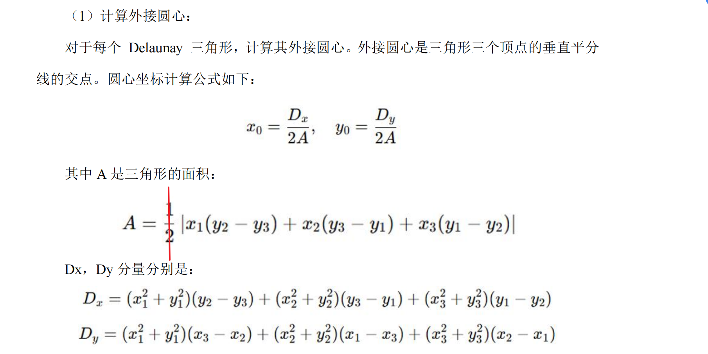

## 写在前面

安徽省赛的题目有问题，外接圆圆心的计算公式有问题。



## 基础类

点，三角形和边

```c#
// 点结构
public struct Point
{
    public double X { get; set; }
    public double Y { get; set; }
    
    public Point(double x, double y)
    {
        X = x;
        Y = y;
    }
}

// 三角形结构
public class Triangle
{
    public Point A { get; set; }
    public Point B { get; set; }
    public Point C { get; set; }
    
    // 计算外接圆心
    public Point GetCircumcenter()
    {
        // 使用题目给出的公式实现
    }
    
    // 计算面积
    public double GetArea()
    {
        // 使用叉积公式计算
    }
}

// 边结构
public class Edge
{
    public Point P1 { get; set; }
    public Point P2 { get; set; }
}
```

------

## 1. Delaunay三角剖分 (Bowyer-Watson算法)

这个算法的思路是：**一个点一个点地加入，每加入一个点就修复网格**。AI 写了一个过程示例，可以直观感受过程：[demo](./bowyer_watson_demo.html)

### 1.1 初始化（创建超级三角形）

创建一个能够包含所有点的三角形

```c#
// 想象你有一张桌子，要在上面放一些点
// 先画一个巨大的三角形，大到能包含所有的点
private Triangle CreateSuperTriangle(List<Point> points)
{
    // 找到所有点的边界
    double minX = points.Min(p => p.X);
    double maxX = points.Max(p => p.X);
    double minY = points.Min(p => p.Y);
    double maxY = points.Max(p => p.Y);
    
    // 创建一个比边界大很多的三角形
    double dx = maxX - minX;
    double dy = maxY - minY;
    double deltaMax = Math.Max(dx, dy) * 2;
    
    Point p1 = new Point(minX - deltaMax, minY - deltaMax);
    Point p2 = new Point(maxX + deltaMax, minY - deltaMax);
    Point p3 = new Point((minX + maxX) / 2, maxY + deltaMax);
    
    return new Triangle(p1, p2, p3);
}
```

### 1.2 逐点插入（核心循环）

```c#
foreach (var newPoint in points)
{
    // 每次加入一个新点，就像在桌子上放一个新棋子
    InsertPoint(newPoint, triangles);
}


private void InsertPoint(Point newPoint, List<Triangle> triangles)
{
    // 1. 找到所有"坏"三角形
    var badTriangles = FindBadTriangles(newPoint, triangles);
    
    // 2. 找到空洞边界
    var boundaryEdges = FindPolygonBoundary(badTriangles);
    
    // 3. 删除坏三角形
    foreach (var badTriangle in badTriangles)
    {
        triangles.Remove(badTriangle);
    }
    
    // 4. 用新点连接边界，创建新三角形
    ConnectNewPoint(newPoint, boundaryEdges, triangles);
}
```

### 1.3 各个功能函数

####  找"坏"三角形

意思就是判断新插入的点，是不是在目前 triangles 的某些三角形的外接圆内，如果存在，那么这些三角形的外接圆就不是 “空圆” 了

```c#
// "坏"三角形 = 外接圆包含新点的三角形
// 就像：这些三角形的外接圆被新点"入侵"了
private List<Triangle> FindBadTriangles(Point newPoint, List<Triangle> triangles)
{
    var badTriangles = new List<Triangle>();
    
    foreach (var triangle in triangles)
    {
        if (IsPointInCircumcircle(newPoint, triangle))
        {
            badTriangles.Add(triangle);
        }
    }
    
    return badTriangles;
}

// 检查点是否在三角形的外接圆内
private bool IsPointInCircumcircle(Point point, Triangle triangle)
{
    // 计算三角形的外接圆心
    Point circumcenter = triangle.GetCircumcenter();
    
    // 计算外接圆半径
    double radius = Distance(circumcenter, triangle.A);
    
    // 计算新点到圆心的距离
    double distanceToPoint = Distance(circumcenter, point);
    
    // 如果距离小于半径，点就在圆内
    return distanceToPoint < radius;
}
```

#### 找空洞边界

```c#
// 删除坏三角形后，会留下一个空洞
// 我们需要找到这个空洞的边界
private List<Edge> FindPolygonBoundary(List<Triangle> badTriangles)
{
    var allEdges = new List<Edge>();
    
    // 收集所有坏三角形的边
    foreach (var triangle in badTriangles)
    {
        allEdges.Add(new Edge(triangle.A, triangle.B));
        allEdges.Add(new Edge(triangle.B, triangle.C));
        allEdges.Add(new Edge(triangle.C, triangle.A));
    }
    
    // 边界边的特点：只出现一次
    // 内部边会出现两次（被两个三角形共享）
    var boundaryEdges = new List<Edge>();
    
    foreach (var edge in allEdges)
    {
        int count = 0;
        foreach (var otherEdge in allEdges)
        {
            if (edge.EdgeEquals(otherEdge))
            {
                count++;
            }
        }
        
        if (count == 1) // 只出现一次就是边界
        {
            boundaryEdges.Add(edge);
        }
    }
    
    return boundaryEdges;
}
```

EdgeEquals 是 Triangel 里的一个方法。我们就不用原生的 equal 了，不然的话要重写 equal。

```c#
public bool EdgeEquals(Edge otherEdge)
        {
            var flag = P1.X == otherEdge.P1.X && P1.Y == otherEdge.P1.Y && P2.X == otherEdge.P2.X && P2.Y == otherEdge.P2.Y;
            var flagReverse = P1.X == otherEdge.P2.X && P1.Y == otherEdge.P2.Y && P2.X == otherEdge.P1.X && P2.Y == otherEdge.P1.Y;
            if(flag || flagReverse)
            {
                return true;
            }
            else
            {
                return false;
            }
        }
```


#### 用新点连接边界

```c#
// 把新点和空洞边界的每条边连起来，形成新的三角形
private void ConnectNewPoint(Point newPoint, List<Edge> boundaryEdges, List<Triangle> triangles)
{
    foreach (var edge in boundaryEdges)
    {
        // 新点 + 边界边 = 新三角形
        var newTriangle = new Triangle(newPoint, edge.P1, edge.P2);
        triangles.Add(newTriangle);
    }
}
```

------

### 1.4 移除超级三角形

最后一步是移除包含最初的超级三角形的任何点的所有三角形。

```c#
// 删除包含超级三角形顶点的所有三角形
private void RemoveSuperTriangle()
{
    // 创建需要删除的三角形列表
    var trianglesToRemove = new List<Triangle>();

    foreach (var triangle in triangles)
    {
        // 检查三角形是否包含超级三角形的任何顶点
        if (ContainsSuperTriangleVertex(triangle))
        {
            trianglesToRemove.Add(triangle);
        }
    }

    // 删除这些三角形
    foreach (var triangle in trianglesToRemove)
    {
        triangles.Remove(triangle);
    }
}

// 检查三角形是否包含超级三角形的顶点
private bool ContainsSuperTriangleVertex(Triangle triangle)
{
    // 检查三角形的每个顶点是否与超级三角形的顶点重合
    return IsPointEqual(triangle.A, superA) ||
           IsPointEqual(triangle.A, superB) ||
           IsPointEqual(triangle.A, superC) ||
           IsPointEqual(triangle.B, superA) ||
           IsPointEqual(triangle.B, superB) ||
           IsPointEqual(triangle.B, superC) ||
           IsPointEqual(triangle.C, superA) ||
           IsPointEqual(triangle.C, superB) ||
           IsPointEqual(triangle.C, superC);
}

// 判断两个点是否相等（考虑浮点数精度）
private bool IsPointEqual(Point p1, Point p2)
{
    const double tolerance = 1e-10;
    return Math.Abs(p1.X - p2.X) < tolerance && Math.Abs(p1.Y - p2.Y) < tolerance;
}
```

## 2. 凸包计算(使用Andrew's Monotone Chain算法)

```c#
public class ConvexHull
{
    public List<Point> ComputeConvexHull(List<Point> points)
    {
        // 步骤1: 去重并排序
        var sortedPoints = points.Distinct()
            .OrderBy(p => p.X)
            .ThenBy(p => p.Y)
            .ToList();
        
        // 步骤2: 构建下凸包
        var lower = new List<Point>();
        foreach (var point in sortedPoints)
        {
            while (lower.Count >= 2 && 
                   CrossProduct(lower[lower.Count-2], lower[lower.Count-1], point) <= 0)
            {
                lower.RemoveAt(lower.Count - 1);
            }
            lower.Add(point);
        }
        
        // 步骤3: 构建上凸包
        var upper = new List<Point>();
        for (int i = sortedPoints.Count - 1; i >= 0; i--)
        {
            var point = sortedPoints[i];
            while (upper.Count >= 2 && 
                   CrossProduct(upper[upper.Count-2], upper[upper.Count-1], point) <= 0)
            {
                upper.RemoveAt(upper.Count - 1);
            }
            upper.Add(point);
        }
        
        // 步骤4: 合并（去除重复点）
        lower.RemoveAt(lower.Count - 1);
        upper.RemoveAt(upper.Count - 1);
        lower.AddRange(upper);
        
        return lower;
    }
    
    private double CrossProduct(Point o, Point a, Point b)
    {
        return (a.X - o.X) * (b.Y - o.Y) - (a.Y - o.Y) * (b.X - o.X);
    }
}
```

好的，我们来详细讲解一下这段计算凸包（Convex Hull）的代码。

这个算法被称为 **Andrew's Monotone Chain (安德鲁单调链算法)**。它的核心思想非常巧妙：**先构建凸包的下半部分，再构建凸包的上半部分，最后将它们拼接起来**。

### 核心工具：`CrossProduct` (叉积)

在深入算法步骤之前，必须先理解 `CrossProduct` 函数，因为它是整个算法的灵魂。

```c#
private double CrossProduct(Point o, Point a, Point b)
{
    return (a.X - o.X) * (b.Y - o.Y) - (a.Y - o.Y) * (b.X - o.X);
}
```

这个函数用来判断三个点 `o`, `a`, `b` 的相对位置关系，或者说，从点 `o` 到 `a` 的连线，相对于从 `o` 到 `b` 的连线，是向哪个方向“拐弯”。

想象你站在点 `o`，先面向点 `a`，然后转身面向点 `b`。

- **`CrossProduct` > 0**: 意味着你向**左转**（逆时针）。点 `b` 在向量 `oa` 的左侧。
- **`CrossProduct` < 0**: 意味着你向**右转**（顺时针）。点 `b` 在向量 `oa` 的右侧。
- **`CrossProduct` = 0**: 意味着 `o`, `a`, `b` 三点**共线**。

在凸包算法中，所有相邻的边都必须是“左转”的（或者所有都是“右转”，取决于遍历顺序）。一旦出现“右转”，就说明中间那个点不是凸包上的顶点，需要被剔除。

### 算法分步解析

现在我们来一步步看 `ComputeConvexHull` 方法：

#### **步骤 1: 排序**

```c#
var sortedPoints = points.Distinct()
    .OrderBy(p => p.X)
    .ThenBy(p => p.Y)
    .ToList();
```

- **目的**: 为了让算法能从一个确定的起点（最左边的点）开始，并按顺序处理所有点。
- **操作**:
  1. `Distinct()`: 去除重复的点。
  2. `OrderBy(p => p.X).ThenBy(p => p.Y)`: 按 X 坐标从小到大排序。如果 X 坐标相同，则按 Y 坐标从小到大排序。
- **结果**: 我们得到一个从左到右排好序的点列表。列表的第一个点必然是凸包的顶点（最左下角的点）。

#### **步骤 2: 构建下凸包 (Lower Hull)**

```c#
var lower = new List<Point>();
foreach (var point in sortedPoints)
{
    while (lower.Count >= 2 && 
           CrossProduct(lower[lower.Count-2], lower[lower.Count-1], point) <= 0)
    {
        lower.RemoveAt(lower.Count - 1);
    }
    lower.Add(point);
}
```

- **目的**: 找到构成凸包下半部分的顶点。
- **过程**:
  1. 遍历所有排好序的点（从左到右）。
  2. 对于每个新点 `point`，我们回头看 `lower` 列表中已经存在的最后两个点：`lower[lower.Count-2]` (倒数第二个点，我们称之为 `o`) 和 `lower[lower.Count-1]` (最后一个点，称之为 `a`)。
  3. 我们用 `CrossProduct(o, a, point)` 来判断 `o -> a -> point` 这个路径是向左转还是向右转。
  4. **`while` 循环是关键**:
     - 如果 `CrossProduct` 的结果 **小于或等于 0**，说明这是一个“右转”或者三点共线。这意味着点 `a` (`lower`列表的最后一个点) 是一个凹陷的点，它不应该在下凸包上。
     - 于是，`lower.RemoveAt(lower.Count - 1)` 会将点 `a` 从 `lower` 列表中**移除**。
     - 循环会继续，用新的最后两个点和当前 `point` 再做一次判断，直到形成一个“左转”或者 `lower` 列表中的点少于2个为止。
  5. 当 `while` 循环结束后，说明当前 `point` 与 `lower` 列表的末尾形成了正确的“左转”关系，于是把 `point` 添加到 `lower` 列表中。
- **结果**: 当 `foreach` 循环完成后，`lower` 列表中就包含了从最左点到最右点的完整的下凸包顶点。

#### **步骤 3: 构建上凸包 (Upper Hull)**

```c#
var upper = new List<Point>();
for (int i = sortedPoints.Count - 1; i >= 0; i--)
{
    // ... 逻辑和构建下凸包完全一样 ...
}
```

- **目的**: 找到构成凸包上半部分的顶点。
- **过程**: 这一步和构建下凸包的逻辑完全相同，唯一的区别是**遍历顺序相反**。它从排好序的点列表的末尾（最右边的点）开始，向开头（最左边的点）遍历。
- **结果**: `upper` 列表中包含了从最右点到最左点的完整的上凸包顶点。

#### **步骤 4: 合并**

```c#
lower.RemoveAt(lower.Count - 1);
upper.RemoveAt(upper.Count - 1);
lower.AddRange(upper);
```

- **目的**: 将上下两个凸包链合并成一个完整的凸包。
- **操作**:
  1. `lower` 列表包含了从最左点到最右点的路径。
  2. `upper` 列表包含了从最右点到最左点的路径。
  3. 你会发现，最左点和最右点在 `lower` 和 `upper` 两个列表中都出现了。为了避免重复，我们需要将它们各移除一个。
  4. `lower.RemoveAt(lower.Count - 1)`: 移除了 `lower` 列表中的最右点。
  5. `upper.RemoveAt(upper.Count - 1)`: 移除了 `upper` 列表中的最左点。
  6. `lower.AddRange(upper)`: 将处理过的 `upper` 列表拼接到 `lower` 列表后面。
- **结果**: `lower` 列表现在包含了完整的、按逆时针顺序排列的凸包所有顶点。

### 总结

这个算法就像是用一根橡皮筋去包住所有的钉子（点）。它先从最左边的钉子开始，向右延伸橡皮筋，每遇到一个新钉子，就检查橡皮筋是不是保持了向外“凸”的状态（左转），如果不是，就调整橡皮筋，跳过那个导致“凹”陷的钉子。这样走一圈（先下后上），就找到了能包住所有钉子的最短路径，即凸包。


**为什么【于是，lower.RemoveAt(lower.Count - 1) 会将点 a 从 lower 列表中移除】，而不是直接continue呢**

问得非常好！这是一个理解此算法核心机制的关键点。

简单来说：我们的目的不是**跳过**会产生“凹陷”的新点，而是**修正**已经构建好的路径，去掉那个导致“凹陷”的旧顶点。

我们来详细分析一下：

**算法的目标**

`lower` 列表代表我们正在构建的“下凸包”路径。这个路径必须时刻保持“向左转”的凸性。

当我们从左到右依次处理排好序的点时，每一步都是在尝试将新点`point`添加到`lower`路径的末尾。

**“问题”出在哪里？**

当 `CrossProduct(o, a, point) <= 0` 这个条件成立时：

- `o` 是路径上倒数第二个点 (`lower[lower.Count-2]`)
- `a` 是路径上最后一个点 (`lower[lower.Count-1]`)
- `point` 是我们正要添加的新点

这个结果告诉我们，从`o`到`a`再到`point`形成了一个“右转”或直线。这意味着**点`a`是“罪魁祸首”**，它使得路径向内凹陷了。新来的`point`只是一个“告密者”，它揭示了点`a`不应该在凸包上。

在上图中，当我们试图添加新点 `P` 时，我们发现路径 `A -> B -> P` 是一个“右转”。问题不在于 `P`，而在于 `B`。`B` 点导致了凹陷。正确的凸包路径应该是直接从 `A` 连到 `P`。

**为什么用 `RemoveAt` 而不是 `continue`**

1. **`lower.RemoveAt(lower.Count - 1)` 的作用：修正路径**
   - 这个操作移除了导致凹陷的**点`a`**（图中的点`B`）。
   - 移除后，`lower` 列表的路径就回退了一步。
   - **关键在于，这是一个 `while` 循环**。移除点`a`后，循环会继续，用路径上新的最后两个点和**同一个 `point`** 再次进行检查。可能回退一步还不够，需要连续回退好几步，才能让路径重新变“凸”。
   - 直到路径被修正到可以“左转”到`point`时，循环才会结束，然后我们才把这个合格的`point`添加到路径末尾。
2. **如果用 `continue` 会发生什么：放弃修正，留下错误**
   - `continue` 会立即停止当前 `foreach` 循环的这次迭代，直接跳到下一个新点。
   - 这会产生两个严重后果：
     - **当前的 `point` 被完全跳过**，它没有机会被添加到凸包路径中，这显然是错误的。
     - **导致凹陷的点`a`依然留在 `lower` 列表中**，路径的错误没有被修正。

**总结：**

RemoveAt 是在修正历史，把之前加错的点去掉。

continue 是在放弃当前，直接跳过这个揭示了错误的新点。

为了构建正确的凸包，我们必须不断修正路径，而不是跳过任何一个点，所以必须使用 `RemoveAt`。

------


## 3. 泰森多边形构建(基于Delaunay三角剖分的对偶图)

```c#
public class VoronoiDiagram
{
    public Dictionary<Point, List<Point>> BuildVoronoiDiagram(
        List<Point> points, List<Triangle> triangles)
    {
        var voronoiCells = new Dictionary<Point, List<Point>>();
        
        // 为每个原始点创建其泰森多边形
        foreach (var point in points)
        {
            // 找到包含该点的所有三角形
            var relatedTriangles = triangles.Where(t => 
                t.A.Equals(point) || t.B.Equals(point) || t.C.Equals(point)).ToList();
            
            // 获取这些三角形的外接圆心
            var circumcenters = relatedTriangles.Select(t => t.GetCircumcenter()).ToList();
            
            // 按极角排序
            var sortedVertices = SortByPolarAngle(circumcenters, point);
            
            voronoiCells[point] = sortedVertices;
        }
        
        return voronoiCells;
    }
    
    private List<Point> SortByPolarAngle(List<Point> vertices, Point center)
    {
        return vertices.OrderBy(v => Math.Atan2(v.Y - center.Y, v.X - center.X)).ToList();
    }
}
```

