【视图】- 【工具箱】能够打开工具箱，然后基本的界面就像下面。基本上用到的组件就下面几个，多去了解这几个组件有什么属性就行了，例如怎么更改文字，怎么改背景颜色，怎么改图标。

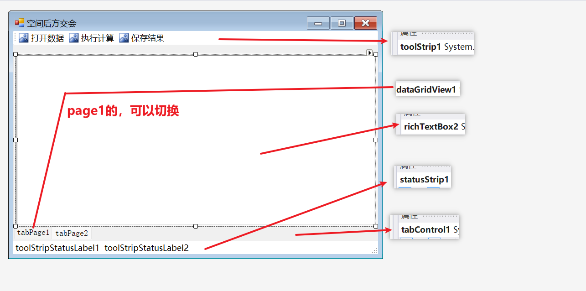

其中，**dataGridView** 是可以初始化列的，在属性的最下面有个杂项，里面能够添加列

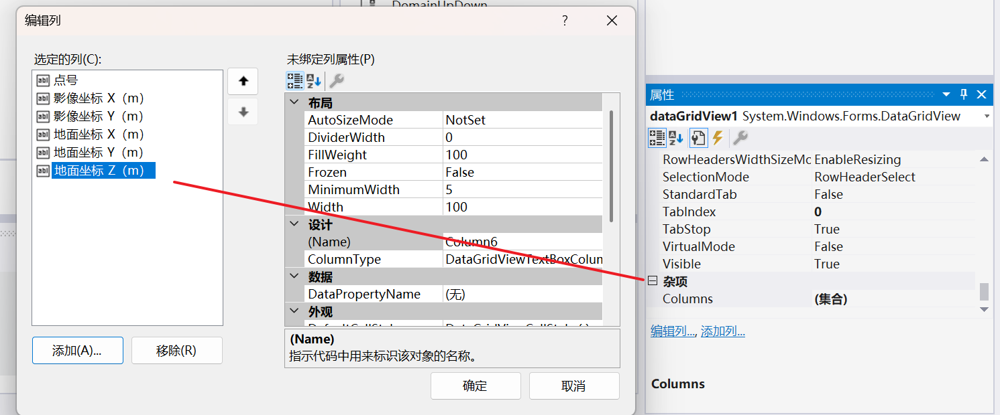

几乎所有题目都按照**三个步骤**来：

## 1.读取数据

读取文本数据——然后存储数据。首先你在窗口设计界面双击 “打开数据按钮” 然后会自动添加并且转到一个 Click 函数，表明当你点击按钮的时候会执行什么代码

读取文本数据需要用到的**基本代码模板**如下

```c#
using System.IO; // StreamReader需要

private void toolStripButton1_Click(object sender, EventArgs e)
        {
            // 1.打开数据，存储数据
            OpenFileDialog openFileDialog = new OpenFileDialog(); // 用于打开数据
            openFileDialog.FileName = "请选择数据"; // 提示词
            openFileDialog.Filter = "文本文件|*.txt|所有文件|*.*"; // 文件筛选器

            if(openFileDialog.ShowDialog() == DialogResult.OK)
            {
                // 如果点击了确定
                try
                {
                    var reader = new StreamReader(openFileDialog.FileName); // 读取器
                    while (!reader.EndOfStream)
                    {
                        //一直读下去，每次读一行
                        var line = reader.ReadLine(); // 读一行
                        if(line.Length > 0)
                        {
                            // 逻辑
                        }
                    }
                    reader.Close(); // 需要关闭 reader


                }
                catch (Exception)
                {

                    MessageBox.Show("数据格式错误!");
                }
            }
        }
```

然后在本次题目中，根据文本文档的组织结构，实现把每个控制点的信息存到 **Point** 里，这里的 Point 是自己新建的类。

**首先来查看文本文档的组织结构**

```txt
影像比例尺,15000
影像内方位元素,x0,y0,f(mm),0,0,153.24
点号,地面坐标X(m),地面坐标Y,地面坐标Z,影像坐标x(mm),影像坐标y(mm)
1,36589.41,25273.32,2195.17,-86.15,-68.99
2,37631.08,31324.51,728.69,-53.40,82.21
3,39100.97,24934.98,2386.50,-14.78,-76.63
4,40426.54,30319.81,757.31,10.46,64.43
```

**然后组织 Point 类需要什么：**

因为数据文本的控制点信息，例如 （1,36589.41,25273.32,2195.17,-86.15,-68.99），整个一行我们都是需要的，所以写一个构造函数，传入的是 reader 读到这一行返回的字符串。

然后对字符串进行分割，这里需要经常用到 **Regex**，这个可以对字符串进行分割，然后返回的是数组。最后用 Convert 把字符串转化成对应类型就行了。注意单位。

```c#
using System.Text.RegularExpressions; // Regex需要

namespace SpaceResection
{
    class Point
    {
        // 控制点的数据信息
        public int id; // 点号
        public double x, y, X, Y, Z; // 控制点的影像坐标，地面坐标，单位为米


        public Point(string line)
        {
            //构造函数
            var buf = Regex.Split(line, @"\,+"); //把字符串以,进行分割，得到的是数组
            id = Convert.ToInt32(buf[0]);
            x = Convert.ToDouble(buf[4]) / 1000.0;
            y = Convert.ToDouble(buf[5]) / 1000.0;
            X = Convert.ToDouble(buf[1]);
            Y = Convert.ToDouble(buf[2]);
            Z = Convert.ToDouble(buf[3]);
        }
    }
}
```

**最后完善代码：**

解释一下 List 泛型。简单来说就是，我们很自然而然的想把所有 point 都存到一个数组里，但是 C# 的数组不能存对象，这个时候就需要 List 泛型了，你就当作它是可以存对象的数组。

```c#
using System.IO; // StreamReader需要
using System.Text.RegularExpressions; // Regex需要

double m = 0; // 影像比例尺

double x0, y0, f; // 影像的内方位元素

List<Point> points = new List<Point>(); // 用于存储所有点

private void toolStripButton1_Click(object sender, EventArgs e)
        {
            // 1.打开数据，存储数据
            OpenFileDialog openFileDialog = new OpenFileDialog(); // 用于打开数据
            openFileDialog.FileName = "请选择数据"; // 提示词
            openFileDialog.Filter = "文本文件|*.txt|所有文件|*.*"; // 文件筛选器

            if(openFileDialog.ShowDialog() == DialogResult.OK)
            {
                // 如果点击了确定
                try
                {
                    points.Clear(); // 清除 points

                    var reader = new StreamReader(openFileDialog.FileName); // 读取器
                    var line1 = Regex.Split(reader.ReadLine(),@"\,+"); // 截取字符串
                    m = Convert.ToDouble(line1[1]); // 第一行有比例尺信息
                    var line2 = Regex.Split(reader.ReadLine(), @"\,+"); // 第二行有内方位元素信息
                    x0 = Convert.ToDouble(line2[4]);
                    y0 = Convert.ToDouble(line2[5]);
                    f = Convert.ToDouble(line2[6]) / 1000.0;//米

                    reader.ReadLine(); // 第三行没有用
                    while (!reader.EndOfStream)
                    {
                        //一直读下去，每次读一行
                        var line = reader.ReadLine(); // 读一行
                        if(line.Length > 0)
                        {
                            Point point = new Point(line);
                            points.Add(point);
                        }
                    }
                    reader.Close();
                    // 下面是给 dataGridView 更新数据的代码
					dataGridView1.Rows.Clear(); // 清除现有数据
                    for(int i = 0;i < points.Count;i++)
                    {
                        dataGridView1.Rows.Add(); // 先添加行，才能添加数据
                        dataGridView1.Rows[i].Cells[0].Value = points[i].id;
                        dataGridView1.Rows[i].Cells[1].Value = points[i].x;
                        dataGridView1.Rows[i].Cells[2].Value = points[i].y;
                        dataGridView1.Rows[i].Cells[3].Value = points[i].X;
                        dataGridView1.Rows[i].Cells[4].Value = points[i].Y;
                        dataGridView1.Rows[i].Cells[5].Value = points[i].Z;
                    }
                    toolStripStatusLabel1.Text = "状态：导入数据成功"; // 更新底部的文本信息。
                    MessageBox.Show("导入成功");
                    tabControl1.SelectedIndex = 0; // 把 tabControl 转到 page1，也就是 dataGridView 所在的地方。

                }
                catch (Exception)
                {

                    MessageBox.Show("数据格式错误!");
                }
            }
        }
```

## 2.计算

在 “执行计算” 按钮双击，会新增并转到 Click 函数。

新建 Algo 类，algo 也就是算法的意思

### 2.1 计算初始值

这部分内容不难，其中 List 泛型有个 ForEach 方法可以用，代码少一点，就不用 for 循环了。

确定外方位元素初始值我觉得应该就只会按这个来。如果要按照其他方法来难度就大了。

```c#
namespace SpaceResection
{
    class Algo
    {
        //主算法
        public double x0, y0, m, f;
        public double Xs0 = 0, Ys0 = 0, Zs0 = 0, fai, omega, kapa; // 外方位元素初始值
     

        #region 确定初始值
        public void GetOrigin(List<Point> points,double m,double f,double x0,double y0)
        {
            this.x0 = x0;
            this.y0 = y0;
            this.m = m;
            this.f = f;
            points.ForEach(item =>
            {
                Xs0 += item.X;
                Ys0 += item.Y;
            });
            Xs0 /= points.Count;
            Ys0 /= points.Count;
            Zs0 = m * f;
            fai = omega = kapa = 0;
        }
        #endregion
    }
}
```

然后在代码里实例化 Algo，并且调用方法

```c#
private void toolStripButton2_Click(object sender, EventArgs e)
    {
        if (points.Count > 0)
        {
            try
            {
                Algo go = new Algo();
                go.GetOrigin(points, m, f); //计算初始值

            }
            catch (Exception)
            {

                throw;
            }
        }
    }
```

### 2.2 计算旋转矩阵 R

用到了 Math，因为需要计算 sin，cos。注意 sin 等等之类的**传入的是弧度，不是角度**，当然，这里我们就不需要管了，毕竟初始值都是 0，而且后面 fai，omega 和 kapa 加上的改正值也是弧度。

```c#
#region 计算旋转矩阵R
public void CalR()
{
    a1 = Math.Cos(fai) * Math.Cos(kapa) - Math.Sin(fai) * Math.Sin(omega) * Math.Sin(kapa);
    a2 = -Math.Cos(fai) * Math.Sin(kapa) - Math.Sin(fai) * Math.Sin(omega) * Math.Cos(kapa);
    a3 = -Math.Sin(fai) * Math.Cos(omega);
    b1 = Math.Cos(omega) * Math.Sin(kapa);
    b2 = Math.Cos(omega) * Math.Cos(kapa);
    b3 = -Math.Sin(omega);
    c1 = Math.Sin(fai) * Math.Cos(kapa) + Math.Cos(fai) * Math.Sin(omega) * Math.Sin(kapa);
    c2 = -Math.Sin(fai) * Math.Sin(kapa) + Math.Cos(fai) * Math.Sin(omega) * Math.Cos(kapa);
    c3 = Math.Cos(fai) * Math.Cos(omega);
}
#endregion
```

这里就不需要在主函数进行调用了，因为计算旋转矩阵 R 是参与在迭代里的。

### 2.3 逐点计算像点坐标值

到这一步会发现什么，会**发现我们需要在 point 类里新增参数**，因为这一步会得到每一个控制点的像点坐标值，然后我们又发现什么，**我们需要去修改 point 的数据**，这个时候需要回过头来在开头的计算未知数初始值的函数里，改动一下：

简单来说就是把原数据的 points 和 algo 类里的 Points 独立开来，如果你直接用 **Points = points**，那么就是浅拷贝，你修改了 algo 里面的 points 也会连同更改原数据。这是我们不想要的。

例如，如果我按下面的代码来写了，是深复制，查看两个 List 的内存地址：是不一样的
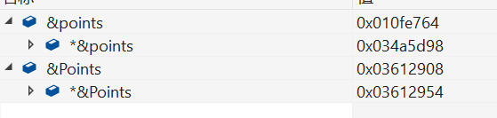

如果用的是 **Points = points**：一样了

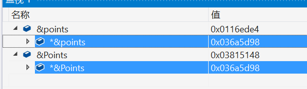

```c#
Algo.cs

public List<Point> Points = new List<Point>();
#region 确定初始值
public void GetOrigin(List<Point> points,double m,double f,double x0,double y0)
{
    Points = points.ConvertAll(p => p.Clone()); // 深拷贝
    
	this.x0 = x0;
    this.y0 = y0;
    this.m = m;
    this.f = f;
    points.ForEach(item =>
    {
        Xs0 += item.X;
        Ys0 += item.Y;
    });
    Xs0 /= points.Count;
    Ys0 /= points.Count;
    Zs0 = m * f;
    fai = omega = kapa = 0;
}
#endregion
    
Point.cs 类也需要改动，添加一个构造函数和一个函数：
public double x_new, y_new;// 像点坐标近似值
public Point(int id,double x,double y,double X,double Y,double Z)
{
    this.id = id;
    this.x = x;
    this.y = y;
    this.X = X;
    this.Y = Y;
    this.Z = Z;
}
public Point Clone()
{
    return new Point(this.id, this.x, this.y, this.X, this.Y, this.Z);
}
```

然后就可以写这步的逻辑代码了：

```c#
#region 逐点计算像点坐标值
public void Calxy()
{
    Points.ForEach(item =>
    {
        item.x_new = x0 - f * (a1 * (item.X - Xs0) + b1 * (item.Y - Ys0) + c1 * (item.Z - Zs0)) / (a3 * (item.X - Xs0) + b3 * (item.Y - Ys0) + c3 * (item.Z - Zs0));
        item.y_new = y0 - f * (a2 * (item.X - Xs0) + b2 * (item.Y - Ys0) + c2 * (item.Z - Zs0)) / (a3 * (item.X - Xs0) + b3 * (item.Y - Ys0) + c3 * (item.Z - Zs0));
    });
}
#endregion
```

### 2.4 计算矩阵 A 的12个参数以及 L 矩阵

误差方程式里矩阵 A 有 12 个参数，每个控制点贡献 12 个参数。我们需要算出来。同时，我们也能顺便把 L 矩阵算了，为此，我们在 Point 类新增两个变量 tLX 和 tLY，表示每个控制点对应的 L 矩阵的参数。

下面的代码不难理解。

```c#
#region 计算A矩阵里的12个参数
public void CalA()
{
    Points.ForEach(item =>
    {
        double H = -(item.Z - Zs0);
        item.a11 = -f / H;
        item.a12 = 0;
        item.a13 = -item.x_new / H;
        item.a21 = 0;
        item.a22 = -f / H;
        item.a23 = -item.y_new / H;
        item.a14 = -f * (1.0 + item.x_new * item.x_new / f * f);
        item.a15 = -item.x_new * item.y_new / f;
        item.a16 = item.y_new;
        item.a24 = -item.x_new * item.y_new / f;
        item.a25 = - f * (1.0 + item.y_new * item.y_new / f * f);
        item.a26 = -item.x_new;
        item.tLX = item.x - item.x_new;
        item.tLY = item.y - item.y_new;
    });
}
#endregion
```

### 2.5 循环迭代

首先需要原生实现矩阵的运算，包括求逆，转置和乘法。说一嘴，历年来都说不考矩阵的求逆，因为代码难记。但是这里又必须要用到。

首先在 Algo.cs 下新建矩阵运算的类

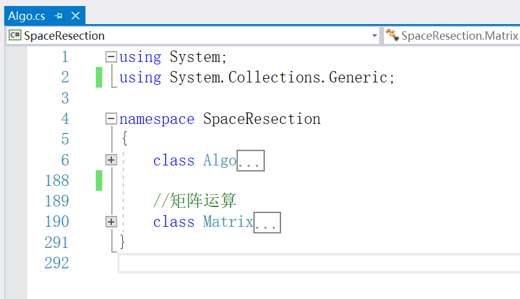

对于矩阵运算的算法实现，我就不在这里解释了，涉及到我们学过的线性代数的知识

```c#
//矩阵运算
class Matrix
{
    private readonly double[,] data; // 存储矩阵元素的二维数组
    public int Rows { get; } // 矩阵的行数
    public int Cols { get; } // 矩阵的列数

    /// <summary>
    /// 构造函数，初始化一个指定行数和列数的矩阵。
    /// </summary>
    /// <param name="rows">矩阵的行数</param>
    /// <param name="cols">矩阵的列数</param>
    public Matrix(int rows, int cols)
    {
        Rows = rows;
        Cols = cols;
        data = new double[rows, cols]; // 初始化二维数组
    }

    /// <summary>
    /// 索引器，用于直接访问或设置矩阵中的元素。
    /// </summary>
    /// <param name="row">元素的行索引</param>
    /// <param name="col">元素的列索引</param>
    /// <returns>指定位置的矩阵元素</returns>
    public double this[int row, int col]
    {
        get => data[row, col]; // 获取元素值
        set => data[row, col] = value; // 设置元素值
    }

    /// <summary>
    /// 静态方法，计算两个矩阵的乘积。
    /// </summary>
    /// <param name="a">左矩阵</param>
    /// <param name="b">右矩阵</param>
    /// <returns>两个矩阵相乘的结果矩阵</returns>
    /// <exception cref="Exception">如果左矩阵的列数不等于右矩阵的行数，则抛出异常。</exception>
    public static Matrix Multiply(Matrix a, Matrix b)
    {
        // 检查矩阵维度是否匹配，左矩阵的列数必须等于右矩阵的行数
        if (a.Cols != b.Rows)
            throw new Exception("Matrix dimensions mismatch for multiplication");

        Matrix result = new Matrix(a.Rows, b.Cols); // 初始化结果矩阵
        // 执行矩阵乘法运算
        for (int i = 0; i < result.Rows; i++) // 遍历结果矩阵的每一行
            for (int j = 0; j < result.Cols; j++) // 遍历结果矩阵的每一列
                for (int k = 0; k < a.Cols; k++) // 遍历左矩阵的列（或右矩阵的行）
                    result[i, j] += a[i, k] * b[k, j]; // 计算并累加乘积项
        return result;
    }

    /// <summary>
    /// 计算矩阵的转置。
    /// </summary>
    /// <returns>当前矩阵的转置矩阵</returns>
    public Matrix Transpose()
    {
        Matrix result = new Matrix(Cols, Rows); // 初始化转置矩阵，行和列互换
        // 执行转置操作
        for (int i = 0; i < Rows; i++) // 遍历原矩阵的每一行
            for (int j = 0; j < Cols; j++) // 遍历原矩阵的每一列
                result[j, i] = data[i, j]; // 将原矩阵的元素(i,j)放到转置矩阵的(j,i)位置
        return result;
    }

    /// <summary>
    /// 计算方阵的逆矩阵。
    /// 使用高斯-若尔当消元法 (Gauss-Jordan elimination) 求解。
    /// </summary>
    /// <returns>当前矩阵的逆矩阵</returns>
    /// <exception cref="InvalidOperationException">如果矩阵不是方阵，则抛出异常。</exception>
    /// <exception cref="Exception">如果矩阵是奇异矩阵（不可逆），则抛出异常。</exception>
    public Matrix Inverse()
    {
        // 检查矩阵是否为方阵
        if (Rows != Cols) throw new InvalidOperationException("Cannot calculate inverse for a non-square matrix");
        const double epsilon = 1e-12; // 用于比较浮点数是否接近于零的阈值

        int n = Rows; // 方阵的阶数
        // 创建增广矩阵 [A | I]，其中 A 是原矩阵，I 是单位矩阵
        Matrix aug = new Matrix(n, 2 * n);
        for (int i = 0; i < n; i++)
        {
            for (int j = 0; j < n; j++)
                aug[i, j] = data[i, j]; // 复制原矩阵到增广矩阵的左半部分
            aug[i, i + n] = 1; // 在增广矩阵的右半部分创建单位矩阵
        }

        // 执行高斯-若尔当消元法
        for (int i = 0; i < n; i++) // 对每一列进行操作
        {
            // 主元选择 (Pivoting): 找到当前列中绝对值最大的元素作为主元，以提高数值稳定性
            int maxRow = i;
            for (int k = i + 1; k < n; k++)
                if (Math.Abs(aug[k, i]) > Math.Abs(aug[maxRow, i]))
                    maxRow = k;

            // 如果主元不在当前行，则交换当前行与主元所在行
            if (maxRow != i)
                for (int j = 0; j < 2 * n; j++)
                    (aug[i, j], aug[maxRow, j]) = (aug[maxRow, j], aug[i, j]); // C# 7.0 元组交换语法

            // 检查主元是否过小（接近于零），如果是，则矩阵奇异，不可逆
            double div = aug[i, i];
            if (Math.Abs(div) < epsilon)
                throw new Exception($"Matrix is singular (pivot element {div:E2} at row {i} is too small), cannot calculate inverse.");

            // 将主元所在行的主元归一化为1
            for (int j = 0; j < 2 * n; j++)
                aug[i, j] /= div;

            // 将其他行的当前列元素消为0
            for (int k = 0; k < n; k++)
            {
                if (k == i) continue; // 跳过主元所在行

                double factor = aug[k, i]; // 当前行需要消元的元素
                if (Math.Abs(factor) < epsilon) continue; // 如果元素已经接近于0，则跳过

                // 从当前行减去 (factor * 主元所在行)
                for (int j = 0; j < 2 * n; j++)
                    aug[k, j] -= factor * aug[i, j];
            }
        }

        // 提取逆矩阵 (增广矩阵的右半部分)
        Matrix inv = new Matrix(n, n);
        for (int i = 0; i < n; i++)
            for (int j = 0; j < n; j++)
                inv[i, j] = aug[i, j + n];
        return inv;
    }
}
```

然后，下面代码新建了一个类 **Result** 用于保存结果

```c#
Result.cs
    
namespace SpaceResection
{
    class Result
    {
        //保存结果
        public double XS0_new = 0, YS0_new = 0, ZS0_new = 0, a1_new = 0, a2_new = 0, a3_new = 0, b1_new = 0, b2_new = 0, b3_new = 0, c1_new = 0, c2_new = 0, c3_new = 0;
    }
}
```

最后在主代码里完善

```c#
private void toolStripButton2_Click(object sender, EventArgs e)
        {
            if (points.Count > 0)
            {
                try
                {
                    Algo go = new Algo();
                    go.GetOrigin(points, m, f,x0,y0); //计算初始值
                    var result = go.Go(); // 循环迭代，并且保存结果

                    richTextBox2.Text = $@"计算成功,结果如下：
Xs0:{result.XS0_new}，
Ys0:{result.YS0_new},
Zs0:{result.ZS0_new},
旋转矩阵：
a1:{result.a1_new},
a2:{result.a2_new},
a3:{result.a3_new},
b1:{result.b1_new},
b2:{result.b2_new},
b3:{result.b3_new},
c1:{result.c1_new},
c2:{result.c3_new},
c3:{result.c3_new},
";
                    tabControl1.SelectedIndex = 1;// 把 tabControl 转到 page2，也就是 richTextBox 所在的地方。
                    toolStripStatusLabel1.Text = "状态：计算成功"; // 更新底部的文本信息。
                    MessageBox.Show("计算成功");
                    

                }
                catch (Exception)
                {

                    throw;
                }
            }
        }
```

## 3. 保存结果

双击保存结果，自动创建并跳转到 Click 事件

保存结果也就是把 richTextBox 的内容保存为 txt 文件。一般就是下面的代码。

```c#
try
{
    if(Points.Count > 0)
    {
        SaveFileDialog saveFileDialog1 = new SaveFileDialog(); // 保存文件需要用到的工具
        saveFileDialog1.FileName = "结果输出"; // 默认输出文件名字
        saveFileDialog1.Filter = "|*.txt";   // 保存为txt类型
        if(saveFileDialog1.ShowDialog() == DialogResult.OK)
        {
            var writer = new StreamWriter(saveFileDialog1.FileName);
            writer.Write(richTextBox1.Text);  // 把 richTextBox1 的文本写入 txt 里
            writer.Close();
            toolStripStatusLabel1.Text = "状态：保存成功";
            MessageBox.Show("保存成功");
        }
    }
}
catch (Exception ex)
{

    throw ex;
}
```

## 4. 界面 UI 完善

**图标**

怎么画图：

首先把 **toolStrip1**的 **ImageScalingSize** 改成 50，这里推荐 50，刚刚好。

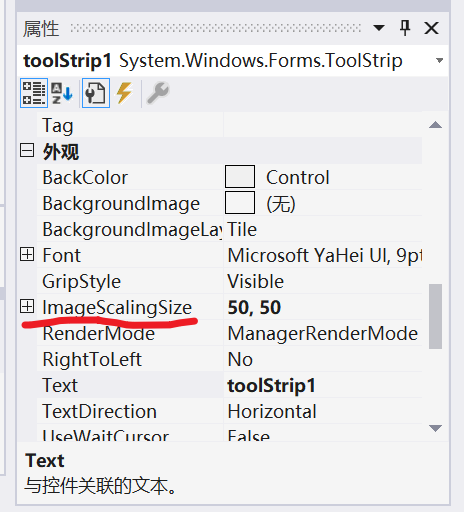

然后在右边的项目里找到 **Resources** 双击进入

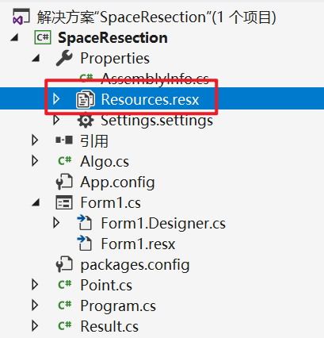

然后切换成图像，最后添加 **BMP** 图像

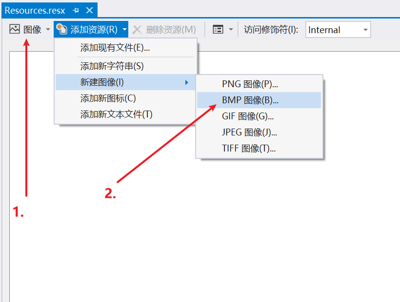

工具我主要用这三个

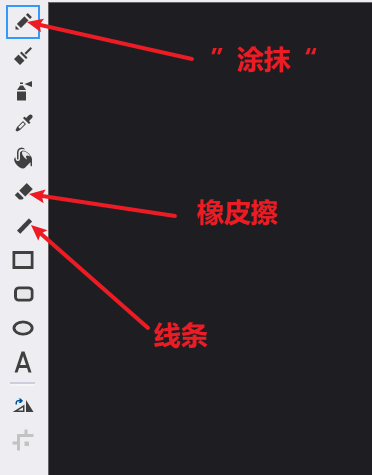

画什么样子可以参考一下我的


然后就可以在对应的属性里使用这些图像了

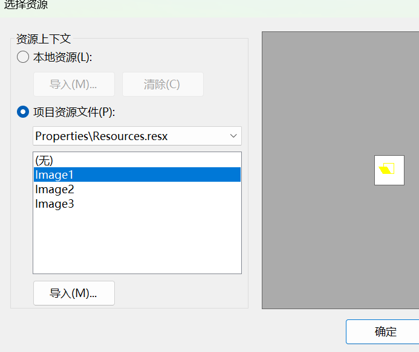

## ~~5. 打包管理~~（删除，现在改用原生实现，不需要打包了）

由于我们下载了一个矩阵运算的包，如果你 **release** ，那么生成的 **exe** 只能在那个文件夹里面用，不能复制到任意地方使用，会报错，因为需要包。

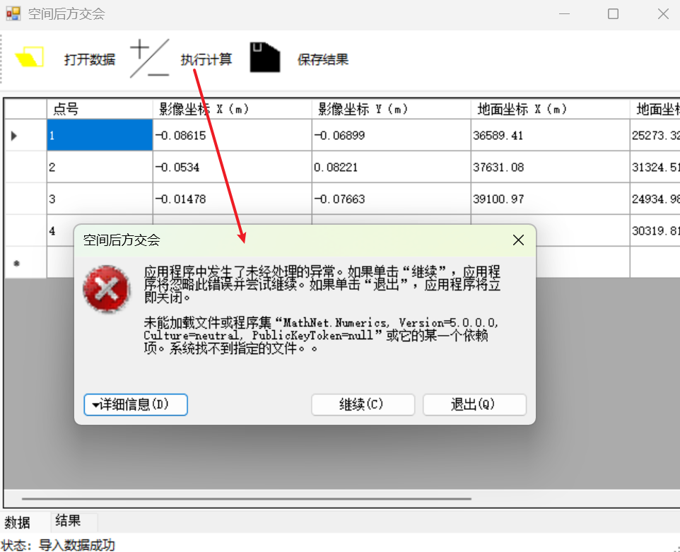


在下面下载包

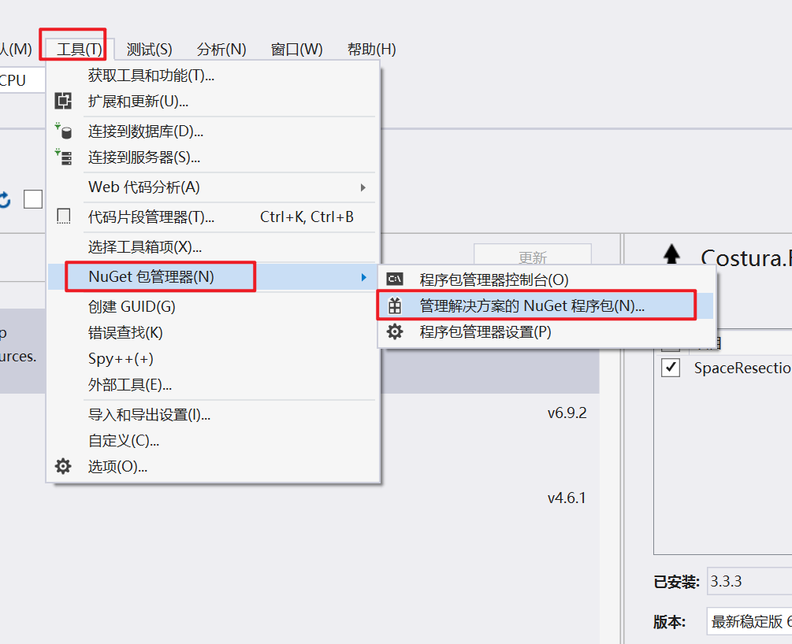

两个：不用下最新版本的，下载以前的最好，因为我们是 2017 版本，怕不支持。

实测 **Costura.Fody** 一定不要下载 4 版本

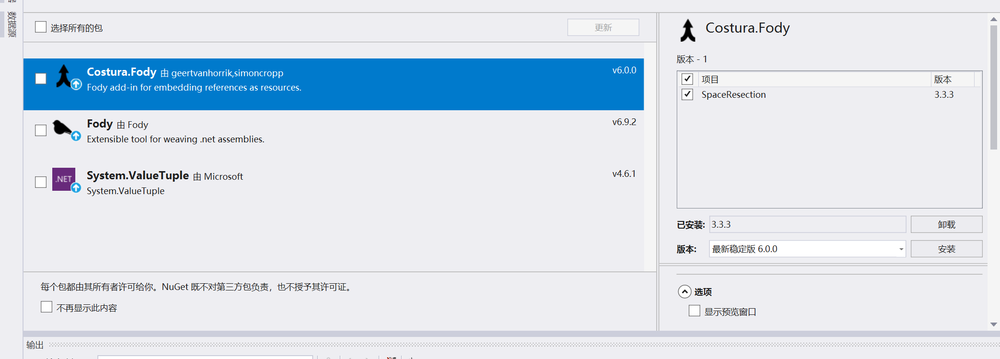

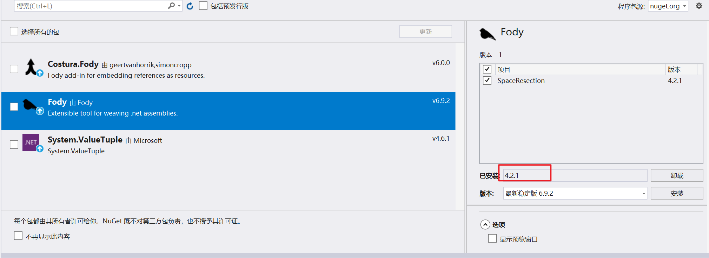

然后就能正常生成 exe 了
