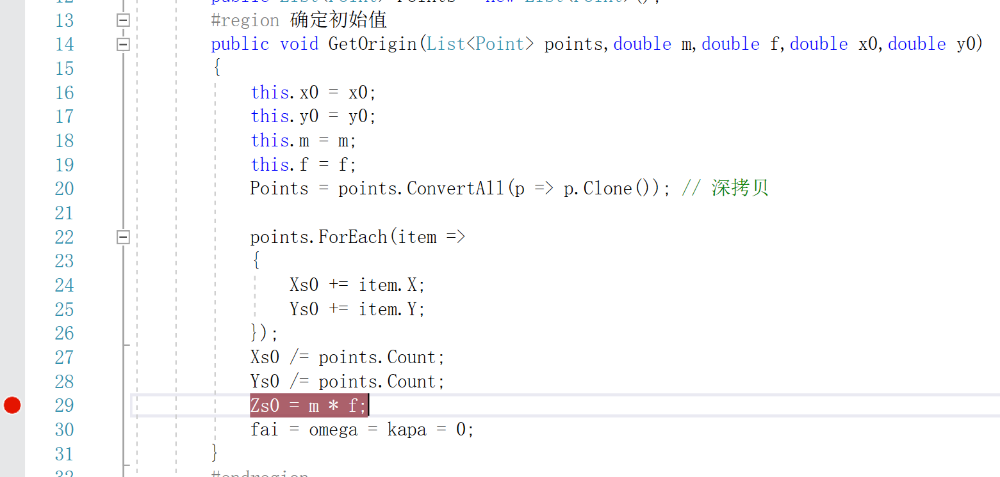
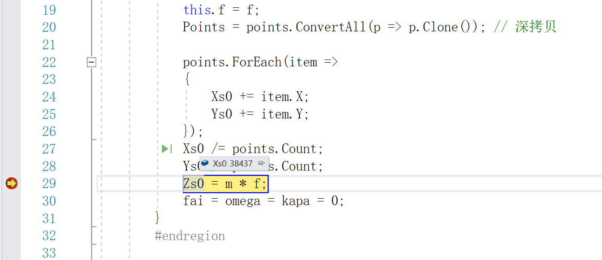
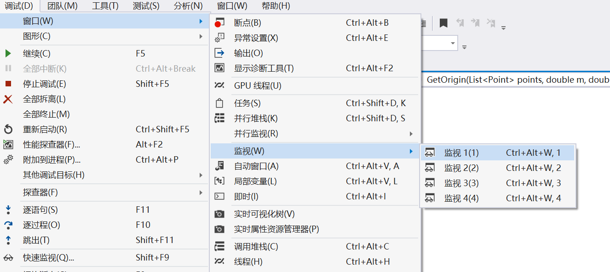
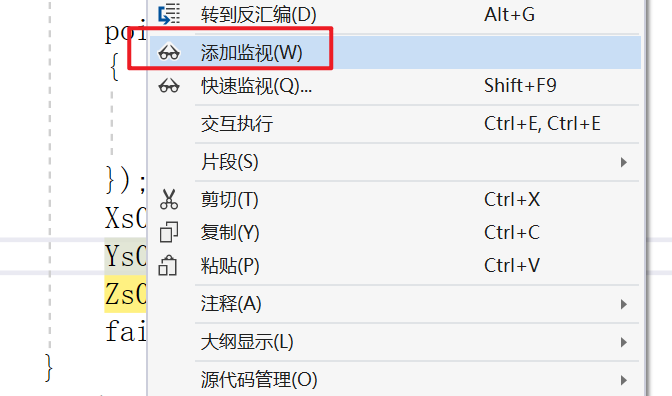

# 1. 打断点调试

比赛成绩里，成果正确性占了很大一部分。就比如需要填写你的中间结果数据，这个时候就需要打断点了。例如空间后方交会，要你填写计算得到的初始值是什么。先打个断点，再运行。



然后鼠标悬浮在变量上，就会显示对应的值



又或者说，你需要监听多个变量。每次去悬浮太麻烦了，那么就可以使用 “监听” 窗口。

首先需要打断点，然后运行。停止到断点处后，在 调试----监视，打开监视窗口。



然后在你需要监听的变量，右键，选择添加监视。



# 2. 快速找到最大值

有时候我们需要找 points 里，X 值最大的 point，或者 Y 值最小的 point

```c#
public List<Point> Points = new List<Point>();

// OrderBy是升序，下面一行代码是找到最小x值的point
Point min_Point = Points.OrderBy(p => p.X).First();
var min_x = AlgoPoints.OrderBy(p => p.X).First().X;

// OrderByDescending是降序，下面一行代码是找到最大x值的point
Point max_Point = Points.OrderByDescending(p => p.X).First();
var max_x = AlgoPoints.OrderByDescending(p => p.X).First().X;
```

同时，如果是要找到前面 N 个值，用 take

```c#
public List<Point> Points = new List<Point>();

// OrderBy是升序，下面一行代码是找到前 N 个point
Point min_Point = Points.OrderBy(p => p.X).Take(N).ToList();  // ToList（）是转换为 List
```

# 3. 快速求和

使用 Sum

```c#
public List<Point> Points = new List<Point>();

// 对所有点的 x 求和
double sum = Points.Sum(p => p.X);
```

# 4. 输出结果

为了输出结果好看，可以使用 $@，写的什么格式就输出什么字符串格式

```c#
String text = $@"
输入什么即输出什么
输入什么格式样子即输出什么格式样子
"
```

