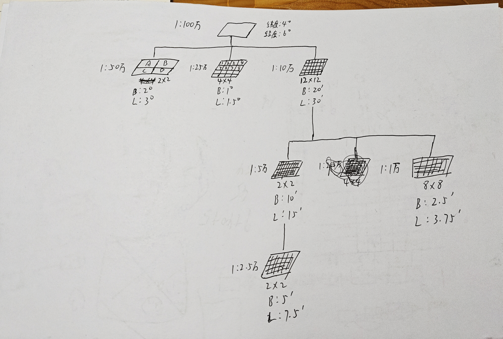
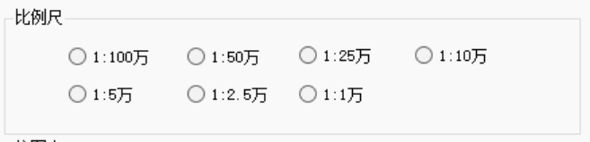

## 1. 随机抽样一致性算法

基本思路：先存储点数据——主算法里，随机选两个点构成线，同时计算该线包含了多少个点——选择包含内点最多的线。

类有 Point，Line。其中 Line 里类的属性有线的基本参数，还有内点的数量。

**随机选取点**

```c#
Random random = new Random();

int index1 = random.Next(points.Count);

int index2;
do
{
	index2 = random.Next(points.Count);
} while(index2 == index1); // 确保两个点不同

Point point1 = points[index1];
Point point2 = points[index2];
```

**排序选择最大的**

```c#
// 降序，选择第一个内点数量最多的线
Line lineWithMaxPoints = lines.OrderByDescending(line => line.CountPoint).FirstOrDefault();
```

## 2.（未完成）GNSS多星多频数据预处理与质量检测


## 3.地形图图幅编号计算

比赛不是可以带草稿纸吗，如果遇到这个题目也可以画个图。我觉得特别的是 1：10万和 1：1万，其他的容易记。当然，比赛册应该会提供关键参数。不过记忆一下也没问题。



写代码的时候考虑了 DDMMSS 的格式是否符合规范，我的建议是比赛时不考虑，平时也不用去记，顶多是程序的鲁棒性那一项分数给你多一分，还不如不写，追求时间分以及减少不必要的记忆。

**DDMMSS 转度**

```c#
//DDMMSS转度
private double DDMMSS_to_Degrees(string text)
{
    // 分割整数部分（度）和小数部分（分秒）
    string[] parts = text.Split('.');
    string integerPart = parts[0]; // 度
    string decimalPart = parts[1]; // 分秒

    // 提取度、分、秒
    int degrees = int.Parse(integerPart); // 度
    int mmss = int.Parse(decimalPart);   // 分秒（MMSS）
    int minutes = mmss / 100;            // 分
    int seconds = mmss % 100;            // 秒

    // 转换为十进制度数：度 + 分/60 + 秒/3600
    double result = degrees + (minutes / 60.0) + (seconds / 3600.0);

    return result;
}
```

**获取比例尺**

主要是我的 RadioButton 在 GroupBox 里，需要得知用户选择了哪个



```c#
// 用于获得用户选择的比例尺
private RadioButton GetSelectedRadioButton(GroupBox groupBox)
{
    // 遍历 GroupBox 中的所有控件
    foreach (Control control in groupBox.Controls)
    {
        // 检查控件是否为 RadioButton 且被选中
        if (control is RadioButton radioButton && radioButton.Checked)
        {
            return radioButton;
        }
    }
    // 如果没有选中任何 RadioButton，返回 null
    return null;
}
```

**获取行号字母**

rowNumber 指的是纬度计算出的行号

```c#
private string GetRowLetter(int rowNumber)
{
    // 1:100万图幅行号从1开始，对应 A-V (共22个)
    // ASCII 'A' is 65. rowNumber 1 should be 'A'.
    if (rowNumber >= 1 && rowNumber <= 22)
    {
        return ((char)('A' + rowNumber - 1)).ToString();
    }
    return ""; // 或者抛出异常，根据实际需求处理无效行号
}
```

**补零操作**

:D2 表示两位数字补零

```c#
$"{rowLetter}{p.Column}{oldSubCode250k:D2}"; // 2位数字，补零
```

## 4.基于统计滤波的点云去噪

**向下取整和向上取整**

`Math.Floor`是向下取整，`Math.Ceiling`是向上取整。这个题目需要用到向上取整

**格网创建**

需要注意的是在这里我们是新 new 了一个 Point，避免污染原来的数据。

```c#
//1.3 创建格网结构
grid = new Dictionary<Tuple<int, int, int>, List<Point>>();
//1.4 分配点
foreach(var p in AlgoPoints)
{
    var ix = (int)Math.Floor((p.X - min_x) / CellSize);
    var iy = (int)Math.Floor((p.Y - min_y) / CellSize);
    var iz = (int)Math.Floor((p.Z - min_z) / CellSize);

    var key = Tuple.Create(ix, iy, iz);
    if(!grid.ContainsKey(key))
    {
        //如果没有，需要新建
        grid[key] = new List<Point>();
    }
    grid[key].Add(new Point(p.X,p.Y,p.Z)); // 最好是新new一个point，避免污染原数据
}
```

**快速计算的技巧**

```c#
//接下来要筛选出最近的N_neighbors个数的点
foreach(var candidatePoint in Point_candidate)
{
    candidatePoint.length = CalLength(p, candidatePoint);
}
var Point_neighobrs = Point_candidate.OrderBy(point => point.length).Take(N_neighbors).ToList();

//接下来就是计算pi的平均邻近距离di
var sum = Point_neighobrs.Sum(point => point.length);
p.di = sum / Point_neighobrs.Count;


//步骤三：计算统计量；去除噪声点
//首先计算统计量
double d_mean = AlgoPoints
    .Where(p => p.di > 0)
    .Average(p => p.di);
// 计算标准差
double d_std_dev = Math.Sqrt(
    AlgoPoints
        .Where(p => p.di > 0)
        .Select(p => Math.Pow(p.di - d_mean, 2))  // 计算每个元素与平均值的差的平方
        .Average()                                // 计算平方差的平均值（即方差）
);

//然后去除噪声点
var resultPoints = AlgoPoints.Where(p => p.di <= d_mean + K_std * d_std_dev).ToList();
```

## 5.泰森多边形


## 6.单像空间后方交会

好好的看解析，记清楚流程是怎么样的。

**矩阵运算**

```c#
//矩阵运算
class Matrix
{
    private readonly double[,] data; // 存储矩阵元素的二维数组
    public int Rows { get; } // 矩阵的行数
    public int Cols { get; } // 矩阵的列数

    /// <summary>
    /// 构造函数，初始化一个指定行数和列数的矩阵。
    /// </summary>
    /// <param name="rows">矩阵的行数</param>
    /// <param name="cols">矩阵的列数</param>
    public Matrix(int rows, int cols)
    {
        Rows = rows;
        Cols = cols;
        data = new double[rows, cols]; // 初始化二维数组
    }

    /// <summary>
    /// 索引器，用于直接访问或设置矩阵中的元素。
    /// </summary>
    /// <param name="row">元素的行索引</param>
    /// <param name="col">元素的列索引</param>
    /// <returns>指定位置的矩阵元素</returns>
    public double this[int row, int col]
    {
        get => data[row, col]; // 获取元素值
        set => data[row, col] = value; // 设置元素值
    }

    /// <summary>
    /// 静态方法，计算两个矩阵的乘积。
    /// </summary>
    /// <param name="a">左矩阵</param>
    /// <param name="b">右矩阵</param>
    /// <returns>两个矩阵相乘的结果矩阵</returns>
    /// <exception cref="Exception">如果左矩阵的列数不等于右矩阵的行数，则抛出异常。</exception>
    public static Matrix Multiply(Matrix a, Matrix b)
    {
        // 检查矩阵维度是否匹配，左矩阵的列数必须等于右矩阵的行数
        if (a.Cols != b.Rows)
            throw new Exception("Matrix dimensions mismatch for multiplication");

        Matrix result = new Matrix(a.Rows, b.Cols); // 初始化结果矩阵
        // 执行矩阵乘法运算
        for (int i = 0; i < result.Rows; i++) // 遍历结果矩阵的每一行
            for (int j = 0; j < result.Cols; j++) // 遍历结果矩阵的每一列
                for (int k = 0; k < a.Cols; k++) // 遍历左矩阵的列（或右矩阵的行）
                    result[i, j] += a[i, k] * b[k, j]; // 计算并累加乘积项
        return result;
    }

    /// <summary>
    /// 计算矩阵的转置。
    /// </summary>
    /// <returns>当前矩阵的转置矩阵</returns>
    public Matrix Transpose()
    {
        Matrix result = new Matrix(Cols, Rows); // 初始化转置矩阵，行和列互换
        // 执行转置操作
        for (int i = 0; i < Rows; i++) // 遍历原矩阵的每一行
            for (int j = 0; j < Cols; j++) // 遍历原矩阵的每一列
                result[j, i] = data[i, j]; // 将原矩阵的元素(i,j)放到转置矩阵的(j,i)位置
        return result;
    }

    /// <summary>
    /// 计算方阵的逆矩阵。
    /// 使用高斯-若尔当消元法 (Gauss-Jordan elimination) 求解。
    /// </summary>
    /// <returns>当前矩阵的逆矩阵</returns>
    /// <exception cref="InvalidOperationException">如果矩阵不是方阵，则抛出异常。</exception>
    /// <exception cref="Exception">如果矩阵是奇异矩阵（不可逆），则抛出异常。</exception>
    public Matrix Inverse()
    {
        // 检查矩阵是否为方阵
        if (Rows != Cols) throw new InvalidOperationException("Cannot calculate inverse for a non-square matrix");
        const double epsilon = 1e-12; // 用于比较浮点数是否接近于零的阈值

        int n = Rows; // 方阵的阶数
        // 创建增广矩阵 [A | I]，其中 A 是原矩阵，I 是单位矩阵
        Matrix aug = new Matrix(n, 2 * n);
        for (int i = 0; i < n; i++)
        {
            for (int j = 0; j < n; j++)
                aug[i, j] = data[i, j]; // 复制原矩阵到增广矩阵的左半部分
            aug[i, i + n] = 1; // 在增广矩阵的右半部分创建单位矩阵
        }

        // 执行高斯-若尔当消元法
        for (int i = 0; i < n; i++) // 对每一列进行操作
        {
            // 主元选择 (Pivoting): 找到当前列中绝对值最大的元素作为主元，以提高数值稳定性
            int maxRow = i;
            for (int k = i + 1; k < n; k++)
                if (Math.Abs(aug[k, i]) > Math.Abs(aug[maxRow, i]))
                    maxRow = k;

            // 如果主元不在当前行，则交换当前行与主元所在行
            //if (maxRow != i)
            //    for (int j = 0; j < 2 * n; j++)
            //        (aug[i, j], aug[maxRow, j]) = (aug[maxRow, j], aug[i, j]); // C# 7.0 元组交换语法
            if (maxRow != i)
            {
                for (int j = 0; j < 2 * n; j++)
                {
                    double temp = aug[i, j];
                    aug[i, j] = aug[maxRow, j];
                    aug[maxRow, j] = temp;
                }
            }


            // 检查主元是否过小（接近于零），如果是，则矩阵奇异，不可逆
            double div = aug[i, i];
            if (Math.Abs(div) < epsilon)
                throw new Exception($"Matrix is singular (pivot element {div:E2} at row {i} is too small), cannot calculate inverse.");

            // 将主元所在行的主元归一化为1
            for (int j = 0; j < 2 * n; j++)
                aug[i, j] /= div;

            // 将其他行的当前列元素消为0
            for (int k = 0; k < n; k++)
            {
                if (k == i) continue; // 跳过主元所在行

                double factor = aug[k, i]; // 当前行需要消元的元素
                if (Math.Abs(factor) < epsilon) continue; // 如果元素已经接近于0，则跳过

                // 从当前行减去 (factor * 主元所在行)
                for (int j = 0; j < 2 * n; j++)
                    aug[k, j] -= factor * aug[i, j];
            }
        }

        // 提取逆矩阵 (增广矩阵的右半部分)
        Matrix inv = new Matrix(n, n);
        for (int i = 0; i < n; i++)
            for (int j = 0; j < n; j++)
                inv[i, j] = aug[i, j + n];
        return inv;
    }
}
```

需要使用的时候：

```c#
// 解算
// MatrixX = (MatrixA转置 * MatrixA)的逆 * MatrixA转置 * MatrixL
Matrix MatrixAT = MatrixA.Transpose();
Matrix MatrixATA = Matrix.Multiply(MatrixAT, MatrixA);
Matrix MatrixATAInverse = MatrixATA.Inverse();
Matrix MatrixATMultiplyL = Matrix.Multiply(MatrixAT, MatrixL);
Matrix MatrixX = Matrix.Multiply(MatrixATAInverse, MatrixATMultiplyL);
```

