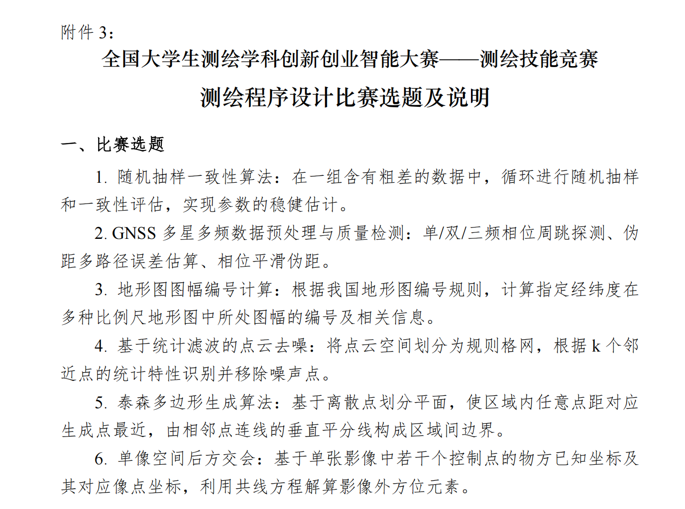

# 今年题目

总体上看，6 个里面只有**两个**书本上有参考资料。比去年少，不过难度应该和去年一样，总体都不难。RS，GNSS 和 GIS 都有涉及，从去年来就是这个趋势。我就觉得第二个有点困难，因为 GPS 课没听，内容不理解。不过幸运的是第六个写过，上学期作为课程大作业。还是了解算法过程的。

最重要的一点，就是今年完全看不出会倾向考哪个题目，去年 6 个题目有 5 个在前几年都有出现过，所以去年很多人就猜测就考那个新的题目（空间自相关），我也在这个题目准备了许多，没想到果真考了（严重怀疑所谓的抽取选题是真的还是假的）。今年的话所有题目都是新的（据我所知），所以不确定哪个重要。

## 一

随机抽样一致性算法：在一组含有粗差的数据中，循环进行随机抽样和一致性评估，实现参数的稳健估计。

- 领域：**RS**
- 书本是否有参考内容：**无**
- 难度预估：**中等**

## 二 

GNSS 多星多频数据预处理与质量检测：单/双/三频相位周跳探测、伪距多路径误差估算、相位平滑伪距。 

- 领域：**GNSS**
- 书本是否有参考内容：**无**
- 难度预估：**难**（因为我是 GIS 的，上 GPS 课听不进去，听不懂）

## 三

地形图图幅编号计算：根据我国地形图编号规则，计算指定经纬度在多种比例尺地形图中所处图幅的编号及相关信息。 

- 领域：**GIS，GNSS**
- 书本是否有参考内容：**有**。下册 P12。
- 难度预估：**中等**

## 四

基于统计滤波的点云去噪：将点云空间划分为规则格网，根据 k 个邻近点的统计特性识别并移除噪声点。 

- 领域：**RS**
- 书本是否有参考内容：**有**。下册 P223。
- 难度预估：**中等**

## 五

泰森多边形生成算法：基于离散点划分平面，使区域内任意点距对应生成点最近，由相邻点连线的垂直平分线构成区域间边界。 

- 领域：**GIS**
- 书本是否有参考内容：**无**
- 难度：**难**

## 六

单像空间后方交会：基于单张影像中若干个控制点的物方已知坐标及其对应像点坐标，利用共线方程解算影像外方位元素。

- 领域：**GNSS，RS**
- 书本是否有参考内容：**无**，不过《摄影测量学》这本书里面有算法详细介绍，还有例题以及答案。P41
- 难度预估：**中等** 