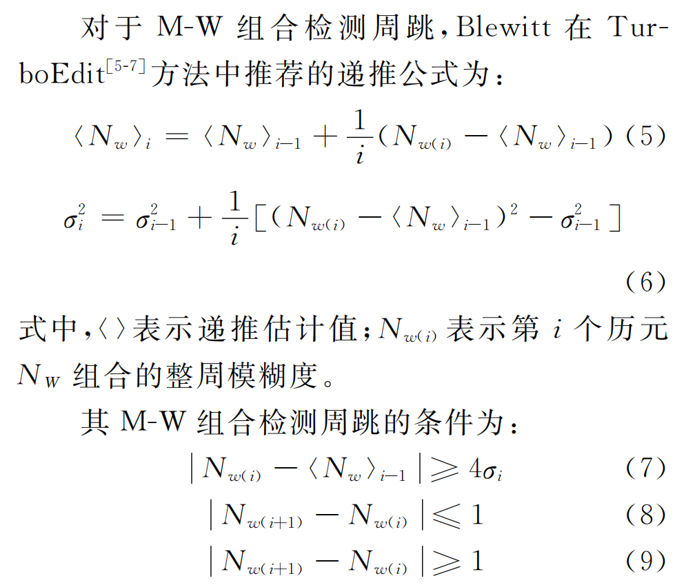
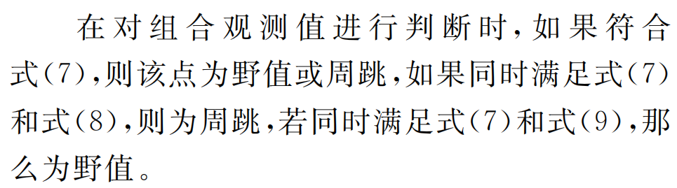
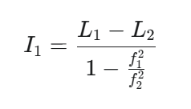

## 写在前面

不一定正确。欢迎讨论

我发现我对周跳一直有一个误解，就是我自己改了其中一个历元的数据，只改了一个，我以为这样就能识别出这个历元发生了周跳。但是不是的，这种情况只能说这个历元是异常值。周跳的话必须是把后面的两个以上的数据都修改一下。


这道题主要是方法多，周跳探测，伪距多路径误差估算，相位平滑伪距都有不同的方法。而且卫星导航的课我是没听的，这方面的东西的确不了解。所幸在 CSDN 上看到了一个人发了一些解析 [刚找到门的小白-CSDN博客](https://blog.csdn.net/2501_92238416?type=blog)，内容挺不错的。刚好讲的就是这个题目，而且也有代码。下面就结合我的理解补充我的内容。

## 1. 理解文本数据

我觉得对于没听过课的同学，不了解这些知识点的同学，首先必须要知道 txt 文档给的数据长什么样。

我是假设有多颗卫星的数据，我这里是两颗。G11，G21。每一行的内容含义如下，重点关注单位：

| 字段   | 含义                                    |
| ------ | --------------------------------------- |
| `L1`   | L1 频段载波相位值（单位：周）           |
| `L2`   | L2 频段载波相位值（单位：周）           |
| `P1`   | P1 频段伪距值（单位：米）               |
| `P2`   | P2 频段伪距值（单位：米）               |
| C1     | C/A 码，这里我们不需要使用 （单位：米） |
| `SNR1` | L1 的信噪比（单位 dB-Hz）               |
| `SNR2` | L2 的信噪比                             |

```
G11 卫星数据
历元名,L1(周),L2(周),P1(米),P2(米),C1(米),SNR1(dBHz),SNR2(dBHz)
A1,120162463.158,93633089.09244,22866155.912,22866155.084,22866156.459,43.500,27.0004
A2,120065062.189,93557192.24144,22847621.430,22847620.337,22847622.049,43.250,27.5004
A3,119968020.466,93481575.32544,22829154.702,22829153.756,22829155.153,43.250,27.0004
A4,119871340.439,93406240.24144,22810757.292,22810756.069,22810757.597,43.250,27.0004
A5,119775029.807,93331192.99444,22792429.975,22792428.659,22792429.715,43.250,27.7504
A6,119679086.914,93256432.29244,22774172.794,22774172.219,22774173.060,43.500,27.5004
A7,119583522.460,93181966.50044,22755987.316,22755985.994,22755987.902,43.250,28.0004
A8,119488325.674,93107787.18044,22737871.383,22737870.343,22737872.529,43.500,28.0004
A9,119393506.813,93033902.35944,22719828.291,22719827.500,22719828.724,42.500,28.7504
A10,119299069.559,92960314.88544,22701857.861,22701856.231,22701857.920,42.250,28.7504
A11,119205012.584,92887023.72744,22683960.215,22683957.742,22683960.081,43.000,28.5004
A12,119111343.723,92814035.00944,22666134.750,22666133.417,22666134.765,43.250,28.5004
A13,119018061.928,92741347.88544,22648383.337,22648382.710,22648384.309,43.500,28.5004
A14,118925167.808,92668962.85244,22630706.578,22630705.191,22630706.706,43.250,28.7504
A15,118832666.701,92596884.07044,22613104.851,22613103.123,22613104.118,43.250,28.5004
A16,118740561.493,92525113.76344,22595576.974,22595575.838,22595577.973,43.250,28.5004
A17,118648858.556,92453656.93044,22578126.637,22578125.272,22578126.974,43.000,29.0004
A18,118557559.194,92382514.55844,22560752.309,22560752.046,22560752.938,43.750,29.2504
A19,118466666.739,92311689.28244,22543457.374,22543456.416,22543456.969,43.500,29.2504
A20,118376180.987,92241180.88444,22526237.379,22526237.078,22526238.466,43.750,29.5004
A21,118286106.522,92170992.99044,22509097.682,22509096.066,22509097.455,43.500,29.5004
A22,118196449.814,92101130.62344,22492036.199,22492035.231,22492036.946,44.250,29.7504

G21 卫星数据
历元名,L1(周),L2(周),P1(米),P2(米),C1(米),SNR1(dBHz),SNR2(dBHz)
B1,123807985.944,96473755.59644,23559872.511,23559872.671,23559874.194,38.750,24.5004
B2,123894980.355,96541543.44044,23576427.690,23576427.909,23576428.888,39.750,27.5004
B3,123982161.202,96609476.53644,23593016.805,23593017.071,23593017.632,37.750,24.2504
B4,124069526.711,96677553.56343,23609641.880,23609641.883,23609642.961,38.000,23.7504
B5,124157080.390,96745777.18044,23626304.242,23626303.851,23626303.133,39.000,24.7504
B6,124244816.928,96814143.32644,23642999.524,23642999.130,23643000.198,39.000,26.0004
B7,124332742.782,96882656.92044,23659730.876,23659731.748,23659731.776,39.500,25.5004
B8,124420843.362,96951306.72644,23676495.858,23676495.047,23676496.912,39.250,24.7504
B9,124509124.688,97020097.37244,23693295.439,23693295.535,23693296.248,39.750,24.7504
B10,124597586.317,97089028.51943,23710128.852,23710128.361,23710129.526,38.250,23.5004
B11,124686223.206,97158096.16643,23726996.234,23726996.595,23726997.226,38.500,23.7504
B12,124775039.014,97227303.31344,23743897.737,23743896.633,23743898.245,40.750,25.0004
B13,124864028.824,97296646.02843,23760830.955,23760831.264,23760832.433,38.500,23.5004
B14,124953189.353,97366121.71644,23777798.688,23777797.061,23777799.367,38.500,24.5004
B15,125042521.312,97435731.03143,23794797.601,23794798.073,23794797.883,38.250,23.7504
B16,125132023.983,97505473.34044,23811829.922,23811829.510,23811829.832,39.000,24.2504
B17,125221699.472,97575350.35543,23828893.691,23828893.362,23828895.743,38.250,23.2504
B18,125311545.351,97645360.11443,23845990.631,23845991.742,23845990.687,38.000,22.2504
B19,125401560.742,97715501.96043,23863120.970,23863119.665,23863120.683,39.500,23.7504
B20,125491741.502,97785772.68444,23880281.135,23880282.158,23880281.823,39.500,24.0004
B21,125582088.156,97856172.65343,23897473.806,23897473.795,23897474.211,38.750,23.0004
B22,125672603.063,97926703.74243,23914697.996,23914698.915,23914697.918,38.000,22.0004
```

我们重点关注载波相位和伪距值。

G11 和 G21 都是 GPS 卫星，GPS 卫星的载波频率和波长是已知的。

**L1载波：1575.42MHz，0.190m**，m是百万的意思，也就是 10 的 6 次方

**L2载波：1227.6MHz、0.244m**

## 2. 算法原理

### 1. 周跳检测与修复算法

#### 1.1 Melbourne-Wubbena (MW) 组合检测法

**计算公式：**

$$
L_{\text{MW}} = \frac{f_1 \lambda_1 \varphi_1 - f_2 \lambda_2 \varphi_2}{f_1 - f_2} - \frac{f_1 P_1 + f_2 P_2}{f_1 + f_2} = N_{\text{WL}} \lambda_{\text{WL}}
\\ \\
\lambda_{WL} = \frac{c}{f_1 - f_2}
$$
最后得到 **宽项模糊度 Nwl**
$$
N_{\text{WL}} = \frac{L_{\text{WL}}}{\lambda_{\text{WL}}} = \varphi_1 - \varphi_2 - \frac{f_1 \cdot P_1 + f_2 \cdot P_2}{\lambda_{\text{WL}} (f_1 + f_2)} 
$$
其中：

- fai1, fai2：L1和L2载波的载波相位观测值，**计算公式里以周为单位**。
- P1, P2：L1和L2载波的伪距观测值  
- f1, f2：L1和L2载波的频率

**检测逻辑：**

<>是平均值的意思。





#### 1.2 二阶差分（GF）


#### 1.3 周跳修复方法

知道有这个就行了，看赛题说明没有提到需要修复周跳。

**修复策略：** 线性内插法

当检测到周跳时：

1. 找到发生周跳的观测数据点

2. 确保该点不是序列的首末点

3. 取前后相邻观测值的平均值作为修复值：

   ```
   修复值 = (前一历元值 + 后一历元值) / 2
   ```

---

### 2. 多路径误差处理算法

#### 2.1 多路径效应估算—CMC方法

直接用**伪距减去载波相位**（距离）的方法是最通用、最简单的方法。P 是伪距，fai 是载波**（单位为周）**，nameda 是波长，单位是米。
$$
CMC = P - \Phi \cdot \lambda
$$
然后就涉及到一个问题，CMC 得到的差值其实包含了误差项，也就是电离层误差，整周模糊度那些。如果是题目不考那么难，那么我们就不用考虑，这个时候，我们就可以通过 CMC 小于某个阈值，又或者说其他方法判断是否有多路径效应。**但是这种情况我们是绝对不可能知道多路径效应的估算值**，只是从数据质量的角度，我们可以判断哪个历元有显著的多路径效应误差。

如果是我们要求得一个合适的**多路径效应估算**，就要进一步。

> 注意，进一步是为了估算出这个多路径误差的数值，但是我实际写完代码发现，误差太大了，不知道是不是数据的问题，或者是就是我的公式不对

首先，CMC 最终项中剩下的误差有：电离层误差、整周模糊度、伪距多路径、载波相位多路径、伪距噪声、载波相位噪声等等。如果只看伪距的多路径误差，那么载波相位多路径和载波相位噪声较小可以忽略不计，**因此，伪距减去载波相位（距离）后，得到的就只有电离层误差，整周模糊度，伪距多路径，噪声**，我们要求得伪距多路径，目标也就是把电离层误差，整周模糊度和噪声消除。

**消除两倍电离层误差（单频）**

准确来说是可以计算的，不过不是这个题目的范畴了，因为单频想要得到电离层误差的话，需要用到其他的模型。这个是不是比赛的范畴了。

**消除整周模糊度和噪声**

这里就需要注意，首先，我们要知道一个前提，在连续的历元里，多路径误差是一个**零均值的、周期性的扰动**，因此，如果我们对连续的历元的 MP1* 求平均值，这个平均值就是整周模糊度和噪声。mp_est 作为多路径估算结果

```
cmc_est = CMC(t) - mean(CMC over window)
```

或者使用差分的方法，但是差分得到的结果**只能判断有没有发生明显的多路径效应**，不能得到具体的多路径误差值

```
cmc_est = CMC(t) - CMC(t-1)
```

需要注意的是，求均值里，**在连续的历元里**的含义是不发生周跳，这就结合了步骤一，周跳的探测。意思就是说，你求均值选中的历元区间，不是上来就是全部历元，而是不发生周跳的区间。

**双频 CMC**

上面讲的办法是单频的，双频情况下，其实也不难，就把两个 CMC 组合一下，用一个新的 CMC 算就行了。
$$
CMC_1 = P_1 - \Phi_1 \cdot \lambda_1
\\
CMC_2 = P_2 - \Phi_2 \cdot \lambda_2
\\
CMC_{IF} = \frac{f_1^2 CMC_1 - f_2^2 CMC_2}{f_1^2 - f_2^2}
$$
然后，双频的优势就在于，可以简便的计算得到电离层误差。需要注意的是，我们要减去**两倍的电离层误差**，这个是在公式推导里得出的。

**公式里的L1 和 L2 的单位是米**：



也就是说，CMCif 需要先减去 两倍的 I，然后用减去的结果继续下一步。

#### 2.2 多路径误差修正

这个修正方法看看就行了，因为不一定就是这种方法。

**修正方法：**

- P1修正：直接减去估算的多路径误差值
- P2修正：假设L2的多路径误差是L1的80%，按比例修正

```
P1_corrected = P1 - MP_estimate
P2_corrected = P2 - MP_estimate × 0.8
```

---

### 3. 伪距平滑算法

#### 3.1 算法原理

相位平滑伪距的核心思想是利用**高精度的载波相位观测值**来**平滑噪声较大的伪距观测值**。载波相位虽然精度高，但有固有的模糊度问题（整数周跳 N），而伪距没有模糊度，但精度较低。通过结合两者，我们可以在保持伪距连续性的同时，提升其精度。

#### 3.2 Hatch滤波

**公式里，fai 的单位是米，要先把周转为米。P 伪距是米**

一般递推形式
$$
P_smooth(k) = (1-α)·P_smooth(k-1) + α·P(k) + (1-α)·[Φ(k) - Φ(k-1)]
$$
其中：

- `α = 1/N`，N是平滑窗口长度，最大值我设置为了100。
- `P_smooth(k)` 是第k个历元的平滑伪距
- `P(k)` 是第k个历元的原始伪距观测值
- `Φ(k)` 是第k个历元的载波相位观测值（转换为距离单位）

**双频**

如果是双频，Pk 和 faik 就需要预先处理：

注意，**fai 的单位需要是米，因此需要先把周转成米**
$$
P_{IF} = \frac{f_1^2 P_1 - f_2^2 P_2}{f_1^2 - f_2^2}
$$

$$
\Phi_{IF} = \frac{f_1^2 \Phi_1 - f_2^2 \Phi_2}{f_1^2 - f_2^2}
$$

然后就用处理后的参与公式计算就行了。

---

### 4. 数据处理流程

#### 整体处理顺序：

```
原始GNSS观测数据
    ↓
1. 周跳检测（MW组合法）
    ↓
2. 周跳修复（线性内插）
    ↓
3. 多路径估算（相位-伪距差值法）
    ↓
4. 多路径修正（误差扣除）
    ↓
5. 伪距平滑（卡尔曼滤波）
    ↓
高质量GNSS观测数据
```
