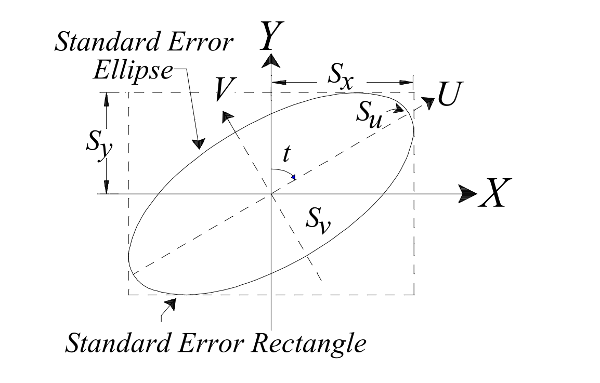
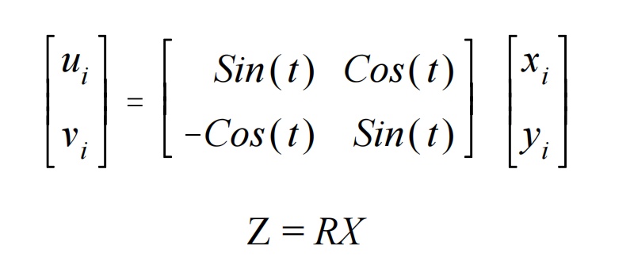
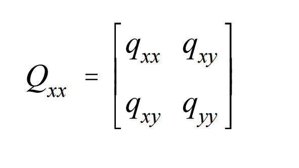
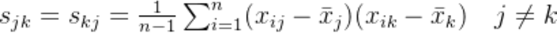
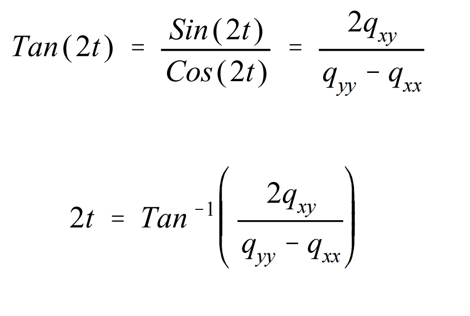
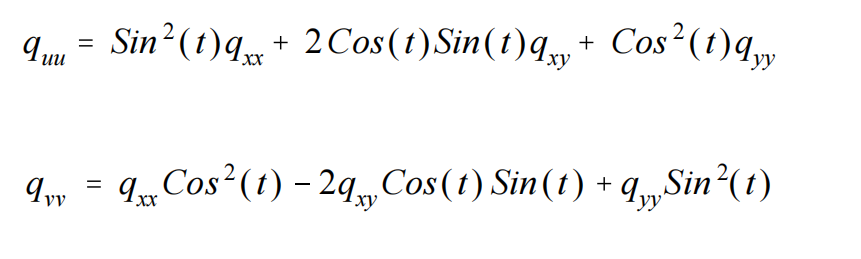
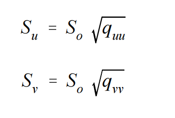
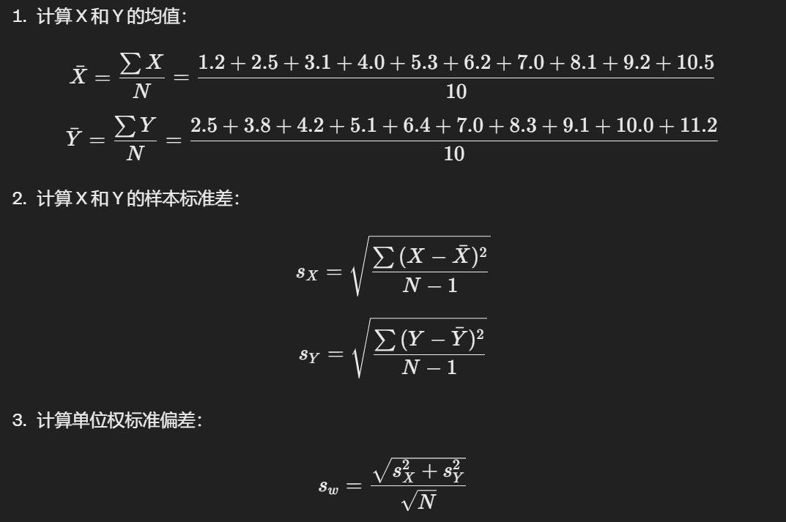
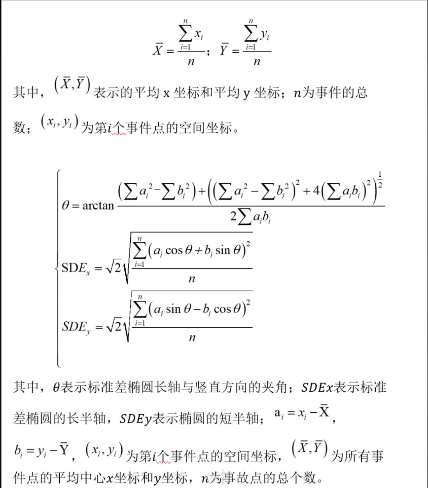

## 第一个PDF的方法：

计算标准误差椭圆可以理解为旋转X和Y轴，使得X和Y轴方向上的数据差异最大。实现数据压缩和降维。

（线性代数里面老师讲过，我有点印象）

如图，X和Y是原来的坐标轴，我们需要计算旋转角度t来将椭圆旋转到V和U坐标轴。所以关键是怎么算t。

### 预备知识：（需要用的时候来看）

[协方差矩阵](https://blog.csdn.net/forest_LL/article/details/135288260)

### 算法流程：

已知数据：所有离散点在XY坐标系的x和y坐标

#### 1.旋转矩阵R的表达式：

u，v是旋转后的坐标。x，y是原来的坐标，意思就是每个坐标点要左乘以旋转矩阵R。

#### 2.辅助计算：计算协方差

只用算协方差

qxx，qxy分别表示x轴的协方差，x与y轴的协方差

协方差的计算过程：

1.先算均值，此处为X，Y坐标的均值

2.求解：

我的建议：不要非从矩阵的角度去写代码，然后就哗啦哗啦的写了矩阵相乘的函数，事实上没必要，因为如果真的完整复现矩阵相乘，数据遍历等等一系列操作，这个函数是非常复杂的。

#### 3.t的计算公式

#### 4.计算新坐标系下的协方差：

#### 5.计算新坐标系下的长半轴短半轴：

这个式子的S0是“单位权的标准偏差”，这个可能题目会给，可能要自己算，怎么算的，我问GPT如下

关键词叫这个，在测绘里又叫“单位权中误差”。

## 方法二：

与上面的方法很接近，网页很简短，我就不写了

[方法二](https://help.autodesk.com/view/CIV3D/2024/CHS/?guid=GUID-7EDBB01A-B41C-405A-BBA8-A12E01F4C303)

第二个PDF和第三个PDF看不懂，感觉跟我们测绘联系小，因为好像要求导数。有能力的自己看。

三：李英冰发的

