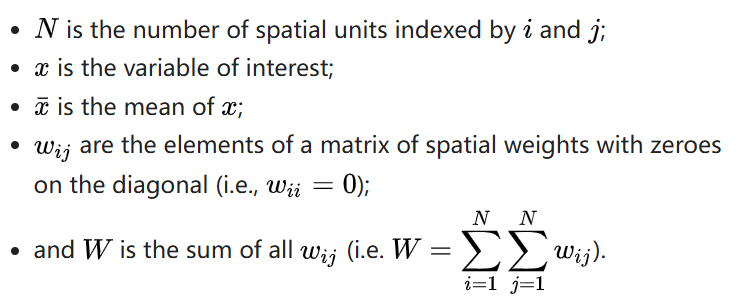
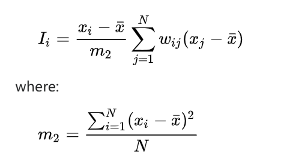
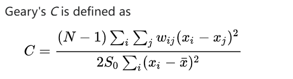
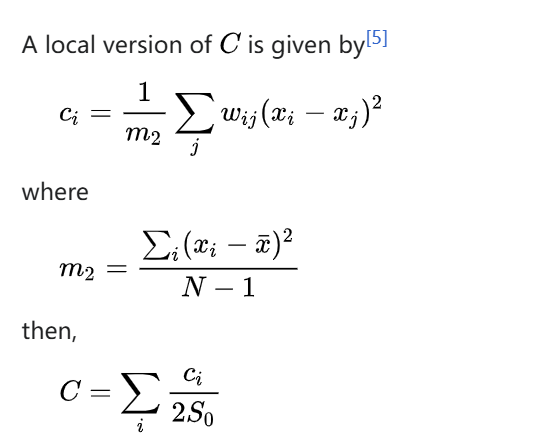
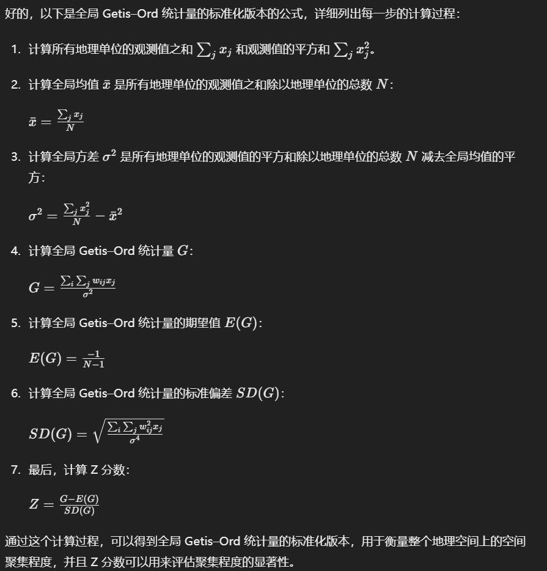
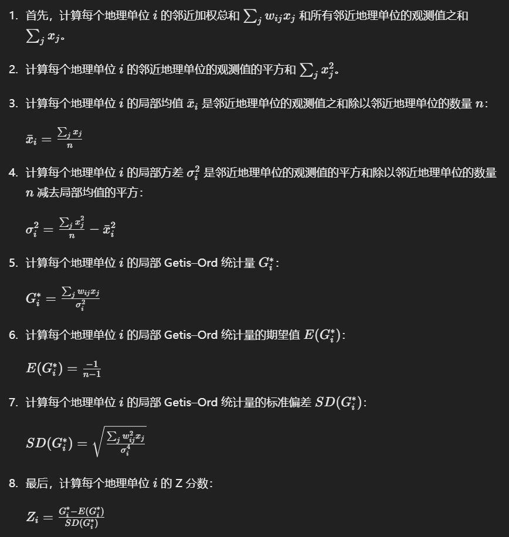

# 空间自相关系数

在上一个markdowm得到空间权重矩阵后，我们就要算空间自相关系数了

## 一、莫兰指数

通常情况，先做一个地区的**全局莫兰指数**，全局指数告诉我们空间是否出现了集聚或异常值。如果全局有自相关出现，接着做**局部自相关**，局部Moran'I会告诉我们哪里出现了异常值或者哪里出现了集聚。

### 1.全局莫兰指数

N是观察值的数量，W是总空间权重值

莫兰指数的计算过程包括以下步骤：

1. 确定空间权重矩阵 𝑊：根据研究的空间特征和问题，确定观测值之间的空间连接关系和权重。
2. 计算平均值 𝑥ˉ：计算所有观测值的平均值。
3. 计算空间自相关项：对于每对观测值 𝑖 和 𝑗，计算空间权重 𝑤𝑖𝑗 乘以观测值之间的差值。
4. 计算总的空间自相关和平方的偏差项：计算空间自相关项的总和以及观测值之间的平方偏差的总和。
5. 计算莫兰指数：根据上述公式计算莫兰指数。

莫兰指数的取值范围在 −1−1 到 11 之间，其中：

- 当莫兰指数接近 1 时，表示空间正自相关，即相似值聚集在一起。
- 当莫兰指数接近 −1 时，表示空间负自相关，即相似值相互分散。
- 当莫兰指数接近 0 时，表示空间随机分布，没有明显的自相关性。

### 2.局部莫兰指数

## 二、Geary's C

### 1.全局Geary's C

其中：

- N 是地理单位的数量；
- 𝑥𝑖 和 𝑥𝑗 是第 𝑖 和 𝑗 个地理单位的变量值；
- 𝑥ˉ 是所有地理单位变量值的平均值；
- 𝑤𝑖𝑗 是第 𝑖 和 𝑗 个地理单位之间的空间权重；
- S0 是所有空间权重 𝑤𝑖𝑗 的总和。

Geary's C 的取值范围是 0 到 2 之间，其中：

- 当 Geary's C 接近于 1 时，表示地理空间上的变量分布是随机的，不存在空间自相关性；
- 当 Geary's C 小于 1 时，表示地理空间上的变量分布存在正的空间自相关性；
- 当 Geary's C 大于 1 时，表示地理空间上的变量分布存在负的空间自相关性。

### 2.局部Geary's C

## 三、Getis–Ord statistics

### 1.全局Getis–Ord statistics

### 2.局部Getis–Ord statistics

