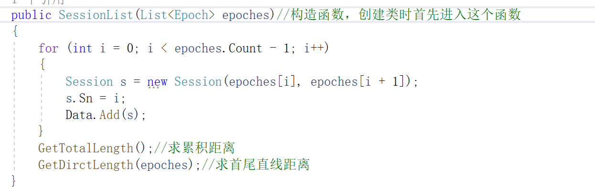

## 练习一：出租车轨迹数据计算

代码说明：FileHelper为文件读取程序，Algo为时间转换算法，Epoch为每个历元，Session为计算好每个历元的速度，距离等等数据的数据结构，SessionList为计算好的所有结果。

这个练习没有什么特别的，按照步骤来就行

#### 一些总结：

1.构造函数。

创建类时，如果类的方法里有构造函数，那么首先进入构造函数。再执行其他操作。

构造函数的格式：public + 类名  +（）或者（参数）

函数名必须和类名一致，你可以传参数，也可以不传参数，看你需求。只能是这个格式，否则不是构造函数。在本次练习里，当我们创建一个SessionList的类时，并且传入了epoches泛型，那么首先执行以下过程

for遍历里是算出每两个历元的速度方位角，每两个历元的距离，每两个历元的速度，每两个历元的数据用Session储存，然后把所有Session添加到SessionList里面。

最后GetTotalLength求总长，GetDirctLength求起始点与终点的距离。

2.一般的算法可以按照【文件读取——数据结构储存——算法实现】的过程来看
