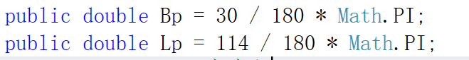
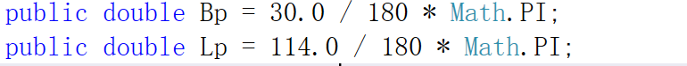

这一节给的答案示例实在是看不懂，什么定义椭球体啊，实在看不懂所以后半部分不会。

这里我只算出了高度角和方位角，后面半部分不知道怎么搞，算的值总是不对，想了挺久的了，没办法只能跳过

（我怀疑是书本公式印刷错了）

#### 总结：

1.我犯了个致命的错误，**一直算不出来方位角和高度角**，我直接硬是手算了一遍，结果还是跟我手写的不一样，我真就一个一个排查，最后排查左矩阵的时候，发现第一行的【0，0，1】，我就纳闷了。后面才发现了错误

我表示Bp，Lp的时候没有加小数点！！！，这样只是整数相除！！！永远是0

加个小数点就行了。

啊，废了几个小时，哭。

3.方位角要进行判断，具体请参考第一次练习。方位角是与正北方的逆时针角度。

4.关于单位的问题，特别是三角函数。sin和cos等等三角函数的参数必须是弧度，不能是度数。

5.正则表达式。我们可能会遇到提供的数据之间的空格数不一的情况，这时需要用到正则表达式来分割数据。Regex.Split(string A, string B)命名空间为System.Text.RegularExpressions;

A为你要分割的字符串，B为正则表达式，如果要以空格分割，此处为@"\s+"

6.Math.Pow(a,b)可以表示a的n次幂

