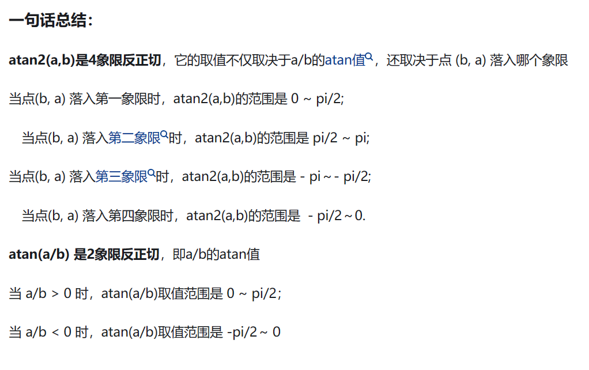

没算出来，不知道哪里错了，我怀疑又是像之前的练习一样，某个地方的公式写错了。好难受，不给中间结果验算好容易算错。

## 总结：

**1.arctan2与arctan的区别**

此外，书上给的arctan(p / q)里，p是x方向，q是y方向，所以算出的第一象限角是与y轴的角。（如果是y / x，那么就是我们平时所知的与x轴的角）

**2.**10的多少次幂：1e-3  10的负三次幂，1e6 10的6次幂。或者用Math.Pow(x,y)表示x的y次幂
