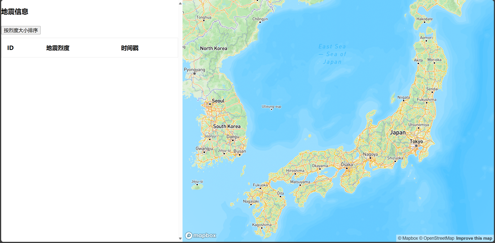

# Lab4b：GeoJSON 加载可视化

在此之前，你可以通过 [geojson.io | powered by Mapbox](https://geojson.io/#map=2/0/20) 来查看提供的 GeoJSON 和 JSON 数据的大致结构，把 `assets` 里面的数据拖入即可，或者选择打开

### 1.Body 结构

```html
<body>
  <main id="container">
    <div id="table">
      <h3>地震信息</h3>
      <button>按烈度大小排序</button>
      <table>
        <tr>
          <th>ID</th>
          <th>地震烈度</th>
          <th>时间戳</th>
        </tr>
      </table>
    </div>
    <div id="map">
    </div>
  </main>
</body>
```

### 2.Style 样式

#### 容器

```css
  body {
    margin: 0;
    padding: 0;
  }

  #container {
    display: flex;
    height: 100vh;
    flex-direction: row;
    align-items: stretch;
  }
```

`display: flex;`：将`#container`设置为一个弹性盒子容器，使其子元素成为弹性盒子项目（flex items）。

`height: 100vh;`：设置容器的高度为视窗高度的100%，确保它占据整个视窗的高度。

`flex-direction: row;`：将容器内的子元素排列成一行（水平排列）。

`align-items: stretch;`：将容器内的子元素在交叉轴（垂直方向）上拉伸，使它们的高度与容器的高度相同

```css
 #table {
    flex-basis: 500px;
    overflow-y: scroll;
  }

  #map {
    flex-grow: 1;
  }
```

**flex-basis: 500px;**：这个属性定义了弹性盒子项目的初始主尺寸。在这个例子中，`#table`的初始宽度为500像素。如果容器的空间允许，这个元素将至少宽500像素。

**overflow-y: scroll;**：这个属性设置了垂直方向的溢出行为。如果内容超出了`#table`的高度，就会出现垂直滚动条

**flex-grow: 1;**：这个属性定义了弹性盒子项目的扩展比率。在这个例子中，`#map`元素会根据剩余的可用空间进行扩展。容器中所有元素的`flex-grow`值之和决定了各个元素的扩展比例。因为`#map`的`flex-grow`为1，它将占据剩余空间中的一部分。

#### table

```css
table {
    border-collapse: collapse;
    border-spacing: 0;
    width: 100%;
    border: 1px solid #ddd;
}

th,
td {
    text-align: left;
    padding: 16px;
}

tr:nth-child(even) {
    background-color: #f2f2f2;
}
```

1. **border-collapse: collapse;**：将表格的边框折叠为单一边框。这样表格单元格之间不会有额外的空间。
2. **border-spacing: 0;**：设置单元格之间的间距为0。这在`border-collapse: collapse;`已经生效的情况下没有太大影响，但如果`border-collapse`不是`collapse`，它可以确保单元格之间没有间距。
3. **width: 100%;**：设置表格的宽度为其父容器的100%，确保表格占满可用空间。
4. **border: 1px solid #ddd;**：为表格添加一个1像素宽、颜色为浅灰色（#ddd）的实线边框。

#### **表头和单元格样式**

1. **th, td**：这个选择器同时应用于表格头部单元格（`<th>`）和表格数据单元格（`<td>`）。
2. **text-align: left;**：将单元格内容对齐到左边。
3. **padding: 16px;**：为单元格内容添加16像素的内边距，以增加内容与单元格边框之间的空间，使其看起来更美观。

#### 偶数行样式

**tr:nth-child(even)**：选择表格中的偶数行（第2、4、6行等），注意CSS的计数是从1开始的。

**background-color: #f2f2f2;**：将这些偶数行的背景颜色设置为浅灰色（#f2f2f2），以便与奇数行区分开来。这种交替的背景颜色有助于提高表格的可读性。

### 3.加载 Mapbox 地图

查看 [Mapbox官网]([Mapbox GL JS | Mapbox](https://docs.mapbox.com/mapbox-gl-js/guides/)) 学习导入地图，在此之前，你需要先注册获得 token

使用 API 一般有 CDN 和 Modules 两种方式，刚入门的我们采用CDN

首先引入对应的 JS 和 CSS

```html
<head>
  <meta charset="UTF-8">
  <meta name="viewport" content="width=device-width, initial-scale=1.0">
  <title>Earthquake</title>
  <script src='https://api.mapbox.com/mapbox-gl-js/v3.5.1/mapbox-gl.js'></script>//引入
  <link href='https://api.mapbox.com/mapbox-gl-js/v3.5.1/mapbox-gl.css' rel='stylesheet' />//引入
</head>
```

然后初始化地图

```js
<script>
  mapboxgl.accessToken = 'YOUR_ACCESS_TOKEN';
  const map = new mapboxgl.Map({
    container: 'map', // container ID
    style: 'mapbox://styles/mapbox/streets-v12', // style URL
    center: [135, 37], // starting position [lng, lat]
    zoom: 5, // starting zoom
  });
</script>
```

打开后得到如下图


### 4.导入数据 


```js
async function loadGeoJson() {
    const earthquakesResponse = await fetch('assets/earthquakes.geojson')
    const japanResponse = await fetch('assets/japan.json')
    const earthquakes = await earthquakesResponse.json();
    const japan = await japanResponse.json();
    map.on('load', function loadingData() {
      map.addSource('earthquakes', {
        type: 'geojson',
        data: earthquakes
      });

      map.addLayer({
        'id': 'earthquakes-layer',
        'type': 'circle',
        'source': 'earthquakes',
        'paint': {
          'circle-radius': 8,
          'circle-stroke-width': 2,
          'circle-color': 'red',
          'circle-stroke-color': 'white'
        }
      });


      map.addSource('japan', {
        type: 'geojson',
        data: japan
      });

      map.addLayer({
        'id': 'japan-layer',
        'type': 'fill',
        'source': 'japan',
        'paint': {
          'fill-color': '#0080ff', // blue color fill
          'fill-opacity': 0.5
        }
      });

    });
  }
  //#endregion
  loadGeoJson();
```

**详细说明：**

- **addSource**: 加载和定义数据来源，比如 GeoJSON、栅格图像等。
- **addLayer**: 定义如何在地图上展示这些数据，比如将数据中的点显示为圆形、将线段显示为实线或虚线等。

**数据流动过程：**

1. **数据源**: 首先通过 `addSource` 将外部数据加载到地图中，给定一个 ID 来标识这个数据源。
2. **图层**: 然后通过 `addLayer` 引用这个数据源的 ID，并定义如何将数据源中的数据可视化。

**为什么不能跳过 `addSource` 直接 `addLayer`？**

**没有数据**: `addLayer` 需要知道展示什么内容。如果没有数据源，它就没有可展示的数据。

**错误提示**: 如果你尝试在没有数据源的情况下使用 `addLayer`，会报错，因为 Mapbox 无法找到匹配的 `source`。

### 5.将数据渲染到表格里

```javascript
table = document.getElementsByTagName("table")[0];
    let row, cell1, cell2, cell3;
    for (let i = 0; i < earthquakes.features.length; i++) {
      // Create an empty <tr> element and add it to the 1st position of the table:
      row = table.insertRow(-1);
      cell1 = row.insertCell(0);
      cell2 = row.insertCell(1);
      cell3 = row.insertCell(2);
      cell1.innerHTML = earthquakes.features[i].properties.id;
      cell2.innerHTML = earthquakes.features[i].properties.mag;
      cell3.innerHTML = new Date(earthquakes.features[i].properties.time).toLocaleDateString(
        "en-US");
    }
```

#### 代码解释：

```javascript
table = document.getElementsByTagName("table")[0];
```

- **获取表格元素**：`document.getElementsByTagName("table")[0]` 会返回文档中第一个 `<table>` 元素。这个 `table` 对象将用于在表格中添加数据。

```javascript
let row, cell1, cell2, cell3;
```

- **声明变量**：声明 `row`、`cell1`、`cell2` 和 `cell3` 变量，用于后续创建表格行和单元格。

```javascript
for (let i = 0; i < earthquakes.features.length; i++) {
```

- **遍历地震数据**：`earthquakes.features` 是一个数组，其中包含所有地震的具体信息。`for` 循环遍历这个数组，每次循环处理一个地震数据。

```javascript
row = table.insertRow(-1);
```

- **插入新行**：`table.insertRow(-1)` 会在表格的最后添加一个新的空行（`<tr>`）。`-1` 表示在表格的末尾插入新行。

```javascript
 cell1 = row.insertCell(0);
 cell2 = row.insertCell(1);
 cell3 = row.insertCell(2);
```

- **插入新单元格**：`row.insertCell(0)`、`row.insertCell(1)` 和 `row.insertCell(2)` 分别在新创建的行中插入3个新的单元格（`<td>`）。这些单元格将被用于存放地震的具体信息。

```javascript
cell1.innerHTML = earthquakes.features[i].properties.id;
cell2.innerHTML = earthquakes.features[i].properties.mag;
cell3.innerHTML = new Date(earthquakes.features[i].properties.time).toLocaleDateString("en-US");
```

- 填充单元格内容
  - `cell1.innerHTML = earthquakes.features[i].properties.id;`：将地震的 ID 填充到第一个单元格。
  - `cell2.innerHTML = earthquakes.features[i].properties.mag;`：将地震的震级（`mag`）填充到第二个单元格。
  - `cell3.innerHTML = new Date(earthquakes.features[i].properties.time).toLocaleDateString("en-US");`：将地震的时间戳转换为可读的日期格式，并填充到第三个单元格。


### 6.Sort自定义函数

```javascript
function sortTable(e) {
    let table, rows, switching, i, x, y, shouldSwitch;
    table = document.getElementsByTagName("table")[0];
    switching = true;
    /*Make a loop that will continue until
    no switching has been done:*/
    while (switching) {
      //start by saying: no switching is done:
      switching = false;
      rows = table.rows;
      /*Loop through all table rows (except the
      first, which contains table headers):*/
      for (i = 1; i < (rows.length - 1); i++) {
        //start by saying there should be no switching:
        shouldSwitch = false;
        /*Get the two elements you want to compare,
        one from current row and one from the next:*/
        x = parseFloat(rows[i].getElementsByTagName("td")[1].innerHTML);
        y = parseFloat(rows[i + 1].getElementsByTagName("td")[1].innerHTML);
        //check if the two rows should switch place:
        if (x < y) {
          //if so, mark as a switch and break the loop:
          shouldSwitch = true;
          break;
        }
      }
      if (shouldSwitch) {
        /*If a switch has been marked, make the switch
        and mark that a switch has been done:*/
        rows[i].parentNode.insertBefore(rows[i + 1], rows[i]);
        switching = true;
      }
    }
  }
```

1. - `rows[i].parentNode.insertBefore(rows[i + 1], rows[i]);`
   - 这里的 `parentNode` 返回的是当前行 `rows[i]` 的父节点。
   - `insertBefore` 方法由父节点来调用，因为它负责管理其子节点的顺序。
   - 通过父节点的 `insertBefore` 方法，将下一行 `rows[i + 1]` 插入到当前行 `rows[i]` 之前，完成交换。

**为什么不能直接操作子节点？**

直接在行节点 `<tr>`上调用插入操作是不可能的，因为 `insertBefore` 操作是针对子节点与父节点之间的关系设计的。DOM 的这种设计确保了节点只能在它们的父节点之下移动，从而维护了 DOM 树的结构完整性。