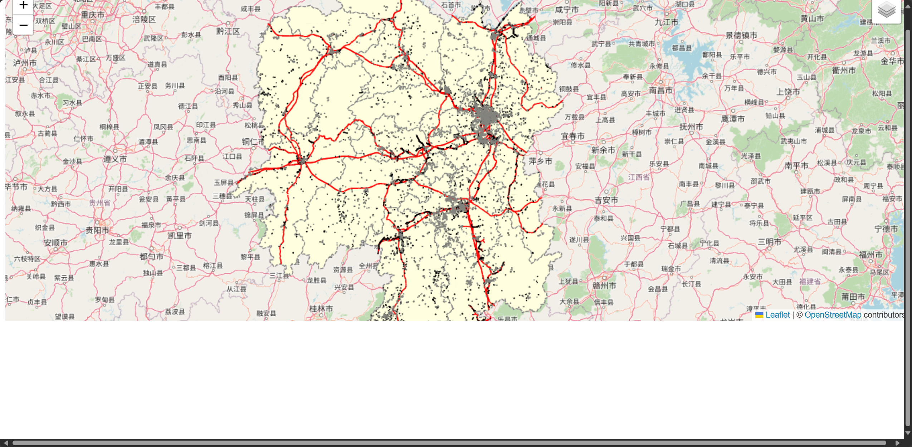

# 实验5：简单的发布地图

你可以自己设计流程，我这里是发布一个图层组，组里有湖南省的区划图，建筑图层，铁路图层。

## 一、数据准备

PostGIS需要 shp 格式的，推荐一个数据格式转换网站：[GeoConverter (infs.ch)](https://geoconverter.infs.ch/)，可以把若干格式直接相互转换，包括 JSON 转换到 shp。你可以在以下网站下载行政区划图[EasyMap (easyv.cloud)](https://map.easyv.cloud/)，[DataV.GeoAtlas地理小工具系列 (aliyun.com)](https://datav.aliyun.com/portal/school/atlas/area_selector?spm=a2crr.23498931.0.0.4ad815ddOU8PfS)。下载后转换成 shp 格式。[ (openstreetmap.org)](https://www.openstreetmap.org/#map=13/23.0797/113.9089) 提供了道路数据，并且提供了 shp 格式，不用转换。

## 二、导入PostGIS

你要导入的数据的位置路径是要全英文，不然 import 会报错，不要出现中文。

## 三、Geoserver发布WMS服务

使用图层组来发布，样式看不懂XML怎么写的（我也不会）直接问GPT，让他给你写SLD。在Geoserver设置样式和直接用API设置样式的区别是API只针对你更改的图层，而Geoserver是设置所有使用该样式的图层。

## 四、导入

```html
<body>
  <div id="map"></div>
</body>
<script>
  // 初始化Leaflet地图，设置视图中心和缩放级别
  var map = L.map('map').setView([26, 118], 7);  // 视图中心可以根据实际需要调整

  // 添加基础地图层 (如OpenStreetMap)
  L.tileLayer('https://{s}.tile.openstreetmap.org/{z}/{x}/{y}.png', {
    attribution: '&copy; <a href="https://www.openstreetmap.org/copyright">OpenStreetMap</a> contributors'
  }).addTo(map);
  // 添加GeoServer的WMS图层
  var wmsLayer = L.tileLayer.wms('http://localhost:8080/geoserver/tiger/wms', {
    layers: 'tiger:HuNanProvinceMap',              // 图层名称
    format: 'image/png',             // 图像格式
    transparent: true,               // 是否透明
    crs: L.CRS.EPSG4269              // 使用与WMS服务相同的坐标参考系
  }).addTo(map);
  // 如果需要切换图层，可以使用如下代码
  var baseLayers = {
    "OpenStreetMap": L.tileLayer('https://{s}.tile.openstreetmap.org/{z}/{x}/{y}.png')
  };
  var overlayLayers = {
    "GeoServer WMS Layer": wmsLayer
  };
  L.control.layers(baseLayers, overlayLayers).addTo(map);
</script>
```

效果如下：