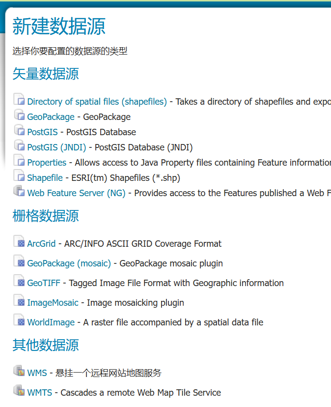

### 工作空间（workspace）

A workspace is a folder used to group similar layers together.

工作空间如同一个文件夹，用来组织相似的图层

添加图层里的参数，其中，**name 不能超过 10  个字符以及不能包含空格**

URL 可以随便取（当然，起码要能看得懂），URL 只是一个标识，**这个 URL 可以不是实际存在的网站**

| Field         | Value                                    |
| ------------- | ---------------------------------------- |
| Name:         | tutorial                                 |
| Namespace URI | http://localhost:8080/geoserver/tutorial |

### 存储仓库（store）

添加数据时需要将数据放置一个存储仓库里，store 有很多种类型，根据你的数据类型选择

### 图层（layer）

图层显示了你存储空间里的数据里有哪些图层，发布后，进入编辑页面

有三个信息需要注意，**基本资源信息** 和 **坐标系** 就不说了，能看懂，重要的是**边框**

一般情况下我们都是让边框大小刚好与数据边框相当

先点击 从数据中计算 再点击 Compute from native bounds

但是如果是想直接显示 SRS 坐标系的边框的话，就点击 **Compute from SRS bounds**，不过这种情况下图像可能会很小

### 图层组（Layer groups）

Layer groups are allowed to be “global”, allowing a map to be created combining layers from several workspaces into a single visual.

设置里图层组的**标题**建议取名，这是图层预览里的标题，便于区分

### 导入 PostGIS 表

新不新建工作空间看自己需求，新建存储空间选择 PostGIS

参数解释，基本信息不解释，主要是连接参数

其中 **database**，**schema** 是变化的，看你的数据库。（需要你了解数据库的知识）

| Option   | Value                              |
| -------- | ---------------------------------- |
| host     | localhost                          |
| port     | 5432                               |
| database | postgis                            |
| schema   | public                             |
| user     | postgres                           |
| passwd   | (Password for the `postgres` user) |

然后就能发布你数据库里面的图层了