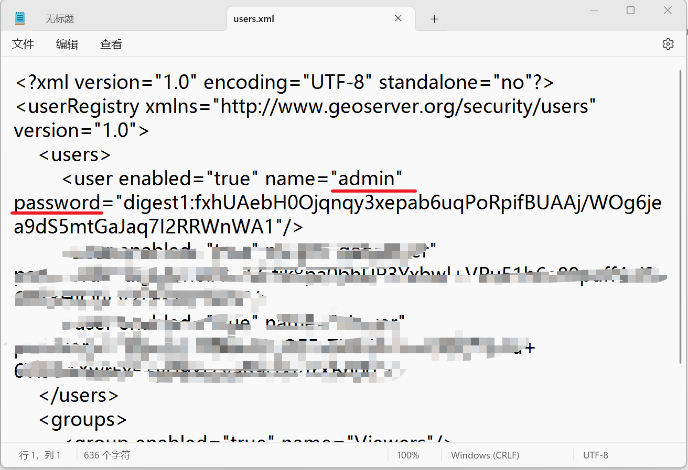
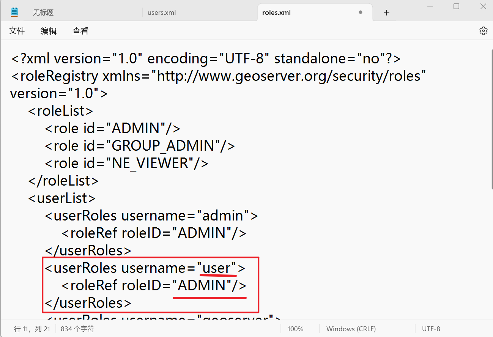

第一次安装后，如果你设置密码那一栏一直都是默认的话，那么登录密码应该是账户 admin，密码 geoserver

但是，如果你自己设置了密码和账户，登录又登录不上，或者忘记了，有以下方法可以解决。

本质上是查看 geoserver 的用户密码

**管理员身份运行记事本**，打开 **"C:\ProgramData\GeoServer\security\usergroup\default\users.xml"** 

你会看到如下：**admin** 可以是其他的，会是你初始设置的。**password** 后面一大串的不是密码，他是一种加密策略（ digest1 表示密码经过了加密，不然的话人人都可以从这里得知密码了），你无法得知密码是什么。

这时，你只需要把 **"digest1: XXXXXXXXX"** 改成 **"plain:XXXXXXX"** 就可以设置密码了，这里的 **plain** 便指的是没有加密策略。**如果你是新手，强烈建议 name 保持 admin 不变**，否则会报错，至于为什么，只有你了解 **安全** 模块里的 **用户、组、角色** 才知道，当然，我在后面也有解决方法，看不懂就不用做

如果你偏要把 **name** 设置成其他的，在这里，我们假设为 **user** ，接下来，请你同样的**管理员身份运行记事本**，打开 **"C:\ProgramData\GeoServer\security\role\default\roles.xml"**，添加红框里面的内容，就可以了

现在回过头看，为什么建议用 **admin** 用户名呢？因为 **role（角色）**里面初始就有 admin，如果你在**角色**里不添加 **user** 的话，是无法登录的。

就好比如你突然有一天捡到一本湖南师范大学的作业本，上面印刷了湖南师范大学这几个字，你在上面写上你的名字，然后向湖南师范大学的保安说你是湖南师范大学的学生，保安会信吗？不会，根本上是因为你的**学籍**不是湖南师范大学的，这里的**学籍**好比如注册了 **role**。

更详细的需要你了解 geoserver 里的 **安全** 模块里的 **用户、组、角色** 才知道

最后最后最后最后，我们设置密码的时候不是用的是 **plain** 吗？这样很不安全，没有加密任何人都能知道。怎么解决呢？

我不告诉你