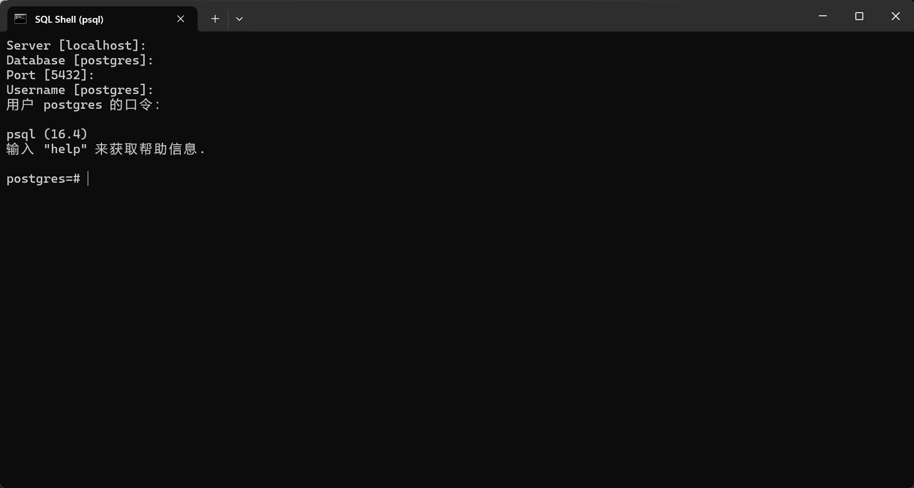
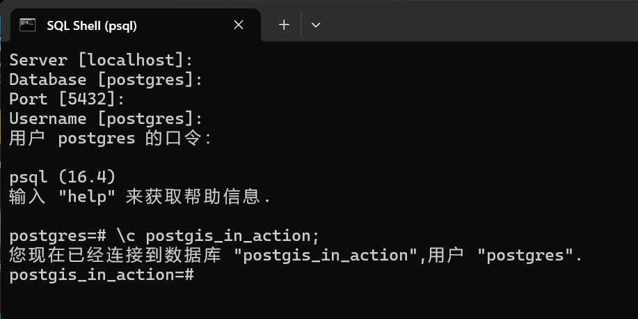
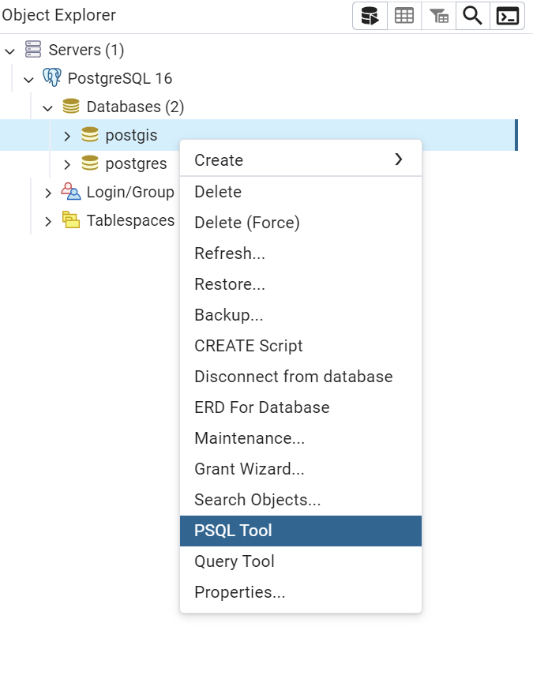
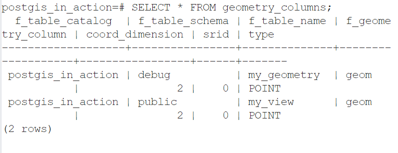

## 安装

安装postsql 和 postgis 直接在网上找教程就行了

## 基础操作

一般我们写 SQL 语句时有两种选中，要么在 SQL Shell 里写，要么在 pgAdmin 里写


打开 SQL Shell 后，一直回车就行了，最后面的口令就是你的密码，安装的时候应该有设置



**创建新的数据库**，name是你设置的数据库名称

```sql
CREATE DATABASE name;
```

**查看当前有哪些数据库**，这个 l 是字母小写 l ，不是数字 1 ，不用打分号

```sql
\l
```

**连接到数据库**

```sql
\c [DBNAME] [USER] [HOST] [PORT]
```

具体参数解释：

- **DBNAME**：要连接的数据库名称。
- **USER**（可选）：用于连接的 PostgreSQL 用户名。如果不指定，则使用当前用户。
- **HOST**（可选）：数据库服务器的主机名。如果数据库运行在本地，可以忽略此项。
- **PORT**（可选）：数据库服务器的端口号，默认是 `5432`。



或者在 `pgAdmin` 里，在对应数据库右键 `PSQL tool` ，在里面打语句



**创建模式**，模式是数据库中的一个逻辑容器，用来组织和管理数据库中的表、视图、索引等对象。通过使用模式，用户可以更好地对数据库对象进行分类，并为不同的应用或用户群体提供隔离和命名空间。

模式可以让数据库更加组织化，尤其是在项目较大或者有多个团队使用同一个数据库时，使用模式能避免命名冲突，并使管理更加灵活。

```sql
CREATE SCHEMA name;
```

------

**给予全部用户访问权限**

```sql
GRANT USAGE ON SCHEMA your_schema_name TO public;
```

`GRANT USAGE ON your_schema_name TO public;` 这个命令用于为 `public` 角色授予对指定模式（schema）的**使用权限**。

**含义**

- **GRANT USAGE**：为指定的角色授予在某个模式下使用对象的权限，允许用户查找和使用该模式中的对象（如表、视图、函数等）。但是，`USAGE` 权限并不允许用户修改模式中的对象（如插入数据、删除数据等），它只是提供了访问的基础权限。
- **ON your_schema_name**：这是你要授予权限的模式名。你需要将 `your_schema_name` 替换为你实际使用的模式名称。
- **TO public**：将权限授予 `public` 角色。`public` 是 PostgreSQL 中的一个默认角色，表示所有用户。如果授予 `public`，则所有数据库用户都会获得该权限。

示例

假设你有一个名为 `postgis` 的模式，并希望将使用权限授予所有用户，命令将是：

```sql
GRANT USAGE ON SCHEMA postgis TO public;
```

**注意**

1. **USAGE 只允许使用模式**，但并不赋予对模式中表或其他对象的权限。如果你还想授予对模式中表的查询权限，你还需要执行类似以下的命令：

   ```sql
   GRANT SELECT ON ALL TABLES IN SCHEMA postgis TO public;
   ```

   这将允许 `public` 用户查询该模式中的所有表。

2. **精确控制权限**：如果不希望所有用户都能访问模式中的对象，你可以将权限授予特定用户或角色，而不是 `public`。

------

**添加到搜索路径中**

```sql
ALTER DATABASE postgis_in_action SET search_path=public,your_schema_name,contrib;
```

`ALTER DATABASE postgis_in_action SET search_path=public,your_schema_name,contrib;` 这条命令用于更改数据库 `postgis_in_action` 的搜索路径（`search_path`）。

**含义**

- **search_path** 是 PostgreSQL 的一个配置参数，决定数据库在查找表、视图、函数等对象时会先去哪些模式（schema）中查找。如果对象在当前模式中找不到，数据库会按照 `search_path` 中定义的顺序继续查找其他模式。
- **public、your_schema_name、contrib**：这些是模式的名称。这里定义了三个模式，数据库会依次在 `public`、`your_schema_name` 和 `contrib` 这三个模式中查找对象。
  - `public` 是默认模式，所有数据库对象如果没有指定模式，默认都会创建在 `public` 模式中。
  - `your_schema_name` 是你之前创建的模式，存储了 PostGIS 的扩展函数、类型和对象。
  - `contrib` 通常用来存放一些额外的扩展或贡献的模块。

**作用**

这条命令的作用是，当你在 `postgis_in_action` 数据库中执行查询或调用函数时，PostgreSQL 会按照 `search_path` 的顺序，在这些模式中查找相应的对象。如果你在 `postgis` 模式中安装了 PostGIS 扩展并且设置了 `search_path`，你可以直接使用 PostGIS 函数和对象，而无需在每次查询时明确指定模式。

------

**查看 postgis 和 postSQL 版本**，输入此命令前，不要进入任何数据库

```sql
SELECT postgis_full_version();
```

------

## 教程

### 1.导入

情景：我们需要找到高速公路1公里以内的快餐店数量

> 在此之前，请进入数据库，并且查看是否安装了Postgis拓展

#### 1.使用模式

```sql
CREATE SCHEMA ch01;
```

#### 2.创建有经营权的餐厅对照表

```sql
CREATE TABLE ch01.lu_franchises (id char(3) PRIMARY KEY
 , franchise varchar(30)); -- <1>

INSERT INTO ch01.lu_franchises(id, franchise) -- <2>
VALUES 
  ('BKG', 'Burger King'), ('CJR', 'Carl''s Jr'),
  ('HDE', 'Hardee'), ('INO', 'In-N-Out'), 
  ('JIB', 'Jack in the Box'), ('KFC', 'Kentucky Fried Chicken'),
  ('MCD', 'McDonald'), ('PZH', 'Pizza Hut'),
  ('TCB', 'Taco Bell'), ('WDY', 'Wendys');

```

《1》：

**CREATE TABLE ch01.lu_franchises**：

- 这是一个 `CREATE TABLE` 语句，表示要创建一个名为 `lu_franchises` 的新表。
- `ch01` 是模式（schema）的名称，表示这个表存储在 `ch01` 这个命名空间中。`ch01.lu_franchises`里面的“ . ” 号就是在 `ch01` 模式下创建新表

> 删除表：DROP TABLE table_name

**id char(3) PRIMARY KEY**：

- `id` 是表中的第一列，类型为 `char(3)`，表示一个**固定**长度为 3 个字符的字符串。
- `PRIMARY KEY` 表示这一列是**主键**，必须唯一且不能为空。这意味着表中的每一行都将通过 `id` 唯一标识。

**franchise varchar(30)**：

- `franchise` 是表中的第二列，类型为 `varchar(30)`，表示一个最多包含 30 个字符的**可变长度**字符串。这个列将存储特许经营（franchise）的名称。

> **字符串类型**
>
> - 定长字符串：
>   - `CHAR(n)`：固定长度的字符串，长度为 `n`。如果字符串不够 `n` 个字符，系统会自动用空格补齐。
> - 变长字符串：
>   - `VARCHAR(n)`：变长字符串，最多可以存储 `n` 个字符。字符串长度可以根据实际字符数动态变化。
>   - `TEXT` 或 `CLOB`：用于存储大文本数据，最大长度由数据库系统决定。

《2》：

**INSERT INTO ch01.lu_franchises(id, franchise)**：

- `INSERT INTO` 是用来插入数据的 SQL 语句。
- `ch01.lu_franchises` 是目标表的名称，表位于 `ch01` 模式下。
- 括号中的 `(id, franchise)` 指定要插入数据的列，数据将插入 `id` 和 `franchise` 列中。

**VALUES**：

- `VALUES` 子句定义了要插入的具体值。
- 每组括号中的值对应一行记录，分别表示 `id` 和 `franchise` 列的值。

**插入的值**：

- 例如，`('BKG', 'Burger King')` 表示 `id` 为 `'BKG'`，`franchise` 为 `'Burger King'` 的一条记录。
- `Carl's Jr` 中的 `Carl''s Jr` 使用了两个单引号来表示字符串中的一个单引号，这是 SQL 中的转义方式。
- 其余插入的数据为不同的快餐品牌的 `id` 和 `franchise` 对应关系。

#### 3.创建餐厅表：

```sql
CREATE TABLE ch01.restaurants
(
  id serial primary key,   -- <1>
  franchise char(3) NOT NULL,
  geom geometry(point,2163) -- <2>
);
```

> 更改表名：
>
> ```sql
> ALTER TABLE 原表名 RENAME TO 新表名;
> ```

> 查看一个模式下有哪些表：
>
> ```sql
> \dt schema_name.*
> ```

**id serial primary key**：

- `id` 是表中的主键列，用于唯一标识每一行数据。
- `serial` 是一种特殊的数据类型，它自动生成唯一的整数值，通常从 1 开始递增。因此，不需要手动插入 `id` 值，每次插入新行时会自动生成一个新值。
- `primary key` 声明这一列为主键，要求其值是唯一的，并且不能为空。

**franchise char(3) NOT NULL**：

- `franchise` 是一个字符串列，类型为 `char(3)`，表示一个长度为 3 个字符的固定长度字符串。
- `NOT NULL` 约束表示该列不能为空，意味着每条记录都必须有一个非空的 `franchise` 值。

**geom geometry(point,2163)**：

- `geom` 是一个几何列，存储空间几何对象。
- `geometry(point,2163)` 表示该列存储的是 `POINT` 类型的几何数据，用于记录地理坐标点。
- `2163` 是空间参考系统（SRID，Spatial Reference System Identifier）的编号，代表坐标系统。在这个例子中，`2163` 对应于北美平面投影（US National Atlas Equal Area）。

#### 4.在几何列上放置空间索引

创建索引的主要目的是 **提高数据库查询的性能**，尤其是涉及大量数据的查询操作。索引可以显著加速数据检索过程，使查询更高效。

```sql
CREATE INDEX ix_code_restaurants_geom ON ch01.restaurants USING gist(geom);
```

**CREATE INDEX ix_code_restaurants_geom**：

- `CREATE INDEX` 是用于创建索引的 SQL 命令。
- `ix_code_restaurants_geom` 是你为索引指定的名称。索引名称是用户定义的，可以选择任何合适的名称，但通常会包括表名和列名以便识别。

**ON ch01.restaurants**：

- 指定要在 `ch01.restaurants` 表上创建索引。

**USING gist(geom)**：

- `USING gist` 表示使用 GiST（Generalized Search Tree）索引方法。GiST 是一种支持多种数据类型的索引结构，特别适合处理空间数据。
- `geom` 是你要为其创建索引的列。GiST 索引特别适合空间数据类型，如 `geometry` 或 `geography`。

#### 5.将餐厅表与经营权餐厅表创建外键关系

> **外键**（Foreign Key）是在数据库表中用于建立和加强表之间关系的字段或字段组合。它用于确保在两个表之间的数据的一致性和完整性。
>
> ### 外键的作用
>
> 外键的主要作用是 **引用另一个表的主键**，并确保在两个表之间保持参照完整性。外键可以防止数据库中产生孤立或无效的记录。
>
> ### 外键的概念
>
> - **主键 (Primary Key)**: 主键是表中唯一标识每一行的字段或字段组合。它的值必须唯一，且不能为空。
> - **外键 (Foreign Key)**: 外键是在一个表中引用另一个表的主键的字段。它的值可以重复，但通常与另一个表中的主键对应。
>
> ### 外键的基本规则
>
> 1. 外键字段的值必须出现在引用表的主键或唯一键中，或为空值（如果允许为空）。
> 2. 删除或更新引用表中的主键值时，数据库可以采取特定的行动（如级联删除、更新，或阻止操作）以维护参照完整性。
>
> ### 外键的优势
>
> 1. **保持数据一致性**：确保表之间的关系保持一致，避免无效或孤立的数据。
> 2. **参照完整性**：通过外键约束，防止删除或修改主表中正在被引用的记录。
> 3. **自动管理**：可以设置外键行为，比如级联删除或更新，方便维护表间关系。
>
> ### 外键操作选项
>
> - **ON DELETE CASCADE**: 当主表中被引用的行被删除时，自动删除外键表中所有关联的行。
> - **ON UPDATE CASCADE**: 当主表中的主键被更新时，自动更新外键表中的相应字段。

简单来说就是只有拥有经营权的餐厅才能添加到餐厅表里，为此，我们需要将两个表建立联系，因为每个表都只能有一个主键，因此只能创建外键关系

```sql
ALTER TABLE ch01.restaurants 
  ADD CONSTRAINT fk_restaurants_lu_franchises
  FOREIGN KEY (franchise) 
  REFERENCES ch01.lu_franchises (id)
  ON UPDATE CASCADE ON DELETE RESTRICT;
```

> fk：Foreign Key的简写

**ALTER TABLE ch01.restaurants**：

- `ALTER TABLE` 是用来修改现有表的 SQL 命令。
- `ch01.restaurants` 是要修改的表的名称，表位于 `ch01` 模式下。

**ADD CONSTRAINT fk_restaurants_lu_franchises**：

- `ADD CONSTRAINT` 用于添加新的约束到表中。
- `fk_restaurants_lu_franchises` 是你为外键约束指定的名称。这个名称可以自定义，通常包括表名和约束类型，以便于识别。

**FOREIGN KEY (franchise)**：

- `FOREIGN KEY` 关键字定义了外键约束。
- `(franchise)` 指定了 `ch01.restaurants` 表中的 `franchise` 列作为外键列。该列将引用另一个表中的主键列。

**REFERENCES ch01.lu_franchises (id)**：

- `REFERENCES` 关键字用于指定外键约束所引用的表和列。
- `ch01.lu_franchises` 是引用的表的名称，表位于 `ch01` 模式下。
- `(id)` 是引用表中的主键列，`ch01.lu_franchises` 表的 `id` 列是主键。

**ON UPDATE CASCADE**：

- 这个选项指定当 `ch01.lu_franchises` 表中的 `id` 列的值发生更改时，相关联的 `ch01.restaurants` 表中的 `franchise` 列的值也将自动更新。这有助于保持数据的一致性。

**ON DELETE RESTRICT**：

- 这个选项指定当尝试删除 `ch01.lu_franchises` 表中的一行时，如果该行被 `ch01.restaurants` 表中的任何行引用，删除操作将被阻止。即，如果 `ch01.lu_franchises` 表中的某个 `id` 被 `ch01.restaurants` 表中的 `franchise` 引用，不能删除该行。

然后可以创建一个索引，使两个表之间的连接更高效

```sql
CREATE INDEX fi_restaurants_franchises 
 ON ch01.restaurants (franchise);
```

> fi：Foregin Index的简写

#### 6.创建高速公路表

```sql
CREATE TABLE ch01.highways
(
  gid integer NOT NULL,
  feature character varying(80),
  name character varying(120),
  state character varying(2),
  geom geometry(multilinestring,2163), 
  CONSTRAINT pk_highways PRIMARY KEY (gid)
);
```

**CREATE TABLE ch01.highways**: 创建一个名为 `highways` 的表，并将其放置在 `ch01` 模式下。

**gid integer NOT NULL**: `gid` 是表中的一个整数列，不能为空。通常用于唯一标识每一条记录。

**feature character varying(80)**: `feature` 是一个可变长度的字符列，最多可以存储80个字符，可能用于描述高速公路的特征。

**name character varying(120)**: `name` 是另一个可变长度的字符列，最多可以存储120个字符，用于存储高速公路的名称。

**state character varying(2)**: `state` 列用于存储州的缩写，最多可以存储2个字符。

**geom geometry(multilinestring,2163)**: `geom` 列用于存储地理空间数据，具体是 `MULTILINESTRING` 类型，用于存储一条或多条线。SRID 2163 是空间参考系统标识符，代表所使用的地理坐标系。

**CONSTRAINT pk_highways PRIMARY KEY (gid)**: 为 `gid` 列设置主键约束，确保该列的值是唯一的且不能为空。

> pk：PRIMARY KEY 主键的简写

添加空间索引

```sql
CREATE INDEX ix_highways 
 ON ch01.highways USING gist(geom);
```

> 使用地理空间数据时，一般创建后就创建空间索引，提高效率

#### 7.导入CSV数据

导入CSV文件，数据在资源里，名称是 `restaurants.csv`

1.先创建表

```sql
CREATE TABLE ch01.restaurants_staging (
  franchise text, lat double precision, lon double precision);
```

**CREATE TABLE ch01.restaurants_staging**: 创建一个名为 `restaurants_staging` 的表，并将其放置在 `ch01` 模式下。这个表可能用作临时或中间阶段的数据存储表

**franchise text**: `franchise` 列用于存储餐厅的连锁品牌名称，数据类型为 `text`，允许存储不定长度的字符数据。

**lat double precision**: `lat` 列用于存储餐厅的纬度坐标，数据类型为 `double precision`，用于高精度的数值存储（通常用于地理坐标）。

**lon double precision**: `lon` 列用于存储餐厅的经度坐标，数据类型也是 `double precision`，同样用于高精度数值存储。

2.使用psql\copy命令，将CSV文件导入临时表，

```sql
\copy ch01.restaurant_staging FROM '/path/to/restaurants.csv' DELIMITER ',' CSV HEADER;
```

> 注意，使用反斜杠，同时避免路径中有中文

**ch01.restaurant_staging**: 数据将导入的目标表，即 `restaurant_staging` 表，位于 `ch01` 模式下。

**FROM 'file_path'**: `'file_path'` 是本地文件的路径，文件中包含要导入的数据。路径可以是相对路径或绝对路径。

**DELIMITER ','**: 指定文件中使用的分隔符，例如，逗号分隔的 CSV 文件使用 `,` 作为分隔符。

**CSV**: 指文件是 CSV 格式。

**HEADER**: 如果文件的第一行是标题行（包含列名），可以使用 `HEADER` 选项来跳过第一行不导入。

3.将数据从 `ch01.restaurants_staging` 表插入到 `ch01.restaurants` 表中

```sql
INSERT INTO ch01.restaurants (franchise, geom)
SELECT franchise
 , ST_Transform(
   ST_SetSRID(ST_Point(lon , lat), 4326)
   , 2163) As geom
FROM ch01.restaurants_staging;
```

**INSERT INTO ch01.restaurants (franchise, geom)**：将数据插入到 `ch01.restaurants` 表中的 `franchise` 和 `geom` 两个列中。

**SELECT franchise**：从 `ch01.restaurants_staging` 表中选择 `franchise` 字段。

**ST_Point(lon, lat)**：根据 `lon`（经度）和 `lat`（纬度）生成点几何对象。`ST_Point` 函数创建一个基于输入经纬度坐标的点。

**ST_SetSRID(ST_Point(lon, lat), 4326)**：将生成的点设置为 `SRID 4326`，这是 WGS 84 坐标系，通常用于 GPS 经纬度。

**ST_Transform(..., 2163)**：将点从 `SRID 4326` 坐标系转换为 `SRID 2163`，这是一个等面积投影（US National Atlas Equal Area）。这个函数用于将几何对象转换到不同的坐标系。

**FROM ch01.restaurants_staging**：数据来源是 `ch01.restaurants_staging` 表

> **常见的 PostGIS `ST_` 函数：**
>
> 1. **ST_Point**:
>    - **功能**: 创建一个点几何对象。
>    - **示例**: `ST_Point(lon, lat)` 生成一个点，其坐标为指定的经度和纬度。
> 2. **ST_SetSRID**:
>    - **功能**: 为几何对象设置空间参考系的标识符（SRID）。
>    - **示例**: `ST_SetSRID(geom, 4326)` 设置几何对象 `geom` 的 SRID 为 4326（WGS 84）。
> 3. **ST_Transform**:
>    - **功能**: 将几何对象从一个坐标系转换到另一个坐标系。
>    - **示例**: `ST_Transform(geom, 2163)` 将几何对象 `geom` 从其当前坐标系转换为 SRID 2163 的坐标系。
> 4. **ST_Buffer**:
>    - **功能**: 创建一个缓冲区（围绕几何对象的区域）。
>    - **示例**: `ST_Buffer(geom, distance)` 在几何对象 `geom` 周围创建一个指定距离的缓冲区。
> 5. **ST_Intersects**:
>    - **功能**: 判断两个几何对象是否相交。
>    - **示例**: `ST_Intersects(geom1, geom2)` 检查 `geom1` 和 `geom2` 是否相交。
> 6. **ST_Area**:
>    - **功能**: 计算几何对象的面积（适用于面状几何）。
>    - **示例**: `ST_Area(geom)` 计算 `geom` 的面积。

#### 8.导入shp数据

大多数情况下我们收集到的数据都是shp格式的，因此我们要学会如何将shp数据导入到postsql里

此命令在cmd里面打

```sh
shp2pgsql -D -s 4269 -g geom -I "D:\roadtrl020.shp" ch01.highways_staging | psql -h localhost -U postgres -p 5432 -d postgis_in_action
```

> 如果出现了 “shp2pgsql不是内部命令” 之类的问题，应该是没有添加环境变量，将PostgreSQL安装目录下的bin文件添加到环境变量里就行了，例如【C:\Program Files\PostgreSQL\16\bin】
>
> 此外，命令的最后不要加分号 ；

1.**shp2pgsql**:

- **功能**: `shp2pgsql` 是一个命令行工具，用于将 Shapefile 转换为 SQL 脚本，并将其导入到 PostgreSQL 数据库中。它是 PostGIS 提供的工具之一。
- **选项**:
  - **-D**: 将数据类型指定为 `DOUBLE PRECISION`。
  - **-s 4269**: 设置 Shapefile 的空间参考系（SRID），在这里 SRID `4269` 是 NAD83（North American Datum 1983）。
  - **-g geom**: 指定 Shapefile 中几何数据的字段名为 `geom`。
  - **-I**: 创建空间索引（`GIST` 索引）。
  - **/data/roadtr1020.shp**: Shapefile 文件的路径。
  - **ch01.highways_staging**: PostgreSQL 中的目标表名，数据将导入到这个表中。没有则会创建

2. **psql**:

- **功能**: `psql` 是 PostgreSQL 的交互式命令行客户端，用于执行 SQL 查询和命令。
- **选项**:
  - **-h localhost**: 指定 PostgreSQL 服务器的主机名为 `localhost`（即本地机器）。
  - **-U postgres**: 使用 `postgres` 用户登录数据库。
  - **-p 5432**: 指定连接到 PostgreSQL 服务器的端口为 `5432`（这是 PostgreSQL 的默认端口）。
  - **-d postgis_in_action**: 连接到名为 `postgis_in_action` 的数据库。

**流程说明：**

1. **转换 Shapefile**:
   - `shp2pgsql` 将 `/data/roadtr1020.shp` Shapefile 转换为 SQL 脚本，这个脚本将包含创建表和插入数据的 SQL 语句。转换时，它还会处理空间数据类型和坐标系转换。
2. **执行 SQL 脚本**:
   - 通过管道 `|` 将 `shp2pgsql` 生成的 SQL 脚本传递给 `psql`，`psql` 将执行这些 SQL 语句，将数据导入到 `postgis_in_action` 数据库的 `ch01.highways_staging` 表中

#### 9.填充高速公路表

这个shp数据是包含了所有美国的道路数据，大约47000行，但是我们可以做初步筛选，筛选出高速公路，最后是16000行左右。

```sql
INSERT INTO ch01.highways (gid, feature, name, state, geom)
SELECT gid, feature, name, state, ST_Transform(geom, 2163)
FROM ch01.highways_staging
WHERE feature LIKE 'Principal Highway%';
```

1. **INSERT INTO ch01.highways (gid, feature, name, state, geom)**

- **目标表**: `ch01.highways` 是目标表，你要将数据插入到这个表中。
- **列**: 插入的列包括 `gid`, `feature`, `name`, `state`, 和 `geom`。

2. **SELECT gid, feature, name, state, ST_Transform(geom, 2163)**

- **来源表**: 数据来自 `ch01.highways_staging` 表。
- **选择列**:
  - `gid`: 表示唯一标识符。
  - `feature`: 表示道路的特征。
  - `name`: 道路名称。
  - `state`: 状态。
  - **ST_Transform(geom, 2163)**: 使用 PostGIS 函数 `ST_Transform` 将 `geom` 列的几何数据从其当前坐标参考系统转换为 EPSG:2163 (USA Contiguous Albers Equal Area Conic)。

3. **FROM ch01.highways_staging**

- **数据来源**: 从 `ch01.highways_staging` 表中读取数据。

4. **WHERE feature LIKE 'Principal Highway%'**

- **筛选条件**: 仅选择 `feature` 列值以 `'Principal Highway'` 开头的行。

> 在 SQL 中，`%` 是 `LIKE` 子句中的通配符，用于匹配字符串中的任意字符序列。`LIKE` 子句用于在 SQL 查询中进行模式匹配。
>
> **`LIKE` 子句和 `%` 的作用**
>
> - **LIKE 子句**: 用于在 SQL 查询中查找符合指定模式的字符串。它通常与通配符一起使用来匹配不同的字符串模式。
> - **% 通配符**: 在 `LIKE` 子句中，`%` 表示零个或多个字符。这意味着 `%` 可以匹配任意数量的字符，包括零个字符。
> - **'Principal Highway%'**: 这个模式匹配所有以 `'Principal Highway'` 开头的字符串，不管后面跟着什么字符（包括零个字符）。因此，它会匹配以 `'Principal Highway'` 开头的任何字符串。
>
> **其他常用的通配符**
>
> - **_**: 匹配单个字符。例如，`'H_llo'` 将匹配 `'Hello'` 和 `'Hullo'`，但不会匹配 `'Helloo'` 或 `'Helo'`。
> - **[ ]**: 匹配指定范围内的字符。例如，`'[Hh]ello'` 将匹配 `'Hello'` 和 `'hello'`。

#### 10.进行一次 vacuum 分析

```sql
vacuum analyze ch01.highways;
```

`VACUUM ANALYZE` 是 PostgreSQL 数据库管理中的一个重要命令，用于优化和维护数据库表的性能。它包括两部分操作：

**`VACUUM` 操作**

- **作用**: 清理表中的“死”行。数据库中的每个表在进行 `UPDATE` 或 `DELETE` 操作时会产生垃圾行，这些行占用空间但不再使用。
- **效果**:
  - 释放未使用的空间。
  - 避免数据库膨胀。
  - 改善查询性能。

**`ANALYZE` 操作**

- **作用**: 更新表的统计信息，以帮助数据库优化器生成更有效的查询计划。
- **效果**:
  - 提高查询性能。
  - 确保数据库优化器使用最新的统计信息进行查询优化。

**什么时候使用 `VACUUM ANALYZE`**

1. **数据修改后**: 在大量 `INSERT`、`UPDATE` 或 `DELETE` 操作后，使用 `VACUUM ANALYZE` 可以帮助维护性能。
2. **定期维护**: 作为数据库维护计划的一部分，定期运行 `VACUUM ANALYZE` 可以确保性能稳定。

#### 11.编写查询代码

> 前提知识：
>
> **内连接**
>
> 内连接（INNER JOIN）根据连接谓词结合两个表（table1 和 table2）的列值来创建一个新的结果表。查询会把 table1 中的每一行与 table2 中的每一行进行比较，找到所有满足连接谓词的行的匹配对。
>
> 当满足连接谓词时，A 和 B 行的每个匹配对的列值会合并成一个结果行。
>
> 内连接（INNER JOIN）是最常见的连接类型，是默认的连接类型。
>
> INNER 关键字是可选的。
>
> 下面是内连接（INNER JOIN）的语法：
>
> ```sql
> SELECT table1.column1, table2.column2...
> FROM table1
> INNER JOIN table2
> ON table1.common_filed = table2.common_field;
> ```
>
> 其中，DEPARTMENT 表的记录如下：
>
> ```sql
>  id | dept        | emp_id
> ----+-------------+--------
>   1 | IT Billing  |  1
>   2 | Engineering |  2
>   3 | Finance     |  7
> ```
>
> COMPANY 表的记录如下：
>
> ```sql
>  id | name  | age | address      | salary
>  ----+-------+-----+--------------+--------
>    1 | Paul  |  32 | California   |  20000
>    2 | Allen |  25 | Texas        |  15000
>    3 | Teddy |  23 | Norway       |  20000
>    4 | Mark  |  25 | Rich-Mond    |  65000
>    5 | David |  27 | Texas        |  85000
>    6 | Kim   |  22 | South-Hall   |  45000
>    7 | James |  24 | Houston      |  10000
>    8 | Paul  |  24 | Houston      |  20000
>    9 | James |  44 | Norway       |   5000
>   10 | James |  45 | Texas        |   5000
> (10 rows)
> ```
>
> 基于上面的表，我们可以写一个内连接，如下所示：
>
> ```sql
> runoobdb=# SELECT EMP_ID, NAME, DEPT FROM COMPANY INNER JOIN DEPARTMENT ON COMPANY.ID = DEPARTMENT.EMP_ID;
>  emp_id | name  |        dept
> --------+-------+--------------
>       1 | Paul  | IT Billing
>       2 | Allen | Engineering
>       7 | James | Finance
> (3 rows)
> ```

```sql
SELECT f.franchise
 , COUNT(DISTINCT r.id) As total -- <1>
FROM copy01.restaurants As r 
  INNER JOIN copy01.lu_franchises As f ON r.franchise = f.id
    INNER JOIN copy01.highways As h 
      ON ST_DWithin(r.geom, h.geom, 1609) -- <2>
GROUP BY f.franchise
ORDER BY total DESC;
```

1. `SELECT f.franchise, COUNT(DISTINCT r.id) As total -- <1>`

- **f.franchise**: 选择 `lu_franchises` 表中的 `franchise` 字段，表示连锁餐厅品牌的名称。
- **COUNT(DISTINCT r.id) As total**: 统计每个品牌在查询结果中出现的餐厅数量。`COUNT(DISTINCT r.id)` 计算每个品牌在距离范围内的餐厅的数量，`As total` 给这个计数结果起了个别名 `total`。

2. `FROM ch01.restaurants As r`

- **作用**: 指定查询的主要表 `ch01.restaurants`，它包含餐厅的信息。
- **As r**: 给 `ch01.restaurants` 表设置别名 `r`，简化查询中的引用。

3. `INNER JOIN ch01.lu_franchises As f ON r.franchise = f.id`

- **作用**: 通过 `INNER JOIN` 操作将 `ch01.restaurants` 表与 `ch01.lu_franchises` 表连接。连接条件是 `r.franchise = f.id`，即 `restaurants` 表中的 `franchise` 字段与 `lu_franchises` 表中的 `id` 字段相匹配。
- **As f**: 给 `ch01.lu_franchises` 表设置别名 `f`，便于在查询中引用。

4. `INNER JOIN ch01.highways As h ON ST_DWithin(r.geom, h.geom, 1609) -- <2>`

- **作用**: 将 `ch01.restaurants` 表与 `ch01.highways` 表通过空间连接 `INNER JOIN`。连接条件是 `ST_DWithin(r.geom, h.geom, 1609)`。
- **ST_DWithin(r.geom, h.geom, 1609)**: 这是一个 PostGIS 空间函数，用于检查 `r.geom`（餐厅的位置）和 `h.geom`（道路的几何形状）是否在指定的距离（1609 米，约 1 英里）之内。只有在这个距离范围内的餐厅才会被包含在结果中。

> `ST_DWithin` 是 PostGIS 提供的一个空间函数，用于检测两个地理对象（例如点、线、面）是否在指定的距离范围内。这个函数常用于空间查询中，以确定地理对象之间的接近度或邻近关系。
>
> **函数语法**
>
> ```sql
> ST_DWithin(geomA, geomB, distance)
> ```
>
> **参数说明**
>
> - **geomA**: 第一个地理对象（可以是点、线、面等）。
> - **geomB**: 第二个地理对象（也可以是点、线、面等）。
> - **distance**: 距离阈值（以单位为度、米或其他度量单位）。
>
> **返回值**
>
> - **TRUE**: 如果 `geomA` 和 `geomB` 的距离小于或等于指定的距离阈值，返回 `TRUE`。
> - **FALSE**: 如果 `geomA` 和 `geomB` 的距离大于指定的距离阈值，返回 `FALSE`。

- **As h**: 给 `ch01.highways` 表设置别名 `h`，简化查询中的引用。

5. `GROUP BY f.franchise`

- **作用**: 按 `franchise` 字段分组，计算每个品牌下的餐厅数量。这样可以确保统计每个品牌在指定距离范围内的餐厅数量。

6. `ORDER BY total DESC`

- **作用**: 按 `total`（每个品牌的餐厅数量）降序排列结果。这样餐厅数量最多的品牌会排在最前面。

#### 12.可视化输出

下载 OpenJUMP ：直接去搜就行了，最后解压压缩包，在 bin 文件夹里有给 OpenJUMP.exe 可执行文件，点击就是打开了软件

如何连接数据库：点击【文件】下的【运行数据储存查询】，添加连接，名称自己取，`驱动程序`选中 PostGIS，`Server` 为 localhost，`Port` 默认下为 5432，`Database` 是你要连接的数据库，`User` 和 `Password` 在你之前安装MySQL 的时候设置了，然后就连接成功了。

依次执行以下代码：

```sql
SELECT gid, name, geom 
FROM ch01.highways
WHERE name = 'US Route 1' AND state = 'MD';
```

此时，你会得到一个线

生成缓冲区：

```sql
SELECT ST_Union(ST_Buffer(geom, 1609*20))
FROM ch01.highways
WHERE name = 'US Route 1' AND state = 'MD';
```

**ST_Buffer(geom, 1609\*20)**: 针对 `geom` 几何对象（代表道路形状）生成缓冲区。这里的缓冲距离是 `1609 * 20`，也就是约 32.18 公里（1 英里 = 1609 米，20 英里 = 32.18 公里）。这意味着你正在对 `US Route 1` 的几何形状创建一个宽度为 20 英里的缓冲区。

> **ST_Buffer**
>
> `ST_Buffer` 是 PostGIS 中用于创建几何对象缓冲区的函数。缓冲区是围绕给定几何体的一个区域，距离该几何体的边缘固定距离。它常用于创建影响范围、邻近分析等空间操作。
>
> ```sql
> ST_Buffer(geometry, radius)
> ```
>
> - **geometry**: 输入的几何对象（点、线、多边形等）。
> - **radius**: 缓冲区的半径，单位取决于几何对象的坐标系（如果是地理坐标系，单位通常是度数；如果是投影坐标系，单位通常是米）。

**ST_Union**: 将缓冲区几何对象合并成一个单一的几何对象。这样可以防止缓冲区之间的重叠，并将它们整合成一个多边形或多部分多边形。

>  **ST_Union**
>
> `ST_Union` 是 PostGIS 中用于合并多个几何对象为一个几何体的函数。它会将重叠或相邻的几何对象合并为一个单一的几何对象（多边形、线或点）。
>
> ```sql
> ST_Union(geometry set)
> ```
>
> - **geometry set**: 输入的是多个几何对象，可以是同一行的几何体或通过聚合函数处理多行的几何体。
>
> **使用场景：**
>
> - **多部分区域合并**：将多个分散的多边形区域合并为一个。
> - **避免几何重叠**：将具有重叠部分的几何体合并，生成一个无重叠的区域。
> - **复杂对象简化**：将多个复杂几何对象统一成一个，以便进一步分析。

**FROM ch01.highways**: 查询来自 `ch01.highways` 表的数据，该表存储了 `highways` 的几何形状和其他属性。

**WHERE name = 'US Route 1' AND state = 'MD'**: 过滤条件，查询的是 `US Route 1`，且位于 `MD`（马里兰州）的记录。

最后，显示餐厅的点位

```sql
SELECT r.geom
FROM ch01.restaurants r
WHERE EXISTS 
 (SELECT gid FROM ch01.highways 
  WHERE ST_DWithin(r.geom, geom, 1609*20) AND 
  name = 'US Route 1' 
   AND state = 'MD' AND r.franchise = 'HDE');
```

**外部查询**：

```sql
SELECT r.geom
FROM ch01.restaurants r
```

- 该部分从 `ch01.restaurants` 表中查询餐馆的几何位置（`geom` 列）。`r` 是表的别名，用于简化引用。

**WHERE EXISTS 子查询**：

```sql
WHERE EXISTS 
(SELECT gid FROM ch01.highways 
 WHERE ST_DWithin(r.geom, geom, 1609*20) 
   AND name = 'US Route 1' 
   AND state = 'MD' 
   AND r.franchise = 'HDE')
```

- **EXISTS** 子查询用于检查是否存在符合条件的 `highways` 记录。
- **ST_DWithin(r.geom, geom, 1609\*20)**：该函数用于判断两个几何对象是否在指定距离内。这里指定的距离是 `1609*20` 米，即 20 英里。查询的目的是查找距离 `US Route 1` 公路 20 英里范围内的餐馆。
- **name = 'US Route 1' AND state = 'MD'**：进一步限定条件，筛选出公路名称为 `US Route 1` 且位于马里兰州 (`MD`) 的道路。
- **r.franchise = 'HDE'**：这个条件要求餐馆的 `franchise` 属性为 `HDE`。

**关键函数解释**：

- **ST_DWithin**:这个函数检查两个几何对象之间的距离是否在指定范围内。如果在范围内，则返回 `TRUE`。语法如下：

  ```sql
  ST_DWithin(geomA, geomB, distance)
  ```

  - **geomA**: 第一个几何对象。
  - **geomB**: 第二个几何对象。
  - **distance**: 指定的距离，在这个例子中是 `1609*20`（即 20 英里）。

- **EXISTS**:这是一个逻辑条件，用来检查子查询是否返回至少一行。如果返回任何结果，`EXISTS` 就会返回 `TRUE`，从而让外部查询继续进行。

### 2. 空间数据类型

PostGIS 里我们常使用的数据类型有三种，geometry（几何） , geography（地理） , raster（栅格）。在小范围里，地球的曲率影响小，geometry 数据都假定笛卡尔坐标系：平行线永不相交，适用勾股定理等等。但是在大范围下就要考虑地球曲率了。geography 便是这种情况的适用。

#### 2.1 类型修饰符

##### 2.1.1 子类型修饰符

在PostGIS 里，geometry 和 geography 都有子类型修饰符。虽然 geometry 和 geography 本身就是类型，但是我们应该避免没有子类型修饰符的父类型。

典型的子类型修饰符如下，其中，geometry 是数据类型，POINT 是子类型修饰符，4326 是 SRID 类型修饰符

```sql
geometry(POINT,4326)
```

子类型修饰符有很多，不一一列举，需要用的时候便会明白。

在 PostGIS 里，只有 geometry 和 geography 支持类型修饰符，raster 数据类型和 topogeometry 数据类型不支持类型修饰符。

##### 2.1.2 空间参考标识符

所有 PostGIS 空间数据类型都有一个**空间参考标识符**，即 **SRID**，对于 geometry , raster 和 topogeometry 类型，SRID 可以为未知，即 0 ，但是 geography 类型数据的 SRID 不能是未知的，如果未指定，那么默认是 4326。 

#### 2.2 geometry（几何）

##### 2.2.1 点

geometry 和 geography 类型中 POINT 子类型修饰符有以下几种：

- POINT：2D 空间由 X 和 Y 坐标指定的点
- POINTZ：3D 空间，X Y Z 坐标
- POINTM：2D 空间坐标带测量值的点，X Y M 坐标值
- POINTZM：3D 空间坐标带测量值的点，X Y Z M

示例：

```sql
CREATE TABLE ch02.my_points (
	id serial PRIMARY KEY,
    p geometry(POINT),
    pz geometry(POINTZ),
    pm geometry(POINTM),
    pzm geometry(POINTZM),
    p_srid geometry(POINT,4269)
);
INSERT INTO ch02.my_points (p, pz, pm, pzm, p_srid)
VALUES (
	ST_GeomFromText('POINT(1 -1)'),
	ST_GeomFromText('POINT Z(1 -1 1)'),
	ST_GeomFromText('POINT M(1 -1 1)'),
	ST_GeomFromText('POINT ZM(1 -1 1 1)'),
	ST_GeomFromText('POINT(1 -1)',4269)
);
```

> `ST_GeomFromText` 是 PostGIS 中用于从 Well-Known Text (WKT) 表示法创建几何对象的函数。WKT 是一种标准的文本格式，用于描述几何形状，如点（POINT）、线（LINESTRING）、多边形（POLYGON）等。
>
> 函数语法
>
> ```sql
> ST_GeomFromText(text_wkt, [srid])
> ```
>
> - **text_wkt**: WKT格式的几何对象，例如 `'POINT(1 1)'` 或 `'LINESTRING(0 0, 1 1, 2 2)'`。这是必填参数。
> - **srid** (可选): 空间参考ID (Spatial Reference System Identifier)，用于指定几何对象的坐标系。如果省略，则默认使用 PostGIS 的缺省坐标系。
>
> 使用 `ST_GeomFromText` 创建几何对象时，创建 `POINT Z` 时推荐打空格，在定义列时，即 `geometry(POINTZ)` 推荐省去空格

##### 2.2.2 linestring（线串）

线是基于点的，所以，像点一样，线串有四种变体

- LINESTRING：由两个或者多个 POINT 指定的 2D 线串
- LINESTRINGZ：与 POINTZ 类似，3D 空间
- LINESTRINGM：与 POINTM 类似，有测量值
- LINESTRINGZM：与 POINTZM 类似，3D ，带观测值

示例：

```sql
CREATE TABLE ch02.my_linestrings (
	id serial PRIMARY KEY, 
	name varchar(20),
	my_linestrings geometry(LINESTRING)
); -- <1>
  
INSERT INTO ch02.my_linestrings (name, my_linestrings)
VALUES 
	('Open', ST_GeomFromText('LINESTRING(0 0, 1 1, 1 -1)')), -- <2>
	('Closed', ST_GeomFromText('LINESTRING(0 0, 1 1, 1 -1, 0 0)'))
```

其中，Open 是开放线串，即首尾不相连，Closed 首尾相连

此外，线串还有简单和非简单之分，简单线串就是自己不相交，非简单线串就是有相交

PostGIS 提供了一个用于测试简单性的函数 ST_IsSimple，如果是非简单线串则返回 false

```sql
SELECT ST_IsSimple(ST_GeomFromText('LINESTRING(2 0,0 0,1 1,1 -1)')) --false
```

##### 2.2.3 POLYGON（多边形)

多边形分为有孔和没有孔

无孔多边形的 WKT 文本描述的线串就是外环

```sql
ALTER TABLE ch02.my_geometries ADD COLUMN my_polygons geometry(POLYGON);
INSERT INTO ch02.my_geometries (name, my_polygons)
VALUES (
	'Triangle',
	ST_GeomFromText('POLYGON((0 0, 1 1, 1 -1, 0 0))')
);
```

有孔多边形的 WKT 文本描述多个线串 ，其中第一个是外环，其余的都是内环

```sql
INSERT INTO ch02.my_geometries (name,my_polygons)
VALUES (
	'Square with two holes',
	ST_GeomFromText(
        'POLYGON(
            (-0.25 -1.25,-0.25 1.25,2.5 1.25,2.5 -1.25,-0.25 -1.25),
            (2.25 0,1.25 1,1.25 -1,2.25 0),(1 -1,1 1,0 0,1 -1)
        )'
	)
);
```

多边形还具有有效性的概念。以下情况多边形无效：

- 环不能重叠，不能共享一个边界
- 如果内环有一部分在外环外，则多边形无效

PostGIS 有处理无效多边形的函数

- ST_IsValid 如果图形有效则返回 true
- ST_IsValidReason 描述多边形无效的原因，如果有效则返回 Valid Geometry
- ST_IsValidDetail 对于具有多种无效原因的多边形，可以使用此函数，每行列出一种原因，有效则返回 true ，但是不提供额外细节
- ST_MakeValid 能够将无效多边形转换成有效多边形，但是可能会更改几何类型

##### 2.2.4 几何图形集合

**点集合**

- MULTIPOINT
- MULTIPOINT ZM
- MULTIPOINT Z
- MULTIPOINT M

例如：

```sql
SELECT ST_GeomFromText('MULTIPOINTM(-1 1 4, 0 0 2, 2 3 2)')
```

**线串集合**

- MULTILINESTRING
- MULTILINESTRING ZM
- MULTILINESTRING M

例如：

```sql
SELECT ST_GeomFromText('MULTILINESTRING((0 0,0 1,1 1),(-1 1,-1 -1))')
```

**多边形集合**

- MULTIPOLYGON
- MULTIPOLYGON Z
- MULTIPOLYGON ZM
- MULTIPOLYGON M

例如：

```sql
SELECT 'MULTIPOLYGON(
    ((2.25 0,1.12 1,1.15 -1,2.25 0)),
    ((1 -1,1 1,0 0,1 -1))
)'::geometry;
```

> `::geometry` 是一种类型转换语法，将文本格式的几何表示转换为PostGIS的`geometry`类型。转换后，这个几何对象可以用于PostGIS的空间查询和分析功能。

**几何图形集合（GEOMETRYCOLLECTION）**

可以包含各种 geometry 类型的集合，即可以包含点，线，面的集合

构建这种几何图形集合推荐使用 ST_Collect 收集更简单的几何图形来创建他们

```sql
SELECT ST_AsText(ST_Collect(g))
FROM (
	SELECT ST_GeomFromText('MULTIPOINT(-1 1, 0 0, 2 3)') As g
	UNION ALL
	SELECT ST_GeomFromText(
		'MULTILINESTRING((0 0, 0 1, 1 1), (-1 1, -1 -1))'
	) As g
	UNION ALL
	SELECT ST_GeomFromText(
		'POLYGON(
			(-0.25 -1.25, -0.25 1.25, 2.5 1.25, 2.5 -1.25, -0.25 -1.25), 
			(2.25 0, 1.25 1, 1.25 -1, 2.25 0), 
			(1 -1, 1 1, 0 0, 1 -1)
		)'
	) As g
) x;
```

`UNION ALL` 的作用是合并多个几何对象，并确保它们全部保留，不会删除重复几何对象

**ST_Collect 函数**：

```sql
ST_Collect(g)
```

- `ST_Collect` 是一个 PostGIS 聚合函数，用于将多个几何对象组合成一个 `GEOMETRYCOLLECTION`。它不会改变几何对象本身的类型，只是将它们放入一个集合中。例如，多个 `POINT` 和 `LINESTRING` 可以一起放入一个 `GEOMETRYCOLLECTION` 中。

**ST_AsText 函数**：

```sql
ST_AsText(ST_Collect(g))
```

- `ST_AsText` 用于将几何对象以文本形式输出，也就是将PostGIS几何数据转换为标准的 WKT 格式，便于阅读和理解。

在你的代码中，`x` 是为内部子查询结果**指定的别名**（alias）。在 SQL 中，当你在 `FROM` 子查询中定义一个查询时，通常需要给它一个别名，以便外部查询可以引用这个结果集。

`x` 的作用：

1. **内部子查询的别名**：

   - 这里的 `x` 是对括号内的整个子查询的别名。SQL 语法规定，任何从子查询中生成的结果集都需要有一个别名。
   - 这个别名 `x` 允许外部查询（`SELECT ST_AsText(ST_Collect(g))`）引用子查询返回的几何列 `g`。

2. **引用子查询的结果**：

   - 外部的 `SELECT` 语句通过 `x.g` 引用子查询中的几何对象列 `g`。例如：

     ```sql
     ST_Collect(g)
     ```

     这里的 `g` 来自于子查询 `x`，它是由子查询返回的几何数据列名。


1. **规范 SQL 语法**：
   - 在 SQL 中，如果你对子查询没有提供别名，大多数数据库系统会抛出语法错误。因此，指定别名是一个必须的操作，即使它可能没有在查询中被显式使用（如在这个例子中，`x` 只是形式上的别名，没有被进一步调用）。

`x` 是子查询的别名，用来标识内部子查询生成的结果集。它使得外部查询能够引用和操作子查询中的数据，在你的代码中，它确保外部查询可以使用几何列 `g` 进行后续的几何集合操作。

##### 2.2.5 曲线几何图形

一般的工具都不支持曲线几何图形，所以在正常情况下我们尽量避免使用。不过逐渐许多工具计划增加对曲线几何图形的支持。例如 FME 和 QGIS 是以及支持曲线几何图形的工具

1.`CIRCULARSTRING`

`CIRCULARSTRING` 用于表示圆弧。这是一种最基本的曲线几何类型。

```sql
-- 创建一个包含圆弧的 CircularString
SELECT ST_AsText(ST_CircularString(0 0, 1 1, 2 0));
```

**解释：**
这表示一段从点 `(0, 0)` 到点 `(2, 0)` 的圆弧，经过中间点 `(1, 1)`。

2.`COMPOUNDCURVE`

`COMPOUNDCURVE` 是复合曲线，它可以包含直线段和圆弧段。

```sql
-- 创建一个包含直线段和圆弧段的 CompoundCurve
SELECT ST_AsText(
    ST_CompoundCurve(
        ST_CircularString(0 0, 1 1, 2 0), 
        ST_LineString(2 0, 3 3)
    )
);
```

**解释：**
这个示例结合了一个 `CIRCULARSTRING`（从 `(0, 0)` 到 `(2, 0)`）和一个 `LINESTRING`（从 `(2, 0)` 到 `(3, 3)`），形成一个复合曲线。

3.`CURVEPOLYGON`

`CURVEPOLYGON` 是一种曲线多边形，允许边界由曲线组成。即第一个表示外环，后面的表示内环

```sql
-- 创建一个使用 CircularString 边界的 CurvePolygon
SELECT ST_AsText(
    ST_CurvePolygon(
        ST_CompoundCurve(
            ST_CircularString(0 0, 1 1, 2 0), 
            ST_LineString(2 0, 0 0)
        )
    )
);
```

**解释：**
这是一个使用 `CIRCULARSTRING` 和 `LINESTRING` 组合成的复合边界形成的多边形。

##### 2.2.6 几何图形的空间目录

PostGIS 附带名为 `geometry_columns` 的只读视图，该视图列出了数据中所有 geometry 列

```sql
SELECT * FROM my_view;
```



`coord_dimension` 为坐标纬度，允许值为2，3 和 4 ，即 X Y Z 和 M

**管理 geometry 列**

**更改现有 geometry 列的 SRID**

```sql
ALTER TABLE my_table
ALTER COLUMN geom TYPE geometry(MULTIPOLYGON,4326)
USING ST_SetSRID(geom,4326);
```

`USING` 是用来定义如何将现有的 `geom` 列的数据转换为新的几何类型。

这段代码做了以下事情：

- 将 `my_table` 表中 `geom` 列的几何数据类型更改为 `MULTIPOLYGON` 类型，并设置它的 SRID 为 4326（WGS84 坐标系）。
- 如果现有的 `geom` 列没有 SRID，则使用 `ST_SetSRID` 函数将其设置为 4326。这不会改变实际的坐标值，只是指定了它们的坐标系。

**将 geometry 转换为 geography 列**

```sql
ALTER TABLE my_table
ALTER COLUMN way TYPE geography(MULTIPOLYGON,4326)
USING ST_Transform(way,4326)::geography;
```

这段代码将 `my_table` 表中 `geom` 列的数据类型从 `geometry` 类型转换为 `geography(MULTIPOLYGON, 4326)` 类型，即使用地理数据类型存储表示多面体的几何数据。

使用 `ST_Transform` 函数将 `way` 列中的几何数据投影到 EPSG:4326 坐标系，并将其转换为 `geography` 类型。

#### 2.3 geography（地理）

geography 的所有数据都基于 WGS 84，即默认的 SRID 为4326。当然你可以自己设置。所有 geometry 的内容都适用于 geography，所以这里不做说明。

#### 2.4 raster（栅格）

PostGIS 里面的栅格我认为类似于切片，不同于遥感里面常用的栅格影像。PostGIS 里的栅格波段不一定是红外，近红外波段，你可以填入任意含义的波段，比如人口密度的波段，街道的波段，这些波段可以添加到一起。所以我觉得类似于切片。

导入栅格可以使用 raster2pgsql 之类的加载器，后续会讲，这里只是简单概述

##### 2.4.1 创建栅格

使用栅格需要安装拓展

```sql
CREATE EXTENSION postgis_raster SCHEMA postgis;
```

创建世界栅格表

```sql
CREATE TABLE ch02.my_rasters (
	rid SERIAL PRIMARY KEY, 
	name varchar(150), 
	rast raster
);

INSERT INTO ch02.my_rasters (name, rast)
SELECT 
	'quad ' || x::text || ' ' || y::text, 
	ST_AddBand( -- <1>
		ST_MakeEmptyRaster(
			90, 45, 
			(x-2) * 90, 
			(2-y) * 45, 
			1, -1, 0, 0, 
			4326
		), -- <2>
		'16BUI'::text, 
		0
	) 
FROM generate_series(0,3) As x CROSS JOIN generate_series(0,3) As y;
```

插入数据代码解释：

```sql
INSERT INTO ch02.my_rasters (name, rast)
SELECT 
    'quad ' || x::text || ' ' || y::text,  -- 生成栅格名称，如 'quad 0 0'，|| 是字符串连接运算符
    ST_AddBand(                            -- <1> 添加一个新的波段到空栅格
        ST_MakeEmptyRaster(                -- <2> 创建一个空的栅格
            90, 45,                        -- 栅格的宽度为90像素，高度为45像素
            (x-2) * 90,                    -- 左上角 x 坐标
            (2-y) * 45,                    -- 左上角 y 坐标
            1, -1, 0, 0,                   -- 栅格的像素大小，分别为 x 和 y 方向上每个像素的分辨率
            4326                           -- 使用 WGS 84 (EPSG:4326) 坐标系
        ), 
        '16BUI'::text,                     -- 指定波段数据类型为16位无符号整数
        0                                  -- 初始化波段的所有像素值为0
    ) 
FROM generate_series(0,3) As x CROSS JOIN generate_series(0,3) As y;
```

1. **栅格名称生成**：
   - `'quad ' || x::text || ' ' || y::text`：生成的名称形如 `'quad 0 0'`、`'quad 0 1'` 等。
2. **ST_MakeEmptyRaster**：
   - `ST_MakeEmptyRaster(90, 45, (x-2) * 90, (2-y) * 45, 1, -1, 0, 0, 4326)` 用于创建一个空的栅格，其尺寸为 90 像素宽、45 像素高，起点坐标根据 `x` 和 `y` 动态调整。分辨率为 1 在 x 轴、-1 在 y 轴，使用 EPSG:4326 (WGS 84) 坐标系。
   - 在 `ST_MakeEmptyRaster` 函数中，参数 `1, -1, 0, 0` 代表栅格的像素大小和像素的原点偏移。具体解释如下：
     - **1, -1**：这两个参数定义了栅格在 x 和 y 方向上的分辨率，也就是每个像素在空间坐标中的宽度和高度。
       - `1`：x 方向的像素分辨率，即每个像素代表1个单位（在这里是1度，因为坐标系是 WGS 84 (EPSG:4326)）。
       - `-1`：y 方向的像素分辨率，这里为-1表示像素是从上到下排列的（栅格的y轴向下）。
     - **0, 0**：这两个参数定义了栅格的原点相对于像素坐标的偏移量，具体是指栅格左上角相对于像素中心的偏移。
       - **第一个 0**：表示 x 方向的偏移量（相对于栅格的左上角）。值为 0 时，意味着栅格的坐标系与像素的左上角对齐。
       - **第二个 0**：表示 y 方向的偏移量（相对于栅格的左上角）。值为 0 时，也表示栅格的坐标系与像素的左上角对齐。
3. **ST_AddBand**：
   - 通过 `ST_AddBand` 往空的栅格中添加一个波段，波段类型为 `'16BUI'`（16位无符号整数），初始像素值设为 `0`。
4. **generate_series(0,3)**：
   - 这里使用 `generate_series` 生成 `x` 和 `y` 的值范围为0到3，通过交叉连接（CROSS JOIN）生成4x4=16个栅格，每个栅格有唯一的 `x` 和 `y` 组合。
5. **交叉连接（CROSS JOIN）：**把第一个表的每一行与第二个表的每一行进行匹配。如果两个输入表分别有 x 和 y 行，则结果表有 x*y 行。由于交叉连接（CROSS JOIN）有可能产生非常大的表，使用时必须谨慎，只在适当的时候使用它们。

最终，代码在 `my_rasters` 表中插入了16条栅格数据，每个栅格都有一个对应的名称和栅格内容。

##### 2.4.2 添加波段

```sql
UPDATE ch02.my_rasters 
SET rast = ST_AddBand(rast, '8BUI'::text, 0);
```

- **UPDATE ch02.my_rasters**：更新 `ch02.my_rasters` 表中的数据。
- **SET rast = ST_AddBand(rast, '8BUI'::text, 0)**：
  - `rast` 是表中的栅格字段。
  - `ST_AddBand` 是 PostGIS 提供的一个函数，用于为现有栅格添加一个新的波段。
  - `rast`：第一个参数是现有的栅格数据。
  - `'8BUI'::text`：第二个参数表示要添加的新波段的数据类型。`'8BUI'` 表示 8 位无符号整数，`::text` 将其转换为文本类型。
  - `0`：第三个参数表示新波段中所有像素的初始值，即新波段中的所有像素将被初始化为 `0`。

**SET 的作用**

`SET` 是 SQL 中 `UPDATE` 语句的一部分，它用于指定要更新的列及其新值。

语法结构：

```sql
UPDATE table_name 
SET column_name = new_value 
WHERE condition;
```

- **SET** 告诉数据库管理系统，你打算修改表中的某些列，并为这些列设置新值。
- 它后面紧跟要更新的列（或多个列）及对应的新值。

在你的例子中：

```sql
SET rast = ST_AddBand(rast, '8BUI'::text, 0);
```

表示要更新 `rast` 列的值，并设置为函数 `ST_AddBand(rast, '8BUI'::text, 0)` 的返回值（即在现有栅格上添加一个新的波段）。

**= 符号的作用**

`=` 是**赋值运算符**，用于将右边的值赋给左边的列。

- **左边**是列的名称（在这里是 `rast` 列），表示你希望更新该列。
- **右边**是要赋予的值或表达式的结果（在这里是 `ST_AddBand` 函数返回的值）。

在这个上下文中：

```sql
SET rast = ST_AddBand(rast, '8BUI'::text, 0);
```

的含义是：

- 使用 `=` 运算符将 `ST_AddBand(rast, '8BUI'::text, 0)` 返回的值（即原始栅格添加新波段后的栅格）赋值给 `rast` 列，更新其内容。

**因此，`SET rast = ST_AddBand(rast, '8BUI'::text, 0);` 本质是覆盖原来的列，但是因为 ST_AddBand 函数的返回值是在原有列上添加新波段，所有最后的结果是添加了新数据**

##### 2.4.3 应用约束

添加约束的一个主要目的是确保 raster 表中的各列正确地注册到 `raster_columns` 视图中。

`raster_columns` 是 PostGIS 中一个系统视图，包含有关栅格列的信息，例如列名、数据类型、空间参考系统（SRID）、波段数等。

当你为栅格表添加约束时，PostGIS 会更新 `raster_columns` 视图，使其包含新约束的信息。这使得查询栅格列的信息变得更加可靠。

```sql
SELECT AddRasterConstraints('ch02', 'my_rasters'::name, 'rast'::name);
```

1. **SELECT**：这是用于调用函数的基本 SQL 语法结构，虽然这里使用 `SELECT` 只是为了执行 `AddRasterConstraints` 函数，并不返回查询结果。
2. **AddRasterConstraints**：这是 PostGIS 提供的一个函数，用于为指定的栅格表添加约束。它的作用是确保栅格数据符合特定的规则和条件，比如空间参考系统（SRID）、波段数量、像素类型等。
3. **参数说明**：
   - **'ch02'**：这是包含目标表的模式（schema）名称。在此例中，栅格表位于名为 `ch02` 的模式下。
   - **'my_rasters'::name**：这是目标表的名称，指定要为其添加约束的栅格数据表名。`::name` 表示将字符串转换为 `name` 类型。
   - **'rast'::name**：这是目标表中栅格列的名称。在这个例子中，栅格数据存储在名为 `rast` 的列中，`::name` 将其转换为 `name` 类型。

这条语句的主要目的是：

- **为 ch02.my_rasters 表中的 rast 列添加栅格约束**，确保所有存储在此列中的栅格数据符合 PostGIS 的栅格数据标准。这样可以提高数据的一致性和可靠性，防止无效或不合格的栅格数据被插入。

通常，在创建栅格数据表后，执行 `AddRasterConstraints` 是一个良好的实践，它可以自动设置必要的约束，以便于后续的数据管理和查询操作。