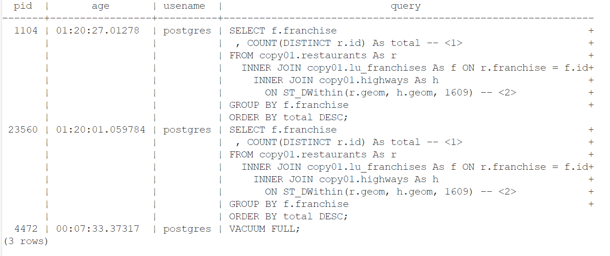

写 ch01 代码的时候，写了一个空间查询，但是SQL里一直在运行，我以为没什么，然后有打了一次，还是在运行，最后没管了。

过了几个小时无意间打开 此电脑 看看内存还有多少。

卧槽了，C盘就TM只剩20G了，直接变红色，我第一反应是之前的空间查询占用了大量内存，后面终于找到在 **"C:\Program Files\PostgreSQL\16\data\base\pgsql_tmp"** 下，这个文件夹有80个G！！！

## 解决方法：

### 1. **Vacuum和Analyze数据库**：

由于频繁的`INSERT`、`UPDATE`、`DELETE`操作，PostgreSQL可能会产生“膨胀”问题，导致磁盘使用急剧增加。通过执行`VACUUM`和`ANALYZE`，可以释放未使用的空间并优化查询性能：

```sql
VACUUM FULL;
ANALYZE;
```

- **VACUUM FULL**：这个命令会重写整个表，并回收已删除或更新的记录占用的空间。**注意**：这个操作会锁住表，所以在高并发的生产环境下谨慎使用。
- **ANALYZE**：更新统计信息，帮助优化查询计划。

### 2. **终止长时间运行的查询**：

有可能某些复杂查询仍在运行并持续生成临时文件。你可以通过以下SQL语句查找和终止正在运行的查询：

```sql
SELECT pid, age(clock_timestamp(), query_start), usename, query
FROM pg_stat_activity
WHERE state != 'idle' AND query NOT ILIKE '%pg_stat_activity%'
ORDER BY query_start;
```

如我所料，之前的空间查询还在运行



找到长时间运行的查询后，使用以下命令终止它们：

```sql
SELECT pg_terminate_backend(pid);
```

