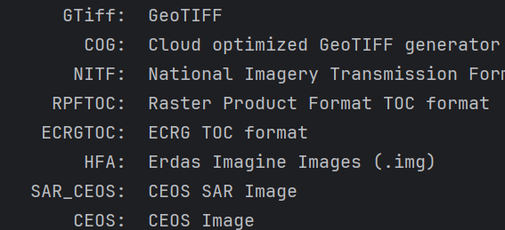
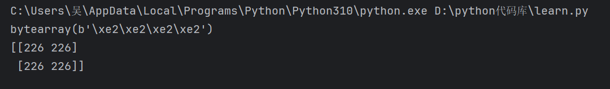

GDAL（Geospatial Data Abstraction Library）是一个用于处理地理空间数据的开源库，它支持读取、写入和转换各种格式的地理空间数据。

## 驱动

GDAL中的“驱动”（Driver）是负责处理特定数据格式的模块。

**驱动的作用**

驱动是GDAL与不同文件格式或数据源之间的**接口**。**每种格式都有对应的驱动程序**，GDAL通过这些驱动程序来读写特定格式的数据。例如，GDAL可以读取GeoTIFF、Shapefile、JPEG、PNG等格式的数据文件，而这些格式的支持都是通过相应的驱动实现的。

**驱动的类型**

- **栅格驱动**：处理栅格数据，如卫星影像、数字高程模型等。常见的栅格格式包括GeoTIFF、JPEG、PNG等。
- **矢量驱动**：处理矢量数据，如点、线、面等地理要素。常见的矢量格式包括Shapefile、GeoJSON、KML等。

**查看可用驱动**

使用 `gdal.GetDriverCount()` 可以获取GDAL支持的驱动数量，使用 `gdal.GetDriver(idx)` 可以获取每个驱动的详细信息，包括它的名称和描述。

**示例**

```python
from osgeo import gdal

driver_count = gdal.GetDriverCount()
for idx in range(driver_count):
    driver = gdal.GetDriver(idx)
    print("%10s:  %s" % (driver.ShortName, driver.LongName))
```

这段代码会列出当前GDAL库中所有可用的驱动程序及其描述。

例如可以看出，GeoTIFF 的名称是 GTiff 。  



**但是一般情况下要避免使用gdal.GetDriver()这个函数来获取驱动**

而是使用 `GetDriverByName` 例如： **driver = gdal.GetDriverByName('GeoTiff')**

------


## 影像的元数据

```python
from osgeo import gdal
gdal.UseExceptions()
# 打开GeoTIFF文件
dataset = gdal.Open("D:/NE1_LR_LC/NE1_LR_LC.tif")
```

- `dataset.GetDescription()` 获得栅格的描述信息
- `dataset.RasterCount` 获得栅格数据集的波段数
- `dataset.RasterXSize` 栅格数据的宽度(X方向上的像素个数)
- `dataset.RasterYSize` 栅格数据的高度(Y方向上的像素个数)
- `dataset.GetGeoTransform()` 栅格数据的六参数。
- `GetProjection()` 栅格数据的投影
- `dataset.RasterXSize`  影像以像元为单位的宽度
- `dataset.RasterYSize`  影像以像元为单位的高度

**获取数据集的波段**

`GetRasterBand()` 函数，可以获得栅格数据集的波段。这是函数的参数使用波段的索引值。

> 注意，索引值从1开始

**波段操作**

```python
from osgeo import gdal
gdal.UseExceptions()
# 打开GeoTIFF文件
dataset = gdal.Open("D:/NE1_LR_LC/NE1_LR_LC.tif")
# 波段操作
band1 = dataset.GetRasterBand(1) #注意！这里的波段获取和一般编程语言中数组下标的索引方式不一样，开始是 1 不是 0 

band1_XSize = band1.XSize #宽（像元为单位）

band1_YSize = band1.YSize #高（像元为单位）

band1_DataType = band1.DataType # DataType 是图像中实际数值的数据类型，表示 8 位无符整型。

band1_MinMax = band1.ComputeRasterMinMax() # 计算波段的最小值和最大值
```

## 读取栅格数据

GDAL提供了下面两个函数来访问影像的数值。

- `ReadRaster()` 读取图像数据（以二进制的形式返回）
- `ReadAsArray()` 读取图像数据（以数组的形式返回）

**参数及其含义（ReadRaster和ReadAsArray基本相同）：**

ReadRaster(xoff=0, yoff=0, xsize=None, ysize=None, buf_xsize=None, buf_ysize=None, buf_type=None, buf_pixel_space=None, buf_line_space=None, resample_alg=0, callback=None, callback_data=None, buf_obj=None) method of osgeo.gdal.Band instance

ReadAsArray(xoff=0, yoff=0, win_xsize=None, win_ysize=None, buf_xsize=None, buf_ysize=None, buf_type=None, buf_obj=None, resample_alg=0, callback=None, callback_data=None) method of osgeo.gdal.Band instance
    Reading a chunk of a GDAL band into a numpy array. The optional (buf_xsize,buf_ysize,buf_type)
    parameters should generally not be specified if buf_obj is specified. The array is returned

1. **xoff (int)**:
   - X方向上的偏移量，表示从栅格的哪个位置开始读取。
   - 单位是像素，默认值为0，即从图像的最左边开始。
2. **yoff (int)**:
   - Y方向上的偏移量，表示从栅格的哪个位置开始读取。
   - 单位是像素，默认值为0，即从图像的最上边开始。
3. **xsize (int)**:
   - 要读取的栅格数据的宽度（X方向）。
   - 单位是像素。如果为 `None`，则读取到图像的右边缘。
4. **ysize (int)**:
   - 要读取的栅格数据的高度（Y方向）。
   - 单位是像素。如果为 `None`，则读取到图像的下边缘。
5. **buf_xsize (int)**:
   - 输出缓冲区的宽度（X方向）。
   - 单位是像素。如果指定，该值决定了将读取的数据缩放到多大的宽度。
6. **buf_ysize (int)**:
   - 输出缓冲区的高度（Y方向）。
   - 单位是像素。如果指定，该值决定了将读取的数据缩放到多大的高度。
7. **buf_type**:
   - 指定输出数据的像素类型（数据类型）。
   - 例如，`gdal.GDT_Byte` 表示 8 位无符号整数。如果为 `None`，则使用栅格波段的原始数据类型。
8. **buf_pixel_space (int)**:
   - 输出缓冲区中像素之间的字节距离。
   - 通常用于调整输出数组在内存中的布局。
9. **buf_line_space (int)**:
   - 输出缓冲区中行之间的字节距离。
   - 这个参数允许你在内存中指定行与行之间的偏移。
10. **resample_alg (int)**:
    - 重采样算法，用于当输出缓冲区的大小与输入大小不同时如何调整。
    - 例如，`gdal.GRIORA_NearestNeighbour` 表示最近邻算法（默认值为 0）。其他选项包括双线性、立方卷积等。
11. **callback**:
    - 读取进度的回调函数。通常在处理大文件时使用，用于报告进度。
12. **callback_data**:
    - 传递给 `callback` 的用户自定义数据。
13. **buf_obj**:
    - 目标缓冲区对象。你可以将读取的数据写入到一个现有的缓冲区或数组中，而不是创建新的缓冲区。
    - 这个参数通常与 `numpy` 或其他内存视图对象一起使用。

示例：

```python
from osgeo import gdal
gdal.UseExceptions()
# 打开GeoTIFF文件
dataset = gdal.Open("D:/NE1_LR_LC/NE1_LR_LC.tif")
# 波段操作
band1 = dataset.GetRasterBand(1)
dataTwo = band1.ReadRaster(1000,1000,2,2)
dataArray = band1.ReadAsArray(1000,1000,2,2)
print(dataTwo)
print(dataArray)
```

结果：

------


## 裁剪区域

**使用 gdal_translate 进行裁剪**

`gdal_translate` 是 GDAL 提供的工具，用于裁剪影像文件。你可以在 Python 中使用 `gdal.Translate` 来裁剪影像。

**基本语法**

```python
from osgeo import gdal

output_dataset = gdal.Translate(destName, srcDataset, **options)
```

- `destName`: 输出文件的名称。
- `srcDataset`: 输入数据集（可以是文件路径或已打开的 GDAL 数据集对象）。
- `options`: 其他可选参数，用于控制转换和处理行为。

**常用选项**

1. **format**: 指定输出文件的格式。

   ```python
   options = gdal.TranslateOptions(format='GTiff')  # 输出为 GeoTIFF 格式
   ```

2. **outputSRS**: 指定输出文件的空间参考系统（坐标系）。

   ```python
   options = gdal.TranslateOptions(outputSRS='EPSG:4326')  # 输出为 WGS84 坐标系
   ```

3. **projWin**: 使用边界框提取指定区域的数据（通过指定左上角和右下角的坐标）。

   具体取决于你的影像，如果是UTM投影，单位是m，难么左上角的坐标就是UTM投影坐标

   ```python
   options = gdal.TranslateOptions(projWin=[ulx, uly, lrx, lry])
   ```

4. **bandList**: 指定输出文件中包含的波段。

   ```python
   options = gdal.TranslateOptions(bandList=[1, 2, 3])  # 只保留前3个波段
   ```

5. **noData**: 设置无数据值。

   ```python
   options = gdal.TranslateOptions(noData=0)  # 将 0 设为无数据值
   ```

6. **scaleParams**: 用于线性缩放波段值。

   ```python
   options = gdal.TranslateOptions(scaleParams=[[0, 255, 0, 1]])  # 线性缩放到[0, 1]
   ```

7. **creationOptions**: 控制创建输出文件时的一些格式特定选项。

   ```python
   options = gdal.TranslateOptions(creationOptions=['COMPRESS=LZW'])  # 使用LZW压缩
   ```

**示例代码**

```python
from osgeo import gdal

input_file = 'input.tif'
output_file = 'output.tif'

# 配置转换选项
options = gdal.TranslateOptions(
    format='GTiff',
    outputSRS='EPSG:4326',
    projWin=[440720, 3751320, 441920, 3750120],
    bandList=[1, 2, 3],
    noData=0,
    creationOptions=['COMPRESS=LZW']
)

# 执行转换
gdal.Translate(output_file, input_file, options=options)
```


