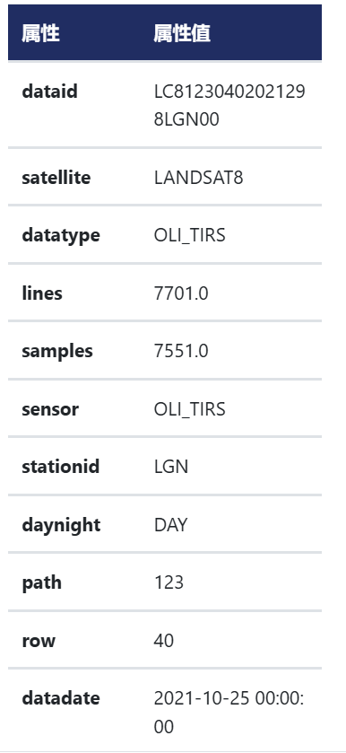
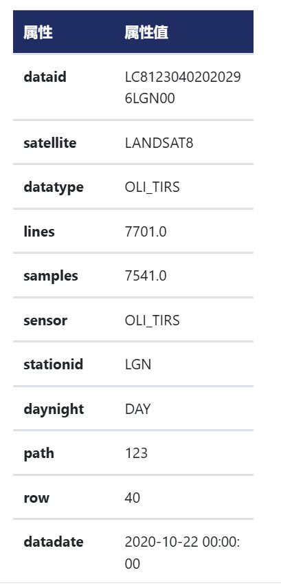

# 使用GDAL简单处理影像

**项目规划与目标设定**

- **目标**：分析特定区域在不同时间点的土地利用变化。确定分析的区域和时间范围。
- **数据准备**：收集和准备多年的卫星影像数据。确保数据具有相同的分辨率和坐标系统，以便进行对比。

## **数据准备**

- **获取数据**：从公共数据源（如 NASA Earthdata、USGS Earth Explorer、Copernicus Open Access Hub）下载所需的卫星影像数据。

  我是从[地理空间数据云 (gscloud.cn)](https://www.gscloud.cn/home) 下载的Landsat 8 OLI 数据，一开始是想下载多个年份的，但是发现一年的数据就有900mb，所以就下载了21和20年的

  

  ​


## **数据预处理**

### **裁剪：**

Landsat下载的区域远远大于长沙市，所以我们先裁剪区域

**确定裁剪区域**

你需要确定要裁剪的区域，通常以四个坐标点（左上角和右下角的经纬度或投影坐标）来定义。

**使用 gdal_translate 进行裁剪**

`gdal_translate` 是 GDAL 提供的工具，用于裁剪影像文件。你可以在 Python 中使用 `gdal.Translate` 来裁剪影像。

**示例代码**：

```python
from osgeo import gdal
import os

gdal.UseExceptions()

# 设置输入文件路径模板和输出文件路径模板
input_file_template = "D:/LC81230402020296LGN00/LC08_L1TP_123040_20201022_20201105_01_T1_B{}.TIF"
output_file_template = "D:/LC81230402020296LGN00/ChangSha_20201022_B{}.TIF"

# 设置裁剪区域的坐标（左上角和右下角的投影坐标）
ulx, uly = 674372, 3138298  # 左上角
lrx, lry = 718611, 3108877  # 右下角

# 循环裁剪每个波段
for band in range(1, 12):
    # 构造输入和输出文件路径
    input_file = input_file_template.format(band)
    output_file = output_file_template.format(band)

    # 检查文件是否存在
    if not os.path.exists(input_file):
        print(f"文件 {input_file} 不存在，跳过。")
        continue

    # 打开影像文件
    dataset = gdal.Open(input_file)

    if dataset is None:
        print(f"无法打开文件 {input_file}，跳过。")
        continue

    # 裁剪影像
    gdal.Translate(output_file, dataset, projWin=[ulx, uly, lrx, lry])

    # 关闭影像文件
    dataset = None

    print(f"波段 {band} 的影像裁剪完成并保存为 {output_file}")

print("所有波段裁剪完成。")

```

在这个示例中，`projWin` 参数定义了裁剪窗口的范围，分别表示左上角和右下角的坐标。**坐标可以是经纬度（WGS84）或图像的投影坐标**，取决于你使用的影像投影系统。

从影像的元信息我们可以得知影像是UTM投影坐标系，单位是m，使用 Arcgis 打开，裁剪长沙市大致区域，得知左上角和右上角的坐标。这一步你可以自由选择怎么操作

------


### **辐射校正和大气校正：**

使用 Py6S 进行辐射校正和大气校正可以确保从卫星影像中获得更准确的地表反射率。下面是如何使用 Py6S 进行这两个步骤的详细流程。

**注意！！！Py6S不只是pip个包就行了，具体的去搜，需要下载其他东西，我的是按这个来的[Py6s模块配置过程（Windows,亲测可用）_py6s的安装-CSDN博客](https://blog.csdn.net/qq_38107818/article/details/131768845)**

**注意！！！，Py6S保存的结果没有坐标系！！！，下面的结果输出需要改动一下，我没改了，因为做到最后一步才发现输出的结果没有坐标系，但是之前的数据已经删了**

前提条件

- 你已经下载并安装了 Py6S 和 GDAL。
- 你有 Landsat 8 OLI 数据，并且已经解压缩了影像和元数据文件。

**步骤 1：辐射校正**

目的：将原始 DN 值转换为辐射度或表观反射率。

1. **读取影像的元数据文件**（通常以 `.MTL.txt` 结尾），提取辐射校正的相关参数。
2. **计算辐射度**：使用辐射校正的乘数和加数，将 DN 值转换为辐射度。
3. **计算表观反射率**：辐射度转换为表观反射率，考虑到太阳高度角等因素。

**示例代码**：

```python
from osgeo import gdal
import numpy as np

# 打开影像文件
dataset = gdal.Open("LC08_L1TP_123032_20200815_B4.TIF")
band = dataset.GetRasterBand(1)
DN = band.ReadAsArray()

# 读取元数据中的辐射校正参数（在元数据文件中可以找到）
# 假设 radiance_mult 和 radiance_add 是从元数据提取的辐射校正乘数和加数
radiance_mult = 0.00002  # 示例值，请使用真实数据
radiance_add = 0.1       # 示例值，请使用真实数据

# 计算辐射度
radiance = DN * radiance_mult + radiance_add

# 计算表观反射率
sun_elevation = 45  # 从元数据中获取太阳高度角（度）
reflectance = (radiance * np.pi) / (np.cos(np.radians(90 - sun_elevation)) * 1957)  # 1957是太阳辐射常数的示例值
```

**步骤 2：大气校正**

目的：消除大气影响，将表观反射率转换为地表反射率。

1. **配置 Py6S 模型**：设置大气条件、太阳角度、传感器角度等参数。
2. **运行 Py6S 模型**：计算大气校正系数。
3. **应用校正**：使用 Py6S 的输出将辐射校正后的表观反射率转换为地表反射率。

在使用 Py6S 进行大气校正时，你需要设置一系列参数，其中一些参数可以直接从 Landsat 8 影像的元数据中提取，另一些则需要你根据具体的分析场景和目标选择或假设。下面是你需要获取或设置的数据和对应的说明：

**大气模式 (AtmosProfile)**

- **选择**：根据研究区域的气候条件选择适当的大气模式。例如：`MidlatitudeSummer`（中纬度夏季）、`MidlatitudeWinter`（中纬度冬季）、`Tropical`（热带）、`SubarcticSummer`（亚北极夏季）等。

**气溶胶模式 (AeroProfile)**

- **选择**：根据研究区域的气溶胶类型选择适当的模式，例如：`Continental`（大陆）、`Maritime`（海洋）、`Urban`（城市）、`Desert`（沙漠）等。

**太阳角度 (Solar Zenith and Azimuth Angles)**

- 太阳天顶角 (s.geometry.solar_z)
  - **获取**：从 Landsat 8 影像的元数据文件 (`MTL.txt`) 中的 `SUN_ELEVATION` 计算得出。
  - **计算**：`solar_z = 90° - SUN_ELEVATION`。
- 太阳方位角 (s.geometry.solar_a)
  - **获取**：从元数据文件 (`MTL.txt`) 中直接提取 `SUN_AZIMUTH`。

**传感器角度 (View Zenith and Azimuth Angles)**

- 传感器天顶角 (s.geometry.view_z)
  - **设置**：通常设置为 `0` 度（即传感器垂直向下观察地表），因为 Landsat 8 的默认观测角度是 nadir（正下方）。
- 传感器方位角 (s.geometry.view_a)
  - **设置**：通常设置为 `0` 度，除非有特定的观测角度需求。

**地面反射率 (Ground Reflectance)**

- **选择**：根据地物类型选择合适的反射率模型。例如：`HomogeneousOcean(0.03)` 表示假设地面为均匀的海洋表面，反射率为 0.03。
- **获取**：地面反射率可以基于现场测量数据或参考文献中的典型值进行设定。如果没有具体数据，使用经验值或默认值。

**大气校正系数 (Atmospheric Correction Coefficient)**

- **获取**：你需要运行 Py6S 模型来获取这些系数。模型运行后会输出一系列校正参数，包括总散射透过率（`transmittance_total_scattering`），你可以使用这些参数进行后续的反射率校正。

**影像反射率 (Reflectance)**

- **获取**：从 Landsat 8 数据中计算得到。Landsat 8 的反射率计算公式通常涉及到 `REFLECTANCE_MULT_BAND_X` 和 `REFLECTANCE_ADD_BAND_X` 参数。

**其他参数**

- **地表高度 (Altitude)**：如果研究区域地形起伏较大，可以考虑设置地表高度（默认为海平面）。
- **气溶胶光学厚度 (Aerosol Optical Thickness)**：可以根据具体的大气条件调整这个参数，但通常使用 Py6S 的默认值。

**示例代码**：

```python
from Py6S import *

# 初始化 6S 模型
s = SixS()

# 设置大气模式（例如：Midlatitude Summer）
s.atmos_profile = AtmosProfile.PredefinedType(AtmosProfile.MidlatitudeSummer)

# 设置气溶胶模式（例如：Continental）
s.aero_profile = AeroProfile.PredefinedType(AeroProfile.Continental)

# 设置太阳角度（从元数据文件中提取）
s.geometry.solar_z = 45  # 太阳天顶角（例子）
s.geometry.solar_a = 135 # 太阳方位角（例子）

# 设置传感器角度（通常为0度）
s.geometry.view_z = 0
s.geometry.view_a = 0

# 设置地面反射率（例如：均匀反射）
s.ground_reflectance = GroundReflectance.HomogeneousOcean(0.03)

# 运行模型
s.run()

# 获取大气校正系数
transmittance = s.outputs.transmittance_total_scattering.total
reflectance_corrected = reflectance / transmittance
```

**步骤 3：保存校正后的影像**

将校正后的地表反射率影像保存为新的 GeoTIFF 文件，以便后续分析。

```python
# 使用 GDAL 保存校正后的影像
driver = gdal.GetDriverByName("GTiff")
out_dataset = driver.Create("output_corrected.tif", dataset.RasterXSize, dataset.RasterYSize, 1, gdal.GDT_Float32)
out_band = out_dataset.GetRasterBand(1)
out_band.WriteArray(reflectance_corrected)
out_band.SetNoDataValue(-9999)
out_dataset.FlushCache()
```

**注意！！！，保存的结果没有坐标系！！！**

由于我做到这一步已经把之前的数据删除了，只能用下面的方法

**示例：**

```python
from osgeo import gdal
gdal.UseExceptions()

input_file_temp = "C:\\Users\吴\Desktop\项目制学习\土地利用变化\影像数据\ChangSha_20211025_Landsat8 OLI\ChangSha_20211025_B{}_output_corrected.tif"
for band in range(1,12):

    input_file = input_file_temp.format(band)
    # 打开裁剪后的影像
    dataset = gdal.Open(input_file,gdal.GA_Update)

    # 假设裁剪后的影像尺寸
    width = dataset.RasterXSize  # 影像宽度（像素数）
    height = dataset.RasterYSize  # 影像高度（像素数）

    # 裁剪后的左上角坐标
    ulx = 674372
    uly = 3138298

    # 裁剪后的右下角坐标
    lrx = 718611  # 右下角 X 坐标
    lry = 3108877  # 右下角 Y 坐标

    # 计算像素分辨率
    x_pixel_resolution = (lrx - ulx) / width
    y_pixel_resolution = (uly - lry) / height

    # 设置地理变换矩阵
    geotransform = [ulx, x_pixel_resolution, 0, uly, 0, -y_pixel_resolution]
    dataset.SetGeoTransform(geotransform)

    # 设置投影信息
    dataset.SetProjection('EPSG:32649')  # WGS84, UTM Zone 49N

    # 保存并关闭影像
    dataset.FlushCache()
    dataset = None

```

------

## 去云：

```python
import numpy as np
from osgeo import gdal
gdal.UseExceptions()

# 打开654三个波段的单独文件
band6_ds = gdal.Open(r"C:\Users\吴\Desktop\小项目学习方式\土地利用变化\影像数据\ChangSha_20211025_Landsat8 OLI\ChangSha_20211025_B6_output_corrected.tif")
band5_ds = gdal.Open(r"C:\Users\吴\Desktop\小项目学习方式\土地利用变化\影像数据\ChangSha_20211025_Landsat8 OLI\ChangSha_20211025_B5_output_corrected.tif")
band4_ds = gdal.Open(r"C:\Users\吴\Desktop\小项目学习方式\土地利用变化\影像数据\ChangSha_20211025_Landsat8 OLI\ChangSha_20211025_B4_output_corrected.tif")
bqa_ds = gdal.Open(r"C:\Users\吴\Desktop\小项目学习方式\土地利用变化\影像数据\ChangSha_20211025_Landsat8 OLI\ChangSha_20211025_BQA.TIF")  # 打开BQA波段

# 读取每个波段的数据
band6 = band6_ds.GetRasterBand(1).ReadAsArray()
band5 = band5_ds.GetRasterBand(1).ReadAsArray()
band4 = band4_ds.GetRasterBand(1).ReadAsArray()
bqa = bqa_ds.GetRasterBand(1).ReadAsArray()  # 读取BQA波段数据

# 根据BQA波段创建云掩膜
cloud_mask = (bqa & (1 << 4)) != 0  # 检查第4位是否为1（云）

# 如果需要高置信度的云和云影区域，可以添加以下掩膜
cloud_confidence_mask = (bqa & (3 << 5)) == (3 << 5)  # 检查第5-6位是否为11（高置信度）
cloud_shadow_confidence_mask = (bqa & (3 << 7)) == (3 << 7)  # 检查第7-8位是否为11（高置信度）

# 最终的云掩膜，结合了云和高置信度的云、云影区域
final_cloud_mask = cloud_mask | cloud_confidence_mask | cloud_shadow_confidence_mask

# 将云区域替换为NoData值或插值值
# 使用 -9999 作为 NoData 值
band6[final_cloud_mask] = -9999
band5[final_cloud_mask] = -9999
band4[final_cloud_mask] = -9999

# 创建输出文件，将654三个波段合成为一个文件
driver = gdal.GetDriverByName('GTiff')
out_dataset = driver.Create(r"C:\Users\吴\Desktop\小项目学习方式\土地利用变化\影像数据\ChangSha_20211025_Landsat8 OLI\RemoveCloud.TIF", band6_ds.RasterXSize, band6_ds.RasterYSize, 3, gdal.GDT_Float32)

# 设置地理转换和投影信息
out_dataset.SetGeoTransform(band6_ds.GetGeoTransform())
out_dataset.SetProjection(band6_ds.GetProjection())

# 写入波段数据
out_dataset.GetRasterBand(1).WriteArray(band6)  # 写入波段6
out_dataset.GetRasterBand(2).WriteArray(band5)  # 写入波段5
out_dataset.GetRasterBand(3).WriteArray(band4)  # 写入波段4

# 设置NoData值
out_dataset.GetRasterBand(1).SetNoDataValue(-9999)
out_dataset.GetRasterBand(2).SetNoDataValue(-9999)
out_dataset.GetRasterBand(3).SetNoDataValue(-9999)

# 保存并关闭文件
out_dataset.FlushCache()
out_dataset = None  # 关闭文件

```


**数据分类**

- **选择分类方法**：决定使用监督分类（需要已有的标注数据）或非监督分类（如 K-means 聚类）的方法进行数据分类。
- **实施分类**：将影像数据分类为不同的土地利用类型（如森林、城市、农业用地等）。分类结果将生成标识不同土地利用类型的栅格数据。

**变化检测**

- **计算变化**：对比不同时间点的分类结果，识别和计算土地利用类型的变化。识别从一个土地利用类型转换到另一个类型的区域。
- **生成变化图**：创建显示变化区域的图像，以便清楚地展示土地利用的变化情况。

**统计分析与报告**

- **生成统计报告**：计算不同土地利用类型的变化量，例如新增建设用地、减少的森林面积等。总结变化的面积、比例等指标。
- **撰写报告**：撰写详细的分析报告，汇总项目的背景、数据处理过程、结果分析和可视化图表。报告应包括图表和地图，清晰展示土地利用变化的结果。

**可视化与分享**

- **生成地图**：创建可视化地图展示土地利用变化的结果，帮助理解数据并支持决策。
- **分享成果**：将项目成果与他人分享，可以将结果发布到 GitHub、撰写博客文章或制作教程，帮助其他人了解和利用你的分析结果。

**反思与改进**

- **项目总结**：总结项目中的经验教训，评估哪些方法有效，哪些地方需要改进。
- **探索新方法**：在完成当前项目后，尝试新的方法或工具，以进一步提升分析能力和处理效率。