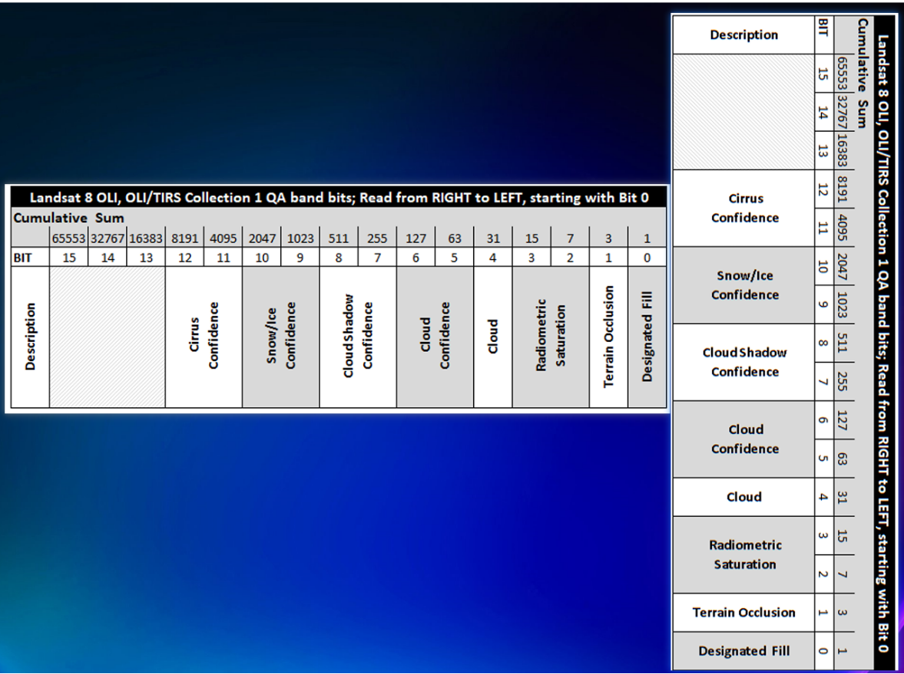

# Landsat 8 去云操作详细介绍

Landsat 8 提供了BQA波段，BQA波段是影像质量波段，包含了云层，雪，冰等的信息。接下来我将讲解运用BQA波段去云操作。

下面是**官方用户手册**的介绍：

BQA波段包含了从影像数据中收集的质量统计信息以及场景的云掩膜信息。BQA文件是一个16位图像，与标准的L1T场景具有相同的尺寸。每个位用于区分在系统校正（Level 1Gs）处理阶段后的某些可辨识伪影。第一个位（位0）是最低有效位。正确使用BQA位可以提高科学研究的完整性，帮助识别哪些像素可能受到仪器伪影或云污染的影响。例如，如果在包含云的像素上计算归一化植被指数（NDVI），结果可能会显示异常值，这会导致错误的季节性植被生长特征分析结果。

对于严格的科学应用，QA位是初步指示某些条件的有用工具。然而，用户应注意，该文件包含的信息容易被误解，不建议一般使用。处理BQA波段需要能处理16位数据的图像处理软件。

BQA波段的像素值需要转换为16位二进制形式以有效使用。位0、1和4的单个位表示特定条件是否存在；辐射饱和度位（位2-3）表示有多少波段达到饱和；双个位（位5-6、7-8、9-10、11-12）表示条件存在的置信水平。

某些值定期出现，可以在不解包为16位字符串的情况下进行解释。用户可以使用USGS提供的免费工具提取BQA波段中的位压缩信息，以便于解释。

工具下载链接：[Landsat Quality Assessment Tools](https://www.usgs.gov/land-resources/nli/landsat/landsat-quality-assessment-tools)



BQA每个像素是16位，根据图标，可以这样理解：

0     0     00     0     00     00     00     00     000    （16位进制）

第1个0（Designated Fill）代表是不是有效，如果值是1，说明这个像素点有问题，例如被云覆盖

第2个0（Terrain Occlusion）表示由于地形遮挡（如山脉或其他地形特征的阴影）导致传感器无法获取到地面信息的像素，0代表有效，无遮挡

第3，4个0 （Radiometric Saturation，辐射饱和度）表示传感器在拍摄影像时某些像素达到了其辐射测量能力的上限，导致这些像素值无法准确反映真实的地表反射率。这种情况通常发生在非常亮的物体（如雪、沙漠或强反射的建筑物）或者光线条件特别强烈的时候。**00**：没有波段饱和，**01**：1-2 个波段饱和，**10**：3-4 个波段饱和，**11**：5 个或更多波段饱和。这些值告诉我们在同一像素上有多少波段的辐射值已达到饱和。饱和的波段在后续处理时可能不准确，应该小心对待

第5个0 （Cloud），顾名思义，1代表此处有云，0代表无云

第6，7个0，代表云的置信度，即可能性，**00**是不确定，**01**代表低（Low，0-33%），**10**代表中等（Medium，34-66%），**11**代表高（High，67-100%）

后面的同理，最后的**"Cirrus Confidence"** 是用于表示卷云（Cirrus clouds）存在的置信度


知道原理后，我们去云主要有两种方式：

## 一、使用官方提供的工具箱

解压后，由于我的是Windows，所以用的是对应的版本

首先打开cmd，然后cd进入到对应的文件夹里

### 使用 unpack_oli_qa.exe 工具

#### 1. **基本命令格式**

```bash
unpack_oli_qa --ifile=input_QA_filename --ofile=output_unpacked_QA_filename [options]
```

#### 2. **参数说明**

- `--ifile`: 输入的QA文件（GeoTIFF格式）。
- `--ofile`: 输出文件的基本名称（如果不合并QA位）或完整文件名（如果合并QA位）。
- `--combine`: 指定将所有QA位合并到一个输出文件中（默认为不合并）。

#### 3. **可选参数**

- `--all`: 输出所有质量位（使用指定的置信度级别）。
- `--fill`: 输出填充值位。
- `--drop_frame`: 输出丢帧位。
- `--terrain_occl`: 输出地形遮挡位。
- `--water=conf_level`: 输出水体置信度，`conf_level` 为 'low'、'med' 或 'high'。
- `--cloud_shadow=conf_level`: 输出云阴影置信度。
- `--veg=conf_level`: 输出植被置信度。
- `--snow_ice=conf_level`: 输出雪/冰置信度。
- `--cirrus=conf_level`: 输出卷云置信度。
- `--cloud=conf_level`: 输出云置信度。

#### 4. **示例命令**

1. **解压所有QA位到单独的文件**

   ```bash
   unpack_oli_qa --ifile=example_BQA.TIF --ofile=example_output --all
   ```

   这个命令将解压所有的QA位到多个单独的文件中，使用默认的中等置信度（`med`）。

2. **解压特定的QA位，设置置信度**

   ```bash
   unpack_oli_qa --ifile=example_BQA.TIF --ofile=example_output --fill --water=high --veg=low --snow_ice --cloud=med
   ```

   这个命令将解压填充值、雪/冰、植被和云等质量字段，根据指定的置信度输出结果。

3. **合并QA位到一个单一的文件**

   ```bash
   unpack_oli_qa --ifile=example_BQA.TIF --ofile=example_combined_mask.tif --fill --cloud=high --cirrus=low --combine
   ```

   这个命令将解压填充值、云和卷云等质量字段，并将所有指定的QA位合并到一个文件中。

一般我们使用基本命令格式就行，结果会在文件架里得到多个质量位的单独文件，然后可以使用对应的设置掩膜

```python
from osgeo import gdal
import numpy as np

# 打开影像数据和QA位文件
image_ds = gdal.Open('path_to_your_image.tif')
cloud_mask_ds = gdal.Open('path_to_your_cloud_mask.tif')

# 读取数据
image = image_ds.GetRasterBand(1).ReadAsArray()
cloud_mask = cloud_mask_ds.GetRasterBand(1).ReadAsArray()

# 创建云掩膜（假设云区域标记为1）
cloud_mask = (cloud_mask == 1)

# 将云区域替换为NoData值
image[cloud_mask] = -9999

# 保存修改后的影像数据
driver = gdal.GetDriverByName('GTiff')
out_ds = driver.Create('path_to_your_cleaned_image.tif', image_ds.RasterXSize, image_ds.RasterYSize, 1, gdal.GDT_Float32)
out_ds.SetGeoTransform(image_ds.GetGeoTransform())
out_ds.SetProjection(image_ds.GetProjection())
out_ds.GetRasterBand(1).WriteArray(image)
out_ds.GetRasterBand(1).SetNoDataValue(-9999)
out_ds.FlushCache()
out_ds = None
```

## 二、使用按位的逻辑操作

### 原理：

`(bqa & (1 << 4))` 是位运算，用来检查或提取特定位的信息。

**操作分解**

1. **位移操作 1 << 4**:
   - `1` 是一个二进制数，表示为 `0000000000000001`。
   - `<<` 是位移运算符，它将 `1` 向左移动 4 位。
   - `1 << 4` 的结果是 `00000000000010000`（十进制的 `16`）。
2. **按位与运算 bqa & 16**:
   - `bqa` 是 BQA 波段的像素值，它是一个 16 位的无符号整数。
   - `&` 是按位与运算符，它会逐位比较两个数的二进制位：
     - 如果两个对应位都为 `1`，结果为 `1`；
     - 如果有任意一位为 `0`，结果为 `0`。
   - `bqa & 16` 会检查 `bqa` 的第 4 位是否为 `1`。


------


`(bqa & (3 << 5)) == (3 << 5)` 是一种位运算操作，通常用来检查特定位置的两位（或更多位）是否都满足某个条件。

**操作分解**

1. **位移操作 3 << 5**:
   - `3` 的二进制表示是 `0000000000000011`。
   - `<< 5` 是将 `3` 向左移动 5 位，结果是 `0000000000110000`，也就是十进制的 `48`。
2. **按位与运算 bqa & 48**:
   - `bqa` 是一个 16 位的无符号整数，表示某个像素的 BQA 值。
   - `&` 是按位与运算符，逐位比较 bqa 和 48 的二进制表示：
     - 如果 `bqa` 的第 5 和第 6 位都为 `1`，`bqa & 48` 的结果是 `48`；
     - 否则，结果为 `0` 或其他值。
3. **相等判断 == 48**:
   - 最后，结果会与 `48` 进行比较。
   - 如果 `bqa` 的第 5 和第 6 位都为 `1`，则 `(bqa & 48) == 48` 为 `True`，否则为 `False`。

```python
import numpy as np
from osgeo import gdal
gdal.UseExceptions()

# 打开654三个波段的单独文件
band6_ds = gdal.Open(r"C:\Users\吴\Desktop\小项目学习方式\土地利用变化\影像数据\ChangSha_20211025_Landsat8 OLI\ChangSha_20211025_B6_output_corrected.tif")
band5_ds = gdal.Open(r"C:\Users\吴\Desktop\小项目学习方式\土地利用变化\影像数据\ChangSha_20211025_Landsat8 OLI\ChangSha_20211025_B5_output_corrected.tif")
band4_ds = gdal.Open(r"C:\Users\吴\Desktop\小项目学习方式\土地利用变化\影像数据\ChangSha_20211025_Landsat8 OLI\ChangSha_20211025_B4_output_corrected.tif")
bqa_ds = gdal.Open(r"C:\Users\吴\Desktop\小项目学习方式\土地利用变化\影像数据\ChangSha_20211025_Landsat8 OLI\ChangSha_20211025_BQA.TIF")  # 打开BQA波段

# 读取每个波段的数据
band6 = band6_ds.GetRasterBand(1).ReadAsArray()
band5 = band5_ds.GetRasterBand(1).ReadAsArray()
band4 = band4_ds.GetRasterBand(1).ReadAsArray()
bqa = bqa_ds.GetRasterBand(1).ReadAsArray()  # 读取BQA波段数据

# 根据BQA波段创建云掩膜
cloud_mask = (bqa & (1 << 4)) != 0  # 检查第4位是否为1（云）

# 如果需要高置信度的云和云影区域，可以添加以下掩膜
cloud_confidence_mask = (bqa & (3 << 5)) == (3 << 5)  # 检查第5-6位是否为11（高置信度）
cloud_shadow_confidence_mask = (bqa & (3 << 7)) == (3 << 7)  # 检查第7-8位是否为11（高置信度）

# 最终的云掩膜，结合了云和高置信度的云、云影区域
final_cloud_mask = cloud_mask | cloud_confidence_mask | cloud_shadow_confidence_mask

# 将云区域替换为NoData值或插值值
# 使用 -9999 作为 NoData 值
band6[final_cloud_mask] = -9999
band5[final_cloud_mask] = -9999
band4[final_cloud_mask] = -9999

# 创建输出文件，将654三个波段合成为一个文件
driver = gdal.GetDriverByName('GTiff')
out_dataset = driver.Create(r"C:\Users\吴\Desktop\小项目学习方式\土地利用变化\影像数据\ChangSha_20211025_Landsat8 OLI\RemoveCloud.TIF", band6_ds.RasterXSize, band6_ds.RasterYSize, 3, gdal.GDT_Float32)

# 设置地理转换和投影信息
out_dataset.SetGeoTransform(band6_ds.GetGeoTransform())
out_dataset.SetProjection(band6_ds.GetProjection())

# 写入波段数据
out_dataset.GetRasterBand(1).WriteArray(band6)  # 写入波段6
out_dataset.GetRasterBand(2).WriteArray(band5)  # 写入波段5
out_dataset.GetRasterBand(3).WriteArray(band4)  # 写入波段4

# 设置NoData值
out_dataset.GetRasterBand(1).SetNoDataValue(-9999)
out_dataset.GetRasterBand(2).SetNoDataValue(-9999)
out_dataset.GetRasterBand(3).SetNoDataValue(-9999)

# 保存并关闭文件
out_dataset.FlushCache()
out_dataset = None  # 关闭文件
```


## 最后

最后得到的去云结果，云区域是黑色的，我们无法得知云层下面的真实地物情况，这是目前技术无法实现的。只能通过把云区设置成无效值，排除干扰，但无法解决。

有人会问为什么GEE能够去云然后得到云层下面的实际地物，因为原理不一样

Google Earth Engine (GEE) 之所以能够在去云后得到云层下面的真实数据，是因为它利用了多时相数据的能力。GEE 并不是从单一影像中直接恢复被云遮挡的区域，而是通过以下几个关键技术手段来实现的：

1. **多时相数据合成（Multi-temporal Data Composite）**：

GEE 有大量的遥感数据存储库，包括来自 Landsat、Sentinel 等卫星的多时相影像。通过合成不同时间的影像，GEE 可以选择无云或少云时刻的影像来替换有云区域，从而“重建”云层下的地物。

2. **面向像素的最佳可用像素选择（Best Pixel Selection）**：

GEE 使用像素级别的筛选方法，如“质量掩码”（Quality Mask）和“最佳像素合成”（Best Pixel Composite），来自动选择云覆盖较少的像素。这些方法通过分析多个时相影像中的每个像素，选择最清晰的、无云的像素值用于合成最终影像。

3. **时空数据融合（Spatio-temporal Data Fusion）**：

通过将高空间分辨率的光学数据与低分辨率但时间分辨率更高的数据融合在一起，GEE 可以生成更连续的时空数据产品。这些技术使得在影像时间序列中，GEE 可以估算出云层下地物的反射信息。

4. **机器学习和统计方法**：

GEE 还可以结合机器学习方法，通过训练模型来预测和补全云覆盖区域的数据。这些方法利用多源数据和时序数据来推断云下的地物信息。

5. **数据集积木（Mosaic and Composite）**：

GEE 中的 `mosaic()` 和 `composite()` 方法可以将多个影像堆叠在一起，自动选择每个像素的最佳可用值。这样可以有效地去除云层对影像的干扰。

总之，GEE 的“去云”操作实际上是通过合成多个时相的影像来实现的，而不是从单一影像中恢复云层下的地物数据。这使得在最终合成的影像中，云层下的数据看起来就像是原始的真实数据。这个过程高度依赖于多时相数据和自动化的像素选择算法。