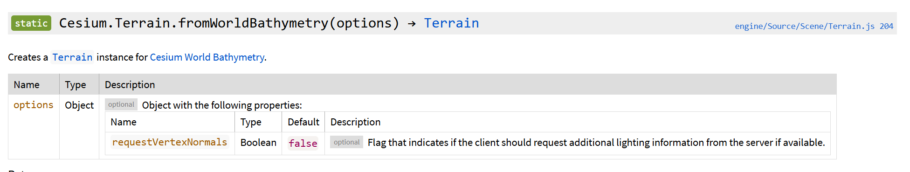
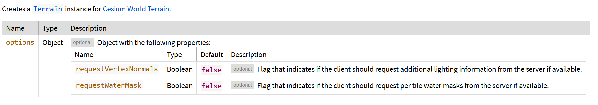
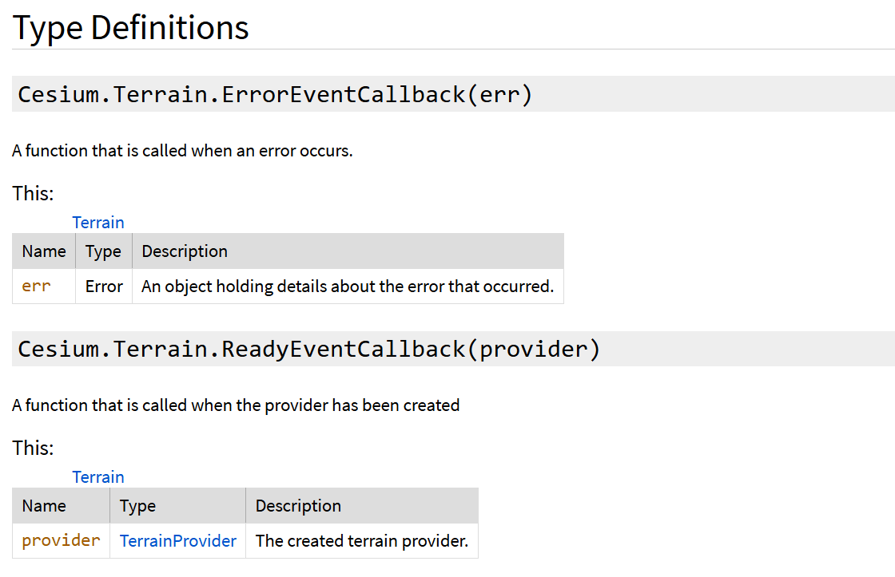
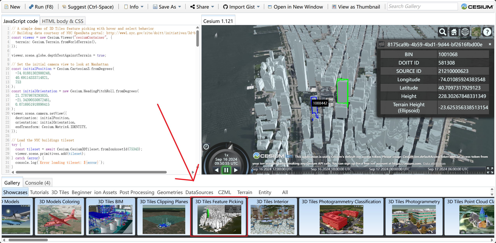
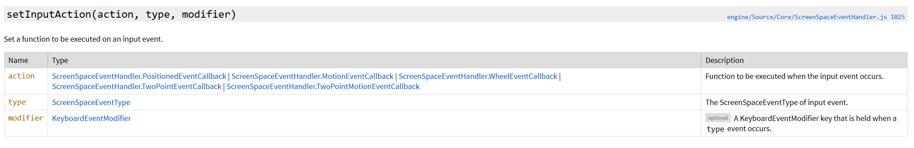
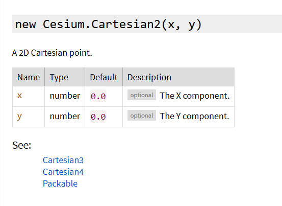
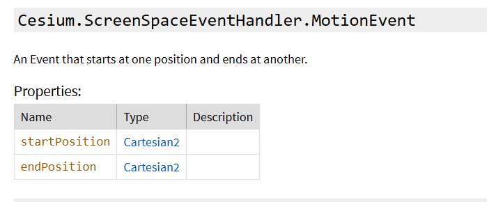
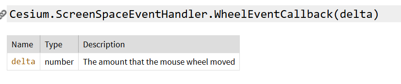
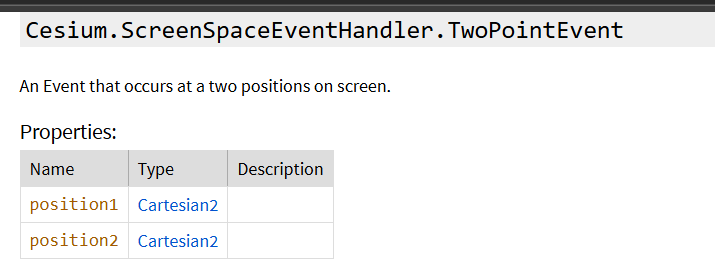
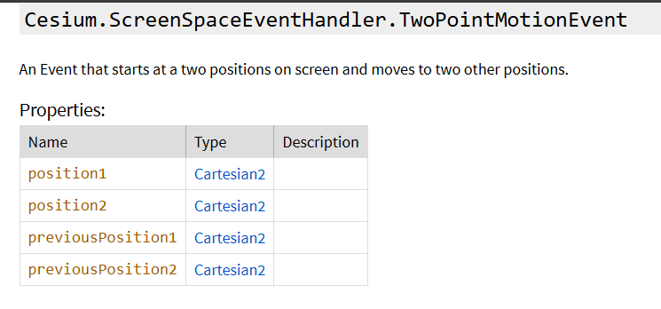

# 介绍

学校选修了一门三维建模，最后的考核是展示一个三维模型，我是在小组里是负责开发的。我的想法是我的其他队友先在 blender,3DMAX 等三维建模软件里先建立好三维模型，然后我就写一个静态网页来展示，核心是用 Cesium，因此本文档是用来记录我 Cesium  的 学习过程的。

Cesium 的学习很困难，**我只是学习怎么展示 3D 模型而已**，实现的功能**仅仅是展示模型，加一点点击事件**，其他的就不去学习了，学习过程也只是看官方的教程示例而已。

目录如下，教程代码的核心解读在第二部分

[TOC]


# 简单的教程：

起步是看这个网站的：[cesium中文网 | 学习cesiumjs 的好地方--伐罗密](http://cesium.xin/)

## 1.页面介绍和小控件隐藏：

默认加载 Cesium 的 viewer 是有默认控件的，我们可以在 viewer 实例化时设置 option 来隐藏这些小控件


```js
var viewer = new Cesium.Viewer('cesiumContainer', {
    // 禁用以下控件
    animation: false,        // 时间轴控件
    timeline: false,         // 时间线控件
    fullscreenButton: false, // 全屏按钮
    homeButton: false,       // 主页按钮
    sceneModePicker: false,  // 场景模式选择器
    baseLayerPicker: false,  // 图层选择器
    geocoder: false,         // 地址搜索
    navigationHelpButton: false, // 导航帮助按钮
    infoBox: false,          // 信息框
    selectionIndicator: false // 选择指示器
});
```

------


## 2.加载3D建筑

```js
<script type="module">
    // Your access token can be found at: https://ion.cesium.com/tokens.
    // This is the default access token from your ion account
    Cesium.Ion.defaultAccessToken = 'Token';

    // Keep your Cesium.Ion.defaultAccessToken = 'your_token_here' line above. 
    // STEP 2 CODE
    // Initialize the viewer with Cesium World Terrain.
    const viewer = new Cesium.Viewer('cesiumContainer', {
      terrain: Cesium.Terrain.fromWorldTerrain(),
    });

    // Fly the camera to Denver, Colorado at the given longitude, latitude, and height.
    viewer.camera.flyTo({
      destination: Cesium.Cartesian3.fromDegrees(-104.9965, 39.74248, 4000)
    });

    // Add Cesium OSM Buildings.
    const buildingsTileset = await Cesium.createOsmBuildingsAsync();
    viewer.scene.primitives.add(buildingsTileset);
  </script>
```

在加载 **Cesium OSM Buildings**（基于 OpenStreetMap 数据的全球 3D 建筑模型）之前，先加载地形数据（Terrain）是非常重要的，原因如下：

**确保建筑物与真实地形匹配**

- **地形提供了真实的高程数据**：地形数据包含了地球表面的高程信息，如山脉、丘陵和谷地。这些信息使得地球表面在 3D 场景中具有起伏，而不是一个平坦的平面。
- **建筑物需要贴合地表**：Cesium OSM Buildings 是按照真实世界的位置和高度进行建模的。为了使这些建筑物在 3D 场景中正确地位于地表之上，必须有正确的地形高程数据作为基础。
- **避免建筑物悬空或埋入地下**：如果不加载地形，地球表面将是一个平坦的平面（海拔为零）。这可能导致建筑物出现在错误的高度上，造成视觉上的悬空或嵌入地面的现象。

下面介绍 Terrain：

### Terrain：

**new Cesium.Terrain(terrainProviderPromise)**

成员：

- `readonly` errorEvent ：Event.(Terrain.ErrorEventCallback)   处理错误

- `readonly` provider ：TerrainProvider

- `readonly` ready ：boolean

- `readonly` readyEvent ：Event.(Terrain.ReadyEventCallback) 

  **Event.<Terrain.ErrorEventCallback>**：

  - `Event` 表示这个属性是一个事件对象，它包含某些行为，比如可以添加或删除事件监听器。
  - **Terrain.ErrorEventCallback** 表示事件的回调函数类型。这意味着，当 `errorEvent` 被触发时，回调函数的类型必须符合 `Terrain.ErrorEventCallback` 的定义。
  - 这通常会是一个函数，接受某些参数（如错误对象）并执行相应的操作。

方法：

- **`static` Cesium.Terrain.fromWorldBathymetry(options) → Terrain**

  

  `requestVertexNormals` 是 Cesium 地形服务中与地形数据相关的一个选项，它的作用是**请求地形的顶点法线（vertex normals）**，用于提高地形的渲染效果和光照表现。

  **顶点法线（Vertex Normals）**

  - **法线** 是指向物体表面上某点的垂直向量，通常用于计算光照效果。在 3D 渲染中，法线的方向会影响光照的强弱、阴影的投射等视觉效果。
  - **顶点法线** 是作用在网格顶点上的法线，通常用于平滑地形渲染，使光照效果更真实、自然。

  **`requestVertexNormals` 的作用**

  - **光照效果**：当你设置 `requestVertexNormals: true` 时，Cesium 将会请求地形的顶点法线数据，这样可以显著提高地形的光照效果。例如，山坡在不同光源方向下的阴影会更加细腻，地形的光影过渡也更加平滑自然。
  - **增强细节**：法线数据可以帮助 Cesium 更好地理解地形表面的细节，尤其是在有坡度变化、山脊和山谷的地区。顶点法线可以让这些地形细节在光照下显得更为突出和逼真。

  **返回一个 CesiumTerrainProvider 的异步辅助对象**。简单来说就是返回一个 Promise

  ​

- **`static` Cesium.Terrain.fromWorldTerrain(options) → Terrain**

  

  `requestWaterMask` 是 Cesium 地形服务中的一个选项，它的作用是**请求水体遮罩（Water Mask）** 数据，用于渲染地球表面的水体区域，例如海洋、湖泊、河流等。

  **水体遮罩（Water Mask）作用**

  - **水体的可视化**：水体遮罩提供了一种简单的方式来标记地形数据中的水体区域。这些区域通常会被渲染为具有反射、波动效果的水面，使海洋、湖泊、河流等地理要素在场景中显得更加真实。
  - **视觉效果增强**：开启 `requestWaterMask` 后，Cesium 会在水体区域添加动态水面效果，如波浪、反射等。这可以增强水体的真实感，尤其是在阳光和其他光源照射下，会呈现出逼真的水面反射效果。

  **使用场景**

  - **渲染海洋和湖泊**：当你希望在 Cesium 场景中显示更逼真的水体，例如海洋、湖泊和河流时，启用 `requestWaterMask` 是非常有用的。
  - **动态水面效果**：启用该选项后，Cesium 可以在水体区域生成动态水面，包括波动效果和光线反射，特别是在航海模拟、环境模拟等应用场景下非常有用。

  **返回一个 CesiumTerrainProvider 的异步辅助对象**。简单来说就是返回一个 Promise

类型定义：




**await Cesium.createOsmBuildingsAsync()**

- `await`: 用于等待一个异步操作的完成。在这里，它等待 `Cesium.createOsmBuildingsAsync()` 返回一个包含 OSM 建筑物的对象。
- `Cesium.createOsmBuildingsAsync()`: 这是一个异步函数，它会从 Cesium 的 OSM 数据源中加载全球的 3D 建筑物数据，并返回一个 `Cesium3DTileset` 对象。这个对象代表一个 3D 瓦片集，其中包含了实际的 3D 建筑物数据。

**viewer.scene.primitives.add(buildingsTileset)**

- `viewer.scene.primitives`: 这是 Cesium 中的一个集合，用于管理所有的 3D 原语（例如 3D 瓦片集、模型、点云等）。这些原语会被渲染到场景中。
- `.add(buildingsTileset)`: 这个方法将前面获取到的 `buildingsTileset` 对象（即 3D 建筑物数据）添加到场景中，使得这些建筑物在 Cesium 地图上显示出来。

------

## 3.显示GeoJson

```js
// STEP 3 CODE
async function addBuildingGeoJSON() {
  // Load the GeoJSON file from Cesium ion.
  const geoJSONURL = await Cesium.IonResource.fromAssetId(your_asset_id);
  // Create the geometry from the GeoJSON, and clamp it to the ground.
  const geoJSON = await Cesium.GeoJsonDataSource.load(geoJSONURL, { clampToGround: true });
  // Add it to the scene.
  const dataSource = await viewer.dataSources.add(geoJSON);
  // By default, polygons in CesiumJS will be draped over all 3D content in the scene.
  // Modify the polygons so that this draping only applies to the terrain, not 3D buildings.
  for (const entity of dataSource.entities.values) {
    entity.polygon.classificationType = Cesium.ClassificationType.TERRAIN;
  }
  // Move the camera so that the polygon is in view.
  viewer.flyTo(dataSource);
}
addBuildingGeoJSON();
```

1. **加载GeoJSON文件：**

   ```js
   const geoJSONURL = await Cesium.IonResource.fromAssetId(your_asset_id);
   ```

   `Cesium.IonResource`用于管理和简化从Cesium ion服务中获取资源（例如GeoJSON文件）的过程。你通过资产ID调用`IonResource.fromAssetId`方法，这个方法会返回一个`IonResource`实例，它代表你在Cesium ion中的那个特定资产的URL或其他访问信息。

2. **创建并将几何体贴地显示：**

   ```js
   const geoJSON = await Cesium.GeoJsonDataSource.load(geoJSONURL, { clampToGround: true });
   ```

   这里将GeoJSON数据加载为几何体，并通过`clampToGround`参数确保它们贴在地面上显示。

   返回`GeoJsonDataSource`类型

3. **将几何体添加到场景中：**

   ```js
   const dataSource = await viewer.dataSources.add(geoJSON);
   ```

   这行代码将加载的GeoJSON数据添加到Cesium的场景中。

4. **仅在地形上覆盖多边形：**

   ```js
   for (const entity of dataSource.entities.values) {
     entity.polygon.classificationType = Cesium.ClassificationType.TERRAIN;
   }
   ```

   Cesium默认情况下会将多边形覆盖在所有3D内容上，此部分代码将多边形仅覆盖在地形上，而不会覆盖在其他3D建筑物上。

   **for (const entity of dataSource.entities.values)**:

   - 这里使用了一个`for...of`循环，用于遍历`dataSource.entities.values`中的每个实体。`dataSource.entities.values` 是一个数组，包含了GeoJSON数据加载后生成的所有实体（entities）。
   - `dataSource` 是通过 `Cesium.GeoJsonDataSource.load()` 加载的 GeoJSON 数据源。每个实体代表GeoJSON文件中的一个几何图形。

   **entity.polygon.classificationType**:

   - `entity` 是当前遍历到的实体对象。
   - `entity.polygon` 访问的是这个实体的多边形属性。这个属性存在的前提是实体是一个多边形。
   - `classificationType` 是 `polygon` 的一个属性，用来控制多边形如何与其他场景中的内容进行分类或交互。

   **Cesium.ClassificationType.TERRAIN**:

   - ```
     Cesium.ClassificationType
     ```

      是一个枚举，定义了多边形分类的类型。它有几个选项，比如：

     - `Cesium.ClassificationType.TERRAIN`：只在地形上进行分类。
     - `Cesium.ClassificationType.CESIUM_3D_TILE`：只在3D瓷砖（如3D建筑物）上进行分类。
     - `Cesium.ClassificationType.BOTH`：在地形和3D瓷砖上都进行分类。

   - 在这个例子中，`Cesium.ClassificationType.TERRAIN` 指定了多边形仅与地形（而非其他3D对象如建筑物）交互。因此，这些多边形将仅覆盖地形，保持建筑物表面的完整性。

5. **移动相机以显示多边形：**

   ```js
   viewer.flyTo(dataSource);
   ```

------

## 4.加载简单3D建筑物

加载3D建筑物很简单，只需要在 Cesium 平台上操作一下

```js
// STEP 6 CODE
// Add the 3D Tileset you created from your Cesium ion account.
const newBuildingTileset = await Cesium.Cesium3DTileset.fromIonAssetId(your_asset_id);
viewer.scene.primitives.add(newBuildingTileset);

// Move the camera to the new building.
viewer.flyTo(newBuildingTileset);
```


# 教程代码解析：

教程功能：1.点击地物显示信息。2.点击时地物轮廓颜色变化。3.鼠标悬停在地物时轮廓颜色变化。




# 其他功能实现：

## 1.Cesium里的鼠标事件：

Cesium的鼠标事件通常在`ScreenSpaceEventHandler`类里，这个类里常见的方法有：

### setInputAction：

- **setInputAction(action, type, modifier)**：注册事件处理器的方法。它允许你为不同的屏幕事件类型设置回调函数，处理用户的鼠标或触摸操作

  

  **action**：类型是函数，这是一个回调函数，当指定类型的事件被触发时会执行的函数。它通常接收一个 `movement` 对象作为参数，表示与事件相关的信息（如鼠标位置等）。**重点考虑回调函数的参数**，参数的类型根据`setInputAction`第二个参数`type`来决定，参数有5种：

  1. **ScreenSpaceEventHandler.PositionedEventCallback**

  - **含义**: 这是针对与某个屏幕位置相关的事件的回调函数，通常用于点击或触摸类的事件（例如鼠标单击或触摸屏的单点触摸）。

  - **典型事件**: `LEFT_CLICK`、`RIGHT_CLICK`、`MIDDLE_CLICK` 等。

  - **回调函数的参数**: 该回调接收一个包含 `position` 属性的对象，`position` 表示点击或触摸的位置（屏幕坐标）。

    

  2. **ScreenSpaceEventHandler.MotionEventCallback**

  - **含义**: 这是针对带有移动信息的事件的回调函数，通常用于鼠标移动或拖动等操作。

  - **典型事件**: `MOUSE_MOVE`、`LEFT_DOWN`（拖动开始）、`LEFT_UP`（拖动结束）等。

  - **回调函数的参数**: 该回调接收一个包含 `startPosition` 和 `endPosition` 属性的对象，表示移动的起点和终点位置。

    

  3. **ScreenSpaceEventHandler.WheelEventCallback**

  - **含义**: 这是用于处理鼠标滚轮事件的回调函数，通常用于放大或缩小视图的操作。

  - **典型事件**: `WHEEL`（鼠标滚轮滚动事件）。

  - **回调函数的参数**: 该回调接收一个包含 `delta` 属性的对象，`delta` 表示鼠标滚轮的滚动量。

    

  4. **ScreenSpaceEventHandler.TwoPointEventCallback**

  - **含义**: 这是用于双点触摸事件的回调函数，通常用于处理移动设备上的双点触摸操作，比如放大、缩小、旋转等。

  - **典型事件**: 双指操作，如双指缩放（未直接列出为 `ScreenSpaceEventType` 的一部分，但可在移动设备场景下使用）。

  - **回调函数的参数**: 该回调接收一个包含两个点位置信息的对象，表示双指触摸屏幕的两个位置。

    

  5. **ScreenSpaceEventHandler.TwoPointMotionEventCallback**

  - **含义**: 这是用于双点触摸移动事件的回调函数，通常用于处理双指拖动或缩放操作的移动事件。

  - **典型事件**: 双指移动或缩放（例如双指捏合放大缩小，未直接列出为 `ScreenSpaceEventType` 的一部分）。

  - **回调函数的参数**: 该回调接收一个包含两个起点和终点位置信息的对象，表示两点在移动中的初始和结束位置。

    

  **type**：事件的类型，它定义了哪种类型的屏幕空间事件会触发回调函数。Cesium 提供了一系列预定义的事件类型。总共有：

  | Name                | Type   | Description                                                  |
  | ------------------- | ------ | ------------------------------------------------------------ |
  | `LEFT_DOWN`         | number | Represents a mouse left button down event.                   |
  | `LEFT_UP`           | number | Represents a mouse left button up event.                     |
  | `LEFT_CLICK`        | number | Represents a mouse left click event.                         |
  | `LEFT_DOUBLE_CLICK` | number | Represents a mouse left double click event.                  |
  | `RIGHT_DOWN`        | number | Represents a mouse left button down event.                   |
  | `RIGHT_UP`          | number | Represents a mouse right button up event.                    |
  | `RIGHT_CLICK`       | number | Represents a mouse right click event.                        |
  | `MIDDLE_DOWN`       | number | Represents a mouse middle button down event.                 |
  | `MIDDLE_UP`         | number | Represents a mouse middle button up event.                   |
  | `MIDDLE_CLICK`      | number | Represents a mouse middle click event.                       |
  | `MOUSE_MOVE`        | number | Represents a mouse move event.                               |
  | `WHEEL`             | number | Represents a mouse wheel event.                              |
  | `PINCH_START`       | number | Represents the start of a two-finger event on a touch surface. |
  | `PINCH_END`         | number | Represents the end of a two-finger event on a touch surface. |
  | `PINCH_MOVE`        | number | Represents a change of a two-finger event on a touch surface |

  **modifier**（可选）:

  - 这个参数用于指定组合键修改符（Modifier），如 `Shift`、`Ctrl` 或 `Alt`，当用户按下这些键并同时触发指定的 `type` 事件时，才会执行 `action`。
  - 常用的修改符有：
    - `Cesium.KeyboardEventModifier.CTRL`: 只在按下 `Ctrl` 键的情况下触发事件。
    - `Cesium.KeyboardEventModifier.SHIFT`: 只在按下 `Shift` 键的情况下触发事件。
    - `Cesium.KeyboardEventModifier.ALT`: 只在按下 `Alt` 键的情况下触发事件。
  - 如果不需要任何修改符，此参数可以省略。

### getInputAction：

- getInputAction：获取鼠标事件的事件处理器，便于后续修改或替换处理鼠标事件的逻辑的逻辑

  ```js
  const clickHandler = viewer.screenSpaceEventHandler.getInputAction(
      Cesium.ScreenSpaceEventType.LEFT_CLICK
    );
  ```

  ​


------

### scene.pick：

与鼠标事件有紧密联系的有 `scene` 的 `pick` 方法，因为 `setInputAction` 的  回调函数的参数都有当前鼠标事件的坐标，而 `pick` 方法可以根据屏幕坐标拾取视图里的地物对象

**pick(windowPosition, width, height)**

| Name             | Type       | Default | Description                               |
| ---------------- | ---------- | ------- | ----------------------------------------- |
| `windowPosition` | Cartesian2 |         | Window coordinates to perform picking on. |
| `width`          | number     | `3`     | optionalWidth of the pick rectangle.      |
| `height`         | number     | `3`     | optionalHeight of the pick rectangle.     |

Return： a `Cesium3DTileFeature` object.

如果为空，即点击区域没有地物类型，则返回 `undefined`


## 2.边缘检测功能：

### PostProcessStageLibrary.createEdgeDetectionStage()：

`Cesium.PostProcessStageLibrary.createEdgeDetectionStage()` 是 Cesium 中的一个函数，用于创建**边缘检测**的后处理阶段。这是一种图像处理技术，用于强调图像中的边缘和轮廓，使得对象的边缘更明显。

```js
//创建边缘检测阶段（轮廓检测），用于检测并显示物体的轮廓
    const silhouetteBlue = Cesium.PostProcessStageLibrary.createEdgeDetectionStage();
    silhouetteBlue.uniforms.color = Cesium.Color.BLUE;//轮廓颜色
    silhouetteBlue.uniforms.length = 0.01;//轮廓宽度
    silhouetteBlue.selected = [];

    const silhouetteGreen = Cesium.PostProcessStageLibrary.createEdgeDetectionStage();
    silhouetteGreen.uniforms.color = Cesium.Color.LIME;
    silhouetteGreen.uniforms.length = 0.01;
    silhouetteGreen.selected = [];

    //创建轮廓阶段，并将蓝色和绿色轮廓都加入，以便分别应用于不同交互行为（悬停和点击）
    viewer.scene.postProcessStages.add(
      Cesium.PostProcessStageLibrary.createSilhouetteStage([
        silhouetteBlue,
        silhouetteGreen,
      ])
    );
```

1.`selected` 数组的数据类型

- **Cesium.Feature**: 如果你在处理矢量数据（如 GeoJSON 或 KML），`pickedFeature` 是一个 `Cesium.Feature` 对象，它包含了从数据源中提取的几何和属性信息。
- **Cesium.Entity**: 在处理 `Cesium.Entity` 对象时，`selected` 数组可以包含 `Cesium.Entity` 实例。这些对象是 Cesium 中的基本场景对象，可能包括 3D 模型、图形元素等。

2.使用 `Cesium.PostProcessStageLibrary.createSilhouetteStage` 创建一个轮廓阶段，将之前创建的 `silhouetteBlue` 和 `silhouetteGreen` 后处理阶段作为参数传入。

这个轮廓阶段将同时应用蓝色和绿色轮廓效果。

`viewer.scene.postProcessStages.add` 将这个轮廓阶段添加到 Cesium 的后处理阶段集合中。