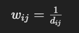
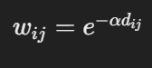
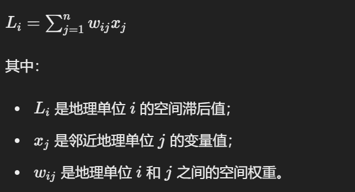

# Spatial weight matrix

空间权重矩阵和空间自相关系数是联系在一起的。

参考资料：[维基百科]([Spatial weight matrix - Wikipedia](https://en.wikipedia.org/wiki/Spatial_weight_matrix))

**空间权重矩阵是用来描述空间临近关系的矩阵**，其主要有三种理论：

## 一、邻近法

Contiguity-Based Weights 方法通常有两种常见的实现方式：

1. **Queen Contiguity**：在Queen邻近方法中，两个地理单位被视为邻近，如果它们有至少一个公共边界或顶点。这种方法更宽泛，可以捕捉到更多的空间连接关系。
2. **Rook Contiguity**：在Rook邻近方法中，两个地理单位被视为邻近，如果它们有至少一个共享边界，而不考虑顶点。这种方法相对严格一些，只考虑地理单位之间的边界连接关系。

Wij，若i与j邻近，则值为1，反之为0。

## 二、基于距离的权重

1.**倒数权重**：距离越近，权重越大。常见的倒数权重公式为：

其中 𝑑𝑖𝑗 是地理单位 𝑖 和 𝑗 之间的距离。

2.**指数衰减权重**：距离越近，权重越接近1；距离越远，权重越接近0。常见的指数衰减权重公式为：

其中 𝛼 是衰减率参数。

## 三、空间滞后矩阵

在一或者二初步得到矩阵后，再将每一项乘以属性值得到空间滞后矩阵

