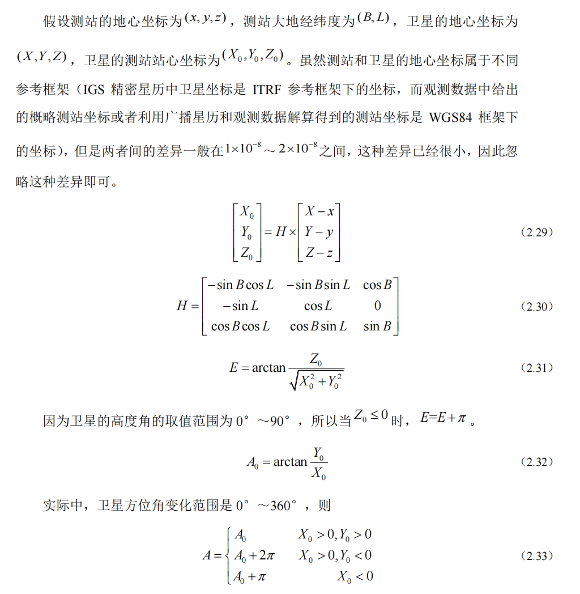
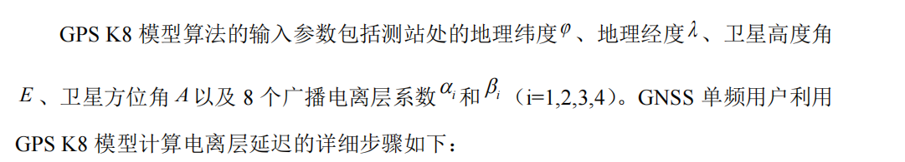
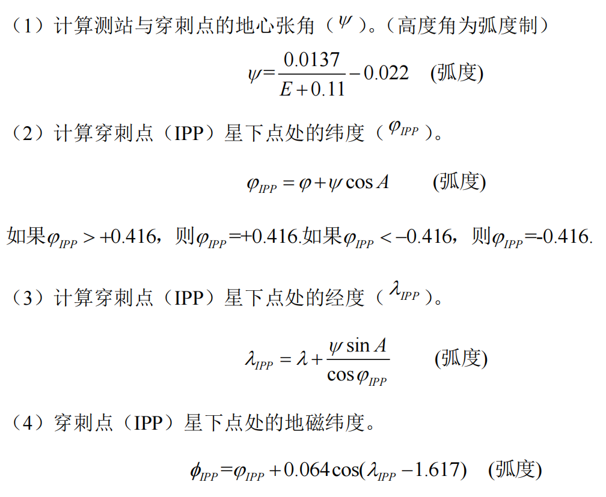
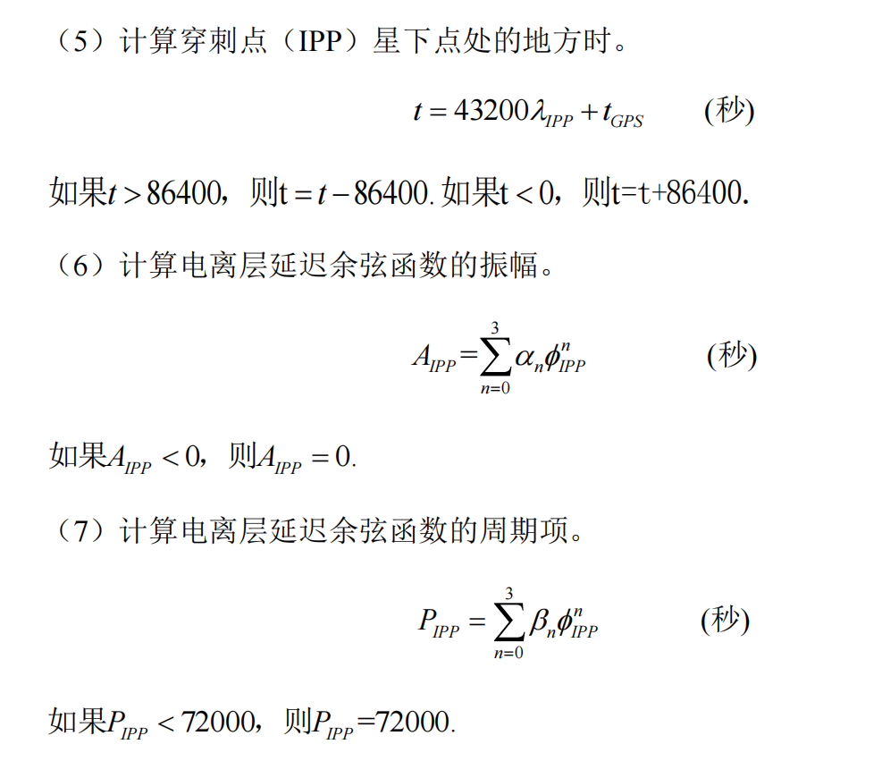
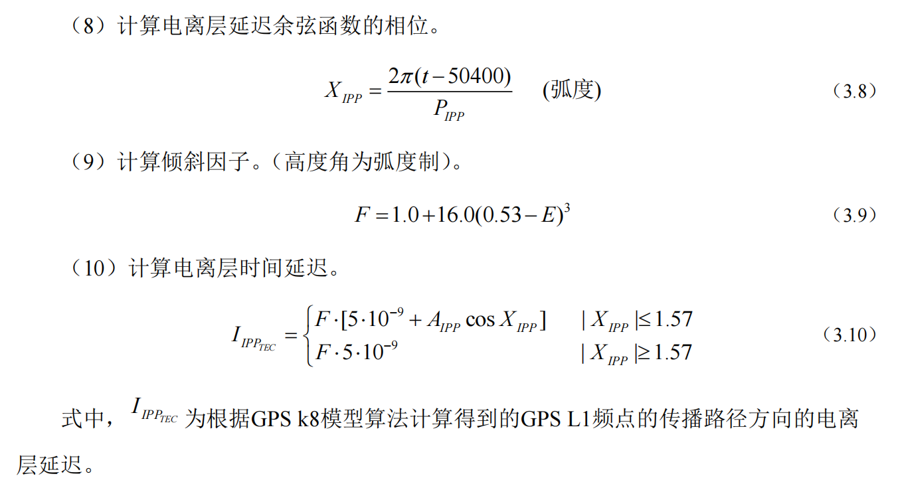
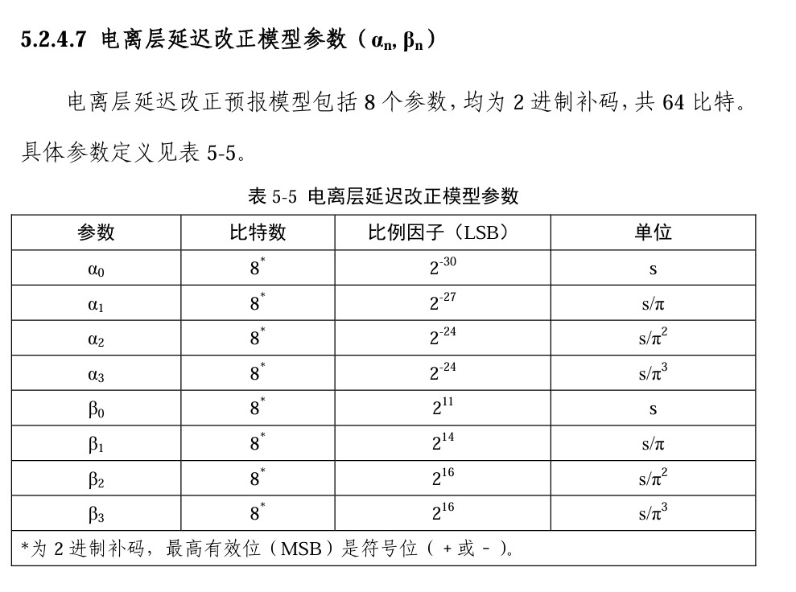
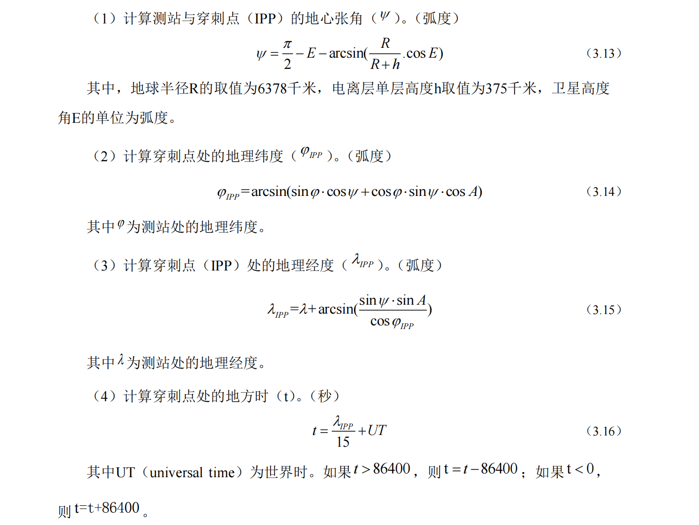
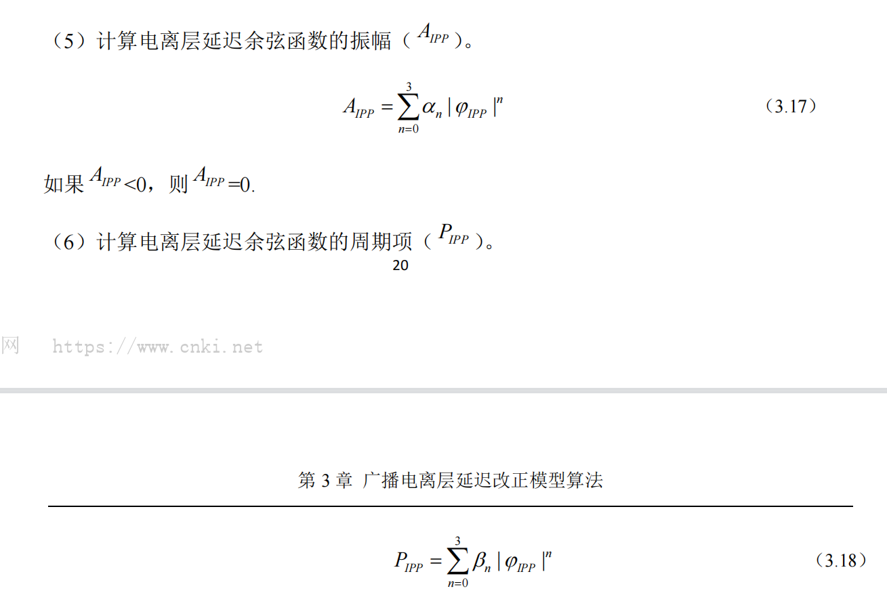
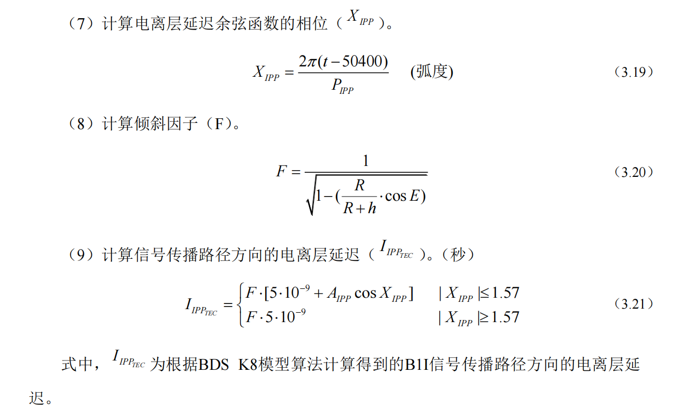

# 电离层改正方法

## 双频改正

双频改正很复杂

## 经验改正（模型改正）

在此之前需要进行地心坐标系到站心坐标系的转换，详细见资料1

### 坐标系转换：得到卫星高度角E，方位角A

已知数据：测站地心坐标、卫星地心坐标、测站大地经纬度

1.求得卫星的测站站心坐标

2.根据1求得的坐标计算卫星高度角E以及方位角A

详细如下：

### 1.Bent模型

### 2.IRI模型

前面两个模型没有固定的数学公式，因为很复杂，所以应该不会考这两个

### 3.Klobuchar模型（见资料1）

#### 3.1  GPS K8模型（书上的模型）

**输入数据：****其中的8个广播电离层系数见书**

**第一步：同书上的步骤2.计算穿刺点的地磁纬度**

注意里面都是弧度进行计算

**第二步：同书上的步骤3.计算电离层延迟量**

#### 3.2  BDS K8模型

那8个参数我看资料1的论文里说的是实时计算，没有固定值，我在北斗卫星文件找到的参数如下，但是我看不懂，我在后续代码暂且就按这个参数来，反正如果出了这个题目比赛会给

**计算步骤如下：**

#### 3.3  其他

资料1提到的其他几个模型感觉太复杂了，比赛应该不会考

### 4.NeQuick模型

这个模型感觉也有点复杂，我看不懂，详细见资料2