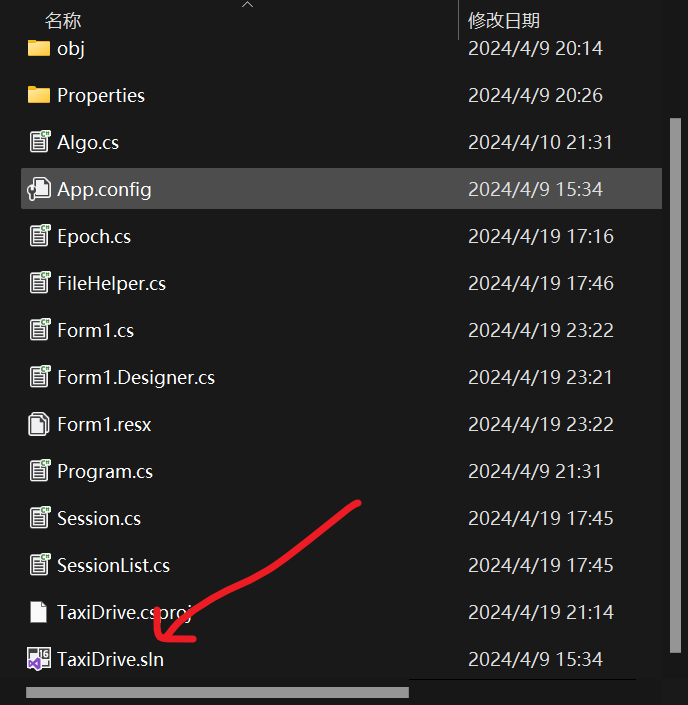
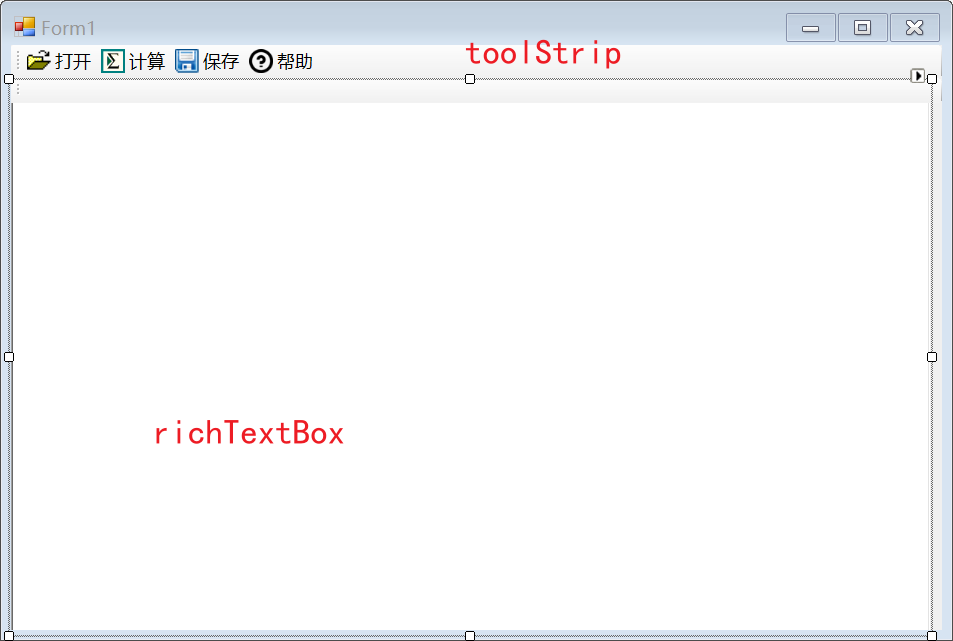
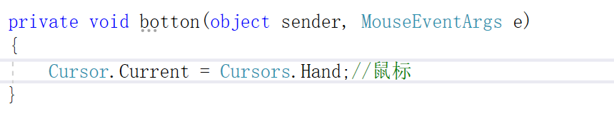

书籍：测绘程序设计（上册）  李英冰  武汉大学出版社  2019年版本

适合对象：测绘专业，gis专业等等

我的VS版本：2017

5/12写完了上册，写了8个练习，基本的已经熟悉的差不多了，所以就不写剩下的了直接去进阶篇。

建议：

1.有编程基础的直接看后面的练习，直接看源码学习C#，我也是这样学的，刚开始有点困难，但是写完第一个练习就顺畅了，只是时间花的多。

2.学会用AI，我看不懂的代码都是问Chatgpt和去CSDN上面找答案的。

3.推荐看老师的示例代码，因为有注释，不理解的部分可以看我每个练习的总结笔记，或许能在里面找到答案。不过后面的就没注释了

我看这本书的原因是想参加那个测绘程序设计大赛，虽然我是gis专业的，但是里面有分非专业组，而且练了一段时间发现能提升自己写算法的能力，起码能粗略的了解算法的大致过程，而且大二好像也会开C#的课，我学了也不亏。

#### 一些总结：（其余的见每次练习的md文档）

1.打开代码的方式：点.sln文件就可以

2.练习题的示例代码是不同的老师设计的，所以代码风格是不一样的，第一、二个练习是李英冰老师写的，他和第三个练习的老师的代码风格不一样，我的建议是学李英冰老师的，不同的功能单独用代码文件写，实现类的封装。

#### 工具箱的总结：

没列出的练习说明跟前面的是重复的

练习一：

练习三：

#### 控件的总结：

**1.如何设置控件的Text不可以更改：**改控件的ReadOnly为True

**2.鼠标光标如何更改：**

   1）看看控件有没有cursor属性

   2）在控件的“事件”里找到MouseMove，设置个事件名，然后点一下

写入以下代码，我这里的效果是小手

**3.tabControl怎么置于底层：**把Alignment改成bottom

