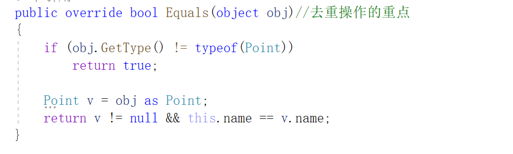

## 最短路径选择

代码说明：Algo为主算法的实现，fileHelper是文件读取程序，Point储存了所有点并且不重复，Session储存所有边以及边两边的点，SessionList是边 + Point顶点。

这个算法如果你看不懂书上的简单说明，可以看这个详细说明的文章：http://t.csdnimg.cn/M6DZy

这次练习我们可以分成两部分理解：数据的整理和储存+算法的实现。

1.数据怎么样储存需要先理解算法怎么样实现的，这里我们需要储存边的数据和点的数据。Session储存了边，Point储存了点，我把两者放到了一起，也就是放入了SessionList里面，你也可以不用这样，只需要改一下Algo就行了，改成传入两个参数。

2.算法的原理就是不断更新局部最优解，全部遍历后就能得到整体的最优解。我在这里难以用言语表示清楚具体过程，读者看上面那篇文章吧。

#### 一些总结：

1.List泛型的Contains方法。Contains方法是查找LIst里面是否有该元素，如果有则返回true。如果是查找值类型，那么是比较值是否相等，但是如果比较的是对象类型，那么比较的是内存地址是否相等，即使两个对象里面的属性都相等，但是他们的内存地址不一样。而本次练习我们是要比较Point里面的name属性是否一样来去重，所以我们要在Point类里面重写Equals方法

