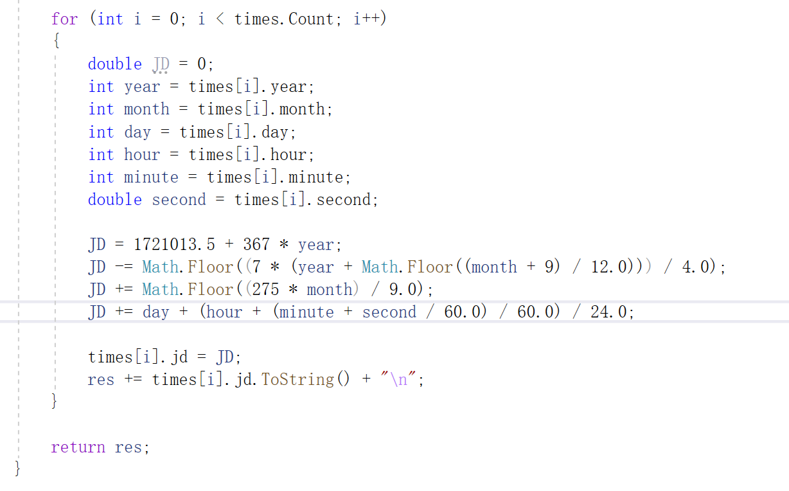

## 时间系统转换

代码说明：Algo为算法实现，fileHelper为文件读取程序，Time是每个时间的内容。

这次练习不难，尝试不看代码自己写写吧。

遇到的问题：

1.Math.Floor（）的二义性问题。这个问题你不一定会遇到，但是我遇到了就写下来了。起因是我在写获得儒略日代码的时候Math.floor出现了问题，后面问了gpt得到以下答案。

如果在使用 `Math.Floor` 函数时出现了 "二义性" 的错误，通常是因为编译器无法确定使用哪个重载版本的 `Math.Floor` 函数。这种情况可能发生在 C# 中的两种情况：

1. **命名空间冲突**：如果您的项目中同时引入了多个命名空间，其中包含了重名的类型或函数，编译器可能无法确定应该使用哪一个。例如，`System.Math.Floor` 与其他命名空间中的 `Math.Floor`（如 `SomeNamespace.Math.Floor`）发生冲突。
2. **函数参数类型不明确**：在某些情况下，编译器可能无法推断函数的参数类型，导致无法确定使用哪个重载版本。例如，当传递的参数既可以是 `double` 又可以是 `decimal` 时，编译器无法确定应该使用哪个重载版本。
   正确写法：

